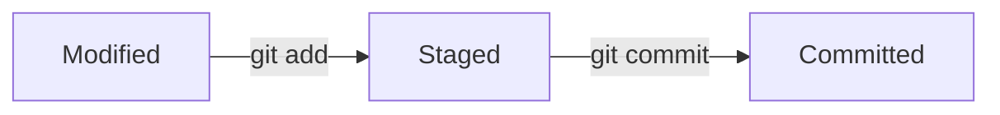
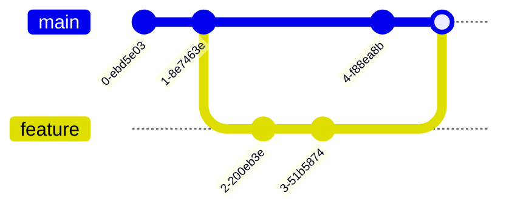

# Git Introduction

## What is Git?

<div style={{
    "width": "20%",
    "margin": "0 auto",
    "text-align": "center"
}}>
    
</div>

Git is a **distributed version control system** that helps developers track changes in their code. Created by Linus Torvalds in 2005 (the same person who developed Linux), Git has become the industry standard for version control.

Unlike older version control systems, Git:
- Works offline
- Is blazingly fast
- Supports non-linear development (branching and merging)
- Provides complete history and full version-tracking capabilities
- Ensures data integrity

## Why Learn Git?

Whether you're a solo developer or part of a large team, Git offers numerous benefits:

- **Track changes**: Keep a complete history of your project
- **Experiment safely**: Create branches to try new ideas without affecting the main codebase
- **Collaborate**: Work seamlessly with others on the same project
- **Backup**: Store your code in remote repositories (like GitHub, GitLab, or Bitbucket)
- **Employability**: Git skills are expected in almost all programming jobs

## Git vs. GitHub: Understanding the Difference

Many beginners confuse Git and GitHub. Let's clarify:

- **Git**: The version control system you install and run on your local machine
- **GitHub**: A web-based hosting service for Git repositories that adds collaboration features

Think of Git as the tool and GitHub as a service built around that tool.

## Getting Started with Git

### Installation

Before using Git, you need to install it on your computer.

#### For Windows:

1. Download the installer from [git-scm.com](https://git-scm.com/)
2. Run the installer and follow the default options

To verify installation, open Command Prompt and type:

```bash
git --version
```

#### For macOS:

If you have Homebrew installed:

```bash
brew install git
```

Or download from [git-scm.com](https://git-scm.com/)

#### For Linux (Ubuntu/Debian):

```bash
sudo apt-get update
sudo apt-get install git
```

### Basic Configuration

After installation, you should configure Git with your identity:

```bash
git config --global user.name "Your Name"
git config --global user.email "your.email@example.com"
```

These details will be associated with any commits you make.

## Core Git Concepts

### Repositories

A Git repository (or "repo") is a collection of files and the history of changes made to those files. It contains a special `.git` directory that stores all the version control information.

### Creating a New Repository

To create a new Git repository:

1. Create a new directory for your project
2. Navigate to that directory in your terminal
3. Initialize the repository with the following command:

```bash
mkdir my-project
cd my-project
git init
```

You should see a message like:

```
Initialized empty Git repository in /path/to/my-project/.git/
```

### The Three States of Git

Files in your working directory can exist in three states:



1. **Modified**: You've changed the file but haven't committed it yet
2. **Staged**: You've marked the modified file to go into your next commit
3. **Committed**: The file is safely stored in your Git database

### The Basic Git Workflow

Here's the fundamental workflow you'll use:

1. Modify files in your working directory
2. Stage the files, adding snapshots to your staging area
3. Commit the files, which stores the snapshots permanently in your Git repository

Let's walk through this process with an example:

```bash
# Create a simple HTML file
echo "<html><body><h1>Hello Git World!</h1></body></html>" > index.html

# Check the status of your repository
git status
```

Output:
```
On branch master

No commits yet

Untracked files:
  (use "git add <file>..." to include in what will be committed)
        index.html

nothing added to commit but untracked files present (use "git add" to track)
```

Now let's stage this file:

```bash
git add index.html
git status
```

Output:
```
On branch master

No commits yet

Changes to be committed:
  (use "git rm --cached <file>..." to unstage)
        new file:   index.html
```

Finally, let's commit the staged changes:

```bash
git commit -m "Add index.html with initial content"
```

Output:
```
[master (root-commit) f344d76] Add index.html with initial content
 1 file changed, 1 insertion(+)
 create mode 100644 index.html
```

Congratulations! You've made your first Git commit.

### Viewing Your Commit History

To see your commit history:

```bash
git log
```

Output:
```
commit f344d76e8aff6a9e9abbb466bacc4a3a627d9c67 (HEAD -> master)
Author: Your Name <your.email@example.com>
Date:   Mon Mar 14 10:00:00 2025

    Add index.html with initial content
```

## Making Changes and Tracking Them

Let's modify our file and see how Git tracks changes:

```bash
# Edit the file
echo "<html><body><h1>Hello Git World!</h1><p>Learning Git is fun!</p></body></html>" > index.html

# Check status
git status
```

Output:
```
On branch master
Changes not staged for commit:
  (use "git add <file>..." to update what will be committed)
  (use "git restore <file>..." to discard changes in working directory)
        modified:   index.html

no changes added to commit (use "git add" and/or "git commit -a")
```

Let's stage and commit these changes:

```bash
git add index.html
git commit -m "Add paragraph about learning Git"
```

Output:
```
[master ab74627] Add paragraph about learning Git
 1 file changed, 1 insertion(+), 1 deletion(-)
```

### Viewing Differences

To see what changes you've made before staging:

```bash
git diff
```

To see what's staged and will be committed:

```bash
git diff --staged
```

## Understanding Git Branches

Branches allow you to diverge from the main line of development and continue working without messing with the main line.



### Creating a Branch

To create a new branch:

```bash
git branch feature-navbar
```

To switch to that branch:

```bash
git checkout feature-navbar
```

Or do both in one command:

```bash
git checkout -b feature-navbar
```

### Working with Branches

Now that you're on a new branch, any changes you make won't affect the main branch (usually called `master` or `main`).

Let's make some changes:

```bash
# Edit the file on our feature branch
echo "<html><body><nav>Home | About</nav><h1>Hello Git World!</h1><p>Learning Git is fun!</p></body></html>" > index.html

# Stage and commit the changes
git add index.html
git commit -m "Add simple navigation bar"
```

To switch back to the main branch:

```bash
git checkout master
```

Notice that our `index.html` file returns to its previous state without the navigation bar.

### Merging Branches

When you're ready to bring your changes from a feature branch back into the main branch:

```bash
# First, make sure you're on the branch you want to merge into (usually master)
git checkout master

# Then merge the feature branch
git merge feature-navbar
```

If there are no conflicts, Git will automatically create a merge commit.

## Remote Repositories

Remote repositories are versions of your project hosted on the internet or network. They allow you to:

1. Backup your code
2. Collaborate with others
3. Deploy your applications

### Adding a Remote Repository

To connect your local repository to a remote repository (like on GitHub):

```bash
git remote add origin https://github.com/username/repository-name.git
```

### Pushing to a Remote Repository

To push your commits to the remote repository:

```bash
git push -u origin master
```

The `-u` flag sets up tracking, so in the future you can simply use `git push`.

### Cloning a Repository

To create a local copy of a remote repository:

```bash
git clone https://github.com/username/repository-name.git
```

This creates a new directory with the repository name, initializes a `.git` directory, pulls all the data from the remote repository, and checks out the latest version.

### Pulling Changes

To get updates from a remote repository:

```bash
git pull
```

This fetches changes from the remote and merges them into your current branch.

## Common Git Commands Summary

Here's a quick reference of the most commonly used Git commands:

| Command | Description |
|---------|-------------|
| `git init` | Create a new Git repository |
| `git clone` | Clone a repository |
| `git add` | Add files to staging area |
| `git commit` | Commit changes |
| `git status` | Show repository status |
| `git log` | View commit history |
| `git branch` | List, create, or delete branches |
| `git checkout` | Switch branches or restore files |
| `git merge` | Merge branches |
| `git pull` | Fetch and merge changes |
| `git push` | Update remote repository |
| `git remote` | Manage remote repositories |

## Best Practices for Using Git

To make the most of Git, follow these practices:

1. **Commit often**: Make small, focused commits rather than large, sweeping changes
2. **Write meaningful commit messages**: Explain what and why, not how
3. **Use branches**: Create a new branch for each feature or bug fix
4. **Pull before pushing**: Always pull changes before pushing to avoid conflicts
5. **Review changes before committing**: Use `git diff` and `git status` to verify changes

## Summary

Git is a powerful, distributed version control system that helps you track changes, collaborate with others, and maintain the history of your projects. In this introduction, we've covered:

- What Git is and why it's valuable
- How to set up Git
- Basic Git workflow with committing changes
- Working with branches
- Connecting to remote repositories

Learning Git may seem challenging at first, but it becomes intuitive with practice. The skills you develop will serve you throughout your programming career.

## Additional Resources

To continue learning Git, consider these resources:

- [Pro Git Book](https://git-scm.com/book/en/v2) - Free, comprehensive guide
- [GitHub Learning Lab](https://lab.github.com/) - Interactive tutorials
- [Git Cheat Sheet](https://education.github.com/git-cheat-sheet-education.pdf) - Quick reference

## Practice Exercises

1. Create a new Git repository for a personal project
2. Make several commits with meaningful messages
3. Create a branch, make changes, and merge it back to the main branch
4. Create a GitHub account and push your repository to it
5. Clone an open-source repository and explore its history with `git log`