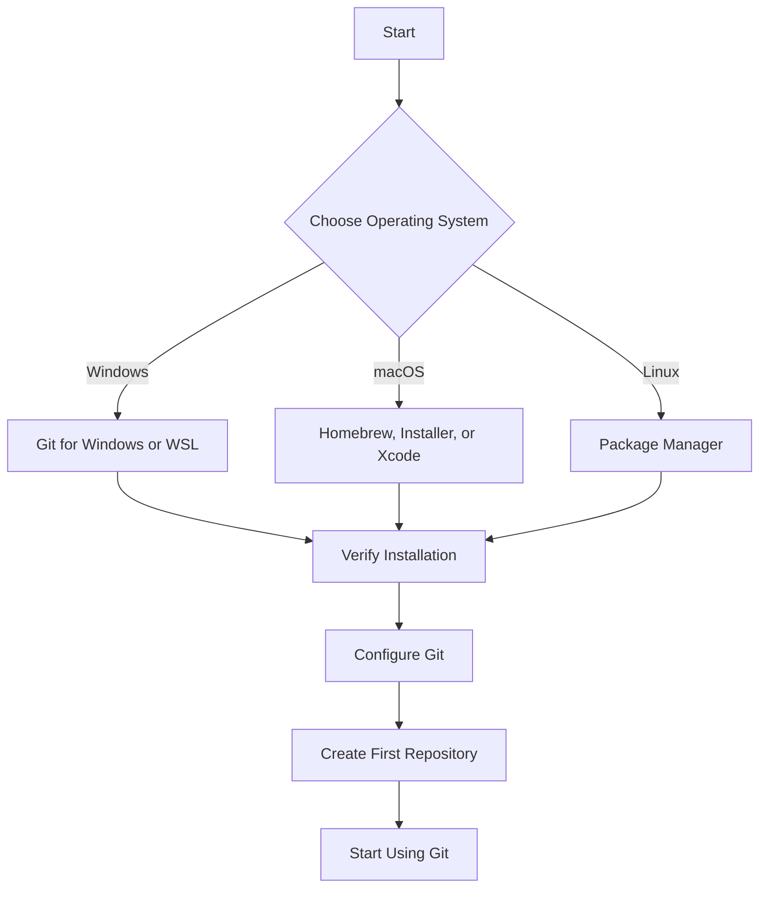

# Git Installation

## Introduction

Git is a distributed version control system that helps you track changes in your code, collaborate with others, and maintain different versions of your project. Before you can start using Git commands and exploring its capabilities, you first need to install it on your system.

In this guide, we'll walk through the process of installing Git on different operating systems (Windows, macOS, and Linux). We'll also verify the installation and perform initial configuration to get you started quickly.

## Prerequisites

Before installing Git, make sure you have:

- Administrative access to your computer
- A stable internet connection
- Basic familiarity with your operating system's terminal or command line interface

## Installing Git

Git installation varies depending on your operating system. Follow the instructions for your specific platform.

### Windows

There are two main approaches to installing Git on Windows: using the official Git for Windows installer (also known as Git Bash) or using Windows Subsystem for Linux (WSL).

#### Option 1: Using Git for Windows (Recommended for beginners)

1. Download the latest Git for Windows installer from the [official website](https://git-scm.com/download/win).

2. Run the installer and follow the setup wizard with these recommended settings:
   - When asked about adjusting your PATH environment, select "Git from the command line and also from 3rd-party software"
   - For the line ending conversions, select "Checkout Windows-style, commit Unix-style line endings"
   - For the terminal emulator, choose "Use Windows' default console window"
   - For extra options, ensure "Enable Git Credential Manager" is selected

3. Complete the installation process.

After installation, you'll have access to:
- Git Bash: A terminal that provides a Unix-like command experience
- Git GUI: A graphical user interface for Git
- Git CMD: Allows you to run Git commands from the Windows Command Prompt

#### Option 2: Using Windows Subsystem for Linux (WSL)

If you're comfortable with Linux commands or plan to do more advanced development:

1. Enable WSL by opening PowerShell as Administrator and running:

```powershell
wsl --install
```

2. Restart your computer after the installation completes.

3. Open the Linux distribution you installed (usually Ubuntu by default) and update the package list:

```bash
sudo apt update
```

4. Install Git:

```bash
sudo apt install git
```

### macOS

macOS offers multiple ways to install Git:

#### Option 1: Using Homebrew (Recommended)

1. If you don't have Homebrew installed, install it by opening Terminal and running:

```bash
/bin/bash -c "$(curl -fsSL https://raw.githubusercontent.com/Homebrew/install/HEAD/install.sh)"
```

2. Install Git using Homebrew:

```bash
brew install git
```

#### Option 2: Using the Git Installer

1. Download the latest Git installer for macOS from the [official website](https://git-scm.com/download/mac).
2. Open the downloaded DMG file and follow the installation instructions.

#### Option 3: Using Xcode Command Line Tools

If you're a macOS user who already has Xcode or plans to install it:

1. Open Terminal and run:

```bash
xcode-select --install
```

2. A dialog box will appear asking if you want to install the command line developer tools. Click "Install".

### Linux

The installation process varies slightly depending on your Linux distribution.

#### Ubuntu/Debian

1. Open Terminal and update your package lists:

```bash
sudo apt update
```

2. Install Git:

```bash
sudo apt install git
```

#### Fedora

```bash
sudo dnf install git
```

#### Arch Linux

```bash
sudo pacman -S git
```

## Verifying the Installation

After installing Git, verify that it was installed correctly by checking the version:

1. Open your terminal (Command Prompt/Git Bash on Windows, Terminal on macOS/Linux)
2. Run the following command:

```bash
git --version
```

You should see output similar to this:

```
git version 2.40.0
```

If you see a version number, Git has been successfully installed!

## Initial Configuration

After installing Git, it's important to configure your identity. This information will be attached to your commits.

### Setting Your Username and Email

Set your name and email address using the following commands:

```bash
git config --global user.name "Your Name"
git config --global user.email "your.email@example.com"
```

### Checking Your Configuration

To verify your configuration settings:

```bash
git config --list
```

This will display all your Git configuration settings, including the username and email you just set.

## Common Installation Issues and Solutions

### "Git is not recognized as an internal or external command"

**Problem:** This error appears in Windows Command Prompt when Git is not properly added to your PATH.

**Solution:** 
1. Reinstall Git and make sure to select the option "Git from the command line and also from 3rd-party software"
2. Or manually add Git to your PATH: System Properties → Advanced → Environment Variables → Path → Edit → Add the path to git.exe (typically `C:\Program Files\Git\bin`)

### Permission Denied Errors on Linux/macOS

**Problem:** You see "Permission denied" when trying to install Git.

**Solution:** Make sure you're using `sudo` before the installation command:

```bash
sudo apt install git  # For Ubuntu/Debian
```

### Installation Hanging or Timing Out

**Problem:** The installation process seems to freeze or time out.

**Solution:**
1. Check your internet connection
2. Try downloading the installer directly from the Git website rather than using package managers
3. Temporarily disable firewall or antivirus software during installation

## Practical Example: Creating Your First Git Repository

Now that Git is installed, let's create a simple repository:

1. Create a new folder for your project:

```bash
mkdir my-first-git-project
cd my-first-git-project
```

2. Initialize a Git repository:

```bash
git init
```

You should see output like:

```
Initialized empty Git repository in /path/to/my-first-git-project/.git/
```

3. Create a simple file:

```bash
echo "# My First Git Project" > README.md
```

4. Check the status of your repository:

```bash
git status
```

You'll see that Git recognizes your new file as untracked:

```
On branch main

No commits yet

Untracked files:
  (use "git add <file>..." to include in what will be committed)
        README.md

nothing added to commit but untracked files present (use "git add" to track)
```

5. Add the file to the staging area:

```bash
git add README.md
```

6. Commit the file:

```bash
git commit -m "Initial commit"
```

Congratulations! You've successfully installed Git and created your first repository.

## Understanding the Git Installation Flow

Here's a visual representation of the Git installation process:



## Summary

In this guide, we've covered:

- Installing Git on Windows, macOS, and Linux
- Verifying your installation
- Configuring your Git identity
- Creating your first Git repository

Git is now ready to use on your system! With Git installed, you can now explore its powerful version control capabilities, collaborate with others, and manage your code effectively.

## Additional Resources

To continue learning about Git, explore these resources:

- **Git Commands**: Learn about basic Git commands in the next section
- **Git Branching**: Understand how to work with branches
- **Remote Repositories**: Learn how to work with GitHub, GitLab, or Bitbucket

## Exercises

1. Create a new Git repository and add three different files to it.
2. Make changes to one of the files and commit those changes.
3. View the commit history of your repository.
4. Create a `.gitignore` file and add patterns to ignore certain file types.