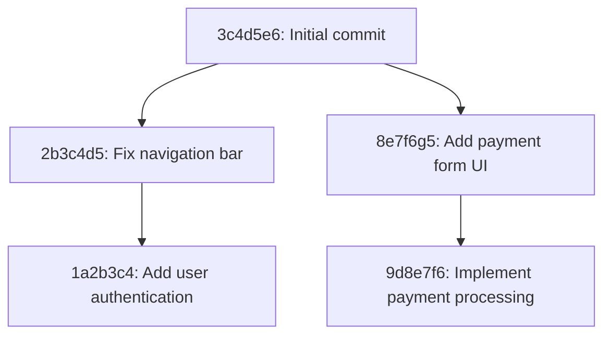

# Understanding Git History

## Introduction

One of Git's most powerful features is how it maintains a complete history of your project. Understanding how to view, navigate, and manipulate this history is crucial for effective version control. When you make commits in Git, you're creating a timeline of your project's development that you can explore, learn from, and even modify when necessary.

In this guide, we'll explore the tools and commands that let you interact with Git's history, helping you better understand your codebase's evolution and making you more effective at managing your projects.

## Viewing Commit History

### The Basic `git log` Command

The most fundamental command for exploring Git history is `git log`. It displays a chronological list of commits, starting with the most recent:

```bash
$ git log
commit 1a2b3c4d5e6f7g8h9i0j1k2l3m4n5o6p7q8r9s0
Author: Jane Doe <jane.doe@example.com>
Date:   Mon Feb 26 14:30:45 2024 -0700

    Add user authentication feature

commit 2b3c4d5e6f7g8h9i0j1k2l3m4n5o6p7q8r9s0t1
Author: John Smith <john.smith@example.com>
Date:   Sun Feb 25 09:15:22 2024 -0700

    Fix navigation bar responsive layout

commit 3c4d5e6f7g8h9i0j1k2l3m4n5o6p7q8r9s0t1u2
Author: Jane Doe <jane.doe@example.com>
Date:   Sat Feb 24 16:42:10 2024 -0700

    Initial commit
```

Each commit entry shows:
- A unique commit hash
- The author's name and email
- The date and time of the commit
- The commit message

### Customizing the Output

The basic `git log` output can be verbose for projects with many commits. Git offers various options to customize the display:

#### One-line Format

For a compact view showing one commit per line:

```bash
$ git log --oneline
1a2b3c4 Add user authentication feature
2b3c4d5 Fix navigation bar responsive layout
3c4d5e6 Initial commit
```

#### Adding Colors

To make the output more readable with colors:

```bash
$ git log --oneline --graph --decorate --all
* 1a2b3c4 (HEAD -> main) Add user authentication feature
* 2b3c4d5 Fix navigation bar responsive layout
* 3c4d5e6 Initial commit
```

#### Showing Stats

To see which files were changed and how many lines were added or removed:

```bash
$ git log --stat
commit 1a2b3c4d5e6f7g8h9i0j1k2l3m4n5o6p7q8r9s0
Author: Jane Doe <jane.doe@example.com>
Date:   Mon Feb 26 14:30:45 2024 -0700

    Add user authentication feature

 src/auth/login.js    | 75 ++++++++++++++++++++
 src/auth/signup.js   | 82 ++++++++++++++++++++++
 src/components/Nav.js| 12 +++-
 3 files changed, 169 insertions(+), 3 deletions(-)
```

## Filtering Commit History

Git allows you to filter the history to find specific commits:

### By Date

To see commits after a certain date:

```bash
$ git log --after="2024-02-01"
```

Or before a certain date:

```bash
$ git log --before="2024-02-15"
```

### By Author

To see commits by a specific author:

```bash
$ git log --author="Jane Doe"
```

### By Content

To find commits that added or removed specific text:

```bash
$ git log -S"login function"
```

### By Message

To search for commits with specific words in their messages:

```bash
$ git log --grep="fix"
```

## Visualizing History

Git history can be visualized as a graph, which is especially useful for seeing how branches relate:

```bash
$ git log --oneline --graph --all
* 1a2b3c4 (HEAD -> main) Add user authentication feature
* 2b3c4d5 Fix navigation bar responsive layout
| * 9d8e7f6 (feature/payment) Implement payment processing
| * 8e7f6g5 Add payment form UI
|/
* 3c4d5e6 Initial commit
```

You can also use `git log` with the `--graph` option to visualize the branching structure:



## Examining Specific Commits

### Using `git show`

To see details about a specific commit:

```bash
$ git show 1a2b3c4
commit 1a2b3c4d5e6f7g8h9i0j1k2l3m4n5o6p7q8r9s0
Author: Jane Doe <jane.doe@example.com>
Date:   Mon Feb 26 14:30:45 2024 -0700

    Add user authentication feature

diff --git a/src/auth/login.js b/src/auth/login.js
new file mode 100644
index 0000000..95c8a5b
--- /dev/null
+++ b/src/auth/login.js
@@ -0,0 +1,75 @@
+// Login component implementation
+...
```

### File History

To see the history of changes to a specific file:

```bash
$ git log -- src/components/Button.js
```

### Line-by-Line History with `git blame`

The `git blame` command shows who last modified each line of a file:

```bash
$ git blame src/components/Button.js
1a2b3c4d (Jane Doe      2024-02-26 14:30:45 -0700  1) import React from 'react';
1a2b3c4d (Jane Doe      2024-02-26 14:30:45 -0700  2) 
3c4d5e6f (John Smith    2024-02-24 16:42:10 -0700  3) const Button = ({ text, onClick, type = 'primary' }) => {
2b3c4d5e (Jane Doe      2024-02-25 09:15:22 -0700  4)   const buttonClass = `btn btn-${type}`;
```

This is invaluable for understanding who introduced a specific piece of code and why.

## Exploring Differences

### Between Commits

To see what changed between two commits:

```bash
$ git diff 3c4d5e6..1a2b3c4
```

### Between Branches

To compare branches:

```bash
$ git diff main..feature/payment
```

## Undoing Changes in History

Git provides several ways to modify history, though you should be cautious when doing so, especially for shared branches:

### Amending the Last Commit

If you've made a mistake in your most recent commit message or forgot to include a file:

```bash
$ git commit --amend
```

This opens an editor to modify the commit message. To include forgotten files:

```bash
$ git add forgotten-file.js
$ git commit --amend
```

### Interactive Rebase

For more complex history rewriting, Git offers interactive rebase:

```bash
$ git rebase -i HEAD~3
```

This opens an editor showing the last three commits, allowing you to:
- Reorder commits
- Drop (delete) commits
- Squash multiple commits together
- Edit commit messages
- Split commits

## Practical Examples

### Example 1: Finding a Bug Introduction

Imagine users report a bug in your application's login functionality. You can use Git history to track down when the bug was introduced:

```bash
# First, find commits that modified the login component
$ git log -- src/components/Login.js

# Then examine the changes in suspicious commits
$ git show 1a2b3c4

# Or use binary search to find the exact commit that introduced the bug
$ git bisect start
$ git bisect bad    # Current version has the bug
$ git bisect good 3c4d5e6    # This older version worked correctly

# Git will check out commits for you to test until it finds the problematic one
```

### Example 2: Understanding Code Evolution

To understand how a complex feature was implemented over time:

```bash
# See all commits related to the feature
$ git log --grep="user authentication"

# Compare the implementation at different stages
$ git diff 2b3c4d5..1a2b3c4 -- src/auth/

# Visualize branch development
$ git log --oneline --graph --all -- src/auth/
```

### Example 3: Creating a Changelog

When preparing a release, use Git history to generate a changelog:

```bash
# Get all commits since the last tag
$ git log --oneline $(git describe --tags --abbrev=0)..HEAD

# Group by type (feature, fix, etc.) based on commit message
$ git log --oneline $(git describe --tags --abbrev=0)..HEAD --grep="^feat"
$ git log --oneline $(git describe --tags --abbrev=0)..HEAD --grep="^fix"
```

## Summary

Git's history tracking is one of its most powerful features. Mastering these commands gives you the ability to:

- Track and understand how your project has evolved
- Identify when and why specific changes were made
- Find and fix bugs more efficiently
- Learn from past development patterns
- Document your project's progress

Remember that Git history isn't just a log—it's a narrative of your project's development that can guide future work and help resolve issues.

## Additional Resources

Here are some exercises to strengthen your Git history skills:

1. **Exploration Exercise**: Clone an open-source repository and use `git log` with different options to explore its history. Can you identify when major features were added?

2. **Bug Hunt Exercise**: In your own project, deliberately introduce a bug, make several more commits, then use `git bisect` to find exactly when the bug was introduced.

3. **History Cleanup Exercise**: Create a feature branch with several small, related commits, then use interactive rebase to clean up the history before merging.

## Further Git History Commands

| Command | Description |
|---------|-------------|
| `git reflog` | Shows a record of all changes to the HEAD reference |
| `git log -p` | Shows patches (changes) along with the log |
| `git shortlog` | Summarizes logs by author |
| `git rev-list` | Lists commit objects in reverse chronological order |
| `git cherry` | Shows commits not yet merged upstream |