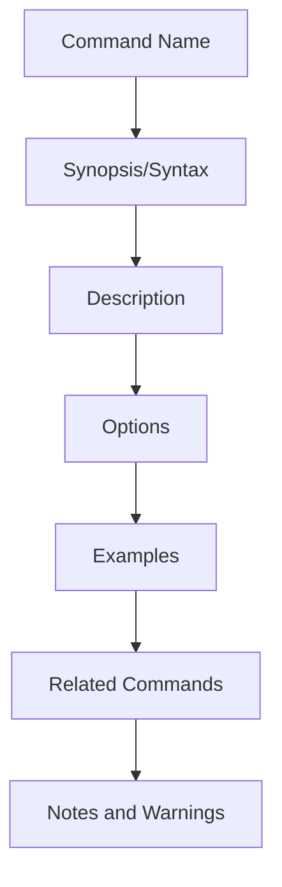

# Git Help Command

## Introduction

When learning Git or even when you're an experienced user, you'll often need to reference documentation for specific commands, options, or workflows. Fortunately, Git comes with a comprehensive built-in help system that provides detailed information on every Git command. This guide will teach you how to effectively use the `git help` command to find the information you need, right from your terminal.

## The Basic Help Command

The simplest way to get help in Git is to use the `help` command with no arguments:

```bash
git help
```

This displays a summary of the most common Git commands, grouped by functionality:

```
usage: git [--version] [--help] [-C <path>] [-c <name>=<value>]
           [--exec-path[=<path>]] [--html-path] [--man-path] [--info-path]
           [-p | --paginate | -P | --no-pager] [--no-replace-objects] [--bare]
           [--git-dir=<path>] [--work-tree=<path>] [--namespace=<name>]
           <command> [<args>]

These are common Git commands used in various situations:

start a working area (see also: git help tutorial)
   clone     Clone a repository into a new directory
   init      Create an empty Git repository or reinitialize an existing one

work on the current change (see also: git help everyday)
   add       Add file contents to the index
   mv        Move or rename a file, a directory, or a symlink
   restore   Restore working tree files
   rm        Remove files from the working tree and from the index

examine the history and state (see also: git help revisions)
   bisect    Use binary search to find the commit that introduced a bug
   diff      Show changes between commits, commit and working tree, etc
   grep      Print lines matching a pattern
   log       Show commit logs
   show      Show various types of objects
   status    Show the working tree status

grow, mark and tweak your common history
   branch    List, create, or delete branches
   commit    Record changes to the repository
   merge     Join two or more development histories together
   rebase    Reapply commits on top of another base tip
   reset     Reset current HEAD to the specified state
   switch    Switch branches
   tag       Create, list, delete or verify a tag object signed with GPG

collaborate (see also: git help workflows)
   fetch     Download objects and refs from another repository
   pull      Fetch from and integrate with another repository or a local branch
   push      Update remote refs along with associated objects

'git help -a' and 'git help -g' list available subcommands and some
concept guides. See 'git help <command>' or 'git help <concept>'
to read about a specific subcommand or concept.
See 'git help git' for an overview of the system.
```

This overview provides a quick reference to the most commonly used commands, grouped by their general purpose.

## Getting Help on Specific Commands

To get detailed help on any Git command, use:

```bash
git help <command>
```

For example, to get help on the `commit` command:

```bash
git help commit
```

This will display the full manual page for the `commit` command, including:
- Command syntax
- Available options
- Examples
- Related commands
- Detailed explanations

The manual page is displayed using your system's default pager (usually `less` on Unix-like systems), allowing you to scroll through the content.

## Alternative Ways to Get Help

Git provides several variations of the help command to suit different needs:

### Short Help with `-h`

For a quick overview of a command's options, use the `-h` flag:

```bash
git commit -h
```

This displays a concise summary of the command's syntax and most common options:

```
usage: git commit [-a | --interactive | --patch] [-s] [-v] [-u<mode>] [--amend]
                  [--dry-run] [--squash=<commit>] [--fixup=<commit>]
                  [--reset-author] [-c | -C <commit>] [-F <file> | -m <msg>]
                  [--trailer <trailer>]... [-e] [--author=<author>]
                  [--date=<date>] [--cleanup=<mode>] [--[no-]status]
                  [-i | -o] [--pathspec-from-file=<file> [--pathspec-file-nul]]
                  [(--trailer <token>)=<value>] [--] [<pathspec>...]

    -a, --all             commit all changed files
    -m, --message <msg>   commit message
    --amend               amend previous commit
    --dry-run            show what would be committed
    -h, --help            show this help
```

### Manual Pages

Git also provides access to its manual pages with:

```bash
man git-<command>
```

For example:

```bash
man git-push
```

This is equivalent to `git help push` but uses your system's `man` command directly.

## Finding Help on Concepts

Git help isn't limited to commands. You can also get information about Git concepts using:

```bash
git help <concept>
```

Some useful concepts to explore:

```bash
git help everyday     # Common everyday Git usage scenarios
git help workflows    # Recommended Git workflows
git help revisions    # Explanation of Git's revision syntax
git help gitignore    # Information about ignoring files
git help glossary     # A glossary of Git terminology
```

## Listing All Available Help Topics

To see all available Git commands:

```bash
git help -a
```

This lists all Git commands, including less commonly used ones.

To see all available concept guides:

```bash
git help -g
```

This shows the list of concept guides that explain various aspects of Git.

## Online Help

If you prefer web-based documentation, you can view the help pages in your browser with:

```bash
git help --web <command>
```

For example:

```bash
git help --web rebase
```

This opens the official Git documentation for the specified command in your default web browser.

## Practical Example: Finding the Right Command

Let's say you want to undo your last commit but keep the changes in your working directory. You're not sure which command to use.

1. Start with basic help to explore available commands:

```bash
git help
```

Looking at the output, you see `reset` under "grow, mark and tweak your common history".

2. Get more information about the `reset` command:

```bash
git help reset
```

3. In the manual page, you find that `git reset --soft HEAD~1` will undo the last commit while keeping the changes staged.

This process of using the help system to discover and learn about commands is a valuable skill for any Git user.

## Understanding Command Structure with Help

The help pages follow a consistent structure that helps you understand how to use commands effectively:



By familiarizing yourself with this structure, you can quickly find the specific information you need within any help page.

## Summary

The `git help` command is an essential tool for both beginners and experienced Git users:

- Use `git help` for an overview of common commands
- Use `git help <command>` for detailed information about specific commands
- Use `git <command> -h` for quick reference of command options
- Use `git help <concept>` to learn about Git concepts
- Use `git help -a` and `git help -g` to discover all available help topics
- Use `git help --web <command>` for web-based documentation

Mastering Git's help system empowers you to find solutions independently and deepen your understanding of Git's capabilities. Rather than memorizing every command and option, knowing how to effectively use the help system allows you to look up information as needed.

## Additional Resources and Exercises

### Exercises

1. Run `git help` and identify three commands you've never used before. Read their help pages to understand what they do.

2. Compare the output of `git commit -h` and `git help commit`. What additional information does the full help provide?

3. Find all options for customizing the output format of `git log` using the help system.

4. Use the help system to discover how to create a Git alias for a command you use frequently.

5. Look up the concept guide for "revisions" and learn three ways to reference a specific commit.

### Additional Resources

- [Pro Git Book](https://git-scm.com/book/en/v2) - A comprehensive free book on Git
- [Git Reference Documentation](https://git-scm.com/docs) - Official online documentation
- [Git Cheat Sheet](https://education.github.com/git-cheat-sheet-education.pdf) - Quick reference for common commands

Remember, becoming proficient with Git is a journey. The help system is your built-in guide along the way, always available when you need information or clarification on any aspect of Git.