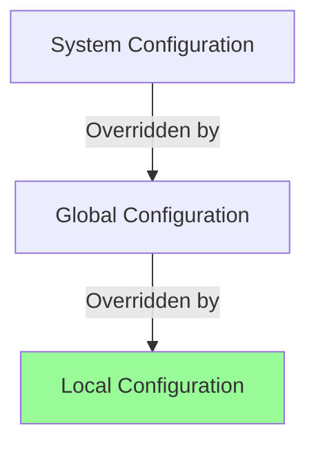

# Git Configuration

## Introduction

Git configuration is an essential aspect of working with Git version control. It allows you to customize how Git behaves, establish your identity, set preferences, and optimize your workflow. Whether you're setting up Git for the first time or fine-tuning your existing setup, understanding Git's configuration system will help you work more efficiently.

In this guide, we'll explore different levels of Git configuration, important settings to know, and how to view and modify these settings. By the end, you'll have a solid understanding of how to tailor Git to your specific needs.

## Git Configuration Levels

Git stores configuration settings at three distinct levels, each with a different scope:

1. **System level** - Applies to all users on the system
2. **Global level** - Applies to all repositories for the current user
3. **Local level** - Applies only to the specific repository

Each level overrides the previous one, with local having the highest priority:



## Basic Git Configuration

### Setting Your Identity

The first thing you should do after installing Git is to set your user name and email address. This is important because Git embeds this information in each commit you make:

```bash
# Set your username
git config --global user.name "Your Name"

# Set your email
git config --global user.email "your.email@example.com"
```

This information will appear in your commit history:

```
commit 8a5cbc430f1a9c3d00faaeffd07798508422908a
Author: Your Name <your.email@example.com>
Date:   Mon Mar 14 10:30:45 2025 -0700

    Add new feature to homepage
```

### Checking Your Settings

To view your current settings:

```bash
# View all settings
git config --list

# Output example:
# user.name=Your Name
# user.email=your.email@example.com
# core.editor=vim
# color.ui=auto
```

To check a specific setting:

```bash
# Check your configured username
git config user.name

# Output:
# Your Name
```

## Configuration Files

Git stores configurations in plain text files:

- System level: `/etc/gitconfig` or `C:\Program Files\Git\etc\gitconfig`
- Global level: `~/.gitconfig` or `C:\Users\<username>\.gitconfig`
- Local level: `.git/config` in your repository

You can edit these files directly with a text editor, or use the `git config` command as shown above.

## Essential Git Configurations

### Setting Your Default Editor

Git may need to open a text editor for certain operations, like writing commit messages:

```bash
# Set VSCode as your default editor
git config --global core.editor "code --wait"

# For Vim
git config --global core.editor "vim"

# For Notepad++ (Windows)
git config --global core.editor "'C:/Program Files/Notepad++/notepad++.exe' -multiInst -notabbar -nosession -noPlugin"
```

### Configuring Line Endings

Different operating systems handle line endings differently. Git can automatically convert line endings:

```bash
# For Windows
git config --global core.autocrlf true

# For macOS and Linux
git config --global core.autocrlf input
```

### Colorizing Git Output

Make Git's output more readable with colors:

```bash
# Enable color output
git config --global color.ui auto
```

### Setting Default Branch Name

Configure the default branch name for new repositories:

```bash
# Set main as default branch name
git config --global init.defaultBranch main
```

## Aliases: Creating Shortcuts

Git aliases allow you to create shortcuts for frequently used commands:

```bash
# Create an alias for git status
git config --global alias.st status

# Create an alias for git checkout
git config --global alias.co checkout

# Create an alias for git commit
git config --global alias.ci commit

# Create an alias for git branch
git config --global alias.br branch
```

Now you can use the shorter commands:

```bash
# Instead of git status
git st

# Instead of git checkout main
git co main
```

## Practical Example: Setting Up a New Developer's Environment

Let's walk through a practical example of configuring Git for a new developer joining a team:

```bash
# Set identity
git config --global user.name "Jane Doe"
git config --global user.email "jane.doe@company.com"

# Set preferred editor
git config --global core.editor "code --wait"

# Configure line endings based on OS
git config --global core.autocrlf input  # For macOS/Linux

# Enable helpful coloring
git config --global color.ui auto

# Set modern default branch name
git config --global init.defaultBranch main

# Add useful aliases
git config --global alias.st status
git config --global alias.co checkout
git config --global alias.br branch
git config --global alias.ci commit
git config --global alias.unstage "reset HEAD --"
git config --global alias.last "log -1 HEAD"

# Configure credential helper for easier authentication
git config --global credential.helper cache  # Cache credentials for 15 minutes
```

## Advanced Configuration

### Configuring a Specific Repository

To apply settings only to a specific repository, omit the `--global` flag and run the commands from within that repository:

```bash
# Apply only to current repository
cd /path/to/your/repo
git config user.email "project-specific@example.com"
```

### Ignoring Files Globally

You can configure Git to ignore certain files across all repositories:

```bash
# Create a global gitignore file
git config --global core.excludesfile ~/.gitignore_global

# Then edit this file to add patterns like:
# .DS_Store
# Thumbs.db
# *.log
# .vscode/
# node_modules/
```

### Customizing Git Diff Tool

```bash
# Set up a custom diff tool
git config --global diff.tool vscode
git config --global difftool.vscode.cmd "code --wait --diff \$LOCAL \$REMOTE"
```

## Summary

Git configuration is a powerful system that allows you to customize Git to fit your workflow and preferences. The key points to remember are:

- Git has three configuration levels: system, global, and local
- Basic identity settings are crucial for proper commit attribution
- You can create aliases to speed up your Git workflow
- Different configurations can be applied to different repositories
- Configuration settings can be viewed and modified using `git config` commands

Mastering Git configuration will make your version control experience smoother and more efficient, especially when working on multiple projects or with different teams.

## Practice Exercises

1. Set up your Git identity with your name and email.
2. Create at least three Git aliases for commands you use frequently.
3. Configure a global `.gitignore` file with patterns relevant to your development environment.
4. Create a repository-specific configuration that differs from your global settings.
5. Experiment with different editor configurations to find what works best for you.

## Additional Resources

- [Git Documentation - Customizing Git](https://git-scm.com/book/en/v2/Customizing-Git-Git-Configuration)
- [Git Config Manual Page](https://git-scm.com/docs/git-config)
- [GitHub's Git Guides](https://github.com/git-guides)