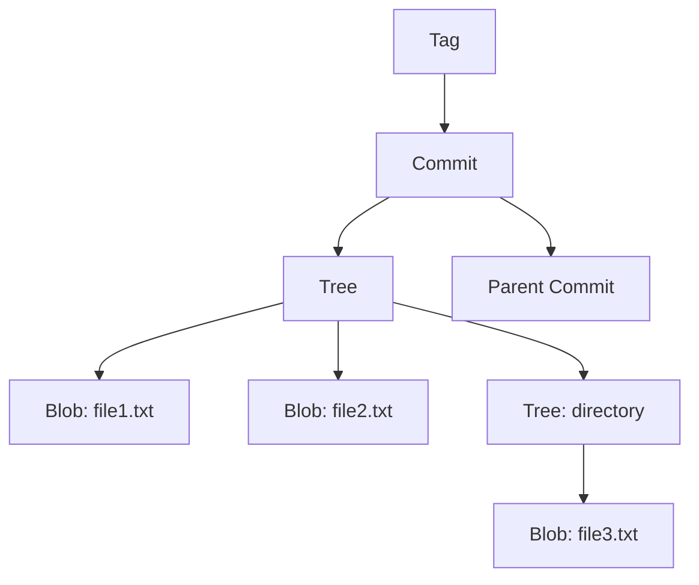
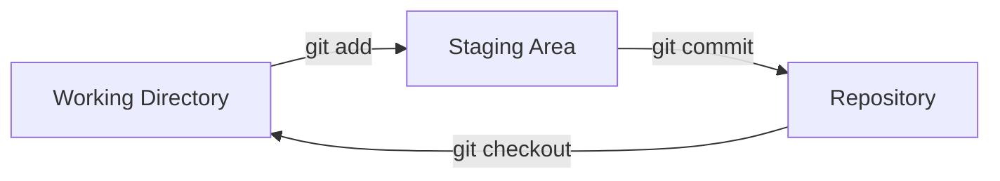
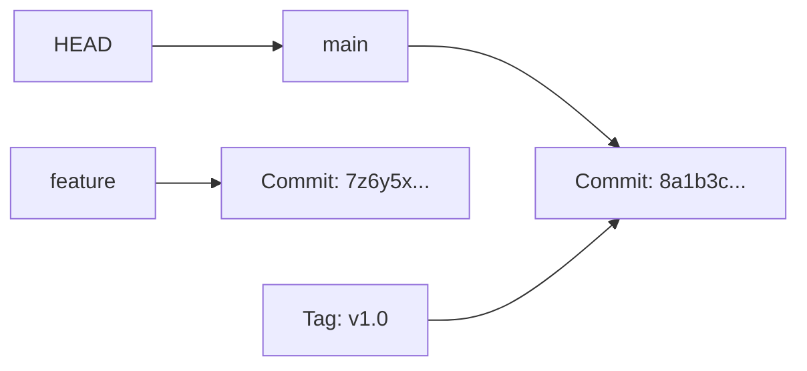
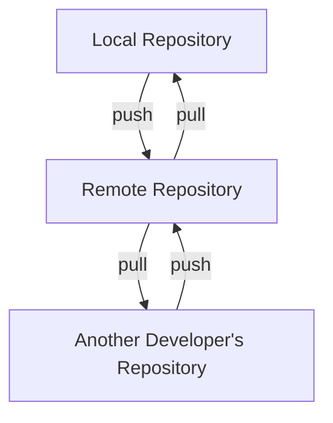

# Git Architecture

## Introduction

Git is one of the most widely used version control systems in the world. While most developers use Git for its powerful commands, understanding its underlying architecture can help you become a more effective developer. This guide will take you behind the scenes to explore how Git actually works under the hood.

Git's architecture was designed with several key principles in mind:
- Speed and efficiency
- Data integrity
- Distributed workflows
- Non-linear development support

By the end of this guide, you'll understand Git's core data structures, how Git stores and tracks your files, and how its distributed nature enables collaborative coding.

## Git's Data Model

At its core, Git is a content-addressable filesystem. This means Git stores data and retrieves it based on its content. Let's dive into the main components of Git's architecture.

### The Git Object Database

Git uses a simple key-value data store. When you save content in Git, it generates a key (a hash) based on the content and stores the content with that key. This content is called an "object."

There are four main types of objects in Git:

1. **Blob**: Stores file data
2. **Tree**: Represents directories and contains pointers to blobs and other trees
3. **Commit**: Points to a tree and contains metadata like author, timestamp, and commit message
4. **Tag**: Points to a specific commit, usually used for marking releases

Let's visualize this relationship:



### Content Addressing with SHA-1

Git generates a 40-character SHA-1 hash for each object based on its content. For example:

```
8a1b3c5d7e9f2g4h6i8j0k1l3m5n7o9p1q3r5t7u9v1x3z5
```

This hash is used as the identifier for the object. This means:

1. The same content will always have the same hash
2. Changing even a single character in the content will generate a completely different hash
3. Git can detect if a file has been corrupted by recalculating its hash

You can see the hash of any object using the `git hash-object` command:

```bash
echo "Hello, Git!" | git hash-object --stdin
```

This would output something like:
```
af5626b4a114abcb82d63db7c8082c3c4756e51b
```

### Examining Git Objects

Let's explore how to view these objects. Git provides the `git cat-file` command for this purpose:

```bash
# View the type of an object
git cat-file -t af5626b4a114abcb82d63db7c8082c3c4756e51b

# View the content of an object
git cat-file -p af5626b4a114abcb82d63db7c8082c3c4756e51b
```

## The Three Areas of Git

In addition to the object database, Git has three "areas" where files can reside:

1. **Working Directory**: Where you edit your files
2. **Staging Area (Index)**: A middle ground where you prepare changes for a commit
3. **Repository**: Where Git stores the history of your project



### Working Directory

This is the directory on your filesystem where you edit, create, and delete files. Git sees these files as:

- **Tracked**: Files that Git knows about
- **Untracked**: Files that Git doesn't yet track

### Staging Area (Index)

The staging area is a file (generally in `.git/index`) that stores information about what will go into your next commit. It's sometimes called the "index."

When you run `git add`, you're updating the staging area with content from your working directory.

### Repository

The repository is stored in the `.git` directory. It contains all the committed history of your project in the form of Git objects.

## Git References

While SHA-1 hashes uniquely identify objects, they're not user-friendly to remember or type. Git uses references (or "refs") as human-readable names that point to commit hashes.

Common references include:

- **HEAD**: Points to the current commit you're working on
- **Branches**: Named references that point to specific commits
- **Tags**: Named references that point to specific objects, usually commits



### Example: Creating and Viewing References

```bash
# Create a new branch (reference)
git branch new-feature

# List all branches
git branch
```

Output:
```
  main
* new-feature
```

## Git's Distributed Architecture

Unlike centralized version control systems, Git is distributed. This means:

1. Every developer has a full copy of the repository, including its history
2. You can work offline and commit changes locally
3. When ready, you can synchronize with other repositories



This distributed nature gives Git several advantages:

- **Redundancy**: Multiple copies of the repository exist
- **Independence**: Developers can work without network access
- **Flexibility**: Various workflow models are possible (centralized, integration manager, dictator and lieutenants)

## Practical Example: Tracking a File's Journey

Let's follow a file through Git's architecture:

1. You create a new file `hello.txt` in your working directory.
2. You run `git add hello.txt` to stage the file.
   - Git creates a blob object with the file's content.
   - The staging area (index) is updated to reference this blob.
3. You run `git commit -m "Add hello.txt"`.
   - Git creates a tree object representing the project's structure.
   - Git creates a commit object with your message, pointing to that tree.
   - The current branch reference is updated to point to the new commit.

Let's examine this with Git commands:

```bash
# Create a file
echo "Hello, Git Architecture!" > hello.txt

# Add it to staging
git add hello.txt

# See what Git will commit
git ls-files --stage
```

Output:
```
100644 7f8a25a61b2b00d0895700be9d8904cb218aa765 0       hello.txt
```

```bash
# Commit the file
git commit -m "Add hello.txt"

# View the commit
git log --oneline -1
```

Output:
```
f7d2e3a Add hello.txt
```

```bash
# Examine the commit object
git cat-file -p f7d2e3a
```

Output:
```
tree 8b9af3c7...
author John Doe <john@example.com> 1631234567 +0000
committer John Doe <john@example.com> 1631234567 +0000

Add hello.txt
```

```bash
# Examine the tree object
git cat-file -p 8b9af3c7...
```

Output:
```
100644 blob 7f8a25a...    hello.txt
```

## Understanding Git Internals: .git Directory

The `.git` directory contains everything Git needs to track your project. Let's explore its structure:

- **objects/**: Contains all Git objects (blobs, trees, commits, tags)
- **refs/**: Contains pointers to commit objects (branches, tags)
- **HEAD**: Points to the currently checked out branch
- **index**: Stores staging area information
- **config**: Repository-specific configuration
- **hooks/**: Custom scripts that run at certain points in Git's execution

You can safely explore this directory without breaking anything:

```bash
ls -la .git/
```

Output:
```
drwxr-xr-x  12 user  group   384 Sep 10 10:00 .
drwxr-xr-x  14 user  group   448 Sep 10 10:00 ..
-rw-r--r--   1 user  group    23 Sep 10 10:00 HEAD
drwxr-xr-x   2 user  group    64 Sep 10 10:00 branches
-rw-r--r--   1 user  group   137 Sep 10 10:00 config
-rw-r--r--   1 user  group    73 Sep 10 10:00 description
drwxr-xr-x   8 user  group   256 Sep 10 10:00 hooks
-rw-r--r--   1 user  group   249 Sep 10 10:00 index
drwxr-xr-x   4 user  group   128 Sep 10 10:00 info
drwxr-xr-x  15 user  group   480 Sep 10 10:00 objects
drwxr-xr-x   4 user  group   128 Sep 10 10:00 refs
```

## Git's Pack Files

While storing each file version separately is conceptually simple, it can be inefficient for large repositories. Git uses "pack files" to store objects more efficiently:

- Instead of storing complete copies of each version of a file, Git can store deltas (differences)
- Git automatically creates pack files when you run commands like `git gc` or before pushing
- Pack files store objects in a compressed format to save space

```bash
# View pack files
ls -la .git/objects/pack/
```

## Summary

In this guide, we've explored Git's architecture from its content-addressable filesystem to its distributed nature. Understanding these concepts will help you:

1. **Debug effectively**: When Git behaves unexpectedly, you'll know where to look
2. **Use Git efficiently**: You'll understand what each command actually does
3. **Implement best practices**: You'll make better decisions about branching, merging, and structuring your workflow

Git's elegant design allows it to be simple on the surface yet powerful underneath. By understanding its architecture, you're better equipped to leverage its full capabilities.

## Additional Resources

To deepen your understanding of Git's architecture:

- Experiment with low-level Git commands like `git cat-file`, `git hash-object`, and `git update-index`
- Read the [Git Internals chapter](https://git-scm.com/book/en/v2/Git-Internals-Plumbing-and-Porcelain) in the Pro Git book
- Try visualizing your repository with `git log --graph --oneline --all`

## Exercises

1. Create a new Git repository and use `git hash-object` to manually create a blob object. Then verify it exists in the `.git/objects` directory.

2. Examine a commit in one of your repositories using `git cat-file -p <commit-hash>` and trace the relationships between the commit, tree, and blob objects.

3. Use `git ls-files --stage` to view the contents of the staging area, then modify a file and run the command again to see the changes.

4. Draw a diagram of your current repository's branch structure using `git log --graph --oneline --all`.