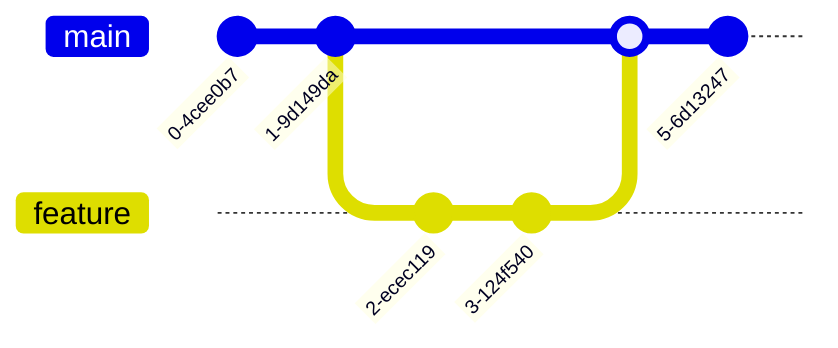

# Git Terminology

## Introduction

Git is a powerful distributed version control system that helps developers track changes, collaborate on code, and maintain project history. Understanding Git's terminology is fundamental to using it effectively. This guide breaks down the essential Git terms and concepts that every beginner should know.

## Core Concepts

### Repository

A repository (or "repo") is a storage location that contains your project files and the complete history of changes made to those files.

There are two types of repositories:
- **Local repository**: Exists on your computer
- **Remote repository**: Hosted on a server (like GitHub, GitLab, or Bitbucket)

```bash
# Create a new local repository
git init

# Clone an existing remote repository
git clone https://github.com/username/repository-name.git
```

### Working Directory

The working directory is where you make changes to your files. It's the directory on your filesystem that contains the project files you're currently working on.

### Staging Area (Index)

The staging area is where you prepare changes before committing them to the repository. It acts as a middle ground between your working directory and the repository.

```bash
# Add files to the staging area
git add filename.txt

# Add all changes to the staging area
git add .
```

### Commit

A commit is a snapshot of your repository at a specific point in time. It records changes to the repository along with a message describing what changed.

```bash
# Commit staged changes with a message
git commit -m "Add new feature"

# Output:
# [main 5d69206] Add new feature
# 1 file changed, 10 insertions(+), 2 deletions(-)
```

### Branch

A branch is an independent line of development that allows you to work on features or fixes without affecting the main codebase.

```bash
# Create a new branch
git branch feature-login

# Switch to a branch
git checkout feature-login

# Create and switch to a new branch (shorthand)
git checkout -b feature-login
```

## Workflow Terminology

### Pull

Pulling retrieves changes from a remote repository and integrates them into your local repository.

```bash
# Pull changes from the remote repository
git pull origin main
```

### Push

Pushing sends your committed changes to a remote repository.

```bash
# Push changes to the remote repository
git push origin main
```

### Merge

Merging combines changes from different branches.

```bash
# Merge a feature branch into main
git checkout main
git merge feature-login

# Output:
# Updating 5d69206..a78df3c
# Fast-forward
# src/login.js | 35 +++++++++++++++++++++++++++++++++++
# 1 file changed, 35 insertions(+)
# create mode 100644 src/login.js
```

### Fetch

Fetching retrieves changes from a remote repository without integrating them into your local repository.

```bash
# Fetch changes from the remote repository
git fetch origin
```

## Status & History Terms

### Status

Status shows the current state of your working directory and staging area.

```bash
# Check status of your repository
git status

# Output:
# On branch main
# Your branch is up to date with 'origin/main'.
# 
# Changes not staged for commit:
#   (use "git add <file>..." to update what will be committed)
#   (use "git restore <file>..." to discard changes in working directory)
#     modified:   README.md
# 
# Untracked files:
#   (use "git add <file>..." to include in what will be committed)
#     newfile.txt
```

### Log

Log displays the history of commits in a repository.

```bash
# View commit history
git log

# Output:
# commit a78df3c6b4e9a2c62e8f82631963d5a31f0d90a7 (HEAD -> main, origin/main)
# Author: John Doe <john@example.com>
# Date:   Wed Mar 10 14:23:01 2021 -0800
# 
#     Add login functionality
# 
# commit 5d69206bd822b34a693bf75a365aaf37572319d0
# Author: John Doe <john@example.com>
# Date:   Wed Mar 10 13:15:32 2021 -0800
# 
#     Initial commit
```

## Branching and Remote Terminology

### HEAD

HEAD is a reference to the current commit in the currently checked-out branch.

```bash
# See where HEAD is pointing
git log --oneline -1

# Output:
# a78df3c (HEAD -> main, origin/main) Add login functionality
```

### Origin

Origin is the default name given to the remote repository from which you cloned your local repository.

```bash
# View information about remote repositories
git remote -v

# Output:
# origin  https://github.com/username/repository-name.git (fetch)
# origin  https://github.com/username/repository-name.git (push)
```

### Fork

A fork is a copy of a repository in your account, allowing you to make changes without affecting the original project.

## Conflict Resolution Terms

### Conflict

A conflict occurs when Git can't automatically merge changes because competing changes exist in the same part of a file.

```bash
# After attempting a merge with conflicts
# Output:
# Auto-merging index.html
# CONFLICT (content): Merge conflict in index.html
# Automatic merge failed; fix conflicts and then commit the result.
```

### Resolution

Resolving a conflict means editing the conflicted files to determine which changes to keep.

```bash
# After resolving conflicts
git add index.html
git commit -m "Resolve merge conflict in index.html"
```

## Git Workflow Visualization

Here's a diagram showing the basic Git workflow:


## Git Branching Strategy Visualization

A common branching strategy visualized:



## Summary

Understanding Git terminology is essential for effective version control. The key concepts include:

- **Repositories**: Storage locations for your project and its history
- **Working Directory**: Where you make changes
- **Staging Area**: Where you prepare changes
- **Commits**: Snapshots of your repository
- **Branches**: Independent lines of development
- **Pull/Push/Fetch**: Methods for sharing changes
- **Merge**: Combining changes from different branches
- **HEAD**: Reference to the current commit
- **Conflicts**: Competing changes that need resolution

## Additional Resources

- Practice with the [Git Learning Lab](https://lab.github.com/)
- Refer to the official [Git Documentation](https://git-scm.com/doc)

## Exercises

1. Initialize a git repository and make your first commit
2. Create a branch, make changes, and merge it back to main
3. Simulate a merge conflict and practice resolving it
4. Clone a public repository and explore its commit history
5. Push changes to a remote repository and then pull them to another location