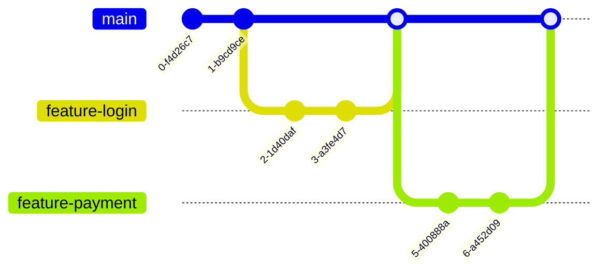
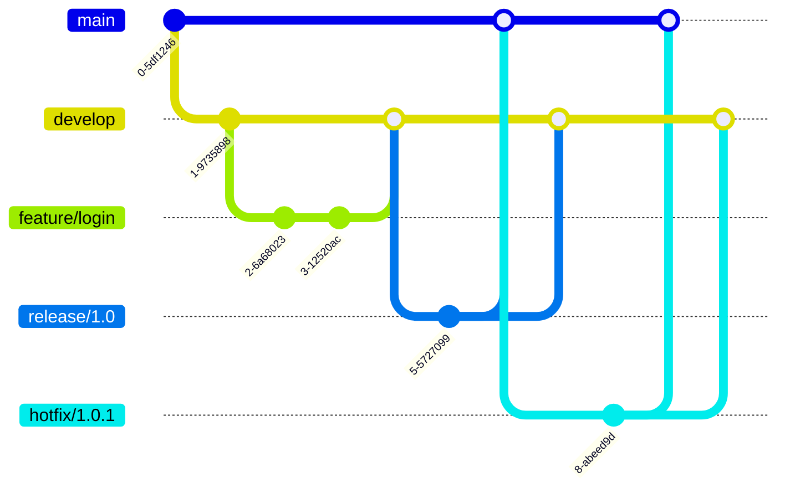
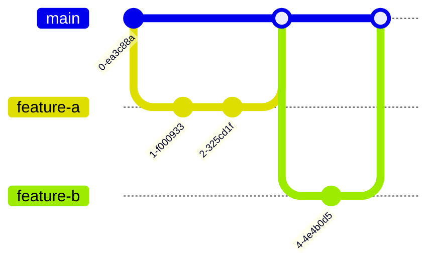

# Git Workflow

## Introduction

A Git workflow is a recipe or recommendation for how to use Git effectively for your projects. It establishes conventions for branching, merging, and deployment strategies that help teams collaborate smoothly. Understanding different Git workflows is crucial for efficient version control and team collaboration.

In this tutorial, we'll explore different Git workflow models, from simple to complex, and how to implement them in your projects. Whether you're working alone or in a team, having a clear workflow will help you maintain clean repositories and avoid common pitfalls.

## Basic Git Workflow

Let's start with the simplest workflow - working directly on the main branch.

### Simple Workflow (For Solo Projects)

For personal projects or initial learning, you might use this straightforward approach:

1. Make changes to your files
2. Stage your changes
3. Commit your changes
4. Push to remote (optional)

Here's how this looks in practice:

```bash
# Make changes to your files in your editor
# Then stage your changes
git add index.html style.css

# Commit your changes
git commit -m "Add navigation bar and styles"

# Push to remote repository (if you have one)
git push origin main
```

This simple workflow works for personal projects but has limitations when working with others.

## Feature Branch Workflow

The feature branch workflow involves creating a separate branch for each new feature or bug fix. This approach keeps the main branch stable while development happens in isolation.



### Implementing Feature Branch Workflow

Here's how to implement this workflow:

1. Create a new branch for your feature
2. Develop your feature with multiple commits
3. Push your branch to the remote repository
4. Create a pull request for review
5. Merge into the main branch

Let's see it in action:

```bash
# Start by creating a new branch
git checkout -b feature/user-authentication

# Work on your feature and make commits
# ... make changes to files ...
git add .
git commit -m "Add user registration form"

# ... more changes ...
git add .
git commit -m "Add form validation"

# Push your branch to the remote repository
git push -u origin feature/user-authentication

# After review, merge into main (you might do this via a pull request on GitHub/GitLab)
git checkout main
git merge feature/user-authentication
git push origin main
```

## Gitflow Workflow

Gitflow is a more structured workflow designed for larger projects with scheduled releases. It uses specific branch types for different purposes.

### Branch Types in Gitflow

- **main**: Production-ready code
- **develop**: Latest development changes
- **feature/\***: New features
- **release/\***: Preparing for a release
- **hotfix/\***: Urgent fixes for production



### Implementing Gitflow

Here's how to implement the Gitflow workflow:

```bash
# Setting up a new repository with Gitflow
git init
git commit --allow-empty -m "Initial commit"
git checkout -b develop

# Starting a new feature
git checkout -b feature/user-profiles develop

# Work on the feature
# ... make changes ...
git add .
git commit -m "Add user profile page"

# Finish the feature
git checkout develop
git merge --no-ff feature/user-profiles
git branch -d feature/user-profiles

# Prepare a release
git checkout -b release/1.0 develop

# Make final adjustments and version bumps
# ... make changes ...
git add .
git commit -m "Bump version to 1.0"

# Finish the release
git checkout main
git merge --no-ff release/1.0
git tag -a v1.0 -m "Version 1.0"
git checkout develop
git merge --no-ff release/1.0
git branch -d release/1.0

# Creating a hotfix
git checkout -b hotfix/1.0.1 main

# Fix the bug
# ... make changes ...
git add .
git commit -m "Fix critical security issue"

# Finish the hotfix
git checkout main
git merge --no-ff hotfix/1.0.1
git tag -a v1.0.1 -m "Version 1.0.1"
git checkout develop
git merge --no-ff hotfix/1.0.1
git branch -d hotfix/1.0.1
```

## GitHub Flow

GitHub Flow is a simpler alternative to Gitflow, focused on continuous delivery. It's lighter and more suitable for web applications with frequent deployments.

### Key Principles of GitHub Flow:

1. The main branch is always deployable
2. Create feature branches from main
3. Push to remote feature branches regularly
4. Open a pull request at any time for feedback
5. Merge only after code review
6. Deploy immediately after merging to main



### Implementing GitHub Flow

Here's how to use GitHub Flow:

```bash
# Start by creating a descriptive branch
git checkout -b improve-login-validation

# Make changes and commits
# ... make changes ...
git add .
git commit -m "Add password strength meter"

# Push to the remote repository
git push -u origin improve-login-validation

# After creating a pull request and receiving approval:
# (Usually done through the GitHub interface)

# After merging via GitHub, pull the updated main
git checkout main
git pull origin main
```

## Trunk-Based Development

Trunk-based development is a version control practice where developers merge small, frequent updates to a core "trunk" or main branch. This approach is popular in CI/CD environments.

### Key Characteristics:

- Short-lived feature branches (typically less than a day)
- Direct commits to main for smaller changes
- Feature flags for incomplete features
- Strong emphasis on automated testing

```bash
# For small changes, work directly on main
git checkout main
git pull
# ... make small changes ...
git add .
git commit -m "Fix typo in welcome message"
git push

# For larger changes that take a few hours (branch and merge same day)
git checkout -b quick-feature
# ... make changes ...
git add .
git commit -m "Add remember me checkbox"
git push -u origin quick-feature
# Create pull request and merge same day
```

## Best Practices for Git Workflows

Regardless of which workflow you choose, these practices will help you succeed:

1. **Write clear commit messages**
   ```bash
   # Good
   git commit -m "Add password reset functionality"
   
   # Better (using extended description)
   git commit -m "Add password reset functionality" -m "Implements the forgotten password flow including email verification and security questions."
   ```

2. **Commit often, push regularly**
   - Make small, focused commits
   - Push to remote repositories regularly to back up your work

3. **Use meaningful branch names**
   ```bash
   # Good
   git checkout -b feature/user-authentication
   
   # Avoid
   git checkout -b my-feature
   ```

4. **Review changes before committing**
   ```bash
   git diff
   git status
   ```

5. **Keep your local repository updated**
   ```bash
   git pull origin main
   ```

6. **Use pull requests for code reviews**
   - Create detailed pull request descriptions
   - Respond constructively to review comments

## Choosing the Right Workflow

Here's a quick guide to choosing the most suitable workflow:

| Workflow | Best For | Complexity | Release Frequency |
|----------|----------|------------|-------------------|
| Simple | Solo projects, learning | Low | Anytime |
| Feature Branch | Small teams | Low-Medium | Frequent |
| Gitflow | Larger teams with scheduled releases | High | Scheduled |
| GitHub Flow | Web applications, continuous delivery | Medium | Very frequent |
| Trunk-Based | CI/CD environments, experienced teams | Medium | Continuous |

## Configuring Your Git Environment

A proper Git workflow also includes configuring your environment correctly:

```bash
# Set your identity
git config --global user.name "Your Name"
git config --global user.email "your.email@example.com"

# Set default editor
git config --global core.editor "code --wait"

# Set default branch name
git config --global init.defaultBranch main

# Set up helpful aliases
git config --global alias.co checkout
git config --global alias.br branch
git config --global alias.st status
```

## Summary

A well-defined Git workflow is essential for efficient collaboration and version control. The workflow you choose should match your team's size, project requirements, and deployment frequency:

- **Simple Workflow**: For beginners and solo projects
- **Feature Branch Workflow**: For small teams with regular deployments
- **Gitflow**: For larger teams with scheduled releases
- **GitHub Flow**: For web applications with continuous delivery
- **Trunk-Based Development**: For experienced teams with strong CI/CD practices

Remember that workflows can be adapted to your needs. Start with something simple and evolve as your project and team grow.

## Exercises

1. Set up a personal project using the Feature Branch workflow
2. Practice creating a release using Gitflow
3. Simulate a team environment by creating branches, pull requests, and merging them
4. Experiment with handling merge conflicts in different workflows
5. Try implementing feature flags in a trunk-based development approach

## Additional Resources

- [Pro Git Book](https://git-scm.com/book/en/v2)
- [Atlassian Git Workflow Guide](https://www.atlassian.com/git/tutorials/comparing-workflows)
- [GitHub Flow Guide](https://guides.github.com/introduction/flow/)
- [Git Flow Cheatsheet](https://danielkummer.github.io/git-flow-cheatsheet/)