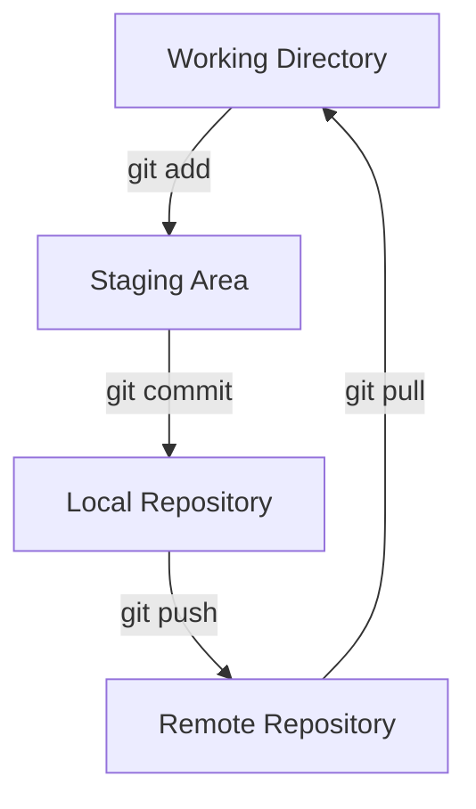

# Git Repository

## Introduction

A Git repository (or "repo") is the heart of any Git-based project. It's a special data structure where Git stores all the files, directories, and the complete history of your project. Think of it as a database that tracks every change made to your project files over time.

Unlike traditional file storage, a Git repository doesn't just keep the current version of your files - it maintains a complete record of what changed, when it changed, and who made those changes. This makes it a powerful tool for version control, collaboration, and project management.

## Understanding Git Repositories

### What Makes Up a Repository?

A Git repository consists of:

1. **Working Directory**: The files you currently see and edit on your file system
2. **Staging Area** (Index): A temporary area where changes are stored before being committed
3. **Local Repository**: The `.git` directory containing all metadata and object database for your project



### Types of Git Repositories

There are two main types of Git repositories:

1. **Local Repository**: Exists on your local machine
2. **Remote Repository**: Hosted on a server (like GitHub, GitLab, or Bitbucket)

## Creating a Git Repository

### Initializing a New Repository

To create a brand new Git repository, navigate to your project directory and run:

```bash
# Navigate to your project folder
cd my-project

# Initialize a new Git repository
git init
```

This command creates a hidden `.git` directory, transforming your regular directory into a Git repository. Let's look at the output:

```
Initialized empty Git repository in /path/to/my-project/.git/
```

### Cloning an Existing Repository

If you want to work with an existing repository, you can clone it:

```bash
# Clone a repository
git clone https://github.com/username/repository-name.git

# Clone to a specific folder
git clone https://github.com/username/repository-name.git my-folder
```

Example output:

```
Cloning into 'repository-name'...
remote: Enumerating objects: 684, done.
remote: Counting objects: 100% (684/684), done.
remote: Compressing objects: 100% (406/406), done.
remote: Total 684 (delta 294), reused 558 (delta 229), pack-reused 0
Receiving objects: 100% (684/684), 2.30 MiB | 3.46 MiB/s, done.
Resolving deltas: 100% (294/294), done.
```

## Working with a Git Repository

### Checking Repository Status

To see the current state of your repository:

```bash
git status
```

This command shows which files are:
- Untracked (new files Git doesn't know about)
- Modified (changed since the last commit)
- Staged (ready to be committed)

Example output of a repository with changes:

```
On branch main
Changes not staged for commit:
  (use "git add <file>..." to update what will be committed)
  (use "git restore <file>..." to discard changes in working directory)
        modified:   index.js

Untracked files:
  (use "git add <file>..." to include in what will be committed)
        new-file.txt

no changes added to commit (use "git add" and/or "git commit -a")
```

### Basic Repository Operations

Here are the fundamental operations you'll perform with a Git repository:

#### 1. Adding Files to Staging

```bash
# Add a specific file
git add filename.js

# Add multiple files
git add file1.js file2.js

# Add all files
git add .
```

#### 2. Committing Changes

```bash
# Commit with a message
git commit -m "Add login functionality"

# Commit all changed files (skips staging for tracked files)
git commit -am "Fix bugs in login form"
```

Example output:

```
[main 3d48a71] Add login functionality
 2 files changed, 25 insertions(+), 3 deletions(-)
```

#### 3. Viewing Commit History

```bash
# View commit history
git log

# View compact history
git log --oneline
```

Example output:

```
commit 3d48a71a8f63b6c8e59a85d16218f9cef9c57e2b (HEAD -> main)
Author: Your Name <your.email@example.com>
Date:   Thu Mar 14 10:30:45 2023 -0700

    Add login functionality

commit c72b67835c7e1f5e12bb47203fe5c32a38b9eda1
Author: Your Name <your.email@example.com>
Date:   Wed Mar 13 15:22:12 2023 -0700

    Initial commit
```

## Working with Remote Repositories

### Connecting to a Remote Repository

```bash
# Add a remote repository
git remote add origin https://github.com/username/repository-name.git

# View remote repositories
git remote -v
```

Example output of `git remote -v`:

```
origin  https://github.com/username/repository-name.git (fetch)
origin  https://github.com/username/repository-name.git (push)
```

### Pushing and Pulling Changes

```bash
# Push local commits to remote repository
git push origin main

# Pull changes from remote repository
git pull origin main
```

Example output of a successful push:

```
Enumerating objects: 5, done.
Counting objects: 100% (5/5), done.
Delta compression using up to 8 threads
Compressing objects: 100% (3/3), done.
Writing objects: 100% (3/3), 354 bytes | 354.00 KiB/s, done.
Total 3 (delta 2), reused 0 (delta 0), pack-reused 0
remote: Resolving deltas: 100% (2/2), completed with 2 local objects.
To https://github.com/username/repository-name.git
   c72b678..3d48a71  main -> main
```

## Repository Structure

Let's look at what's inside the `.git` directory:

```
.git/
├── HEAD           # Points to the current branch
├── config         # Repository-specific configuration
├── description    # Repository description (for GitWeb)
├── hooks/         # Client or server-side hook scripts
├── index          # Staging area information
├── objects/       # All content of your repository
└── refs/          # Pointers to commits (branches, tags, etc.)
```

You don't need to manually modify these files - Git provides commands to interact with the repository.

## Real-World Example: Building a Project

Let's walk through a complete example of using a Git repository for a web project:

### Step 1: Initialize a repository for a new project

```bash
# Create project directory
mkdir my-website
cd my-website

# Initialize repository
git init

# Create initial files
touch index.html styles.css script.js
```

### Step 2: Add files and make first commit

```bash
# Add files to staging
git add index.html styles.css script.js

# Commit the files
git commit -m "Initial project setup with HTML, CSS, and JS files"
```

### Step 3: Create a feature branch and make changes

```bash
# Create and switch to a new branch
git checkout -b feature/navbar

# Make changes to files...

# Add and commit the changes
git add .
git commit -m "Add responsive navigation bar"
```

### Step 4: Merge changes back to main branch

```bash
# Switch back to main branch
git checkout main

# Merge the feature branch
git merge feature/navbar

# Delete the feature branch (optional)
git branch -d feature/navbar
```

### Step 5: Share your project on GitHub

```bash
# Create a repository on GitHub first, then:
git remote add origin https://github.com/username/my-website.git
git push -u origin main
```

## Best Practices for Repository Management

1. **Commit Often**: Make small, frequent commits with meaningful messages
2. **Use Branches**: Create branches for new features and bug fixes
3. **Write Clear Commit Messages**: Begin with a verb and describe what the commit does
4. **Keep Repositories Clean**: Use `.gitignore` to exclude build artifacts, dependencies, and sensitive information
5. **Pull Before Push**: Always pull latest changes before pushing to avoid conflicts

## Common Repository Issues and Solutions

### Problem: Accidentally committed sensitive information

Solution:
```bash
# Remove the file from the repository but keep it locally
git rm --cached sensitive_file.txt
git commit -m "Remove sensitive file"

# Add to .gitignore to prevent future commits
echo "sensitive_file.txt" >> .gitignore
git add .gitignore
git commit -m "Add sensitive file to .gitignore"
```

### Problem: Need to undo last commit

Solution:
```bash
# Undo commit but keep changes staged
git reset --soft HEAD~1

# Undo commit and unstage changes
git reset HEAD~1

# Undo commit and discard changes (be careful!)
git reset --hard HEAD~1
```

## Summary

A Git repository is the foundation of version control with Git. It stores your project's files and their complete history, enabling you to track changes, collaborate with others, and maintain different versions of your codebase.

In this tutorial, you've learned:

- What a Git repository is and how it's structured
- How to create new repositories or clone existing ones
- Basic operations like adding, committing, and viewing history
- Working with remote repositories
- Real-world workflow examples
- Best practices for repository management

## Exercises

1. Initialize a new Git repository for a personal project
2. Create a `.gitignore` file to exclude appropriate files
3. Make several commits with different changes
4. Create a repository on GitHub and push your local repository
5. Clone a popular open-source repository and explore its structure

## Additional Resources

- [Git Documentation](https://git-scm.com/doc)
- [GitHub Guides](https://guides.github.com/)
- [Pro Git Book](https://git-scm.com/book/en/v2) (free online)
- [Git Branching Model](https://nvie.com/posts/a-successful-git-branching-model/)