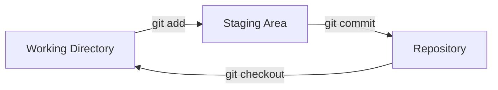

# Git Staging Area

## Introduction

The staging area (also called the "index") is one of Git's most powerful features and an essential concept to understand when learning Git. Think of the staging area as a preparation zone where you can organize and review your changes before committing them to your project's history.

Unlike other version control systems that directly commit all modified files, Git provides this intermediate step that gives you fine-grained control over exactly what changes will be included in your next commit.

## What is the Staging Area?

The staging area is a file (technically called the "index") in your Git directory that stores information about what will go into your next commit. It sits between your working directory (where you make changes to your files) and the repository (where commits are stored).



This three-state workflow is one of Git's distinctive features:

1. **Working Directory**: Where you modify your files
2. **Staging Area**: Where you prepare changes for your next commit
3. **Repository**: Where Git permanently stores your changes as commits

## Why Use the Staging Area?

The staging area allows you to:

- Commit only some of your modified files, not all of them
- Split changes in a single file into multiple commits
- Review and organize your changes before committing
- Construct clean, logical commits that represent complete units of work

## Basic Staging Commands

### Checking File Status

To see which files are in which state, use:

```bash
git status
```

Output example:
```
On branch main
Changes not staged for commit:
  (use "git add <file>..." to update what will be committed)
  (use "git restore <file>..." to discard changes in working directory)
        modified:   README.md

Untracked files:
  (use "git add <file>..." to include in what will be committed)
        new-feature.js
```

For a more condensed view:

```bash
git status -s
```

Output example:
```
 M README.md
?? new-feature.js
```

Where:
- `M` means modified
- `??` means untracked

### Adding Files to the Staging Area

To add files to the staging area:

```bash
# Add a specific file
git add filename.js

# Add multiple files
git add file1.js file2.js

# Add all files in the current directory
git add .

# Add all files of a certain type
git add *.js
```

### Viewing Staged Changes

To see what changes you've staged:

```bash
git diff --staged
```

Output example:
```
diff --git a/README.md b/README.md
index 3b18e51..c5ba5bc 100644
--- a/README.md
+++ b/README.md
@@ -1 +1,2 @@
 # My Project
+This is a sample project to demonstrate Git features.
```

To see what changes you haven't staged yet:

```bash
git diff
```

### Unstaging Files

If you've added a file to the staging area but want to remove it:

```bash
git restore --staged filename.js
```

In older Git versions:

```bash
git reset HEAD filename.js
```

## Practical Example: Building a Logical Commit

Let's walk through a real-world example of using the staging area to create a clean, logical commit.

Imagine you're working on a project and have made several changes:
- Fixed a bug in `utils.js`
- Added a new feature in `app.js`
- Updated documentation in `README.md`
- Added some console.log statements for debugging

First, check what you've modified:

```bash
git status
```

Output:
```
On branch main
Changes not staged for commit:
  (use "git add <file>..." to update what will be committed)
  (use "git restore <file>..." to discard changes in working directory)
        modified:   README.md
        modified:   app.js
        modified:   utils.js
```

Let's say you want to commit just the bug fix first:

```bash
git add utils.js
git commit -m "Fix calculation error in utils.js"
```

Now you can stage and commit the feature addition:

```bash
git add app.js
git commit -m "Add user authentication feature"
```

Finally, stage and commit the documentation update:

```bash
git add README.md
git commit -m "Update README with authentication instructions"
```

This creates three separate, logical commits instead of one large commit with mixed changes, making your project history much more useful and easier to understand.

## Advanced Staging Techniques

### Staging Parts of a File

Sometimes you've made multiple changes to a single file, but want to commit them separately. Git allows you to stage specific parts of a file:

```bash
git add -p filename.js
```

Git will break the changes in the file into "hunks" and ask you what to do with each one:

```
diff --git a/filename.js b/filename.js
index 1234567..abcdefg 100644
--- a/filename.js
+++ b/filename.js
@@ -10,6 +10,7 @@
 function calculateTotal(items) {
   return items.reduce((total, item) => {
+    // Fix calculation to include tax
     return total + item.price;
   }, 0);
 }
Stage this hunk [y,n,q,a,d,s,e,?]?
```

You can respond with:
- `y` - stage this hunk
- `n` - do not stage this hunk
- `q` - quit; don't stage this hunk or any remaining hunks
- `a` - stage this hunk and all remaining hunks
- `d` - do not stage this hunk or any remaining hunks
- `s` - split the hunk into smaller hunks (if possible)
- `e` - manually edit the hunk
- `?` - print help

### Stashing Changes

If you're in the middle of working on something but need to switch contexts, you can use Git's stash feature to save your unstaged and staged changes temporarily:

```bash
git stash
```

This cleans your working directory. Later, you can reapply those changes:

```bash
git stash pop
```

## Common Workflows with the Staging Area

### Feature Branch Workflow

When working on a new feature:

1. Create a feature branch: `git checkout -b new-feature`
2. Make changes to files
3. Stage related changes: `git add relevant-file1.js relevant-file2.js`
4. Commit the staged changes: `git commit -m "Add first part of new feature"`
5. Continue making changes, staging, and committing
6. When the feature is complete, merge back to the main branch

### Code Review Preparation

When preparing code for review:

1. Make your changes
2. Review all changes: `git diff`
3. Stage changes file by file: `git add file1.js`
4. Check what you've staged: `git diff --staged`
5. Make sure commits are logical and well-organized
6. Push for review

## Common Issues and Solutions

### I accidentally staged a file I don't want to commit

```bash
git restore --staged unwanted-file.js
```

### I want to undo all staged changes

```bash
git restore --staged .
```

### I want to stage all tracked files but not new ones

```bash
git add -u
```

### I want to see what I'm about to commit

```bash
git diff --staged
```

## Summary

The Git staging area is a powerful tool that allows you to control exactly what goes into each commit. By thoughtfully using the staging area, you can:

- Create cleaner, more logical commits
- Make your project history more meaningful
- Collaborate more effectively with others
- Simplify code reviews and troubleshooting

Remember that good commits should represent logical units of change. The staging area helps you achieve this by letting you organize your changes before committing them.

## Additional Resources

- Try an interactive staging exercise on [Learn Git Branching](https://learngitbranching.js.org/)
- Read more about the staging area in the [Git Book](https://git-scm.com/book/en/v2/Git-Basics-Recording-Changes-to-the-Repository)

## Practice Exercises

1. Create a new Git repository and practice adding and removing files from the staging area
2. Try using `git add -p` to stage only parts of a modified file
3. Experiment with creating multiple commits from a single set of changes
4. Practice using `git diff` and `git diff --staged` to see the difference between staged and unstaged changes