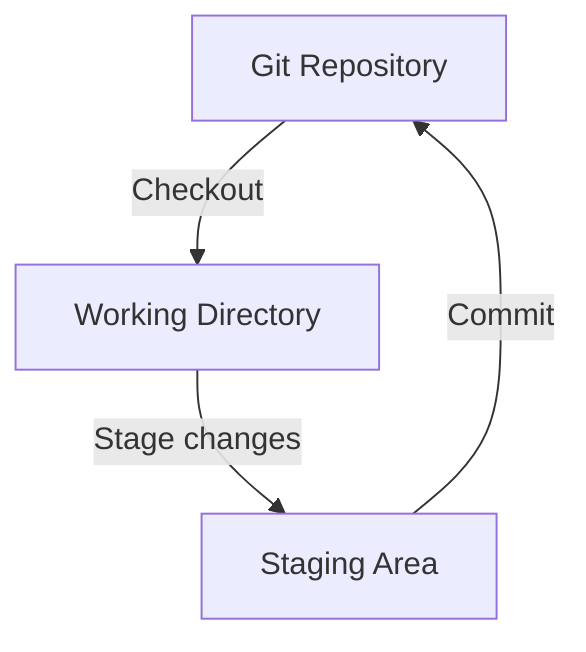

# Git Working Directory

## Introduction

The Git Working Directory is one of the core concepts you need to understand when learning Git. It represents the actual files on your computer that you're working with while developing your project. In Git's architecture, the Working Directory is where you make changes before committing them to your repository.

When working with Git, you're constantly moving between three main areas:
1. The Working Directory (where you edit files)
2. The Staging Area (where you prepare files for commit)
3. The Repository (where Git permanently stores your changes)

This lesson focuses on the Working Directory and its role in the Git workflow.

## Understanding the Git Working Directory

### What is the Working Directory?

The Working Directory (also called the "working tree") is simply the directory on your file system where your project files are located. It contains all the files and folders in your project that you can see and edit directly.



### Key Characteristics

- **Visible and accessible**: You can directly view and modify files in the Working Directory.
- **Temporary workspace**: Changes here are not yet tracked by Git until you explicitly add them to the staging area.
- **Current state**: Represents the current state of your project at a specific point in time.

## The Role of the Working Directory in Git Workflow

### Step 1: Making Changes

When you start working on a project, you make changes to files in your Working Directory. These could include:

- Creating new files
- Editing existing files
- Deleting files
- Renaming or moving files

At this point, Git is aware of these files but isn't actively tracking the changes you're making.

### Step 2: Checking Status

After making changes, you can check their status using:

```bash
git status
```

This command shows you:
- Modified files in your Working Directory
- New files that aren't being tracked
- Files staged for commit

Example output:

```
On branch main
Changes not staged for commit:
  (use "git add <file>..." to update what will be committed)
  (use "git restore <file>..." to discard changes in working directory)
        modified:   index.html

Untracked files:
  (use "git add <file>..." to include in what will be committed)
        style.css

no changes added to commit (use "git add" and/or "git commit -a")
```

### Step 3: Moving Changes to the Staging Area

When you're satisfied with the changes, you move them from the Working Directory to the Staging Area using:

```bash
git add <filename>    # Stage a specific file
git add .             # Stage all changes
```

## Working Directory States

Files in your Working Directory can be in different states:

### 1. Tracked Files

These are files that Git knows about. They can be:

- **Unmodified**: Match what's in your last commit
- **Modified**: Changed since your last commit but not yet staged
- **Staged**: Marked to be included in your next commit

### 2. Untracked Files

These are files in your Working Directory that Git doesn't yet track:

- New files you've just created
- Files explicitly ignored (via `.gitignore`)
- Files from other systems (like build artifacts)

## Practical Examples

Let's walk through some common Working Directory operations:

### Example 1: Creating and Tracking a New File

```bash
# Create a new file
echo "# My Project" > README.md

# Check status (file will be untracked)
git status

# Stage the file
git add README.md

# Check status again (file is now staged)
git status

# Commit the file
git commit -m "Add README file"
```

### Example 2: Modifying an Existing File

```bash
# Edit an existing file
echo "New content" >> README.md

# Check status (file will show as modified)
git status

# View the exact changes
git diff README.md

# Stage the changes
git add README.md

# Commit the changes
git commit -m "Update README file"
```

### Example 3: Discarding Changes in Working Directory

If you make changes that you don't want to keep:

```bash
# Discard changes to a specific file
git restore README.md

# Discard all changes in the Working Directory
git restore .
```

## Working with `.gitignore`

Sometimes you have files in your Working Directory that you never want Git to track, such as:
- Build artifacts
- Log files
- Dependency directories (like `node_modules`)
- Environment configuration files with secrets

You can tell Git to ignore these files by creating a `.gitignore` file:

```
# Example .gitignore file
node_modules/
*.log
.env
build/
dist/
```

## Comparing Working Directory with Other States

### Working Directory vs. Staging Area

To see changes you've made but haven't staged yet:

```bash
git diff
```

### Working Directory vs. Last Commit

To see all changes since your last commit (including staged changes):

```bash
git diff HEAD
```

## Advanced Working Directory Operations

### Temporarily Stashing Changes

If you need to switch tasks but aren't ready to commit:

```bash
# Save your changes temporarily
git stash save "Work in progress on feature X"

# Do other work, switch branches, etc.

# Bring back your changes
git stash pop
```

### Checking Out Previous Versions

You can replace your Working Directory with a previous state:

```bash
# Checkout a specific commit
git checkout <commit-hash>

# Return to the latest commit on main
git checkout main
```

## Common Issues and Solutions

### 1. Accidentally Deleting a File

If you accidentally delete a file in your Working Directory:

```bash
git restore <filename>
```

### 2. Conflicts During Merging

When Git can't automatically merge changes, you'll see conflict markers in your Working Directory files. You need to:

1. Edit the files to resolve conflicts
2. Stage the resolved files with `git add`
3. Complete the merge with `git commit`

## Summary

The Git Working Directory is your active workspace where you create, modify, and delete files as you develop your project. Understanding how it interacts with the Staging Area and Repository is fundamental to using Git effectively:

1. You make changes in your Working Directory
2. You stage changes you want to commit
3. You commit staged changes to your repository

Remember that changes in your Working Directory aren't tracked by Git until you explicitly add them to the staging area. This gives you control over which changes you include in each commit.

## Exercises

1. Create a new project directory and initialize Git. Add some files and observe how they appear as untracked in `git status`.
2. Create a simple text file, add it to Git, then modify it. Use `git diff` to see the changes.
3. Create a `.gitignore` file to exclude temporary files (like `.tmp` or `.log` files) from being tracked.
4. Practice using `git restore` to discard unwanted changes in your Working Directory.
5. Try using `git stash` to temporarily store changes while you work on something else.

## Additional Resources

- [Git Documentation - git-workspace-index-repo](https://git-scm.com/about/staging-area)
- [Pro Git Book - Chapter 2: Git Basics](https://git-scm.com/book/en/v2/Git-Basics-Recording-Changes-to-the-Repository)
- [Atlassian Git Tutorial - Saving Changes](https://www.atlassian.com/git/tutorials/saving-changes)