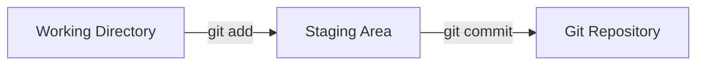

# Git First Commit

## Introduction

When you're starting your journey with Git, making your first commit is a significant milestone. A commit in Git is like taking a snapshot of your project at a specific point in time. This snapshot records the changes you've made and allows you to track the history of your project.

In this tutorial, we'll walk through the process of creating your first commit in Git. We'll cover everything from initializing a Git repository to staging changes and committing them with a meaningful message.

## Prerequisites

Before you begin, make sure you have:

- Git installed on your computer
- A basic understanding of terminal/command line navigation
- A text editor of your choice

You can verify your Git installation by running:

```bash
git --version
```

This should display the version of Git installed on your system.

## Setting Up Your First Git Repository

### Step 1: Create a New Directory

Let's start by creating a new directory for our project:

```bash
mkdir my-first-git-project
cd my-first-git-project
```

### Step 2: Initialize a Git Repository

To start tracking changes with Git, you need to initialize a Git repository in your project directory:

```bash
git init
```

**Output:**
```
Initialized empty Git repository in /path/to/my-first-git-project/.git/
```

This command creates a hidden `.git` directory that will store all the metadata and object database for your project. This is where Git keeps track of all your commits and project history.

## Understanding the Git Workflow

Before we make our first commit, let's understand the basic Git workflow:



1. **Working Directory**: Where you create, edit, and delete files
2. **Staging Area**: Where you prepare changes for a commit
3. **Git Repository**: Where Git permanently stores changes as commits

## Creating Your First Commit

### Step 1: Create a File

Let's create a simple text file to commit:

```bash
echo "# My First Git Project" > README.md
```

This command creates a README.md file with a simple heading.

### Step 2: Check Repository Status

To see what files have been changed but not yet committed, use:

```bash
git status
```

**Output:**
```
On branch master

No commits yet

Untracked files:
  (use "git add <file>..." to include in what will be committed)
        README.md

nothing added to commit but untracked files present (use "git add" to track)
```

This output tells us that README.md is currently untracked, meaning Git is not yet monitoring changes to this file.

### Step 3: Stage Your Changes

Before you can commit a file, you need to add it to the staging area:

```bash
git add README.md
```

You can also add all files in your directory using:

```bash
git add .
```

Check the status again to see the change:

```bash
git status
```

**Output:**
```
On branch master

No commits yet

Changes to be committed:
  (use "git rm --cached <file>..." to unstage)
        new file:   README.md
```

Now README.md is in the staging area, ready to be committed.

### Step 4: Make Your First Commit

Now we're ready to create our first commit:

```bash
git commit -m "Initial commit: Add README file"
```

**Output:**
```
[master (root-commit) f7d9853] Initial commit: Add README file
 1 file changed, 1 insertion(+)
 create mode 100644 README.md
```

Congratulations! You've just made your first Git commit.

## Understanding the Commit Message

The commit message is crucial for maintaining a clear project history. A good commit message should:

1. Be concise yet descriptive
2. Start with a verb in the present tense (e.g., "Add", "Fix", "Update")
3. Explain *what* the change does and *why* it was made

Examples of good commit messages:
- "Add user authentication feature"
- "Fix bug in payment processing"
- "Update documentation for API endpoints"

## Viewing Your Commit History

To see your commit history, use:

```bash
git log
```

**Output:**
```
commit f7d98537890a3f5c3a3b3d6098f7b6cad684fe2a (HEAD -> master)
Author: Your Name <your.email@example.com>
Date:   Mon Jan 01 2023 12:00:00 -0800

    Initial commit: Add README file
```

This shows:
- The commit hash (a unique identifier)
- The author information
- The date and time of the commit
- The commit message

For a more condensed view:

```bash
git log --oneline
```

**Output:**
```
f7d9853 (HEAD -> master) Initial commit: Add README file
```

## Making More Changes

Let's make another change to understand the workflow better:

```bash
echo "This is my first project using Git." >> README.md
```

This adds a new line to our README.md file.

Check the status again:

```bash
git status
```

**Output:**
```
On branch master
Changes not staged for commit:
  (use "git add <file>..." to update what will be committed)
  (use "git restore <file>..." to discard changes in working directory)
        modified:   README.md

no changes added to commit (use "git add" and/or "git commit -a")
```

Now stage and commit this change:

```bash
git add README.md
git commit -m "Update README with project description"
```

**Output:**
```
[master a1b2c3d] Update README with project description
 1 file changed, 1 insertion(+)
```

## Practical Real-World Example

Let's consider a more practical example. Imagine you're starting a web project:

1. Create project files:

```bash
mkdir css js
touch index.html css/style.css js/script.js
```

2. Add some basic HTML content:

```bash
echo "<!DOCTYPE html>
<html>
<head>
    <title>My Project</title>
    <link rel=\"stylesheet\" href=\"css/style.css\">
</head>
<body>
    <h1>Hello, Git!</h1>
    <script src=\"js/script.js\"></script>
</body>
</html>" > index.html
```

3. Stage all the files:

```bash
git add .
```

4. Commit the files:

```bash
git commit -m "Create basic project structure with HTML, CSS, and JS files"
```

This is a common workflow when setting up a new project - creating the basic structure and making an initial commit before diving into the actual development.

## Best Practices for Commits

1. **Make atomic commits**: Each commit should represent a single logical change
2. **Commit frequently**: Small, frequent commits are easier to understand and manage
3. **Write meaningful commit messages**: Clear messages help others (and future you) understand the project history
4. **Don't commit sensitive information**: Avoid committing passwords, API keys, or personal data
5. **Don't commit unnecessary files**: Use `.gitignore` to exclude files that don't need version control

## Common Mistakes and How to Avoid Them

### Committing Too Many Changes at Once

**Problem**: Including multiple unrelated changes in a single commit makes it difficult to understand, review, or revert specific changes.

**Solution**: Make smaller, focused commits that each address a single logical change.

### Writing Vague Commit Messages

**Problem**: Messages like "Fixed stuff" or "Updated code" don't provide useful information.

**Solution**: Be specific about what changed and why.

### Forgetting to Add New Files

**Problem**: New files must be explicitly added to Git before they can be committed.

**Solution**: Always run `git status` before committing to ensure all intended files are staged.

## Summary

In this tutorial, you've learned how to:

1. Initialize a Git repository with `git init`
2. Check the status of your working directory with `git status`
3. Stage changes with `git add`
4. Create commits with `git commit`
5. View your commit history with `git log`
6. Follow best practices for making effective commits

These fundamental skills form the foundation of your Git journey. As you continue to work with Git, you'll build upon these basics to take advantage of Git's powerful version control capabilities.

## Additional Resources

- Try exploring other basic Git commands like `git diff` to see changes before committing
- Learn about `.gitignore` files to exclude files from version control
- Practice with branching and merging, which are core Git concepts
- Consider exploring Git hosting platforms like GitHub, GitLab, or Bitbucket

## Exercises

1. Create a new Git repository and make at least three commits with different types of changes
2. Practice viewing your commit history with different options for `git log`
3. Try modifying a file, staging it, then modifying it again to see how Git tracks changes at different stages
4. Write commit messages following the best practices outlined in this tutorial
5. Try using `git show` to examine the details of a specific commit