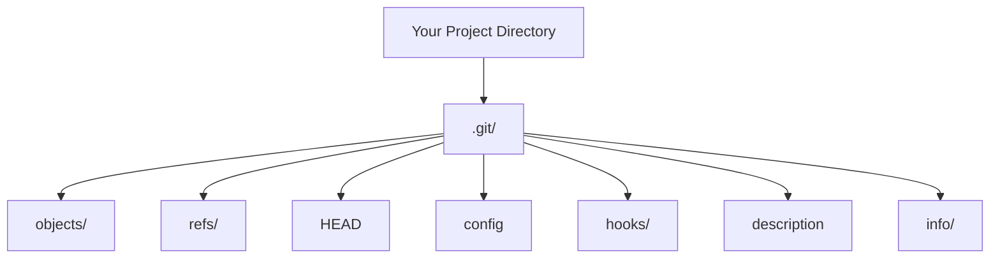

# Git Init

## Introduction

The `git init` command is your first step into the world of Git version control. When you begin a new project or want to start tracking changes to an existing project, `git init` creates the essential foundation - a Git repository. This repository is where Git will store all the version history and metadata for your project.

In this tutorial, you'll learn:
- What `git init` does behind the scenes
- How to initialize a repository properly
- Common options and use cases
- Best practices for starting your projects with Git

## What is Git Init?

The `git init` command creates a new Git repository. It transforms an ordinary directory into a Git workspace by creating a hidden `.git` directory that contains all the necessary metadata and objects that Git needs to track your project.

Think of `git init` as setting up a time machine for your code - it prepares the environment that will allow you to travel back to any previous version of your project in the future.

## Basic Usage

### Creating a New Repository

To create a new Git repository, navigate to your project's root directory in the terminal and run:

```bash
git init
```

You'll see output similar to:

```
Initialized empty Git repository in /path/to/your/project/.git/
```

That's it! Your directory is now a Git repository. While this change might seem invisible at first, Git has created a hidden `.git` directory containing all the necessary infrastructure.

### What Happens Behind the Scenes

When you run `git init`, Git:

1. Creates a `.git` directory in your project folder
2. Sets up several subdirectories within `.git` including:
   - `objects/` - stores all versions of your files
   - `refs/` - stores pointers to commits (branches, tags, etc.)
   - `HEAD` - reference to the current branch
   - `config` - repository-specific configuration
   - And several other configuration files and directories

Let's visualize the structure:



This hidden structure enables Git to track changes, manage branches, and store the complete history of your project.

## Common Options

While `git init` works perfectly for most cases with no additional options, there are a few useful variations:

### Initializing a Bare Repository

A bare repository contains just the Git revision history without a working directory. It's primarily used for remote repositories that developers will push to and pull from, but not work in directly.

```bash
git init --bare
```

Output:
```
Initialized empty Git repository in /path/to/your/project/
```

### Specifying a Directory

You can specify a directory to initialize:

```bash
git init my-new-project
```

Output:
```
Initialized empty Git repository in /path/to/my-new-project/.git/
```

This creates a new directory named `my-new-project` and initializes it as a Git repository.

### Custom Git Directory Location

If you want to store the Git directory somewhere other than the default `.git`:

```bash
git init --separate-git-dir=/path/to/git-dir
```

This is useful for advanced workflows where you might want to share a single Git directory among multiple working directories.

## Practical Examples

### Example 1: Starting a New Web Project

Let's walk through initializing a new web development project:

```bash
# Create a project directory
mkdir my-website
cd my-website

# Initialize the Git repository
git init

# Create some initial files
touch index.html style.css script.js

# Check the repository status
git status
```

Output of `git status`:
```
On branch master

No commits yet

Untracked files:
  (use "git add <file>..." to include in what will be committed)
        index.html
        script.js
        style.css

nothing added to commit but untracked files present (use "git add" to track)
```

Now your project is ready for version control! You can add these files to Git tracking and make your first commit.

### Example 2: Versioning an Existing Project

If you have an existing project that isn't under version control yet:

```bash
# Navigate to your existing project
cd ~/projects/existing-project

# Initialize Git repository
git init

# Add all existing files
git add .

# Make your initial commit
git commit -m "Initial commit: Add existing project files"
```

Output:
```
[master (root-commit) a1b2c3d] Initial commit: Add existing project files
 42 files changed, 1337 insertions(+)
 create mode 100644 ...
 ...
```

Your existing project is now under Git version control, with all files recorded in your initial commit.

## Best Practices

1. **Initialize Early**: Set up Git at the beginning of your project to track all changes from the start.

2. **Create a `.gitignore` File**: Before your first commit, create a `.gitignore` file to specify files and directories that Git should ignore (like build artifacts, dependencies, or environment-specific files).

   ```bash
   # Create a basic .gitignore file
   touch .gitignore
   echo "node_modules/" >> .gitignore
   echo "*.log" >> .gitignore
   ```

3. **Add a README**: Create a README.md file that describes your project, how to set it up, and how to use it.

   ```bash
   # Create a README file
   echo "# My Project

Description of my awesome project." > README.md
   ```

4. **Make an Initial Commit**: After initializing, make an initial commit even if your project is empty.

   ```bash
   git add .gitignore README.md
   git commit -m "Initial commit: Project setup with README and .gitignore"
   ```

5. **Connect to a Remote Repository**: After initializing locally, consider connecting to a remote repository for backup and collaboration.

   ```bash
   git remote add origin https://github.com/username/repository-name.git
   git branch -M main
   git push -u origin main
   ```

## Common Issues and Solutions

### Issue: "Fatal: not a git repository"

If you try to run Git commands and see this error, you're likely not in a Git repository or haven't initialized one yet.

**Solution**: Navigate to your project directory and run `git init`.

### Issue: Accidentally Initialized in Wrong Directory

If you initialize Git in the wrong directory, you can safely remove the Git repository by deleting the `.git` folder:

```bash
rm -rf .git
```

This removes the Git repository without affecting your other files.

### Issue: Multiple Nested Git Repositories

Having Git repositories inside other Git repositories can cause confusion.

**Solution**: Be mindful of where you run `git init` and use `git status` to check if you're already in a Git repository.

## Summary

The `git init` command is your entry point to Git version control. It creates the necessary infrastructure for tracking changes in your project by setting up a `.git` directory with all the required components.

Key points to remember:
- `git init` creates a new Git repository in your current directory
- The command sets up a hidden `.git` directory containing all Git metadata
- You can create bare repositories with `git init --bare` for remote storage
- Initialize Git early in your project's lifecycle
- Follow best practices like creating a `.gitignore` file and README from the start

With your repository initialized, you're ready to move on to other Git commands like `git add` and `git commit` to begin tracking your project's changes.

## Exercises

1. Create a new directory, initialize it as a Git repository, and examine the contents of the `.git` directory. Can you identify what each file and subdirectory is for?

2. Initialize a Git repository, create several files, and practice checking the status with `git status`. Notice how Git identifies untracked files.

3. Try initializing a bare repository and observe the differences in structure compared to a standard repository.

4. Create a project with a proper `.gitignore` file for your preferred programming language. Test that it correctly ignores the specified files.

## Additional Resources

- [Git Official Documentation on git init](https://git-scm.com/docs/git-init)
- [Pro Git Book - Chapter 2.1: Getting a Git Repository](https://git-scm.com/book/en/v2/Git-Basics-Getting-a-Git-Repository)
- [GitHub's Git Handbook](https://guides.github.com/introduction/git-handbook/)