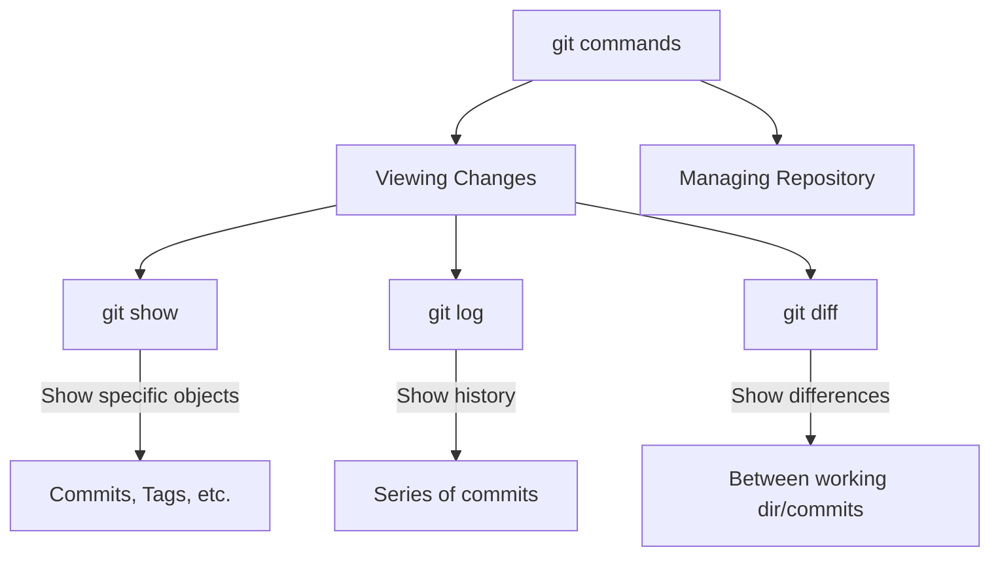

# Git Show

## Introduction

The `git show` command is a versatile tool in Git that allows you to view detailed information about various Git objects. Whether you need to inspect a specific commit, check the contents of a tag, or examine a blob, `git show` provides a way to access this information directly from your terminal.

It's like having a magnifying glass for your Git repository, letting you see the specific details of various Git objects that might otherwise be hidden within the repository's structure.

## Basic Syntax

The basic syntax of the `git show` command is:

```bash
git show [options] <object>
```

Where `<object>` can be:
- A commit hash
- A tag
- A tree
- A blob
- A reference (like HEAD, branch names, etc.)

If you don't specify an object, `git show` defaults to showing the latest commit (HEAD).

## Viewing Commits

### Viewing the Latest Commit

To view the latest commit in your repository:

```bash
git show
```

**Output:**
```
commit a1b2c3d4e5f6g7h8i9j0k1l2m3n4o5p6q7r8s9t (HEAD -> main)
Author: Your Name <your.email@example.com>
Date:   Fri Mar 14 10:30:00 2025 -0700

    Add new feature for user authentication
    
    - Implement login functionality
    - Add password reset capability
    - Update user profile management

diff --git a/src/auth.js b/src/auth.js
index 1234567..abcdefg 100644
--- a/src/auth.js
+++ b/src/auth.js
@@ -10,6 +10,15 @@ function login(username, password) {
   // Existing login code
+  // New authentication code
+  validateCredentials(username, password);
+  createSession(username);
+  return true;
 }
 
+function resetPassword(email) {
+  // Password reset implementation
+  sendResetEmail(email);
+}
+
 // Rest of the file
```

The output shows:
1. The commit hash
2. The author information
3. The commit date
4. The commit message
5. The diff showing what changes were made in that commit

### Viewing a Specific Commit

To view a specific commit, you'll need its hash:

```bash
git show a1b2c3d4e5
```

You don't need to type the entire commit hash—just enough characters to uniquely identify it in your repository.

### Viewing Just the Commit Message

If you only want to see the commit message without the diff:

```bash
git show --quiet a1b2c3d4e5
```

or

```bash
git show -s a1b2c3d4e5
```

## Viewing File Contents at a Specific Commit

To examine a specific file as it appeared in a particular commit:

```bash
git show a1b2c3d4e5:path/to/file.js
```

**Example:**
```bash
git show HEAD~3:src/components/Button.jsx
```

This shows the `Button.jsx` file as it was three commits ago.

## Viewing Tags

Git tags are pointers to specific points in Git history, typically used to mark release points.

```bash
git show v1.0.0
```

**Output:**
```
tag v1.0.0
Tagger: Your Name <your.email@example.com>
Date:   Thu Mar 13 15:45:00 2025 -0700

Initial stable release

commit b9c8d7e6f5a4b3c2d1e0f9g8h7i6j5k4l3m2n1o
Author: Your Name <your.email@example.com>
Date:   Thu Mar 13 15:40:00 2025 -0700

    Prepare for v1.0.0 release
    
    - Update version numbers
    - Final bug fixes
    - Update documentation

diff --git a/package.json b/package.json
index 9876543..0123456 100644
--- a/package.json
+++ b/package.json
@@ -1,6 +1,6 @@
 {
   "name": "my-project",
-  "version": "0.9.9",
+  "version": "1.0.0",
   ...
```

The output shows both the tag information and the commit that the tag points to.

## Formatting Options

Git show has many formatting options to control the output:

### Showing Stats

To include a summary of changes (files changed, insertions, deletions):

```bash
git show --stat
```

**Output:**
```
commit a1b2c3d4e5f6g7h8i9j0k1l2m3n4o5p6q7r8s9t (HEAD -> main)
Author: Your Name <your.email@example.com>
Date:   Fri Mar 14 10:30:00 2025 -0700

    Add new feature for user authentication

 src/auth.js          | 15 +++++++++++++++
 src/components/Login.jsx | 25 +++++++++++++++++++++++++
 src/styles/auth.css  | 18 ++++++++++++++++++
 3 files changed, 58 insertions(+), 0 deletions(-)
```

### Showing a Specific Format

You can use the `--format` option to control exactly what information is displayed:

```bash
git show --format="%h - %an, %ar : %s" a1b2c3d4e5
```

**Output:**
```
a1b2c3 - Your Name, 2 days ago : Add new feature for user authentication
```

### Common Format Placeholders

- `%H`: Commit hash
- `%h`: Abbreviated commit hash
- `%an`: Author name
- `%ae`: Author email
- `%ad`: Author date
- `%ar`: Author date, relative
- `%cn`: Committer name
- `%s`: Subject (commit message first line)
- `%b`: Body (commit message after first line)

## Real-World Applications

### Code Review

When reviewing code, you might want to see what changes a specific commit introduced:

```bash
git show 3f5a2e1 --color-words
```

This shows the changes with word-level diff highlighting, making it easier to see exactly what changed.

### Debugging

When trying to pinpoint when a bug was introduced, you can examine past commits:

```bash
git bisect bad  # Mark current commit as having the bug
git bisect good v1.0.0  # Mark a known good commit
# Git will help you find the commit that introduced the bug
# Once found, you can examine it:
git show buggy_commit
```

### Release Management

Before creating a release tag, check what will be included:

```bash
# View the changes since the last release
git show-branch --more=10 v1.0.0..HEAD

# Then create a new tag for the release
git tag -a v1.1.0 -m "Version 1.1.0 release"
```

## Comparing with Other Git Commands

Here's how `git show` relates to other Git commands:



- `git show`: View specific objects (commits, tags, etc.)
- `git log`: View history of commits
- `git diff`: View differences between commits, working directory, etc.

## Advanced Usage

### Showing Merge Commits

Merge commits can be a bit tricky to view. You can use:

```bash
git show --first-parent  # Show changes relative to first parent
git show -m  # Show differences from all parents
```

### Inspecting the Tree Structure

To view the directory structure at a specific commit:

```bash
git show --name-only --pretty="format:" a1b2c3d4
```

This shows just the files that were changed in that commit.

## Common Issues and Solutions

### Large Diffs

When dealing with large diffs, you might want to limit output:

```bash
git show a1b2c3d4 --stat  # Just show stats, not the full diff
git show a1b2c3d4 -p --word-diff=color  # Show colored word diff
```

### Binary Files

Git doesn't show the contents of binary files by default. You can force it to try:

```bash
git show a1b2c3d4:path/to/image.png | imgcat  # If you have imgcat installed
```

## Summary

The `git show` command is a powerful tool for inspecting Git objects:

- It allows you to view detailed information about commits, tags, trees, and blobs
- You can customize the output format to show exactly what you need
- It's essential for tasks like code review, debugging, and understanding repository history

By mastering `git show`, you gain deeper insight into your Git repository's contents and history, making you more effective at tracking changes and collaborating with others.

## Additional Resources

- [Official Git Documentation for git-show](https://git-scm.com/docs/git-show)
- Try the interactive exercises below to practice using `git show`

## Practice Exercises

1. Create a repository and make several commits. Use `git show` to view your most recent commit.
2. Try viewing a specific file from an earlier commit.
3. Create a tag and then use `git show` to examine it.
4. Experiment with different formatting options to customize the output.
5. Try combining `git show` with other Git commands like `git log` to find and then examine specific commits.