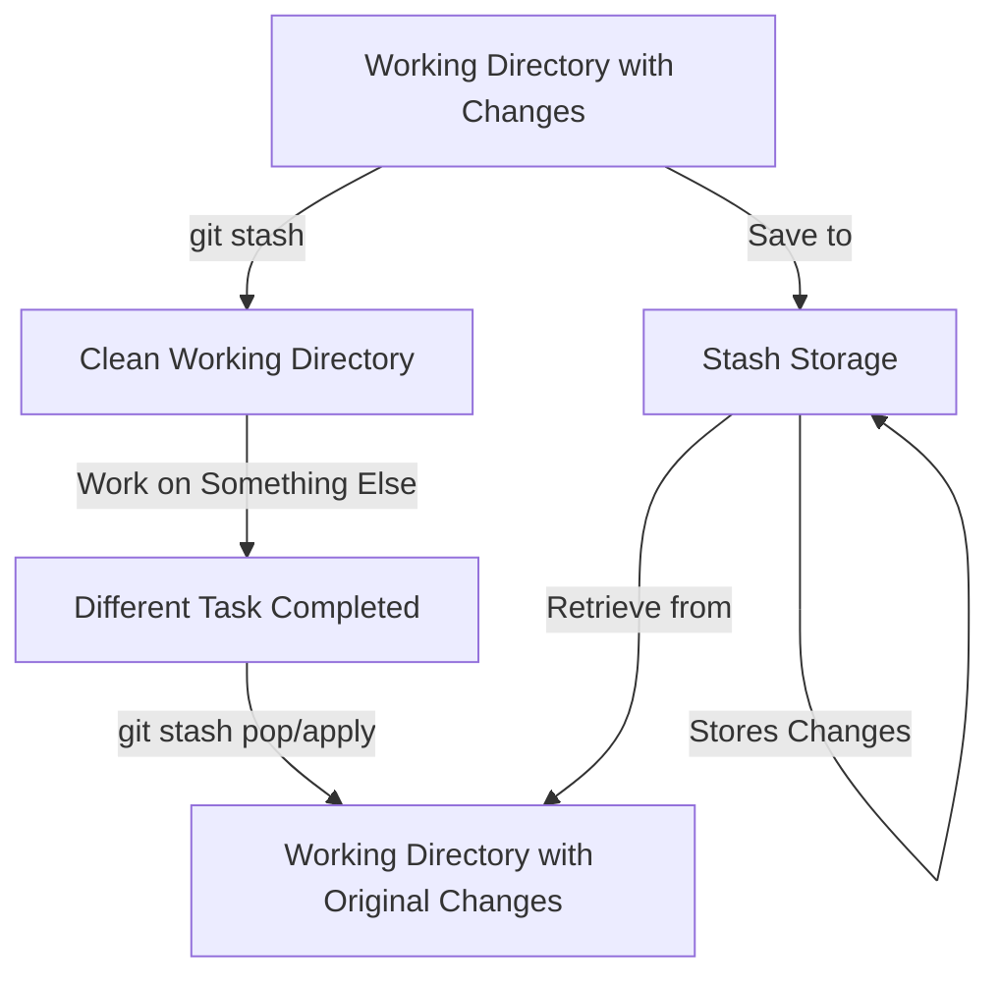

# Git Stash

## Introduction

When working on a project, you might need to switch tasks quickly, but aren't ready to commit your current changes. Perhaps you need to fix a critical bug on another branch, or you want to pull the latest updates without committing your work-in-progress. This is where `git stash` comes in handy.

Git stash allows you to **temporarily shelve (or stash) changes** you've made to your working directory so you can work on something else, and then come back and re-apply them later. Think of it as a clipboard for your code changes.

## Basic Git Stash Operations

### Stashing Your Changes

The most basic stash command is:

```bash
git stash
# or with a message
git stash save "Work in progress for feature X"
```

This command will:
1. Take all changes in your working directory (both staged and unstaged)
2. Save them to a new stash
3. Revert your working directory to match the HEAD commit

Let's see this in action:

```bash
# You've made some changes
$ git status
On branch main
Changes not staged for commit:
  (use "git add <file>..." to update what will be committed)
  (use "git restore <file>..." to discard changes in working directory)
        modified:   index.js
        modified:   styles.css

# Stash the changes
$ git stash
Saved working directory and index state WIP on main: e7d5a4c Add login form

# Check status again
$ git status
On branch main
nothing to commit, working tree clean
```

Your changes have been saved to the stash, and your working directory is now clean!

### Viewing Your Stashed Changes

To see what stashes you have:

```bash
git stash list
```

Example output:

```bash
$ git stash list
stash@{0}: WIP on main: e7d5a4c Add login form
stash@{1}: On feature-navbar: 3fc2ba1 Add responsive design
```

To see the details of a specific stash:

```bash
git stash show stash@{0}
```

This shows a summary of the files changed. For a full diff, add the `-p` flag:

```bash
git stash show -p stash@{0}
```

### Applying Stashed Changes

When you're ready to continue working on your stashed changes, you can apply them:

```bash
# Apply the most recent stash
git stash apply

# Or apply a specific stash
git stash apply stash@{1}
```

However, this keeps the stash in your stash list. If you want to apply and remove the stash in one step:

```bash
# Apply and drop the most recent stash
git stash pop

# Or apply and drop a specific stash
git stash pop stash@{1}
```

Example workflow:

```bash
# Apply the stash
$ git stash pop
On branch main
Changes not staged for commit:
  (use "git add <file>..." to update what will be committed)
  (use "git restore <file>..." to discard changes in working directory)
        modified:   index.js
        modified:   styles.css
Dropped refs/stash@{0} (a67d3a5d9e4c35193a1f9b36edfe7291c4021dbb)
```

### Removing Stashed Changes

If you want to discard a stash without applying it:

```bash
# Remove the most recent stash
git stash drop

# Remove a specific stash
git stash drop stash@{1}
```

Or to remove all stashes:

```bash
git stash clear
```

## Advanced Stash Operations

### Creating a Branch from a Stash

If you want to apply your stashed changes to a new branch:

```bash
git stash branch new-branch-name stash@{0}
```

This creates a new branch, checks it out, and applies the stash to it. If successful, it also drops the stash.

Example:

```bash
$ git stash branch fix-login-feature stash@{0}
Switched to a new branch 'fix-login-feature'
On branch fix-login-feature
Changes not staged for commit:
  (use "git add <file>..." to update what will be committed)
  (use "git restore <file>..." to discard changes in working directory)
        modified:   index.js
        modified:   styles.css
Dropped refs/stash@{0} (a67d3a5d9e4c35193a1f9b36edfe7291c4021dbb)
```

### Stashing Specific Files

To stash only specific files:

```bash
git stash push -m "Stash message" path/to/file1 path/to/file2
```

Example:

```bash
$ git stash push -m "Only stashing JavaScript files" *.js
Saved working directory and index state On main: Only stashing JavaScript files
```

### Stashing Untracked Files

By default, `git stash` only stashes tracked files that have changes. To include untracked files:

```bash
git stash -u
# or
git stash --include-untracked
```

To include both untracked files and ignored files:

```bash
git stash -a
# or
git stash --all
```

### Partial Stashing

You can stash specific parts of a file using the `--patch` flag:

```bash
git stash -p
# or
git stash --patch
```

This will prompt you interactively for which changes to stash.

## Common Stash Workflows

### Quick Context Switching

One of the most common uses for stash is switching tasks quickly:

```bash
# Working on feature A
$ git status
On branch feature-a
Changes not staged for commit:
  modified:   feature-a-file.js

# Urgent bug reported on main
$ git stash
Saved working directory and index state WIP on feature-a

$ git checkout main
Switched to branch 'main'

# Fix the bug
$ vim buggy-file.js
$ git commit -am "Fix critical bug"

# Return to feature A work
$ git checkout feature-a
Switched to branch 'feature-a'
$ git stash pop
```

### Clean Pull Workflow

Stash is useful when you need to update your branch but have local changes:

```bash
# You have local changes
$ git status
On branch main
Changes not staged for commit:
  modified:   index.js

# Need to pull the latest changes
$ git stash
$ git pull origin main
$ git stash pop
```

### Experimental Changes

If you're trying something experimental:

```bash
# Make experimental changes
$ vim experimental.js

# Not working out, stash them for later
$ git stash save "Experimental refactoring - might revisit"

# Later, when you want to revisit
$ git stash list
stash@{0}: Experimental refactoring - might revisit

$ git stash apply stash@{0}
```

## Stash Visualization

Here's a simple diagram of how stash works in your Git workflow:



## Common Issues and Solutions

### Stash Conflicts

When applying a stash, you may encounter conflicts if the changes in your working directory overlap with the stashed changes:

```bash
$ git stash pop
Auto-merging index.js
CONFLICT (content): Merge conflict in index.js
```

In this case:
1. Resolve the conflicts manually by editing the conflicted files
2. Mark them as resolved with `git add`
3. Commit if needed or continue your work

Note that the stash will not be removed if there are conflicts when using `git stash pop`. You'll need to drop it manually when done.

### Lost Stashes

If you accidentally clear your stashes or drop the wrong one, you can sometimes recover them using `git fsck`:

```bash
git fsck --unreachable | grep commit | cut -d ' ' -f3 | xargs git log --format="%ai %H" | sort
```

This will show unreachable commits, which might include your stashes.

## Summary

Git stash is a powerful feature that allows you to:

- Temporarily save changes without committing them
- Switch between tasks quickly
- Keep your working directory clean
- Safely experiment with code

Remember these key commands:
- `git stash`: Save changes and clean your working directory
- `git stash list`: View all stashes
- `git stash apply`: Apply a stash without removing it
- `git stash pop`: Apply a stash and remove it
- `git stash drop`: Delete a stash
- `git stash branch`: Create a new branch from a stash

## Exercises

1. Create a new file in a Git repository, then stash it without committing. Verify it's gone, then apply it back.
2. Make changes to multiple files, then stash only one of them using `git stash push`.
3. Create multiple stashes with meaningful messages, then apply them selectively.
4. Experiment with creating a branch from a stash.
5. Practice resolving conflicts when applying a stash to a working directory with changes.

## Additional Resources

- [Git Stash Documentation](https://git-scm.com/docs/git-stash)
- [Pro Git Book - Git Stash Chapter](https://git-scm.com/book/en/v2/Git-Tools-Stashing-and-Cleaning)
- [Atlassian Git Stash Tutorial](https://www.atlassian.com/git/tutorials/saving-changes/git-stash)