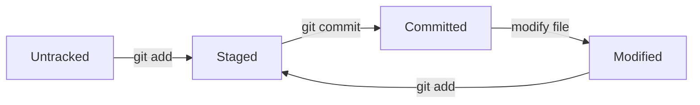

# Git Status

## Introduction

When working with Git, one of the most frequently used commands is `git status`. This command allows you to inspect the current state of your repository by showing which files have been modified, staged for commit, or remain untracked. Understanding how to use and interpret the output of `git status` is a fundamental skill for effective version control.

## What is Git Status?

`git status` is a command that displays the state of the working directory and the staging area. It shows which changes have been staged, which haven't, and which files aren't being tracked by Git. This command doesn't show any commit history information - for that, you would use `git log`.

## Basic Usage

The basic syntax for the command is:

```bash
git status
```

When executed, this command provides an overview of your repository's current state.

## Understanding the Output

Let's explore what the output of `git status` looks like in different scenarios.

### Clean Working Directory

When there are no changes in your working directory, you'll see something like:

```bash
$ git status
On branch main
Your branch is up to date with 'origin/main'.

nothing to commit, working tree clean
```

This means:
- You're on the "main" branch
- Your local branch is in sync with the remote branch (if applicable)
- No changes have been made since your last commit

### Untracked Files

If you've created new files that Git doesn't yet track:

```bash
$ git status
On branch main
Your branch is up to date with 'origin/main'.

Untracked files:
  (use "git add <file>..." to include in what will be committed)
        new_file.txt

nothing added to commit but untracked files present (use "git add" to track)
```

This indicates that `new_file.txt` exists in your directory but isn't being tracked by Git.

### Modified Files

When you modify files that are already tracked by Git:

```bash
$ git status
On branch main
Your branch is up to date with 'origin/main'.

Changes not staged for commit:
  (use "git add <file>..." to update what will be committed)
  (use "git restore <file>..." to discard changes in working directory)
        modified:   existing_file.txt

no changes added to commit (use "git add" and/or "git commit -a")
```

This shows that `existing_file.txt` has been modified but hasn't been staged for the next commit.

### Staged Changes

After you stage changes with `git add`:

```bash
$ git status
On branch main
Your branch is up to date with 'origin/main'.

Changes to be committed:
  (use "git restore --staged <file>..." to unstage)
        modified:   existing_file.txt
        new file:   new_file.txt
```

This output indicates that both files are staged and ready to be committed.

## The File Lifecycle in Git

Understanding `git status` requires knowledge of the file lifecycle in Git:



1. **Untracked**: New files that Git doesn't yet monitor
2. **Staged**: Files marked to be included in the next commit
3. **Committed**: Files safely stored in the Git database
4. **Modified**: Tracked files that have been changed since the last commit

## Practical Examples

### Example 1: Starting a New Project

Let's walk through a common workflow for a new project:

```bash
$ mkdir my_project
$ cd my_project
$ git init
Initialized empty Git repository in /path/to/my_project/.git/

$ git status
On branch main

No commits yet

nothing to commit (create/copy files and use "git add" to track)

$ touch README.md
$ echo "# My Project" > README.md

$ git status
On branch main

No commits yet

Untracked files:
  (use "git add <file>..." to include in what will be committed)
        README.md

nothing added to commit but untracked files present (use "git add" to track)

$ git add README.md

$ git status
On branch main

No commits yet

Changes to be committed:
  (use "git rm --cached <file>..." to unstage)
        new file:   README.md

$ git commit -m "Initial commit with README"
[main (root-commit) abc1234] Initial commit with README
 1 file changed, 1 insertion(+)
 create mode 100644 README.md

$ git status
On branch main
nothing to commit, working tree clean
```

This example demonstrates:
1. Creating a new repository
2. Creating a new file
3. Checking status at each step
4. Staging and committing the file
5. Verifying a clean working directory after committing

### Example 2: Working with Multiple Files

```bash
$ touch index.html styles.css script.js
$ git status
On branch main
Untracked files:
  (use "git add <file>..." to include in what will be committed)
        index.html
        script.js
        styles.css

nothing added to commit but untracked files present (use "git add" to track)

$ git add index.html

$ git status
On branch main
Changes to be committed:
  (use "git restore --staged <file>..." to unstage)
        new file:   index.html

Untracked files:
  (use "git add <file>..." to include in what will be committed)
        script.js
        styles.css

$ echo "<html><body><h1>Hello World</h1></body></html>" > index.html
$ git status
On branch main
Changes to be committed:
  (use "git restore --staged <file>..." to unstage)
        new file:   index.html

Changes not staged for commit:
  (use "git add <file>..." to update what will be committed)
  (use "git restore <file>..." to discard changes in working directory)
        modified:   index.html

Untracked files:
  (use "git add <file>..." to include in what will be committed)
        script.js
        styles.css
```

This example shows:
1. Creating multiple files
2. Selectively staging only some files
3. Modifying an already staged file, which creates two versions: one staged and one in the working directory

## Advanced Options

### Short Format

For a more concise output, you can use the short format:

```bash
$ git status -s
 M index.html
?? script.js
?? styles.css
```

The status codes in the output mean:
- `??` = Untracked files
- `A` = Added to staging area
- `M` = Modified
- `D` = Deleted

The position of the letter matters:
- Left column: staged changes
- Right column: unstaged changes

### Branch Information

To only see branch information without file status:

```bash
$ git status --branch --short
## main...origin/main
```

### Ignored Files

To see ignored files (those matching patterns in `.gitignore`):

```bash
$ git status --ignored
```

## Common Scenarios and Troubleshooting

### Scenario 1: Accidentally Staged a File

If you've staged a file by mistake:

```bash
$ git status
On branch main
Changes to be committed:
  (use "git restore --staged <file>..." to unstage)
        modified:   wrong_file.txt
```

To unstage the file, follow the hint:

```bash
$ git restore --staged wrong_file.txt
$ git status
On branch main
Changes not staged for commit:
  (use "git add <file>..." to update what will be committed)
  (use "git restore <file>..." to discard changes in working directory)
        modified:   wrong_file.txt
```

### Scenario 2: Discarding Changes

If you want to discard changes to a file:

```bash
$ git status
On branch main
Changes not staged for commit:
  (use "git add <file>..." to update what will be committed)
  (use "git restore <file>..." to discard changes in working directory)
        modified:   mistake.txt
```

To revert the file to its last committed state:

```bash
$ git restore mistake.txt
$ git status
On branch main
nothing to commit, working tree clean
```

## Summary

`git status` is a powerful diagnostic tool that helps you understand what's happening in your Git repository. It shows:

- Which branch you're on
- The relationship between your local and remote branches
- Files in different states (untracked, modified, staged)
- Helpful hints for what commands to use next

Regular use of `git status` is a best practice that will help you maintain awareness of your repository's state and avoid common mistakes like committing unwanted changes or forgetting to add important files.

## Exercises

1. Create a new Git repository and experiment with adding, modifying, and staging files.
2. Try the different `git status` formatting options (`-s`, `--branch`, etc.).
3. Practice unstaging files and discarding changes.
4. Make multiple changes, stage some but not others, and observe the status output.

## Additional Resources

- [Git Official Documentation on git-status](https://git-scm.com/docs/git-status)
- [Pro Git Book](https://git-scm.com/book/en/v2)
- The next topic in this series: "Git Add" will build on these concepts by exploring how to stage changes in more detail.