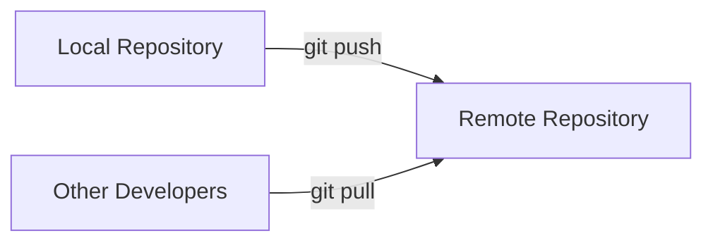

# Git Push

## Introduction

After making changes to your code and committing them to your local Git repository, the next logical step is to share these changes with others. This is where the `git push` command comes into play. The `git push` command allows you to upload your local repository content to a remote repository, making your changes accessible to other developers working on the same project.

Think of `git push` as the digital equivalent of "publishing" your work. Your commits exist locally until you decide to push them to a shared repository where others can see and build upon your changes.

## Understanding git push

### Basic Concept

At its core, `git push` uploads commits from your local repository to a remote repository. A remote repository is typically hosted on platforms like GitHub, GitLab, or Bitbucket, but it can also be set up on your own server.



### The Anatomy of the git push Command

The basic syntax of the `git push` command is:

```bash
git push <remote> <branch>
```

Where:
- `<remote>` is the name of the remote repository (typically "origin")
- `<branch>` is the name of the branch you want to push

## Basic Usage of git push

### Pushing to the Default Remote

When you clone a repository, Git automatically sets up a remote named "origin" pointing to the repository you cloned from. If you've cloned a repository, you can push your changes to the default branch (often "main" or "master") using:

```bash
git push origin main
```

This pushes your local "main" branch to the "main" branch on the remote named "origin".

### Example: Pushing Your First Commit

Let's walk through a simple example of making changes and pushing them:

```bash
# Make changes to a file
echo "New content" > file.txt

# Stage the changes
git add file.txt

# Commit the changes
git commit -m "Add new content to file.txt"

# Push the changes to the remote repository
git push origin main
```

Output:
```
Enumerating objects: 5, done.
Counting objects: 100% (5/5), done.
Delta compression using up to 8 threads
Compressing objects: 100% (2/2), done.
Writing objects: 100% (3/3), 282 bytes | 282.00 KiB/s, done.
Total 3 (delta 0), reused 0 (delta 0), pack-reused 0
To https://github.com/username/repository.git
   a1b2c3d..e4f5g6h  main -> main
```

The output tells you that Git has successfully pushed your changes to the remote repository. The last line shows the old and new commit hashes, and confirms that your local main branch was pushed to the remote main branch.

## Advanced Git Push Operations

### Pushing to a Different Branch

You can push your local branch to a different remote branch using the syntax:

```bash
git push <remote> <local-branch>:<remote-branch>
```

For example, to push your local "feature" branch to a remote branch named "new-feature":

```bash
git push origin feature:new-feature
```

### Pushing All Branches

To push all your local branches to their matching remote branches:

```bash
git push --all origin
```

### Force Push

Sometimes, you might need to override the remote branch with your local branch. This is typically needed after rewriting history with commands like `git rebase`. Use force push cautiously:

```bash
git push --force origin main
```

⚠️ **Warning**: Force pushing can overwrite changes made by others and cause data loss. Use with extreme caution, especially on shared branches!

### Pushing Tags

By default, `git push` doesn't transfer tags. To push tags to the remote repository:

```bash
# Push a specific tag
git push origin <tag-name>

# Push all tags
git push --tags origin
```

## Common Issues and Solutions

### 1. Rejected Pushes

If someone else has pushed changes to the same branch, Git will reject your push:

```
! [rejected]        main -> main (fetch first)
error: failed to push some refs to 'https://github.com/username/repository.git'
hint: Updates were rejected because the remote contains work that you do
hint: not have locally. This is usually caused by another repository pushing
hint: to the same ref. You may want to first integrate the remote changes
hint: (e.g., 'git pull ...') before pushing again.
```

Solution:
```bash
# Pull the remote changes first
git pull origin main

# Resolve any conflicts if needed

# Then push your changes
git push origin main
```

### 2. Non-Fast-Forward Updates

When you attempt to push changes that would rewrite history:

```
! [rejected]        main -> main (non-fast-forward)
error: failed to push some refs to 'https://github.com/username/repository.git'
hint: Updates were rejected because the tip of your current branch is behind
hint: its remote counterpart. Integrate the remote changes (e.g.
hint: 'git pull ...') before pushing again.
```

Solutions:
```bash
# Option 1: Pull and merge (recommended for beginners)
git pull origin main
git push origin main

# Option 2: Force push (use with caution)
git push --force origin main
```

## Practical Examples

### Example 1: Contributing to an Open Source Project

```bash
# Clone the repository
git clone https://github.com/open-source/project.git
cd project

# Create a feature branch
git checkout -b new-feature

# Make changes
echo "New feature implementation" > feature.js

# Commit changes
git add feature.js
git commit -m "Add new feature implementation"

# Push to your fork (assuming you've added it as a remote named 'fork')
git push fork new-feature
```

This workflow is common when contributing to open source projects where you typically:
1. Fork the repository on GitHub
2. Clone your fork
3. Add the original repository as a remote (often named 'upstream')
4. Create a feature branch
5. Push to your fork
6. Create a pull request

### Example 2: Deploying to Production

Many teams use Git branches for deployment workflows:

```bash
# Ensure you're on the development branch
git checkout dev

# Pull latest changes
git pull origin dev

# Run tests
npm test

# If tests pass, merge to main
git checkout main
git merge dev

# Push to production
git push origin main
```

## Best Practices for Using git push

1. **Always pull before pushing**: Run `git pull` before pushing to avoid conflicts.
2. **Push to feature branches, not directly to main**: This keeps the main branch stable.
3. **Write meaningful commit messages**: This helps others understand your changes.
4. **Review your changes before pushing**: Use `git diff` or `git status` to check what you're about to push.
5. **Don't force push to shared branches**: Force pushing can overwrite others' work.
6. **Consider using push options for specific workflows**:
   ```bash
   # Skip CI pipeline (if your server supports it)
   git push -o ci.skip

   # Create a merge request automatically (GitLab specific)
   git push -o merge_request.create
   ```

## Configuring Push Behavior

Git allows you to configure default push behavior:

```bash
# Push only the current branch (recommended for beginners)
git config --global push.default simple

# Push all matching branches
git config --global push.default matching

# Push to a branch of the same name
git config --global push.default current
```

## Summary

The `git push` command is essential for collaboration in Git, allowing you to share your local changes with other developers through a remote repository. Understanding how to use `git push` properly will help you avoid common pitfalls and collaborate more effectively.

Key points to remember:
- The basic syntax is `git push <remote> <branch>`
- Always pull before pushing to avoid conflicts
- Be cautious with force pushing
- Use feature branches for development
- Write meaningful commit messages

## Additional Resources

Here are some exercises to help you practice using `git push`:

1. Create a local repository, add some files, and push it to a new GitHub repository.
2. Clone an existing repository, create a new branch, make some changes, and push the branch.
3. Create a pull request from your pushed branch on GitHub.
4. Practice resolving a push rejection by having someone else push to the same branch.

Remember, Git is a powerful tool that becomes more intuitive with practice. Don't be afraid to experiment in a test repository to gain confidence with commands like `git push`.