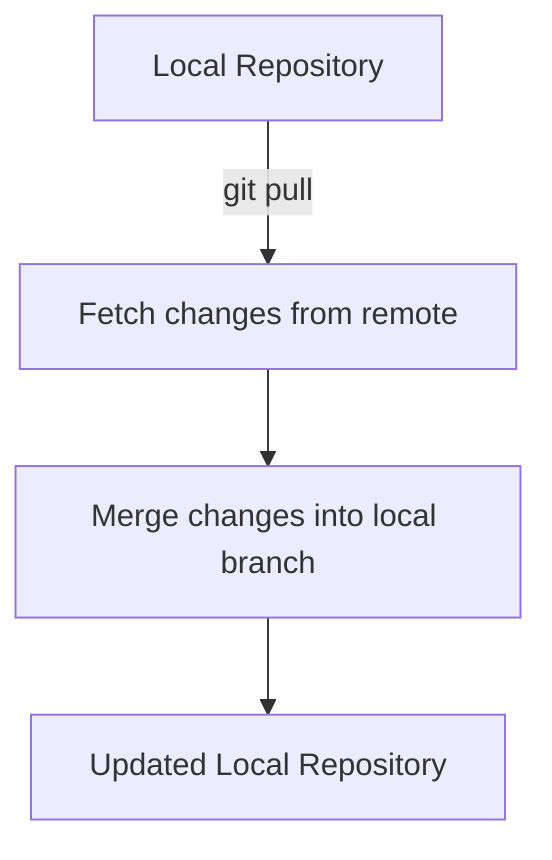

# Git Pull

## Introduction

`git pull` is a fundamental Git command that allows you to fetch changes from a remote repository and integrate them into your local branch. It plays a crucial role in collaborative development workflows by keeping your local repository up-to-date with changes made by other team members.

In essence, `git pull` is a combination of two other Git commands:
1. `git fetch` - Downloads changes from a remote repository
2. `git merge` - Integrates those changes into your current local branch

Understanding how to use `git pull` effectively is essential for any developer working in a collaborative environment.

## Basic Syntax

The basic syntax for the `git pull` command is:

```bash
git pull [<options>] [<repository> [<refspec>...]]
```

For everyday use, you'll typically use the simpler form:

```bash
git pull
```

This command pulls changes from the default remote repository (usually called "origin") and the corresponding remote branch to your current local branch.

## How Git Pull Works

Let's break down what happens when you run `git pull`:



1. Git identifies the remote repository and branch that correspond to your current local branch.
2. It fetches all new commits from that remote branch.
3. It then merges these new commits into your current local branch.

## Common Options

Here are some commonly used options with `git pull`:

- `--rebase`: Instead of merging, it rebases your local commits on top of the fetched changes.
  ```bash
  git pull --rebase
  ```

- `--no-commit`: Fetches and merges but doesn't automatically create a commit.
  ```bash
  git pull --no-commit
  ```

- `--ff-only`: Only allows fast-forward merges. If a fast-forward merge isn't possible, the command will fail.
  ```bash
  git pull --ff-only
  ```

## Practical Examples

### Example 1: Basic Pull from Default Remote

Let's say you're working on the `main` branch and want to get the latest changes from the remote repository:

```bash
# Make sure you're on the main branch
git checkout main

# Pull the latest changes
git pull
```

Output:
```
Updating 3e4f21a..8d9c4b2
Fast-forward
 README.md       | 10 ++++++++--
 src/index.js    | 25 +++++++++++++++++++++++++
 2 files changed, 33 insertions(+), 2 deletions(-)
```

### Example 2: Pulling from a Specific Remote and Branch

If you want to pull from a specific remote and branch:

```bash
git pull origin feature-branch
```

This fetches changes from the `feature-branch` on the `origin` remote and merges them into your current branch.

### Example 3: Using Pull with Rebase

When you want to maintain a cleaner commit history:

```bash
git pull --rebase
```

Output:
```
First, rewinding head to replay your work on top of it...
Applying: Add user authentication feature
Applying: Fix login form validation
```

## Common Scenarios and Solutions

### Scenario 1: Merge Conflicts

Sometimes when you pull changes, Git can't automatically merge them with your local changes:

```bash
git pull
```

Output:
```
Auto-merging src/main.js
CONFLICT (content): Merge conflict in src/main.js
Automatic merge failed; fix conflicts and then commit the result.
```

To resolve this:

1. Open the files with conflicts
2. Look for conflict markers (`<<<<<<< HEAD`, `=======`, `>>>>>>> branch-name`)
3. Edit the files to resolve conflicts
4. Save the files
5. Stage the resolved files
   ```bash
   git add src/main.js
   ```
6. Complete the merge
   ```bash
   git commit -m "Resolve merge conflicts in main.js"
   ```

### Scenario 2: Pull Changes While Having Local Work

If you have uncommitted changes, Git will prevent you from pulling if there might be conflicts:

```bash
git pull
```

Output:
```
error: Your local changes to the following files would be overwritten by merge:
        src/config.js
Please commit your changes or stash them before you merge.
```

Solutions:

1. Commit your changes:
   ```bash
   git commit -m "Save my work in progress"
   git pull
   ```

2. Stash your changes temporarily:
   ```bash
   git stash
   git pull
   git stash pop
   ```

## Best Practices

1. **Pull Frequently**: Pull regularly to stay up-to-date with your team's changes.

2. **Pull Before Push**: Always pull before attempting to push to avoid unnecessary merge conflicts.

3. **Consider Using `--rebase`**: Using `git pull --rebase` can create a cleaner commit history, especially in busy repositories.

4. **Check Your Branch**: Always verify you're on the correct branch before pulling.
   ```bash
   git branch  # Check which branch you're on
   git pull
   ```

5. **Review Changes**: After pulling, review the changes to understand what's been updated.
   ```bash
   git log --oneline -5  # Show last 5 commits
   ```

## Git Pull vs. Git Fetch

While `git pull` is convenient, sometimes you might want more control over the process:

| Git Pull | Git Fetch |
|----------|-----------|
| Downloads + merges changes | Only downloads changes |
| Immediate integration | Allows you to inspect before merging |
| Single command | Requires separate merge step |
| Less control | More control |

Using `git fetch` followed by `git merge` gives you the same result as `git pull`, but with an opportunity to review changes before merging:

```bash
git fetch origin
git log --oneline HEAD..origin/main  # Review incoming changes
git merge origin/main
```

## Summary

`git pull` is an essential command for collaborative Git workflows, allowing you to keep your local repository synchronized with remote changes. By understanding how it works and when to use its various options, you can collaborate more effectively with your team and avoid common pitfalls.

Remember that `git pull` combines the functions of `git fetch` and `git merge`, so understanding these component commands can give you more flexibility in managing your Git workflow.

## Additional Resources

- Try practicing with a team project or a personal repository with multiple branches
- Experiment with different `pull` options to see how they affect your workflow
- Set up a Git alias for your preferred `pull` command configuration:
  ```bash
  git config --global alias.smart-pull 'pull --rebase --autostash'
  ```

## Exercises

1. Create a simple repository and simulate a collaborative workflow by creating changes in a remote branch and then pulling them.
2. Intentionally create a merge conflict, then practice resolving it.
3. Compare the commit history after using `git pull` versus `git pull --rebase` to understand the difference.
4. Set up multiple remotes for a repository and practice pulling from different remotes.