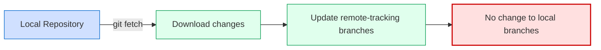
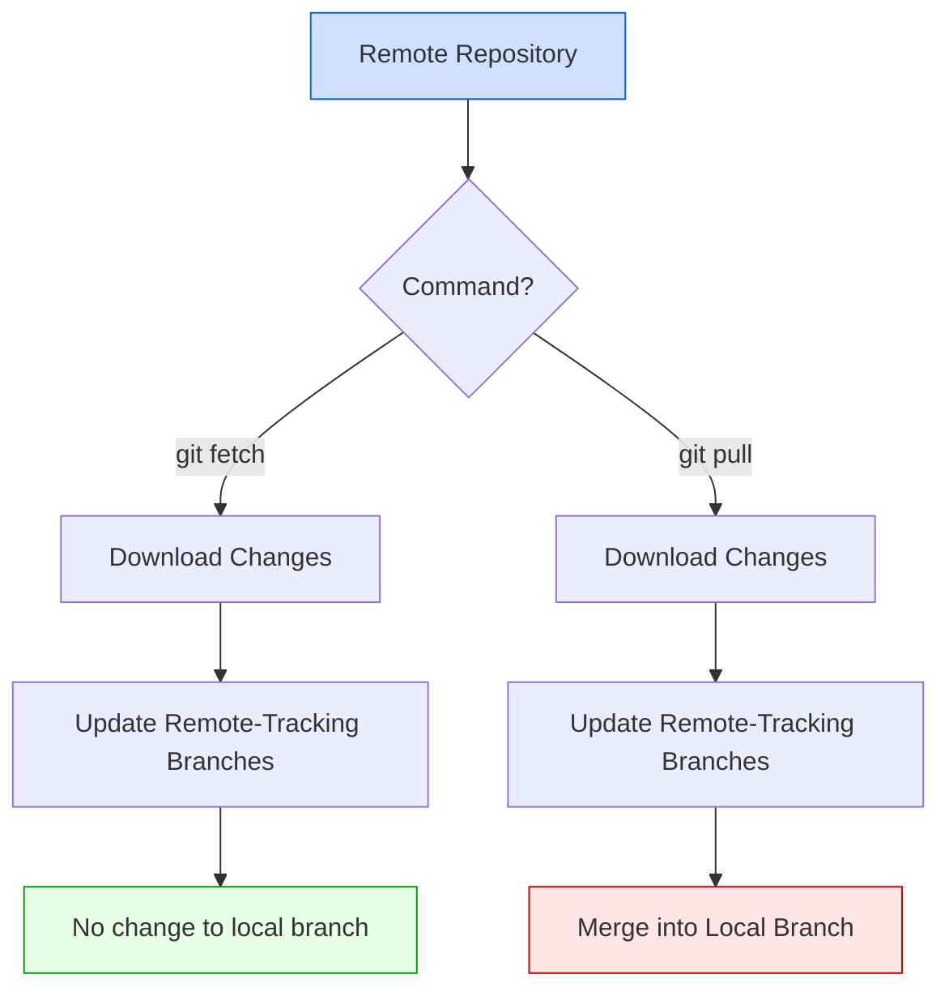

# Git Fetch

## Introduction

When working with Git in a collaborative environment, you'll need to interact with remote repositories. While `git pull` is commonly used to get remote changes, it actually combines two operations: fetching and merging. In this tutorial, we'll focus on the more fundamental `git fetch` command, which gives you more control by downloading remote content without automatically merging it.

## What is Git Fetch?

`git fetch` is a Git command that downloads commits, files, and refs from a remote repository into your local repo. Unlike `git pull`, it doesn't automatically merge these changes into your working files.

Think of `git fetch` as "downloading the latest information about the remote repository" without affecting your local work. This makes it a safe operation that you can perform at any time to stay up-to-date with what others are doing.



## Basic Syntax

The basic syntax for `git fetch` is:

```bash
git fetch [remote-name] [branch-name]
```

Where:
- `remote-name` is the name of the remote repository (defaults to `origin` if not specified)
- `branch-name` is the specific branch to fetch (fetches all branches if not specified)

## Common Usage Examples

### 1. Fetch from the default remote repository (origin)

The simplest form of the command fetches all branches from the default remote repository, typically named "origin":

```bash
git fetch
```

**Output:**
```
remote: Enumerating objects: 43, done.
remote: Counting objects: 100% (43/43), done.
remote: Compressing objects: 100% (28/28), done.
remote: Total 43 (delta 15), reused 43 (delta 15), pack-reused 0
Unpacking objects: 100% (43/43), 12.51 KiB | 426.00 KiB/s, done.
From https://github.com/username/repository
   e3dc155..abcd123  main       -> origin/main
   f7d2a31..5678def  feature-x  -> origin/feature-x
```

This updates all remote-tracking branches like `origin/main` and `origin/feature-x` in your local repository, but doesn't modify your local branches.

### 2. Fetch from a specific remote

If you have multiple remotes configured, you can specify which one to fetch from:

```bash
git fetch upstream
```

**Output:**
```
remote: Enumerating objects: 17, done.
remote: Counting objects: 100% (17/17), done.
remote: Compressing objects: 100% (8/8), done.
remote: Total 17 (delta 9), reused 17 (delta 9), pack-reused 0
Unpacking objects: 100% (17/17), 2.14 KiB | 364.00 KiB/s, done.
From https://github.com/original-owner/repository
   cdef432..abcd123  main       -> upstream/main
```

### 3. Fetch a specific branch

To fetch only a specific branch from a remote repository:

```bash
git fetch origin feature-branch
```

**Output:**
```
remote: Enumerating objects: 11, done.
remote: Counting objects: 100% (11/11), done.
remote: Compressing objects: 100% (5/5), done.
remote: Total 11 (delta 6), reused 11 (delta 6), pack-reused 0
Unpacking objects: 100% (11/11), 1.25 KiB | 256.00 KiB/s, done.
From https://github.com/username/repository
 * branch            feature-branch -> FETCH_HEAD
   bd1c2e3..7890abc  feature-branch -> origin/feature-branch
```

### 4. Fetch all remotes

To fetch from all configured remote repositories at once:

```bash
git fetch --all
```

**Output:**
```
Fetching origin
remote: Enumerating objects: 5, done.
remote: Counting objects: 100% (5/5), done.
remote: Total 5 (delta 0), reused 0 (delta 0), pack-reused 0
Unpacking objects: 100% (5/5), done.
From https://github.com/username/repository
   a1b2c3d..e4f5g6h  main       -> origin/main
Fetching upstream
remote: Enumerating objects: 3, done.
remote: Counting objects: 100% (3/3), done.
remote: Total 3 (delta 0), reused 0 (delta 0), pack-reused 0
Unpacking objects: 100% (3/3), done.
From https://github.com/original-owner/repository
   i7j8k9l..m0n1o2p  main       -> upstream/main
```

## Working with Fetched Content

After running `git fetch`, the remote changes are downloaded to your local repository, but your working directory remains unchanged. Here's what you can do with the fetched content:

### View changes before merging

One of the main benefits of `git fetch` is that it allows you to review changes before integrating them. You can compare your local branch with the corresponding remote-tracking branch:

```bash
git diff main origin/main
```

This shows the differences between your local `main` branch and the remote `main` branch.

### Merge the changes

After reviewing the changes, you can merge them into your local branch:

```bash
git merge origin/main
```

This is equivalent to what `git pull` would do (fetch + merge).

### Interactive rebase

For a cleaner history, you might want to rebase your local changes on top of the fetched changes:

```bash
git rebase origin/main
```

## Real-World Scenario: Collaborating on a Project

Let's walk through a common scenario when collaborating on a project:

1. You and your teammate are both working on the same repository
2. Your teammate pushes changes to the remote repository
3. You want to see those changes without affecting your working directory

Here's how you'd handle this situation:

```bash
# First, fetch the latest changes
git fetch origin

# See what has changed
git log --oneline main..origin/main
```

**Output:**
```
abcd123 Update user authentication module
ef45678 Fix navigation bar responsiveness
9abc012 Add new product listing component
```

This shows the commits that exist in `origin/main` but not in your local `main` branch.

Now you can decide whether to merge these changes or continue with your work:

```bash
# Option 1: Merge the changes
git merge origin/main

# Option 2: Rebase your work on top of the remote changes
git rebase origin/main

# Option 3: Continue working and merge later
# (no command needed, just continue working)
```

## Common Options and Flags

Here are some useful options for `git fetch`:

### `--prune`

Remove remote-tracking branches that no longer exist on the remote:

```bash
git fetch --prune
```

**Output:**
```
From https://github.com/username/repository
 - [deleted]         (none)     -> origin/old-feature-branch
```

### `--dry-run`

Show what would be done, without actually making any changes:

```bash
git fetch --dry-run
```

**Output:**
```
From https://github.com/username/repository
 * branch            main       -> FETCH_HEAD
```

### `--verbose`

Show more detailed information about the fetch operation:

```bash
git fetch --verbose
```

## Git Fetch vs. Git Pull

Let's clarify the difference between `git fetch` and `git pull`:

| Git Fetch | Git Pull |
|-----------|----------|
| Downloads new data from a remote repository | Downloads AND integrates changes into your current branch |
| Updates remote-tracking branches | Updates your current branch |
| Does not change your working directory | Changes your working directory to reflect the remote changes |
| Safe operation that never changes your local branches | May create merge conflicts that need to be resolved |
| Two-step process (fetch then merge) | Single-step process (fetch + merge combined) |



## When to Use Git Fetch

`git fetch` is particularly useful when:

1. You want to see what others have been working on without integrating those changes
2. You want to check for updates before deciding how to integrate them
3. You're in the middle of your own work and don't want to deal with potential merge conflicts yet
4. You want to update your remote-tracking branches for a better understanding of the project's current state

## Common Issues and Solutions

### Issue: "Cannot find remote ref"

```
error: cannot find remote ref refs/heads/branch-name
```

**Solution**: The branch might not exist on the remote repository. Verify the branch name using:

```bash
git remote show origin
```

### Issue: Authentication problems

```
remote: Repository not found.
fatal: repository 'https://github.com/username/repo.git/' not found
```

**Solution**: Check your authentication settings and repository URL:

```bash
git remote -v
```

Update if necessary:

```bash
git remote set-url origin https://github.com/correct-username/correct-repo.git
```

## Summary

`git fetch` is a fundamental Git command that allows you to download changes from remote repositories without affecting your local working files. It gives you more control over the integration process by separating the download and merge steps.

Key points to remember:
- `git fetch` downloads remote content but doesn't merge it
- It updates remote-tracking branches like `origin/main`
- It's a safe operation that can be run at any time
- After fetching, you can review changes before deciding how to incorporate them
- `git pull` is equivalent to `git fetch` followed by `git merge`

## Exercises

1. Set up a local repository with a remote on GitHub (or another Git hosting service).
2. Create and push a new branch to the remote.
3. Make changes to the remote repository using the web interface.
4. Use `git fetch` to download those changes and verify they were downloaded.
5. Use `git diff` to see the differences between your local branch and the remote branch.
6. Try different options with `git fetch` like `--prune` and `--all`.

## Additional Resources

- [Git Official Documentation on git fetch](https://git-scm.com/docs/git-fetch)
- [Pro Git Book - Working with Remotes](https://git-scm.com/book/en/v2/Git-Basics-Working-with-Remotes)
- [Atlassian Git Tutorial - Syncing](https://www.atlassian.com/git/tutorials/syncing)