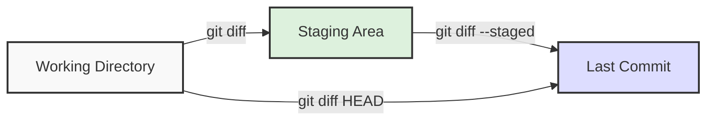

# Git Diff

## Introduction

When working with Git, one of the most valuable skills is being able to inspect and understand changes in your repository. The `git diff` command is a powerful tool that helps you compare changes between commits, branches, working directory, and the staging area. This knowledge is essential for code reviews, debugging, and maintaining clean commit history.

In this tutorial, we'll explore the `git diff` command and learn how to effectively use it to track and visualize changes in your Git repositories.

## What is Git Diff?

The `git diff` command displays the differences between two sources in your Git repository. These sources can be:

- Working directory and staging area
- Staging area and the last commit
- Two commits
- Two branches
- Two files

Git diff shows line-by-line changes using a standard diff format:

- Lines that begin with a `-` (minus) are lines that have been removed
- Lines that begin with a `+` (plus) are lines that have been added
- Unchanged lines provide context and are shown without any prefix

## Basic Usage of Git Diff

### Comparing Working Directory with Staging Area

The simplest form of `git diff` (without any arguments) compares your working directory with the staging area:

```bash
git diff
```

This shows changes you've made but haven't yet staged (added to the staging area).

**Example Output:**

```
diff --git a/example.txt b/example.txt
index 83baae6..5dd01c1 100644
--- a/example.txt
+++ b/example.txt
@@ -1,5 +1,5 @@
 Hello, world!
-This is a test file.
+This is an updated test file.
 Learning Git is fun.
 Git diff helps us see changes.
 End of file.
```

In this example, we can see that a line has been modified, with the original line shown with a `-` prefix and the new line with a `+` prefix.

### Comparing Staging Area with Last Commit

To see what changes are staged and will be included in your next commit:

```bash
git diff --staged
# or
git diff --cached  # Both commands are equivalent
```

**Example:**

If you've modified `example.txt` and staged the changes with `git add example.txt`, then `git diff --staged` will show you what will be committed.

### Comparing with Specific Files

You can limit the diff to specific files:

```bash
git diff -- path/to/file
git diff --staged -- path/to/file
```

## Advanced Git Diff Usage

### Comparing Two Commits

To compare two specific commits:

```bash
git diff commit1 commit2
```

You can use commit hashes, branch names, tags, or relative references like `HEAD~1` (the commit before HEAD).

**Example:**

```bash
git diff abc123 def456
git diff HEAD~3 HEAD
git diff main feature-branch
```

### Comparing Branches

To compare the tips of two branches:

```bash
git diff branch1..branch2
```

**Example:**

```bash
git diff main..feature
```

This shows what changes exist in the `feature` branch compared to the `main` branch.

### Viewing Word-Level Differences

For a more detailed view showing changed words instead of entire lines:

```bash
git diff --word-diff
```

**Example Output:**

```
diff --git a/example.txt b/example.txt
index 83baae6..5dd01c1 100644
--- a/example.txt
+++ b/example.txt
@@ -1,5 +1,5 @@
Hello, world!
This is [-a-]{+an updated+} test file.
Learning Git is fun.
Git diff helps us see changes.
End of file.
```

In this format, deleted words are wrapped in `[-...]` and added words in `{+...+}`.

## Visualizing Git Diff

Git diff output can be complex, especially for large changes. Let's use a Mermaid diagram to visualize the different areas and how git diff compares them:



## Practical Examples

### Scenario 1: Code Review Before Committing

Before committing changes, review them to ensure only intended changes are included:

```bash
# Check what changes will be committed
git diff --staged

# Check what changes are not yet staged
git diff
```

### Scenario 2: Comparing File Versions Between Branches

When working on multiple branches, you might want to see how a specific file differs:

```bash
# Compare file.js between main and feature branches
git diff main..feature -- path/to/file.js
```

### Scenario 3: Reviewing Changes Since a Specific Commit

To see all changes since a specific commit:

```bash
# Show changes since a specific commit
git diff abc123

# Show changes in the last 3 commits
git diff HEAD~3
```

### Scenario 4: Checking Differences Before Merging

Before merging a branch, review the changes that will be incorporated:

```bash
# From your main branch
git diff main..feature-branch
```

## Customizing Git Diff Output

### Ignoring Whitespace

To ignore whitespace changes:

```bash
git diff -w
# or
git diff --ignore-all-space
```

### Showing Context Lines

Control how many lines of context are displayed:

```bash
git diff -U5  # Show 5 lines of context (default is 3)
```

### Generating Statistics

Get a summary of changes without the actual diff:

```bash
git diff --stat
```

**Example Output:**

```
 example.txt | 2 +-
 README.md   | 5 +++++
 2 files changed, 6 insertions(+), 1 deletion(-)
```

## Working with Git Diff in Practice

### Common Workflow

Here's a typical workflow using git diff:

1. Make changes to your files
2. Review unstaged changes: `git diff`
3. Stage changes: `git add .`
4. Review staged changes: `git diff --staged`
5. If everything looks good, commit: `git commit -m "Your message"`

### Integrating with External Diff Tools

Git can be configured to use external diff tools for better visualization:

```bash
# Configure a diff tool
git config --global diff.tool vscode

# Use the configured diff tool
git difftool
```

## Summary

The `git diff` command is an essential tool for comparing changes in your Git repository. Key points to remember:

- `git diff` compares working directory with staging area
- `git diff --staged` compares staging area with last commit
- You can compare specific commits, branches, and files
- Customize output with options like `--word-diff`, `--stat`, and `-w`

Learning to effectively use `git diff` will improve your Git workflow, help you catch errors before committing, and make code reviews more efficient.

## Additional Resources and Exercises

### Exercises

1. Create a new file, make some changes, and use git diff to view the differences before and after staging.
2. Create a branch, make several commits, and then use git diff to compare it with the main branch.
3. Try using different git diff options like `--color-words`, `--stat`, and `--name-only` to see how they affect the output.

### Further Reading

- [Git Documentation on git diff](https://git-scm.com/docs/git-diff)
- [Pro Git Book - Viewing Changes](https://git-scm.com/book/en/v2/Git-Basics-Recording-Changes-to-the-Repository#_viewing_changes)