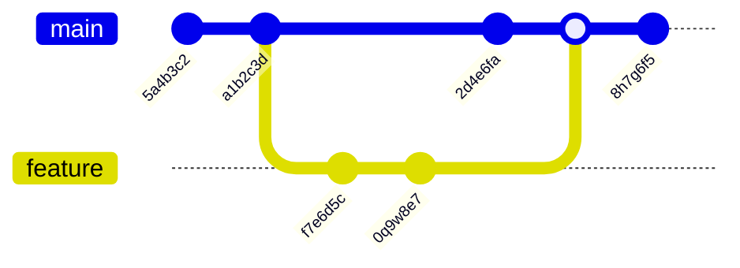

# Git Log

## Introduction

When working with Git, one of the most useful commands is `git log`. This command allows you to view the commit history of your repository, showing who made changes, when they were made, and what changes were included in each commit. The ability to explore your project's history is a fundamental aspect of version control and is essential for understanding how your project has evolved over time.

In this tutorial, we'll explore the `git log` command, understand its various options, and see how it can be used effectively in real-world scenarios.

## Basic Usage

The simplest way to use `git log` is to run it without any arguments in a Git repository:

```bash
git log
```

This will display a list of commits in reverse chronological order (newest first), with information about each commit including:

- The commit hash (a unique identifier)
- Author name and email
- Date and time of the commit
- The commit message

Here's an example of what the output might look like:

```
commit 2d4e6fa989a3b4c5d7e8f0a1b2c3d4e5f6g7h8i9
Author: Jane Doe <jane.doe@example.com>
Date:   Mon Oct 30 15:42:10 2023 -0700

    Add login functionality to user module

commit a1b2c3d4e5f6g7h8i9j0k1l2m3n4o5p6q7r8s9
Author: John Smith <john.smith@example.com>
Date:   Mon Oct 30 10:18:45 2023 -0700

    Fix bug in payment processing

commit 5a4b3c2d1e0f9g8h7i6j5k4l3m2n1o0p9q8r7s6
Author: Jane Doe <jane.doe@example.com>
Date:   Fri Oct 27 09:32:27 2023 -0700

    Initial commit with project structure
```

## Customizing the Output

The default output of `git log` can be quite verbose, especially in repositories with a long history. Fortunately, Git provides numerous options to customize the output to suit your needs.

### Limiting the Number of Commits

To limit the number of commits displayed, use the `-n` option followed by the number of commits you want to see:

```bash
git log -n 5
```

This will show only the 5 most recent commits.

### One-Line Format

For a more compact view, you can use the `--oneline` option:

```bash
git log --oneline
```

Output example:

```
2d4e6fa Add login functionality to user module
a1b2c3d Fix bug in payment processing
5a4b3c2 Initial commit with project structure
```

This displays just the abbreviated commit hash and the commit message on a single line for each commit.

### Showing Diffs

To see the actual changes made in each commit, use the `-p` or `--patch` option:

```bash
git log -p
```

This will show the commit information followed by the diff of changes for each commit.

### Graphical Representation

For a graphical representation of the commit history, especially useful for seeing branch and merge relationships, use `--graph`:

```bash
git log --graph --oneline --all
```

Output example:

```
* 2d4e6fa Add login functionality to user module
* a1b2c3d Fix bug in payment processing
| * f7e6d5c Add documentation
| * 0q9w8e7 Implement notification service
|/
* 5a4b3c2 Initial commit with project structure
```

## Filtering Commits

Git log allows you to filter commits based on various criteria:

### By Author

To see commits by a specific author:

```bash
git log --author="Jane Doe"
```

### By Date

To see commits after a specific date:

```bash
git log --after="2023-10-15"
```

Or before a specific date:

```bash
git log --before="2023-10-30"
```

You can combine these to see commits within a date range:

```bash
git log --after="2023-10-15" --before="2023-10-30"
```

### By Content

To find commits that added or removed specific text:

```bash
git log -S"login function"
```

This will show commits that added or removed the string "login function".

### By File

To see the history of a specific file:

```bash
git log -- path/to/file.js
```

## Practical Examples

Let's look at some common real-world scenarios where `git log` is particularly useful:

### Finding a Bug Introduction

When you discover a bug, you often want to find out when it was introduced. You can use `git log` with `git bisect` for this, but a simple approach is to look at the history of the file with the bug:

```bash
git log -p -- path/to/buggy/file.js
```

This shows the full change history of the file, allowing you to pinpoint when problematic code was added.

### Reviewing Recent Work

Before pushing your changes to a shared repository, it's good practice to review what you've done:

```bash
git log origin/main..HEAD
```

This shows all commits that are in your current branch but not in the remote main branch.

### Tracking Feature Development

To track the development of a specific feature, you might want to see all commits related to it:

```bash
git log --grep="feature-name"
```

This assumes you've included the feature name in your commit messages, which is a good practice.

### Creating a Changelog

When preparing a release, you often need to create a changelog of what's changed since the last release:

```bash
git log --oneline v1.0.0..v1.1.0
```

This shows all commits between tag v1.0.0 and v1.1.0, which can form the basis of your changelog.

## Customizing Log Format

Git allows you to create custom log formats to display exactly the information you need:

```bash
git log --pretty=format:"%h - %an, %ar : %s"
```

This would output something like:

```
2d4e6fa - Jane Doe, 2 days ago : Add login functionality to user module
a1b2c3d - John Smith, 2 days ago : Fix bug in payment processing
5a4b3c2 - Jane Doe, 5 days ago : Initial commit with project structure
```

Some common format placeholders:
- `%h`: abbreviated commit hash
- `%an`: author name
- `%ar`: author date, relative
- `%s`: subject (commit message)

For a full list of placeholders, refer to the Git documentation.

## Visualizing Git Log

Viewing the commit history as a graph can be very helpful for understanding the relationship between branches and merges. Let's illustrate this with a Mermaid diagram:



This diagram shows a main branch with commits, a feature branch created from main, and then the feature branch being merged back into main.

## Summary

The `git log` command is a powerful tool for exploring your repository's history. In this tutorial, we've covered:

- Basic usage of `git log`
- Customizing the output format
- Filtering commits by author, date, content, and file
- Practical examples of using `git log` in real-world scenarios
- Creating custom log formats

Mastering `git log` will help you understand your project's evolution, diagnose problems, and collaborate more effectively with your team.

## Additional Resources

To learn more about `git log` and related commands:

- Run `git log --help` in your terminal for the full documentation
- Practice with the exercises below to reinforce your learning

## Exercises

1. Clone a popular open-source repository (e.g., React, Vue, or TensorFlow) and use `git log` to explore its history.
2. Use `git log` to find the 5 most recent commits in your current project.
3. Create a custom log format that shows the commit hash, author name, and commit date in ISO format.
4. Use `git log` to find all commits that modified a specific function in your codebase.
5. Generate a changelog for your project covering the last month of development.