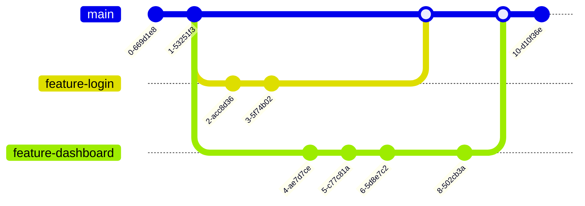

# Git Feature Branch

## Introduction

The Git Feature Branch workflow is a fundamental branching strategy that allows developers to create separate branches for developing new features. This approach enables team members to work on different features simultaneously without interfering with each other's work or disrupting the main codebase.

In this tutorial, we'll explore what feature branches are, why they're important, and how to use them effectively in your development workflow.

## What is a Feature Branch?

A feature branch is a temporary branch created from the main development branch (typically `main` or `develop`) for the purpose of implementing a specific feature, fixing a bug, or making other isolated changes to the codebase.

The core idea is simple:
- Each new feature gets its own branch
- Feature development happens in isolation
- The main branch remains stable
- Changes are integrated back only when the feature is complete

## Why Use Feature Branches?

Using feature branches provides several important benefits:

1. **Isolation**: Developers can work on new features without affecting the main codebase
2. **Collaboration**: Multiple developers can work on separate features simultaneously
3. **Stability**: The main branch remains stable and deployable at all times
4. **Code Review**: Feature branches facilitate code reviews before merging changes
5. **Experimentation**: Developers can experiment freely without risking project stability

## Feature Branch Workflow Visualization



## Creating and Using Feature Branches

Let's walk through the typical lifecycle of a feature branch:

### 1. Create a Feature Branch

Start by ensuring you have the latest version of the main branch:

```bash
# Checkout main branch
git checkout main

# Pull the latest changes
git pull origin main

# Create and checkout a new feature branch
git checkout -b feature-user-authentication
```

The branch name should be descriptive of the feature you're implementing. Common naming conventions include:
- `feature/user-authentication`
- `feature-user-authentication`
- `feature_user_authentication`

### 2. Develop Your Feature

Work on your feature, making regular commits to save your progress:

```bash
# Make changes to files...

# Stage your changes
git add .

# Commit your changes with a descriptive message
git commit -m "Add user login form and validation"

# Make more changes...
git add .
git commit -m "Implement password reset functionality"
```

Remember to commit frequently with clear, descriptive commit messages that explain what changes you've made and why.

### 3. Keep Your Feature Branch Updated

While working on your feature, the main branch might receive updates. To avoid future merge conflicts, regularly update your feature branch with changes from the main branch:

```bash
# Fetch the latest changes from all branches
git fetch

# Update your feature branch with changes from main
git rebase origin/main
```

Alternatively, you can use merge instead of rebase:

```bash
git checkout feature-user-authentication
git merge main
```

### 4. Push Your Feature Branch

To share your work or create a backup, push your feature branch to the remote repository:

```bash
git push origin feature-user-authentication
```

If this is your first push to this branch, you may need to set the upstream:

```bash
git push -u origin feature-user-authentication
```

### 5. Create a Pull Request

When your feature is complete:

1. Push your final changes to the remote repository
2. Create a pull request (PR) or merge request (MR) in GitHub, GitLab, or your preferred Git hosting platform
3. Request reviews from team members
4. Address any feedback by making additional commits to your feature branch

### 6. Merge the Feature Branch

Once your code has been reviewed and approved:

```bash
# Checkout the main branch
git checkout main

# Pull the latest changes
git pull origin main

# Merge your feature branch
git merge feature-user-authentication

# Push the merged changes to the remote repository
git push origin main
```

Many teams use the Git hosting platform's merge capabilities instead of merging locally.

### 7. Delete the Feature Branch

After the feature has been successfully merged, you can delete the feature branch to keep the repository clean:

```bash
# Delete the local branch
git branch -d feature-user-authentication

# Delete the remote branch
git push origin --delete feature-user-authentication
```

## Real-World Example: Adding a Contact Form Feature

Let's walk through a complete example of implementing a contact form feature for a website:

### Step 1: Create the feature branch

```bash
git checkout main
git pull origin main
git checkout -b feature-contact-form
```

### Step 2: Develop the feature

Add the HTML for the contact form:

```html
<!-- contact.html -->
<form id="contactForm">
  <div class="form-group">
    <label for="name">Name</label>
    <input type="text" id="name" required>
  </div>
  <div class="form-group">
    <label for="email">Email</label>
    <input type="email" id="email" required>
  </div>
  <div class="form-group">
    <label for="message">Message</label>
    <textarea id="message" rows="5" required></textarea>
  </div>
  <button type="submit">Send Message</button>
</form>
```

Commit your changes:

```bash
git add contact.html
git commit -m "Add HTML structure for contact form"
```

Add JavaScript validation:

```javascript
// contact.js
document.getElementById('contactForm').addEventListener('submit', function(event) {
  event.preventDefault();
  
  const name = document.getElementById('name').value.trim();
  const email = document.getElementById('email').value.trim();
  const message = document.getElementById('message').value.trim();
  
  // Simple validation
  if (!name || !email || !message) {
    alert('Please fill all fields');
    return;
  }
  
  // Send form data (in a real app, this would call an API)
  console.log('Sending form data:', { name, email, message });
  alert('Thank you! Your message has been sent.');
  
  // Reset form
  this.reset();
});
```

Commit these changes:

```bash
git add contact.js
git commit -m "Add form validation and submission handling"
```

### Step 3: Stay updated with main

```bash
git fetch
git rebase origin/main
```

### Step 4: Push your changes

```bash
git push -u origin feature-contact-form
```

### Step 5: Create a Pull Request

Create a PR in your Git hosting platform with a description of the changes:

**Title**: Add Contact Form Feature  
**Description**:
- Added HTML structure for the contact form
- Implemented client-side validation
- Added form submission handling

### Step 6: Merge after approval

After team review and approval, merge the feature branch into main.

## Best Practices for Feature Branches

1. **Keep branches focused**: Each feature branch should implement a single feature or fix a single bug.

2. **Name branches descriptively**: Use clear naming conventions that indicate what work is being done.

3. **Keep branches short-lived**: Long-lived branches tend to diverge significantly from the main branch, leading to complex merges.

4. **Commit frequently**: Make small, focused commits with descriptive messages.

5. **Update regularly**: Frequently incorporate changes from the main branch to minimize merge conflicts.

6. **Clean up after merging**: Delete feature branches after they're merged to keep your repository tidy.

7. **Write good commit messages**: Start with a concise summary line, followed by more detailed explanation if needed.

8. **Consider using feature flags**: For larger features, use feature flags to merge code before it's ready for users.

## Common Issues and Solutions

### Merge Conflicts

When Git can't automatically merge changes, you'll encounter merge conflicts:

```bash
# During rebase or merge, you might see:
CONFLICT (content): Merge conflict in file.js
Automatic merge failed; fix conflicts and then commit the result.
```

To resolve:

1. Open the conflicted file(s) and look for conflict markers (`<<<<<<<`, `=======`, `>>>>>>>`)
2. Edit the file to resolve the conflict
3. Save the file
4. Stage the resolved file
5. Continue the rebase or commit the merge

```bash
# For rebase
git add file.js
git rebase --continue

# For merge
git add file.js
git commit
```

### Accidentally Working on the Wrong Branch

If you've made changes but realize you're on the wrong branch:

```bash
# Stash your changes
git stash

# Switch to the correct branch
git checkout feature-correct-branch

# Apply your stashed changes
git stash pop
```

## Summary

The Git Feature Branch workflow is a powerful approach that allows developers to work on features in isolation without disrupting the main codebase. By creating separate branches for each feature, teams can collaborate effectively while maintaining a stable main branch.

Key points to remember:
- Feature branches isolate development work
- Create branches from main or develop
- Keep branches focused and short-lived
- Regular updates from main prevent merge conflicts
- Code reviews via pull requests ensure quality
- Clean up branches after merging

By following this workflow, you'll improve collaboration, reduce conflicts, and maintain a more stable codebase.

## Additional Resources

For further learning:

- Git documentation on [branching and merging](https://git-scm.com/book/en/v2/Git-Branching-Basic-Branching-and-Merging)
- GitHub's guide on [pull requests](https://docs.github.com/en/github/collaborating-with-pull-requests)
- GitLab's documentation on [merge requests](https://docs.gitlab.com/ee/user/project/merge_requests/)

## Exercises

1. **Branch Creation Exercise**: Create a new repository with a simple HTML page. Create a feature branch to add a navigation menu, then merge it back to main.

2. **Conflict Resolution**: Create two feature branches that modify the same file in different ways. Practice resolving the merge conflict when merging both to main.

3. **Team Simulation**: If possible, work with a friend to simulate a team environment. Each person creates feature branches and submits pull requests for the other to review before merging.