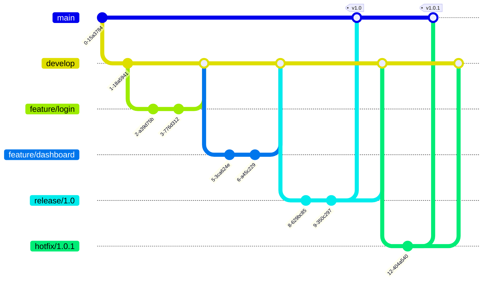

# Git Gitflow

## Introduction

Gitflow is a branching model for Git designed to streamline the process of software development and release management. Created by Vincent Driessen in 2010, Gitflow defines a structured branching strategy that enables teams to manage features, releases, and hotfixes in a methodical way. It's particularly useful for projects with scheduled release cycles, providing clear separation between development work and production-ready code.

In this guide, we'll explore how Gitflow works, when to use it, and how to implement it in your projects.

## What is Gitflow?

Gitflow is a Git workflow that defines a specific branching structure and set of procedures for managing software development. It revolves around two main branches with infinite lifetime:

- `main` (or `master`): Contains production-ready code
- `develop`: Serves as an integration branch for features

In addition to these primary branches, Gitflow uses several types of supporting branches:

- Feature branches: For developing new features
- Release branches: For preparing releases
- Hotfix branches: For fixing critical production issues

Let's visualize the Gitflow model:



## Setting Up Gitflow

To start using Gitflow, you'll need to install the Gitflow extension, which provides high-level repository operations for the workflow.

### Installation

#### On macOS:

```bash
brew install git-flow
```

#### On Linux:

```bash
apt-get install git-flow  # Debian/Ubuntu
yum install gitflow       # CentOS/RHEL
```

#### On Windows:

```bash
# Using Chocolatey
choco install gitflow
```

### Initializing Gitflow

Once installed, you can initialize Gitflow in your repository:

```bash
# Navigate to your repository
cd your-repository

# Initialize Gitflow
git flow init
```

The initialization process will prompt you to define branch names. The default values are usually sufficient:

```
Branch name for production releases: [main]
Branch name for "next release" development: [develop]

How to name your supporting branches?
Feature branches? [feature/]
Release branches? [release/]
Hotfix branches? [hotfix/]
Support branches? [support/]
Version tag prefix? []
```

After initialization, you'll have both `main` and `develop` branches.

## Working with Gitflow

Now let's look at how to use Gitflow for different aspects of development.

### Feature Development

Features are developed in dedicated branches and later merged back into `develop`.

#### Starting a Feature

```bash
git flow feature start user-authentication
```

This command creates a new branch called `feature/user-authentication` from `develop`.

You can now work on your feature, making commits as necessary:

```bash
# Make changes
git add .
git commit -m "Add login form"

# More changes
git add .
git commit -m "Implement authentication logic"
```

#### Finishing a Feature

When your feature is complete, finish it with:

```bash
git flow feature finish user-authentication
```

This will:
1. Merge `feature/user-authentication` into `develop`
2. Delete the feature branch
3. Switch back to the `develop` branch

### Preparing Releases

When `develop` has enough features for a release, you can start a release branch.

#### Starting a Release

```bash
git flow release start 1.0.0
```

This creates a `release/1.0.0` branch from `develop`.

During this phase, you can fix bugs and prepare metadata (version numbers, build dates, etc.):

```bash
# Update version number
git add version.txt
git commit -m "Bump version to 1.0.0"

# Fix last-minute bugs
git add bugfix.js
git commit -m "Fix pagination bug"
```

#### Finishing a Release

When the release is ready:

```bash
git flow release finish 1.0.0
```

This command will:
1. Merge `release/1.0.0` into `main`
2. Tag the release with its name (1.0.0)
3. Merge `release/1.0.0` back into `develop`
4. Delete the release branch

### Handling Hotfixes

Hotfixes are used to quickly patch production releases.

#### Creating a Hotfix

```bash
git flow hotfix start 1.0.1
```

This creates a `hotfix/1.0.1` branch from `main`.

Make your fixes:

```bash
git add critical-fix.js
git commit -m "Fix critical security issue"
```

#### Finishing a Hotfix

```bash
git flow hotfix finish 1.0.1
```

This will:
1. Merge `hotfix/1.0.1` into `main`
2. Tag the release with the hotfix version (1.0.1)
3. Merge the hotfix into `develop` as well
4. Delete the hotfix branch

## Real-World Example: E-commerce Website

Let's see how Gitflow might be used in developing an e-commerce website:

### Initial Setup

```bash
# Create and initialize the repository
mkdir ecommerce-site
cd ecommerce-site
git init
git flow init
```

### Developing Features

```bash
# Start work on product catalog
git flow feature start product-catalog

# After working on the feature
git flow feature finish product-catalog

# Start work on shopping cart
git flow feature start shopping-cart

# After completing the feature
git flow feature finish shopping-cart

# Start work on checkout process
git flow feature start checkout-process

# After completing the feature
git flow feature finish checkout-process
```

### Preparing for Launch

```bash
# Create a release for the first version
git flow release start 1.0.0

# Make final adjustments
# Update version numbers, etc.

# Finish the release
git flow release finish 1.0.0
```

### Post-Launch Hotfix

```bash
# A critical bug is found in the payment processing
git flow hotfix start 1.0.1

# Fix the bug
# Test thoroughly

# Finish the hotfix
git flow hotfix finish 1.0.1
```

## Gitflow vs. Other Workflows

While Gitflow offers a robust structure, it may not be suitable for every project. Here's a quick comparison:

| Workflow | Best For | Complexity |
|----------|----------|------------|
| Gitflow | Scheduled releases, larger teams | High |
| GitHub Flow | Continuous delivery, smaller teams | Low |
| GitLab Flow | Environments with deployments, middle-sized teams | Medium |
| Trunk-Based | Continuous integration, experienced teams | Low |

## Common Commands Reference

Here's a quick reference of common Gitflow commands:

```bash
# Initialize
git flow init

# Feature
git flow feature start feature_name
git flow feature finish feature_name

# Release
git flow release start release_version
git flow release finish release_version

# Hotfix
git flow hotfix start hotfix_version
git flow hotfix finish hotfix_version
```

## Best Practices

1. **Keep `main` always deployable**: The `main` branch should always contain production-ready code.

2. **Name branches clearly**: Use descriptive names for feature branches (e.g., `feature/user-authentication` instead of `feature/f1`).

3. **Use tags for releases**: Create tags for each release to easily identify versions.

4. **Regular merges from `develop` to feature branches**: Keep feature branches up-to-date with the latest changes.

5. **Code reviews before merging**: Implement pull request reviews before merging features into `develop`.

## Potential Challenges

- **Overhead for small projects**: Gitflow might be too structured for small teams or projects.
- **Merge conflicts**: Long-lived feature branches can lead to complex merge conflicts.
- **Learning curve**: Team members need to understand the workflow rules.

## Summary

Gitflow provides a structured approach to Git branching that helps teams organize their development process, particularly for projects with scheduled release cycles. By separating features, development, and production code into different branches, it creates a clear framework for collaboration.

While it introduces some complexity, the benefits of organization and clarity make it worthwhile for many teams. However, always consider your project's specific needs before adopting any workflow.

## Additional Resources

- [Original Gitflow Article by Vincent Driessen](https://nvie.com/posts/a-successful-git-branching-model/)
- [Atlassian Gitflow Tutorial](https://www.atlassian.com/git/tutorials/comparing-workflows/gitflow-workflow)
- [Git-flow Cheatsheet](https://danielkummer.github.io/git-flow-cheatsheet/)

## Exercises

1. Initialize Gitflow in a new repository and create your first feature branch.
2. Simulate a complete release cycle using Gitflow (feature development, release preparation, hotfix).
3. Practice resolving merge conflicts that might occur between feature branches and develop.
4. Create a small project with multiple team members using Gitflow and evaluate its effectiveness.