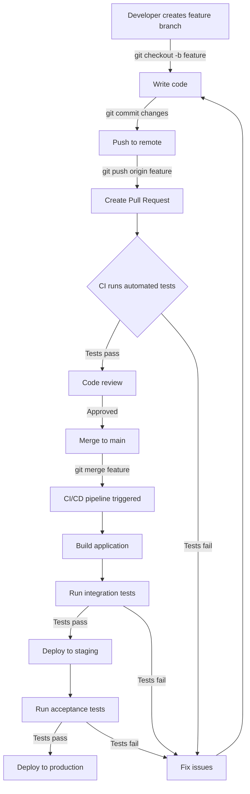

# Git CI/CD Integration

## Introduction

Continuous Integration and Continuous Deployment (CI/CD) is a modern software development practice that enables teams to deliver code changes more frequently and reliably. When integrated with Git, CI/CD creates a powerful workflow that automates testing, building, and deploying your applications whenever changes are pushed to your repository.

In this tutorial, we'll explore how Git integrates with CI/CD pipelines, helping beginners understand how these tools work together to streamline the development process.

## What is CI/CD?

Before diving into the integration with Git, let's clarify what CI/CD means:

- **Continuous Integration (CI)**: The practice of frequently merging code changes into a shared repository, where automated builds and tests verify each integration.
- **Continuous Deployment (CD)**: The practice of automatically deploying all code changes to a testing or production environment after the build stage.

## Git and CI/CD: The Perfect Match

Git's distributed nature and branching model make it an ideal version control system to pair with CI/CD pipelines. Here's why they work so well together:

1. Git branches allow parallel development
2. Pull requests provide a review mechanism before integration
3. Git hooks can trigger CI/CD pipeline events
4. Git tags can mark release versions for deployment

## Setting Up Basic CI/CD with GitHub Actions

GitHub Actions is one of the easiest ways for beginners to get started with CI/CD. Let's set up a basic workflow:

### Step 1: Create a Workflow File

In your repository, create a new file at `.github/workflows/main.yml`:

```yaml
name: CI/CD Pipeline

on:
  push:
    branches: [ main ]
  pull_request:
    branches: [ main ]

jobs:
  build:
    runs-on: ubuntu-latest
    
    steps:
    - uses: actions/checkout@v3
    
    - name: Set up Node.js
      uses: actions/setup-node@v3
      with:
        node-version: '18'
        
    - name: Install dependencies
      run: npm install
      
    - name: Run tests
      run: npm test
      
    - name: Build
      run: npm run build
```

This workflow will run whenever code is pushed to the main branch or when a pull request targeting main is created. It sets up Node.js, installs dependencies, runs tests, and builds the project.

### Step 2: Push the Workflow File to Your Repository

```bash
git add .github/workflows/main.yml
git commit -m "Add CI/CD workflow"
git push origin main
```

### Step 3: Check the Actions Tab on GitHub

After pushing, visit the "Actions" tab in your GitHub repository to see your workflow in action!

## Git Workflow with CI/CD

Let's see how a typical development workflow integrates with CI/CD:



## Integration with Popular CI/CD Platforms

GitHub Actions is just one option. Here's how to integrate Git with other popular CI/CD platforms:

### GitLab CI/CD

Create a `.gitlab-ci.yml` file in your repository:

```yaml
stages:
  - test
  - build
  - deploy

test:
  stage: test
  script:
    - npm install
    - npm test

build:
  stage: build
  script:
    - npm run build
  artifacts:
    paths:
      - dist/

deploy:
  stage: deploy
  script:
    - echo "Deploying application..."
    - ./deploy.sh
  only:
    - main
```

### Jenkins with Git

Jenkins can be configured to monitor your Git repository and trigger builds on changes:

1. Install the Git plugin in Jenkins
2. Create a new Jenkins job
3. Configure the job to pull from your Git repository
4. Set up build triggers to respond to Git webhooks

## Advanced Git CI/CD Techniques

### Using Git Tags for Releases

Tags in Git can be used to mark release points, which can trigger special deployment workflows:

```bash
# Create a new tag for a release
git tag -a v1.0.0 -m "Release version 1.0.0"

# Push the tag to remote
git push origin v1.0.0
```

In your CI/CD configuration, you can set up a special workflow for tags:

```yaml
# GitHub Actions example
on:
  push:
    tags:
      - 'v*'

jobs:
  release:
    runs-on: ubuntu-latest
    steps:
      - uses: actions/checkout@v3
      - name: Build release
        run: npm run build
      - name: Deploy to production
        run: ./deploy-production.sh
```

### Branch-Specific Workflows

Different Git branches can have different CI/CD behaviors:

```yaml
# GitHub Actions example with environment-specific deployments
on:
  push:
    branches:
      - main
      - staging
      - development

jobs:
  deploy:
    runs-on: ubuntu-latest
    
    steps:
      - uses: actions/checkout@v3
      
      - name: Deploy based on branch
        run: |
          if [[ $GITHUB_REF == 'refs/heads/main' ]]; then
            ./deploy-production.sh
          elif [[ $GITHUB_REF == 'refs/heads/staging' ]]; then
            ./deploy-staging.sh
          elif [[ $GITHUB_REF == 'refs/heads/development' ]]; then
            ./deploy-development.sh
          fi
```

### Git Hooks for Local CI

Before code even reaches the remote repository, you can use Git hooks to run tests locally:

Create a `.git/hooks/pre-commit` file:

```bash
#!/bin/sh

# Run tests before allowing commit
npm test

# Exit with non-zero status if tests fail
if [ $? -ne 0 ]; then
  echo "Tests failed. Commit aborted."
  exit 1
fi
```

Make the hook executable:

```bash
chmod +x .git/hooks/pre-commit
```

## Real-World Example: Deploying a Web Application

Let's walk through a complete example of deploying a React application with Git and CI/CD:

### 1. Development Process

```bash
# Create a feature branch
git checkout -b feature/new-login-page

# Make changes to the code
# ...

# Commit changes
git add .
git commit -m "Implement new login page design"

# Push to remote
git push origin feature/new-login-page
```

### 2. Pull Request and CI

Create a pull request on GitHub. This automatically triggers the CI process which:
- Runs unit tests
- Checks code style
- Builds the application

### 3. Code Review and Merge

After the CI passes and code review is complete, merge the pull request to the main branch.

### 4. Continuous Deployment

The merge to main triggers the CD process:

```yaml
# .github/workflows/deploy.yml
name: Deploy

on:
  push:
    branches: [ main ]

jobs:
  deploy:
    runs-on: ubuntu-latest
    steps:
      - uses: actions/checkout@v3
      
      - name: Setup Node.js
        uses: actions/setup-node@v3
        with:
          node-version: '18'
      
      - name: Install dependencies
        run: npm install
      
      - name: Build
        run: npm run build
      
      - name: Deploy to hosting service
        uses: FirebaseExtended/action-hosting-deploy@v0
        with:
          repoToken: '${{ secrets.GITHUB_TOKEN }}'
          firebaseServiceAccount: '${{ secrets.FIREBASE_SERVICE_ACCOUNT }}'
          channelId: live
```

### 5. Monitor the Deployment

Check the GitHub Actions tab to monitor the deployment process. Once complete, your application is live!

## Best Practices for Git CI/CD Integration

1. **Keep Builds Fast**: Slow CI/CD pipelines discourage frequent integration.
2. **Test Thoroughly**: Include unit, integration, and end-to-end tests in your pipeline.
3. **Use Branch Protection Rules**: Require passing CI checks before merging.
4. **Automate Versioning**: Use semantic versioning with Git tags.
5. **Implement Rollback Strategies**: Be prepared to revert to previous versions if needed.
6. **Monitor Your Pipelines**: Set up notifications for failed builds.
7. **Keep Secrets Secure**: Use environment variables or secrets management for sensitive data.
8. **Document Your CI/CD Process**: Make sure your team understands how the pipeline works.

## Common Issues and Troubleshooting

### Failed Builds

If your CI build fails:
1. Check the build logs for specific errors
2. Verify that tests pass locally before pushing
3. Ensure environment-specific configuration is properly set

### Deployment Issues

If deployment fails:
1. Check if the build artifacts were generated correctly
2. Verify deployment credentials and permissions
3. Check if the target environment is accessible from the CI/CD runner

### Integration Issues

If your Git and CI/CD integration isn't working:
1. Verify webhooks are properly configured
2. Check that your CI/CD configuration file is valid
3. Ensure the CI/CD platform has access to your repository

## Summary

Git CI/CD integration transforms the development workflow by automating testing, building, and deployment processes. By leveraging Git's branching model alongside CI/CD pipelines, teams can:

- Catch bugs earlier through automated testing
- Reduce manual deployment errors
- Deploy more frequently with confidence
- Maintain a high-quality codebase
- Collaborate more effectively

As you grow more comfortable with these concepts, you can create increasingly sophisticated pipelines tailored to your project's specific needs.

## Additional Resources

Here are some resources to continue learning about Git CI/CD integration:

- GitHub Actions documentation
- GitLab CI/CD documentation
- Jenkins Pipeline documentation
- "Continuous Delivery" by Jez Humble and David Farley (book)
- "DevOps Handbook" by Gene Kim, Jez Humble, Patrick Debois, and John Willis (book)

## Exercises

1. Set up a basic CI/CD pipeline for a simple web application using GitHub Actions.
2. Modify your pipeline to deploy to different environments based on Git branches.
3. Implement Git hooks to run linters and tests before each commit.
4. Create a release process using Git tags and a CD pipeline.
5. Explore how to run parallel jobs in your CI/CD pipeline to speed up the build process.