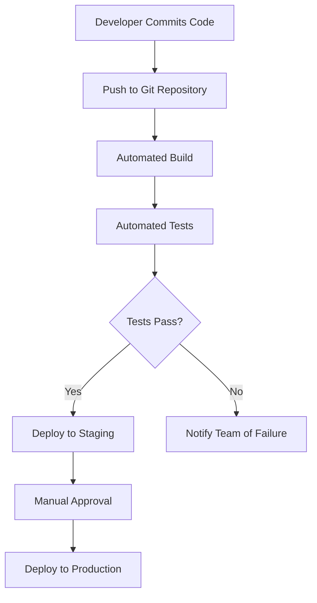

# Git Continuous Delivery

## Introduction

Continuous Delivery (CD) is a software development approach that aims to build software in such a way that it can be released to production at any time. When implemented with Git, it creates a powerful workflow that automates the testing and deployment processes, allowing teams to deliver updates to customers quickly and reliably.

In this guide, we'll explore how Git integrates with Continuous Delivery practices, the benefits this brings to development teams, and how to implement a basic Git CD pipeline as a beginner.

## What is Continuous Delivery?

Continuous Delivery extends the concept of Continuous Integration (CI) by automatically deploying all code changes to a testing and/or production environment after the build stage.

With proper CD, you can:
- Deploy new changes to customers quickly and sustainably
- Reduce the risk associated with releases through automation
- Get faster feedback on new features
- Deliver updates more frequently with less manual effort

## Git Continuous Delivery Workflow

A typical Git Continuous Delivery workflow connects your Git repository to your deployment pipeline:



## Setting Up a Basic Git CD Pipeline

Let's walk through setting up a simple Continuous Delivery pipeline with Git:

### 1. Establish Your Git Branching Strategy

A common approach is to use the following branches:

- `main` - Production-ready code
- `develop` - Integration branch for features
- `feature/*` - New features in development
- `release/*` - Preparing for a new production release
- `hotfix/*` - Urgent fixes for production

### 2. Connect Git to a CI/CD Tool

Popular CI/CD tools that integrate with Git include:
- GitHub Actions
- GitLab CI/CD
- Jenkins
- CircleCI
- Travis CI

Let's look at a simple GitHub Actions workflow file:

```yaml
name: Continuous Delivery Pipeline

on:
  push:
    branches: [ main, develop ]
  pull_request:
    branches: [ main, develop ]

jobs:
  build-and-test:
    runs-on: ubuntu-latest
    
    steps:
    - uses: actions/checkout@v3
    
    - name: Set up Node.js
      uses: actions/setup-node@v3
      with:
        node-version: '16'
        
    - name: Install dependencies
      run: npm ci
      
    - name: Run tests
      run: npm test
      
    - name: Build
      run: npm run build
  
  deploy-staging:
    needs: build-and-test
    if: github.ref == 'refs/heads/develop' && github.event_name == 'push'
    runs-on: ubuntu-latest
    
    steps:
    - uses: actions/checkout@v3
    
    - name: Deploy to staging
      run: |
        echo "Deploying to staging environment"
        # Add your deployment script here
        
  deploy-production:
    needs: build-and-test
    if: github.ref == 'refs/heads/main' && github.event_name == 'push'
    runs-on: ubuntu-latest
    
    steps:
    - uses: actions/checkout@v3
    
    - name: Deploy to production
      run: |
        echo "Deploying to production environment"
        # Add your production deployment script here
```

### 3. Working with Git in a CD Environment

Here's a typical developer workflow:

```bash
# Create a new feature branch
git checkout -b feature/new-login-screen

# Make your changes and commit
git add .
git commit -m "Implement new login screen with improved validation"

# Push your feature branch to remote
git push -u origin feature/new-login-screen

# Create a Pull Request to the develop branch
# (done through Git hosting platform UI)

# After code review and approval, merge to develop
# This will trigger automatic deployment to staging

# When ready for production, create a PR from develop to main
# After approval, merge to main
# This will trigger automatic deployment to production
```

## Implementing Feature Flags with Git CD

Feature flags allow you to deploy code to production but enable it selectively:

```javascript
// Simple feature flag implementation
function showNewFeature() {
  const FEATURE_FLAGS = {
    newLoginScreen: true,
    darkMode: false
  };
  
  if (FEATURE_FLAGS.newLoginScreen) {
    return <NewLoginScreen />;
  } else {
    return <OldLoginScreen />;
  }
}
```

This approach enables you to:
1. Deploy code to production without immediately enabling it
2. Gradually roll out features to certain user segments
3. A/B test new functionality
4. Quickly disable problematic features without rolling back the entire deployment

## Real-World Example: Deploying a Web Application

Let's walk through a practical example of deploying a web application using Git CD:

1. Developer implements a new feature in a feature branch:

```bash
git checkout -b feature/search-improvement
# Make changes to the search functionality
git add .
git commit -m "Improve search algorithm performance by 50%"
git push origin feature/search-improvement
```

2. Create a Pull Request to the `develop` branch

3. After automated tests pass and code review is complete, merge to `develop`

4. CI/CD system automatically:
   - Builds the application
   - Runs all tests
   - Deploys to the staging environment
   - Runs integration tests

5. QA team verifies functionality in staging

6. Create a Pull Request from `develop` to `main`

7. After approval, merge to `main`

8. CI/CD system automatically:
   - Builds the production version
   - Runs all tests
   - Deploys to production gradually (canary deployment)
   - Monitors for errors

9. New feature is now live for all users

## Best Practices for Git Continuous Delivery

1. **Keep commits small and focused**: This makes it easier to identify and fix issues.

2. **Write good commit messages**: Follow conventions like:
   ```
   feat: add new login screen
   fix: resolve password reset issue
   docs: update API documentation
   test: add tests for user authentication
   ```

3. **Protect your main branch**: Require Pull Requests and passing tests before merging.

4. **Automate everything possible**: Testing, code quality checks, security scanning, and deployment.

5. **Monitor deployments**: Set up alerting for unusual patterns after deployment.

6. **Practice rollbacks**: Ensure your team knows how to quickly revert problematic changes:
   ```bash
   # If you need to roll back to a previous commit
   git revert HEAD~1..HEAD
   git push
   ```

## Common Challenges and Solutions

### Challenge: Long-running feature branches
**Solution**: Use feature flags to merge code more frequently, even if features aren't complete.

### Challenge: Test environments differ from production
**Solution**: Use containerization (Docker) to ensure consistent environments.

### Challenge: Slow test suites
**Solution**: Implement parallel testing and optimize your test suite.

### Challenge: Merge conflicts
**Solution**: Merge from the main branch frequently to reduce divergence.

## Summary

Git Continuous Delivery creates a streamlined workflow that enables teams to deliver software updates quickly, reliably, and with minimal manual effort. By connecting your Git workflow to automated testing and deployment processes, you can:

- Reduce the time between writing code and delivering it to users
- Increase the quality and reliability of your software
- Respond quickly to market changes and user feedback
- Reduce the stress and risk of deployment days

Remember that while tools and automation are important, Continuous Delivery is primarily a mindset and a culture. It requires commitment to practices like automated testing, small incremental changes, and consistent attention to keeping your main branch always deployable.

## Additional Resources

- Books:
  - "Continuous Delivery" by Jez Humble and David Farley
  - "DevOps Handbook" by Gene Kim, Jez Humble, Patrick Debois, and John Willis

- Practice Exercises:
  1. Set up a simple web application with GitHub Actions for CI/CD
  2. Implement feature flags in your next project
  3. Create a complete CD pipeline for a personal project

- Next Steps:
  - Learn about Continuous Deployment (automating the final step to production)
  - Explore canary deployments and blue-green deployment strategies
  - Implement infrastructure as code with tools like Terraform