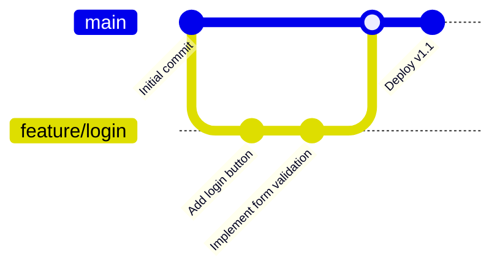

# GitHub Flow

## Introduction

GitHub Flow is a lightweight, branch-based workflow designed by GitHub for teams that need to deploy regularly. Unlike more complex Git workflows, GitHub Flow focuses on simplicity and continuous delivery, making it ideal for beginners and teams that want to maintain a clean, deployable main branch at all times.

This workflow is built around a single principle: the `main` branch should always be deployable. This means that any code in the `main` branch should be stable, tested, and ready to be deployed to production at any time.

## What is GitHub Flow?

GitHub Flow is a simple, six-step workflow:

1. Create a branch from `main`
2. Add commits to your branch
3. Open a Pull Request
4. Discuss and review your code
5. Deploy for testing/validation
6. Merge to `main`

Let's dive into each step to understand how GitHub Flow works in practice.

## GitHub Flow Step by Step

### Step 1: Create a Branch

All development work in GitHub Flow starts with creating a branch from `main`:

```bash
# First, ensure you're on the main branch and it's up to date
git checkout main
git pull origin main

# Create a new feature branch
git checkout -b feature/add-login-button
```

Branches in GitHub Flow should have descriptive names that reflect the work being done. Common prefixes include:

- `feature/` - for new features
- `bugfix/` - for bug fixes
- `hotfix/` - for critical fixes that need immediate deployment
- `docs/` - for documentation changes

### Step 2: Add Commits

Once you've created your branch, you can start making changes to the codebase. Each commit should represent a logical unit of work:

```bash
# After making changes to your files
git add index.html
git commit -m "Add login button to navigation bar"

# Make more changes
git add login.js
git commit -m "Implement login form functionality"
```

Guidelines for good commits:

- Keep commits focused on a single change
- Write clear, descriptive commit messages
- Commit early and often

### Step 3: Open a Pull Request

After you've made your changes and pushed your branch to GitHub, it's time to open a Pull Request (PR):

```bash
# Push your branch to GitHub
git push -u origin feature/add-login-button
```

Then, go to your repository on GitHub and you'll see a prompt to create a Pull Request for your recently pushed branch.

A good Pull Request should:

- Have a descriptive title
- Include details about what changes were made and why
- Link to any relevant issues
- Tag reviewers who should look at your code

Example PR description:

```
## Add User Login Feature

This PR adds a login button to the navigation bar and implements the login form functionality.

Changes include:
- New login button in the navbar
- Login modal with email/password fields
- Client-side validation for the form
- Integration with the authentication API

Fixes #123

@teammate1 @teammate2 Please review when you have a chance.
```

### Step 4: Discuss and Review

Once your PR is open, your team can review your code, suggest changes, and discuss the implementation:

- Reviewers can comment on specific lines of code
- You can respond to comments and make additional commits to address feedback
- GitHub's Review feature allows reviewers to approve changes or request modifications

This step is crucial for maintaining code quality and knowledge sharing within the team.

### Step 5: Deploy for Testing

A key aspect of GitHub Flow is deploying your changes to a testing or staging environment before merging:

```bash
# Some teams use specific commands to deploy from a feature branch
# This varies based on your deployment setup
npm run deploy --branch=feature/add-login-button
```

Many teams automate this process with CI/CD pipelines, which can automatically:

1. Run tests on your branch
2. Build your application
3. Deploy to a test environment
4. Provide a URL for manual testing

This step ensures that your changes work not just on your local machine, but in an environment similar to production.

### Step 6: Merge to Main

Once your Pull Request has been approved and tested, it's time to merge it into the `main` branch:



On GitHub, you can merge your PR by clicking the "Merge pull request" button. After merging, it's a good practice to delete the feature branch:

```bash
# Update your local main branch
git checkout main
git pull origin main

# Delete the local feature branch
git branch -d feature/add-login-button

# Delete the remote feature branch
git push origin --delete feature/add-login-button
```

## Real-World Example: Adding a New Feature

Let's walk through a complete example of using GitHub Flow to add a dark mode toggle to a website:

### 1. Create a Branch

```bash
git checkout main
git pull origin main
git checkout -b feature/dark-mode
```

### 2. Make Changes and Commit

First, add a toggle button to the UI:

```html
<!-- Add this to your navbar -->
<button id="darkModeToggle" class="toggle-button">
  <span class="toggle-icon">🌙</span>
  <span class="toggle-text">Dark Mode</span>
</button>
```

```css
/* Style the toggle button */
.toggle-button {
  display: flex;
  align-items: center;
  padding: 0.5rem;
  background: none;
  border: 1px solid #ccc;
  border-radius: 4px;
  cursor: pointer;
}

.toggle-icon {
  margin-right: 0.5rem;
}

/* Dark mode styles */
body.dark-mode {
  background-color: #1a1a1a;
  color: #f5f5f5;
}
```

Add JavaScript functionality:

```javascript
document.addEventListener('DOMContentLoaded', () => {
  const darkModeToggle = document.getElementById('darkModeToggle');
  const body = document.body;
  
  // Check for saved preference
  const darkMode = localStorage.getItem('darkMode') === 'enabled';
  
  // Apply saved preference
  if (darkMode) {
    body.classList.add('dark-mode');
    darkModeToggle.querySelector('.toggle-icon').textContent = '☀️';
    darkModeToggle.querySelector('.toggle-text').textContent = 'Light Mode';
  }
  
  // Toggle dark mode on button click
  darkModeToggle.addEventListener('click', () => {
    if (body.classList.contains('dark-mode')) {
      body.classList.remove('dark-mode');
      localStorage.setItem('darkMode', 'disabled');
      darkModeToggle.querySelector('.toggle-icon').textContent = '🌙';
      darkModeToggle.querySelector('.toggle-text').textContent = 'Dark Mode';
    } else {
      body.classList.add('dark-mode');
      localStorage.setItem('darkMode', 'enabled');
      darkModeToggle.querySelector('.toggle-icon').textContent = '☀️';
      darkModeToggle.querySelector('.toggle-text').textContent = 'Light Mode';
    }
  });
});
```

Now commit these changes:

```bash
git add index.html styles.css script.js
git commit -m "Add dark mode toggle button and functionality"
```

### 3. Push and Create a Pull Request

```bash
git push -u origin feature/dark-mode
```

Then create a Pull Request on GitHub with the following description:

```
## Add Dark Mode Feature

This PR adds a dark mode toggle to the website that allows users to switch between light and dark themes.

Changes include:
- New toggle button in the navigation bar
- CSS styles for dark mode
- JavaScript to handle toggling and saving user preference

The dark mode preference is saved in localStorage to persist between sessions.

Fixes #456
```

### 4. Review Process

During the review, a teammate might comment:

> The toggle looks good, but we should also update the logo color in dark mode to improve visibility.

You would then make the requested changes:

```css
/* Add this to your CSS */
body.dark-mode .logo {
  filter: invert(1);
}
```

Commit and push these changes:

```bash
git add styles.css
git commit -m "Update logo visibility in dark mode"
git push origin feature/dark-mode
```

### 5. Testing

Your CI/CD pipeline would deploy this branch to a testing environment where you and your team can verify:

- The toggle button works correctly
- Dark mode styles are applied properly
- User preferences are saved and restored
- The feature works across different browsers and devices

### 6. Merge and Deploy

Once everyone is satisfied with the feature, merge the Pull Request on GitHub. Then update your local repository:

```bash
git checkout main
git pull origin main
git branch -d feature/dark-mode
```

## Benefits of GitHub Flow

- **Simplicity**: Easy to understand and implement
- **Continuous Delivery**: Always have a deployable main branch
- **Visibility**: Pull Requests make changes visible and facilitate discussion
- **Feedback**: Regular deploys mean regular user feedback
- **Flexibility**: Works for both scheduled releases and continuous deployment

## When to Use GitHub Flow

GitHub Flow works best when:

- You need to deploy frequently
- Your team is small to medium-sized
- You have good automated testing and CI/CD pipelines
- Your project doesn't require multiple versions to be maintained simultaneously

## GitHub Flow vs. Other Workflows

Unlike Git Flow or GitLab Flow, GitHub Flow:

- Doesn't use a development branch
- Doesn't have release branches
- Focuses on feature branches and quick merges
- Assumes continuous deployment

This simplicity makes it ideal for beginners and teams that want to move quickly.

## Summary

GitHub Flow is a streamlined Git workflow that emphasizes simplicity and continuous delivery. The six steps—branching, committing, opening a Pull Request, reviewing, deploying, and merging—create a process that keeps your main branch always deployable while facilitating collaboration and code quality.

By following GitHub Flow, teams can:
- Develop features in isolation
- Get feedback through Pull Requests
- Test changes before merging
- Deploy with confidence

Whether you're working on a personal project or in a team environment, GitHub Flow provides a straightforward approach to version control that helps maintain stability while enabling rapid development.

## Additional Resources

- [GitHub Flow Official Guide](https://docs.github.com/en/get-started/quickstart/github-flow)
- [GitHub Flow vs. Git Flow](https://www.atlassian.com/git/tutorials/comparing-workflows/gitflow-workflow)
- [Implementing CI/CD with GitHub Actions](https://docs.github.com/en/actions)

## Exercises

1. **Practice Exercise**: Create a new repository, implement GitHub Flow for adding a simple feature, and practice the entire workflow from branching to merging.

2. **Team Simulation**: In a group of 2-4 people, simulate a team environment where each person works on different features using GitHub Flow. Practice code reviews and handling merge conflicts.

3. **Workflow Adaptation**: Take an existing project and convert it to use GitHub Flow. Document the changes needed and any challenges encountered.

4. **CI/CD Integration**: Set up a basic CI/CD pipeline using GitHub Actions that automatically tests Pull Requests and deploys merged changes to a staging environment.