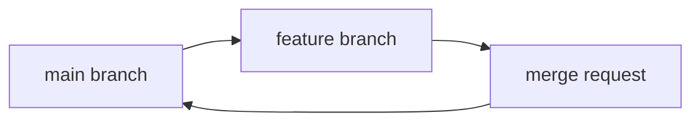
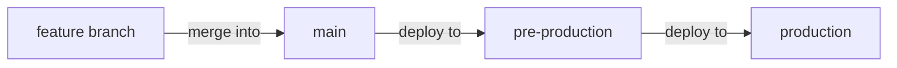

# Git GitLab Flow

## Introduction

GitLab Flow is a simplified Git workflow designed to make collaboration easier, especially in continuous delivery environments. It combines feature branching with issue tracking, providing a balanced approach between simplicity and control.

Unlike Git Flow, which can be complex with multiple branch types, or GitHub Flow, which might be too simplistic for certain scenarios, GitLab Flow offers a middle ground that's both straightforward and adaptable to various project requirements.

## Understanding GitLab Flow Basics

GitLab Flow is built around a few core principles:

1. The `main` branch reflects production-ready code
2. Feature branches are created from `main`
3. Changes are merged back to `main` via merge requests
4. Optional environment branches provide additional structure

Let's visualize the basic structure:



## Environment Branches in GitLab Flow

For projects that need more structure, GitLab Flow introduces environment branches that represent different deployment stages:



These environment branches allow teams to maintain multiple versions of their software in different environments, making it ideal for products with regular releases.

## Getting Started with GitLab Flow

Let's walk through implementing GitLab Flow in a simple project:

### 1. Setting Up Your Repository

First, create a repository with a `main` branch:

```bash
# Initialize a new Git repository
git init

# Create and add a simple README file
echo "# My Project" > README.md
git add README.md
git commit -m "Initial commit"

# Push to your GitLab repository
git remote add origin git@gitlab.com:username/project-name.git
git push -u origin main
```

### 2. Working with Feature Branches

For each new feature or bug fix, create a dedicated branch:

```bash
# Create a new feature branch
git checkout -b feature/user-authentication

# Make changes to implement the feature
echo "// Authentication code" > auth.js
git add auth.js
git commit -m "Add user authentication module"

# Push the feature branch
git push -u origin feature/user-authentication
```

### 3. Creating a Merge Request

Once your feature is complete:

1. Push your changes to GitLab
2. Create a merge request in the GitLab interface
3. Assign reviewers and link related issues
4. After approval, merge the changes into `main`

### 4. Environment Branches (Optional)

If your project needs environment branches, set them up like this:

```bash
# Create environment branches
git checkout -b pre-production
git push -u origin pre-production

git checkout -b production
git push -u origin production
```

With this structure, code flows from `main` to `pre-production` to `production`.

## Production Branches & Release Versioning

For projects that maintain multiple versions, GitLab Flow supports release branches:

```bash
# Create a release branch for version 1.0
git checkout -b release-1-0
git push -u origin release-1-0
```

Hotfixes for a release can be made on these branches and then cherry-picked back to `main`:

```bash
# Create hotfix on release branch
git checkout release-1-0
git checkout -b hotfix/critical-bug

# Fix the bug
echo "// Bug fix" > bugfix.js
git add bugfix.js
git commit -m "Fix critical security issue"

# Create merge request for the release branch
# After merging to release-1-0, cherry-pick to main
git checkout main
git cherry-pick <commit-hash>
```

## Real-World Example: Web Application Development

Let's see GitLab Flow in action for a web application:

### Project Setup

```bash
# Initialize project and main branch
git init
echo "# E-commerce Application" > README.md
git add README.md
git commit -m "Initial commit"
git push -u origin main

# Create environment branches
git checkout -b staging
git push -u origin staging

git checkout -b production
git push -u origin production
```

### Feature Development

```bash
# Branch for new shopping cart feature
git checkout main
git checkout -b feature/shopping-cart

# Work on the feature
# Create shopping cart component
echo "class ShoppingCart {}" > shopping-cart.js
git add shopping-cart.js
git commit -m "Add shopping cart class"

# Add tests
echo "test('adding items to cart');" > shopping-cart.test.js
git add shopping-cart.test.js
git commit -m "Add tests for shopping cart"

# Complete feature implementation
git commit -am "Implement checkout functionality"

# Push and create merge request
git push -u origin feature/shopping-cart
```

### Deployment Flow

Once the merge request is approved and merged to `main`, the deployment process would be:

1. Automated tests run on `main`
2. If tests pass, changes are merged to `staging`
3. After verification in staging, changes are merged to `production`

## Handling Issues and Bugs

GitLab Flow integrates well with GitLab's issue tracking:

1. Create an issue in GitLab
2. Create a branch referencing the issue: `git checkout -b issue-42-login-bug`
3. Fix the issue
4. Create a merge request mentioning the issue (`Fixes #42`)
5. After merging, the issue is automatically closed

## Common GitLab Flow Commands

Here's a quick reference for common GitLab Flow operations:

```bash
# Start a new feature
git checkout main
git checkout -b feature/new-feature

# Update your feature branch with latest changes from main
git checkout feature/new-feature
git fetch origin
git merge origin/main

# Create a release branch
git checkout main
git checkout -b release-2-0

# Apply a hotfix to production and main
git checkout production
git checkout -b hotfix/urgent-fix
# make changes
git commit -am "Fix urgent issue"
git push -u origin hotfix/urgent-fix
# create merge request to production
# after merging to production, cherry-pick to main
```

## Best Practices for GitLab Flow

To make the most of GitLab Flow:

1. **Keep branches short-lived**: Merge feature branches quickly to reduce merge conflicts
2. **Write good commit messages**: Be descriptive about what changes were made and why
3. **Link commits to issues**: Use GitLab's issue tracking integration
4. **Use meaningful branch names**: Follow conventions like `feature/`, `bugfix/`, `hotfix/`
5. **Set up CI/CD pipelines**: Automate testing and deployment
6. **Review code thoroughly**: Use GitLab's merge request features for detailed code reviews

## Comparing GitLab Flow with Other Workflows

Let's compare GitLab Flow with other popular Git workflows:

| Workflow | Complexity | Best For | Key Feature |
|----------|------------|----------|-------------|
| GitLab Flow | Medium | Continuous delivery with environment branches | Balance of simplicity and structure |
| Git Flow | High | Products with release cycles | Separate development and main branches |
| GitHub Flow | Low | Continuous deployment | Simple branch-and-merge workflow |

## Summary

GitLab Flow provides a flexible, streamlined approach to Git workflows that works well for many development teams. Its key advantages include:

- Simplicity compared to Git Flow
- More structure than GitHub Flow
- Integration with issue tracking
- Support for multiple environments
- Adaptability to different project requirements

By following the GitLab Flow methodology, you can maintain a clean, organized repository while supporting continuous integration and deployment practices.

## Additional Resources

- [GitLab Flow Official Documentation](https://docs.gitlab.com/ee/topics/gitlab_flow.html)
- [Pro Git Book](https://git-scm.com/book/en/v2)
- [Git Branching Strategies](https://martinfowler.com/articles/branching-patterns.html)

## Exercises

1. Set up a sample project using GitLab Flow with main, staging, and production branches.
2. Create a feature branch, make changes, and submit a merge request.
3. Simulate a hotfix by creating a branch from production, fixing an issue, and cherry-picking the change to main.
4. Try resolving a merge conflict that might occur when merging a long-lived feature branch.
5. Set up GitLab CI/CD to automatically test your branches and deploy to different environments.