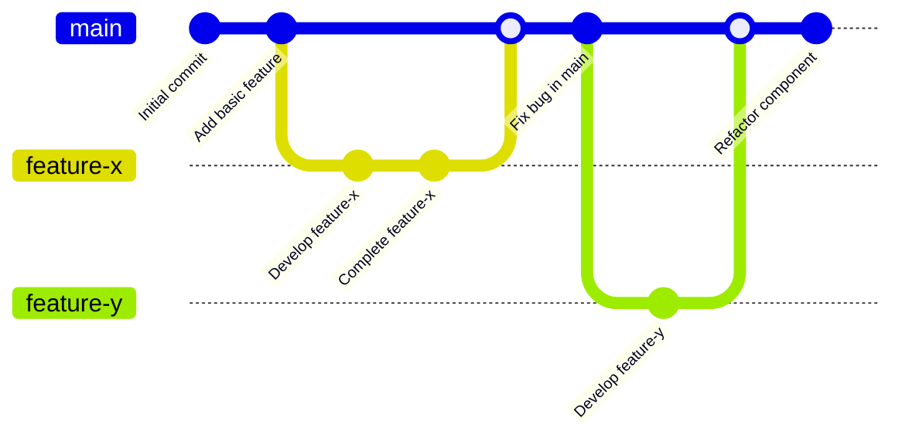

# Git Trunk-Based Development

## Introduction

Trunk-Based Development (TBD) is a source control workflow model that has gained popularity in modern software development, particularly within teams practicing Continuous Integration and Continuous Deployment (CI/CD). Unlike more complex branching strategies, Trunk-Based Development focuses on keeping all work centered around a single branch (typically called 'main' or 'trunk'), with developers integrating their work frequently.

This approach encourages small, incremental changes rather than large feature branches that live for extended periods. The result is often reduced merge conflicts, faster integration, and more reliable releases.

## Core Principles of Trunk-Based Development

Trunk-Based Development is built on several fundamental principles:

1. **The Main Branch is Always Deployable**: The trunk (main branch) should always be in a state that can be deployed to production.

2. **Small, Frequent Commits**: Developers make small, incremental changes and commit them frequently to the main branch.

3. **Short-Lived Feature Branches**: When feature branches are used, they should be short-lived (typically less than a day) and merged back quickly.

4. **Feature Flags for Incomplete Features**: Use feature flags (toggles) to hide incomplete features in production while still allowing code to be merged.

5. **Automated Testing**: Comprehensive automated tests ensure that the main branch remains stable despite frequent changes.

Let's explore how Trunk-Based Development works in practice.

## Basic Trunk-Based Development Workflow

Here's a simple visualization of the Trunk-Based Development workflow:



### Step-by-Step Implementation

Let's walk through the basic workflow of Trunk-Based Development:

#### 1. Start with the main branch

Always begin by ensuring you have the latest version of the main branch:

```bash
# Ensure you're on the main branch
git checkout main

# Get the latest changes
git pull origin main
```

#### 2. Create a short-lived feature branch (optional)

For non-trivial changes, create a short-lived feature branch:

```bash
# Create and switch to a new feature branch
git checkout -b feature/add-login-button
```

#### 3. Make small, focused changes

Keep your changes small and focused on a single task. This makes reviewing and testing easier.

```bash
# Edit files
# ...

# Add your changes
git add .

# Commit with a descriptive message
git commit -m "Add login button to navbar"
```

#### 4. Integrate with main frequently

Even while working on your feature branch, pull from main regularly to avoid drift:

```bash
# Get latest changes from main
git pull origin main
```

#### 5. Push your changes and create a Pull Request

```bash
# Push your branch
git push origin feature/add-login-button
```

Create a pull request for code review. In strict Trunk-Based Development, this PR should be reviewed and merged within a day.

#### 6. Merge to main

After approval, merge your changes back to the main branch:

```bash
# Switch back to main
git checkout main

# Pull latest changes
git pull origin main

# Merge your feature branch
git merge feature/add-login-button

# Push to remote
git push origin main
```

#### 7. Delete the feature branch

Once merged, delete the feature branch:

```bash
# Delete local branch
git branch -d feature/add-login-button

# Delete remote branch
git push origin --delete feature/add-login-button
```

## Working Directly on the Main Branch

For very small changes, experienced teams might work directly on the main branch:

```bash
# Ensure you're on the main branch with latest changes
git checkout main
git pull origin main

# Make your small change
# ...

# Commit and push directly to main
git add .
git commit -m "Fix typo in homepage"
git push origin main
```

This approach requires discipline and should only be used for truly minimal changes that don't risk breaking the build.

## Feature Flags for Incomplete Features

When working on larger features that might take multiple days, use feature flags to hide incomplete functionality in production:

```javascript
// Example of a feature flag in JavaScript
if (featureFlags.isEnabled('new-dashboard')) {
  // New dashboard code
  renderNewDashboard();
} else {
  // Old dashboard code
  renderClassicDashboard();
}
```

This allows you to merge code into the main branch even when the feature isn't complete or ready for users.

## Practical Example: Adding a New Feature with Trunk-Based Development

Let's walk through a practical example of implementing a new search feature using Trunk-Based Development principles:

### Scenario: Adding a Search Feature to a Website

**Step 1: Create a short-lived branch for the search feature**

```bash
git checkout main
git pull origin main
git checkout -b feature/search-bar
```

**Step 2: Implement the basic search UI**

```jsx
// Add a simple search component
const SearchBar = () => {
  const [query, setQuery] = useState('');
  
  const handleSearch = (e) => {
    e.preventDefault();
    // To be implemented
    console.log('Searching for:', query);
  };
  
  return (
    <form onSubmit={handleSearch}>
      <input
        type="text"
        value={query}
        onChange={(e) => setQuery(e.target.value)}
        placeholder="Search..."
      />
      <button type="submit">Search</button>
    </form>
  );
};
```

**Step 3: Commit this small change**

```bash
git add .
git commit -m "Add search bar UI component"
```

**Step 4: Add the search functionality behind a feature flag**

```jsx
// In your app configuration
const featureFlags = {
  'search-feature': process.env.ENABLE_SEARCH === 'true',
};

// In your component
const Header = () => {
  return (
    <header>
      <Logo />
      <Navigation />
      {featureFlags['search-feature'] && <SearchBar />}
    </header>
  );
};
```

**Step 5: Commit these changes**

```bash
git add .
git commit -m "Implement search feature behind feature flag"
```

**Step 6: Merge back to main quickly**

```bash
git push origin feature/search-bar
# Create Pull Request and get it reviewed
# After approval:
git checkout main
git pull origin main
git merge feature/search-bar
git push origin main
```

**Step 7: Continue enhancing the search in small increments directly on main**

```bash
git checkout main
git pull origin main

# Make small improvement to search results display
# ...

git add .
git commit -m "Enhance search results styling"
git push origin main
```

**Step 8: Enable the feature flag when ready**

When the search feature is complete and tested, update the feature flag configuration:

```bash
# Update environment variable or configuration
ENABLE_SEARCH=true
```

## Benefits of Trunk-Based Development

1. **Reduced Merge Hell**: Frequent integration means fewer large, complex merges.

2. **Faster Feedback**: Changes are tested and deployed quickly, providing faster feedback.

3. **Simplified Workflow**: The branching model is straightforward and easy to follow.

4. **Improved Collaboration**: Everyone works off the same main branch, promoting collaboration.

5. **Better CI/CD Support**: Trunk-Based Development aligns perfectly with continuous integration principles.

## Challenges and Solutions

### Challenge: Maintaining Build Stability

With frequent commits to the main branch, there's a risk of breaking the build.

**Solution**: Implement robust automated testing, including:
- Pre-commit hooks that run tests locally
- CI pipelines that verify every push
- Automated rollbacks for failing builds

### Challenge: Incomplete Features

How do you merge work that's part of a larger feature not yet ready for users?

**Solution**: Use feature flags to hide incomplete features in production while still allowing code to be merged.

### Challenge: Code Review Process

How do you ensure code quality when changes are frequent and small?

**Solution**: 
- Implement pair programming
- Use automated code quality tools
- Establish clear coding standards
- Consider trunk-based-friendly review processes like "Reviewboard" or "Gerrit"

## Trunk-Based Development vs. Git Flow

Trunk-Based Development is often contrasted with Git Flow, which uses multiple long-lived branches. Here's a comparison:

| Aspect | Trunk-Based Development | Git Flow |
|--------|-------------------------|----------|
| Main Branch | Single "trunk" | Multiple branches (develop, release, feature, hotfix) |
| Branch Lifespan | Short-lived (hours to days) | Long-lived (days to weeks) |
| Release Process | Continuous deployment from main | Dedicated release branches |
| Complexity | Simple, minimal | Complex, structured |
| Merge Frequency | High (multiple times per day) | Low (when features are complete) |
| Best For | Teams practicing CI/CD | Teams with longer release cycles |

## Summary

Trunk-Based Development is a streamlined Git workflow model that emphasizes working directly on the main branch or using short-lived feature branches. This approach promotes continuous integration, reduces merge conflicts, and supports faster, more reliable deployments.

Key takeaways:
- Keep the main branch always deployable
- Make small, frequent commits
- Use short-lived feature branches (less than a day if possible)
- Leverage feature flags for incomplete features
- Implement comprehensive automated testing
- Pull from main frequently to avoid drift

By following these principles, teams can achieve smoother collaboration and more efficient development processes, particularly when practicing continuous integration and continuous deployment.

## Additional Resources

- [trunkbaseddevelopment.com](https://trunkbaseddevelopment.com/) - The definitive resource on Trunk-Based Development
- [Continuous Integration](https://martinfowler.com/articles/continuousIntegration.html) by Martin Fowler
- [Feature Toggles](https://martinfowler.com/articles/feature-toggles.html) - An in-depth look at feature flags

## Practice Exercises

1. **Convert a Project**: Take an existing project using another branching strategy and convert it to Trunk-Based Development.

2. **Feature Flag Implementation**: Implement a simple feature flag system in your preferred language.

3. **Team Simulation**: With a group, simulate a week of development using Trunk-Based Development principles, tracking how many times you integrate with the main branch.

4. **CI Pipeline Setup**: Configure a continuous integration pipeline that supports Trunk-Based Development by running tests automatically and notifying of any failures.