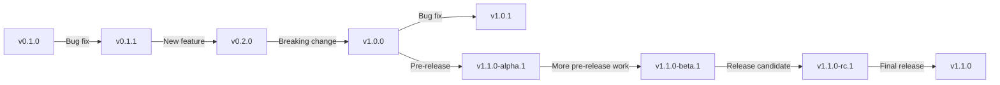
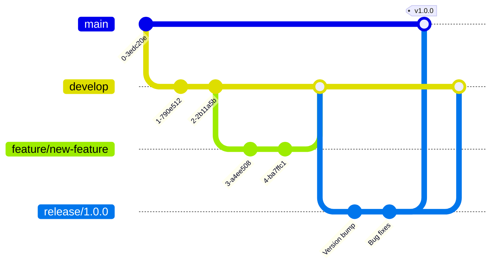

# Git Release Management

## Introduction

Release management is a critical aspect of software development that involves planning, scheduling, and controlling the deployment of software releases. In Git, release management provides a structured approach to versioning your code and making it available to users. Whether you're developing a small library or a large application, proper release management ensures that your users can easily track changes, understand compatibility, and access stable versions of your software.

In this guide, we'll explore how to effectively manage releases in Git projects using tags, semantic versioning, and release workflows.

## Understanding Git Tags

Tags in Git are references to specific points in your repository's history. Unlike branches, tags don't change once created (unless explicitly modified), making them perfect for marking release points.

### Creating Tags

There are two types of Git tags:

1. **Lightweight tags**: Simple pointers to specific commits
2. **Annotated tags**: Full objects stored in the Git database that include the tagger's name, email, date, and a tagging message

Let's see how to create both types:

```bash
# Lightweight tag
git tag v1.0.0

# Annotated tag (recommended for releases)
git tag -a v1.0.0 -m "Version 1.0.0 - Initial stable release"
```

### Listing Tags

To view all available tags in your repository:

```bash
git tag
```

To search for tags matching a pattern:

```bash
git tag -l "v1.0.*"
```

### Pushing Tags to Remote

By default, `git push` doesn't transfer tags to remote repositories. To push tags, use:

```bash
# Push a specific tag
git push origin v1.0.0

# Push all tags
git push origin --tags
```

## Semantic Versioning

Semantic Versioning (SemVer) is a versioning scheme that provides meaning to version numbers. It follows the format `MAJOR.MINOR.PATCH`:

- **MAJOR**: Incremented for incompatible API changes
- **MINOR**: Incremented for backward-compatible new functionality
- **PATCH**: Incremented for backward-compatible bug fixes

Additional labels for pre-release and build metadata can be appended as extensions (e.g., `v1.0.0-alpha.1`, `v1.0.0+20230401`).

### Example of SemVer Evolution



## Release Workflows

Let's explore common Git workflows for managing releases effectively.

### Git Flow Release Process

One popular approach is the Git Flow workflow, which defines specific branch structures for releases:



In Git Flow:

1. Feature development happens on `feature/*` branches off `develop`
2. When ready for release, create a `release/*` branch from `develop`
3. Only bug fixes and release preparations go into the release branch
4. When ready, merge the release branch into both `main` and `develop`
5. Tag the merge commit on `main` with the version number

### Step-by-Step Release Process

Let's walk through a practical release example:

```bash
# Start from develop branch
git checkout develop

# Create a release branch
git checkout -b release/1.0.0

# Update version numbers in relevant files
# (package.json, version.py, etc.)

# Commit the version changes
git commit -a -m "Bump version to 1.0.0"

# Fix any last-minute bugs
git commit -m "Fix login error handling"

# Merge to main branch
git checkout main
git merge --no-ff release/1.0.0 -m "Release version 1.0.0"

# Tag the release
git tag -a v1.0.0 -m "Version 1.0.0"

# Merge back to develop
git checkout develop
git merge --no-ff release/1.0.0 -m "Merge release 1.0.0 back to develop"

# Delete the release branch
git branch -d release/1.0.0

# Push everything to remote
git push origin main develop
git push origin v1.0.0
```

## GitHub Releases

GitHub provides a user-friendly way to manage releases through its Releases feature.

### Creating a GitHub Release

1. Go to your repository on GitHub
2. Click on "Releases" in the right sidebar
3. Click "Create a new release"
4. Select or create a tag
5. Fill in the release title and description
6. Optionally attach binary files or other assets
7. Publish the release

GitHub releases allow you to:

- Provide detailed release notes with Markdown formatting
- Highlight new features, bug fixes, and breaking changes
- Attach compiled binaries or distribution packages
- Automatically generate source code archives

### Release Notes Best Practices

Good release notes help users understand what changed. Consider including:

- Summary of major changes
- Detailed list of features, enhancements, and bug fixes
- Upgrade instructions, especially for breaking changes
- Contributors acknowledgment
- Examples of new features

Example release notes format:

```markdown
## What's New
- Added dark mode theme support
- Improved loading performance by 30%

## Bug Fixes
- Fixed authentication failure on expired tokens
- Resolved layout issues on mobile devices

## Breaking Changes
- Renamed `ApiClient.fetch()` to `ApiClient.request()`
- Dropped support for Internet Explorer

## Upgrade Instructions
Update your imports from:
```javascript
import { fetch } from 'api-client';
```
To:
```javascript
import { request } from 'api-client';
```
```

## Pre-Release Management

For larger projects, it's often beneficial to release pre-release versions for testing.

### Alpha, Beta, and RC Releases

- **Alpha**: Early, unstable versions with incomplete features
- **Beta**: Feature-complete but potentially with known bugs
- **Release Candidate (RC)**: Potential final version if no critical bugs are found

Example versioning:

```bash
# Alpha release
git tag -a v1.0.0-alpha.1 -m "Alpha release 1"

# Beta release
git tag -a v1.0.0-beta.1 -m "Beta release 1"

# Release candidate
git tag -a v1.0.0-rc.1 -m "Release Candidate 1"

# Final release
git tag -a v1.0.0 -m "Version 1.0.0"
```

## Automating Releases

Modern projects often automate the release process using CI/CD pipelines.

### Example GitHub Actions Workflow

Here's a simple GitHub Actions workflow for automated releases:

```yaml
name: Release

on:
  push:
    tags:
      - 'v*'

jobs:
  build:
    runs-on: ubuntu-latest
    steps:
      - uses: actions/checkout@v3
        with:
          fetch-depth: 0
          
      - name: Set up Node.js
        uses: actions/setup-node@v3
        with:
          node-version: '16'
          
      - name: Install dependencies
        run: npm ci
        
      - name: Build project
        run: npm run build
      
      - name: Generate changelog
        id: changelog
        uses: metcalfc/changelog-generator@v4.0.1
        with:
          myToken: ${{ secrets.GITHUB_TOKEN }}
      
      - name: Create GitHub Release
        uses: softprops/action-gh-release@v1
        with:
          body: ${{ steps.changelog.outputs.changelog }}
          files: |
            dist/*.zip
            dist/*.tar.gz
        env:
          GITHUB_TOKEN: ${{ secrets.GITHUB_TOKEN }}
```

## Hotfix Releases

Sometimes, you need to urgently fix issues in a published release:

```bash
# Create hotfix branch from main/production
git checkout main
git checkout -b hotfix/1.0.1

# Fix the issue
# Edit files as needed

# Commit the fix
git commit -m "Fix critical security vulnerability"

# Bump patch version
# Update version in appropriate files
git commit -m "Bump version to 1.0.1"

# Merge to main
git checkout main
git merge --no-ff hotfix/1.0.1 -m "Hotfix 1.0.1"

# Tag the new release
git tag -a v1.0.1 -m "Version 1.0.1 - Security hotfix"

# Merge to develop too
git checkout develop
git merge --no-ff hotfix/1.0.1 -m "Apply hotfix 1.0.1 to develop"

# Delete the hotfix branch
git branch -d hotfix/1.0.1

# Push changes
git push origin main develop
git push origin v1.0.1
```

## Release Management Checklist

Before creating a release, go through this checklist:

1. Ensure all tests pass
2. Update version numbers in all relevant files
3. Update CHANGELOG.md with release notes
4. Check documentation is up to date
5. Review any API changes for backward compatibility
6. Create and push the tag
7. Build and publish artifacts (if applicable)
8. Announce the release to users

## Summary

Git release management is a critical skill for maintaining a professional software project. By following best practices like semantic versioning, proper tagging, and structured workflows, you can create a predictable and reliable release process that benefits both your team and your users.

In this guide, we've covered:
- Creating and managing Git tags
- Implementing semantic versioning
- Following release workflows like Git Flow
- Creating GitHub releases with comprehensive release notes
- Managing pre-releases and hotfixes
- Automating the release process with CI/CD

## Additional Resources

- [Semantic Versioning 2.0.0 Specification](https://semver.org/)
- [Git Documentation on Tagging](https://git-scm.com/book/en/v2/Git-Basics-Tagging)
- [Git Flow Original Post](https://nvie.com/posts/a-successful-git-branching-model/)

## Exercises

1. Create a small Git repository and practice creating tags for versions 0.1.0, 0.2.0, and 1.0.0.
2. Write a release note for a fictional feature you've added to your project.
3. Set up a GitHub repository and create a proper release with release notes and attached assets.
4. Practice the hotfix process by simulating a critical bug fix after a release.
5. Explore automation options for your preferred CI/CD platform to streamline the release process.