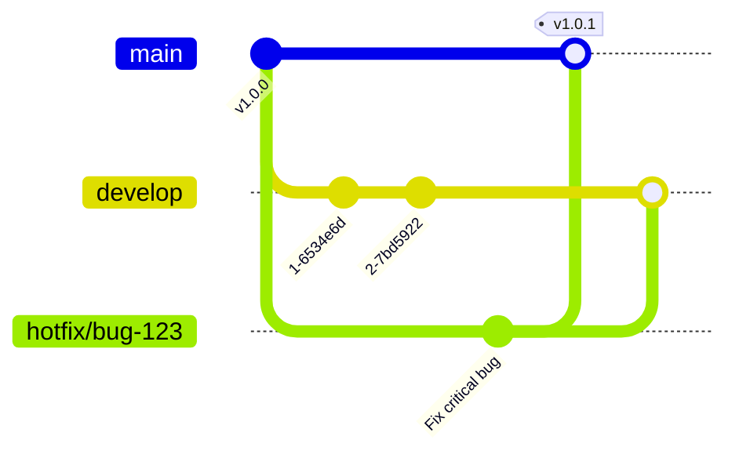

# Git Hotfix Process

## Introduction

In the world of software development, critical bugs sometimes make their way into production environments despite our best efforts to prevent them. When this happens, we need a way to quickly fix these issues without disrupting the normal development workflow. This is where the **Git Hotfix Process** comes into play.

A hotfix is an emergency code change specifically designed to address critical bugs or issues in a production environment. The Git Hotfix Process provides a structured approach to creating, testing, and deploying these urgent fixes while maintaining the integrity of your codebase.

In this guide, we'll explore how hotfixes fit into common Git workflow models, when to use them, and how to implement them effectively.

## When to Use Hotfixes

Hotfixes are appropriate in the following scenarios:

- A critical bug has been discovered in the production environment
- The issue requires immediate attention and cannot wait for the next scheduled release
- You need to make minimal changes to fix the problem without introducing new features

## Hotfix Process Overview

The typical Git hotfix process follows these steps:

1. Create a hotfix branch from the production branch (usually `main` or `master`)
2. Implement the necessary fixes
3. Test the changes thoroughly
4. Merge the hotfix into both the production branch and development branch
5. Tag the production branch with a new version number
6. Deploy the fix to production

Let's visualize this workflow:



## Implementing a Hotfix

Let's walk through a practical example of implementing a hotfix in a typical Git workflow.

### Step 1: Create a Hotfix Branch

First, ensure you're on the production branch and it's up-to-date:

```bash
# Switch to production branch
git checkout main

# Ensure it's updated with the latest changes
git pull origin main
```

Now, create a hotfix branch with a descriptive name:

```bash
git checkout -b hotfix/login-security-issue
```

The naming convention typically follows `hotfix/brief-description` or `hotfix/issue-number`.

### Step 2: Fix the Issue

Make the necessary changes to fix the bug. Remember to keep changes minimal and focused on fixing the specific issue:

```bash
# Edit files to fix the bug
vim src/auth/login.js

# Stage the changes
git add src/auth/login.js

# Commit with a clear message
git commit -m "Fix security vulnerability in login authentication flow"
```

### Step 3: Test Your Changes

Before merging, thoroughly test your changes to ensure they fix the issue without introducing new problems:

```bash
# Run tests
npm test

# Or your specific testing commands
yarn test:unit
yarn test:integration
```

### Step 4: Update the Version Number

For hotfixes, you typically increment the patch version number (following Semantic Versioning):

```bash
# Edit package.json to update version
# Change from 1.2.0 to 1.2.1
vim package.json

# Commit the version change
git add package.json
git commit -m "Bump version to 1.2.1"
```

### Step 5: Merge the Hotfix

First, merge the hotfix into the production branch:

```bash
# Switch to the production branch
git checkout main

# Merge the hotfix branch
git merge --no-ff hotfix/login-security-issue -m "Merge hotfix: Fix login security issue"

# Create a version tag
git tag -a v1.2.1 -m "Version 1.2.1 - Login security hotfix"
```

Then, merge the same hotfix into your development branch:

```bash
# Switch to development branch
git checkout develop

# Merge the hotfix branch
git merge --no-ff hotfix/login-security-issue -m "Merge hotfix: Fix login security issue"
```

### Step 6: Push Changes and Clean Up

Push all changes to the remote repository:

```bash
# Push changes to production branch
git checkout main
git push origin main

# Push the new tag
git push origin v1.2.1

# Push changes to development branch
git checkout develop
git push origin develop

# Delete the hotfix branch (optional)
git branch -d hotfix/login-security-issue
git push origin --delete hotfix/login-security-issue
```

## Real-World Example: Hotfixing a Data Validation Bug

Let's walk through a complete real-world example where we need to hotfix a critical validation bug in a web application that's allowing invalid data to be submitted.

### Scenario

Your production app has a bug where users can submit forms with negative numbers for quantity fields, causing inventory issues. This needs immediate fixing.

### Implementation

**1. Create the hotfix branch:**

```bash
git checkout main
git pull origin main
git checkout -b hotfix/negative-quantity-validation
```

**2. Fix the validation issue:**

```js
// Before: src/components/ProductForm.js
function validateQuantity(value) {
  return Number.isInteger(parseFloat(value));
}

// After: Adding minimum value check
function validateQuantity(value) {
  const quantity = parseFloat(value);
  return Number.isInteger(quantity) && quantity > 0;
}
```

**3. Add a test to verify the fix:**

```js
// test/components/ProductForm.test.js
describe('validateQuantity', () => {
  it('should reject negative values', () => {
    expect(validateQuantity('-5')).toBe(false);
  });
  
  it('should reject zero', () => {
    expect(validateQuantity('0')).toBe(false);
  });
  
  it('should accept positive integers', () => {
    expect(validateQuantity('5')).toBe(true);
  });
});
```

**4. Commit the changes:**

```bash
git add src/components/ProductForm.js test/components/ProductForm.test.js
git commit -m "Fix validation to prevent negative quantity values"
```

**5. Update the version in package.json:**

```bash
# Change version from 2.1.0 to 2.1.1
git add package.json
git commit -m "Bump version to 2.1.1"
```

**6. Merge and deploy:**

```bash
# Merge to main
git checkout main
git merge --no-ff hotfix/negative-quantity-validation -m "Merge hotfix: Prevent negative quantities"
git tag -a v2.1.1 -m "Version 2.1.1 - Fix quantity validation"

# Merge to develop
git checkout develop
git merge --no-ff hotfix/negative-quantity-validation -m "Merge hotfix: Prevent negative quantities"

# Push everything
git checkout main
git push origin main
git push origin v2.1.1
git checkout develop
git push origin develop
```

## Hotfix in Different Git Workflow Models

The hotfix process can vary slightly depending on which Git workflow model you're using:

### 1. In GitFlow

In the GitFlow model, hotfixes are created from the `master`/`main` branch and merged back into both `master`/`main` and `develop` branches, as we've demonstrated above.

### 2. In GitHub Flow

In the simpler GitHub Flow model, hotfixes are just feature branches created from the `main` branch and merged back via pull requests after review.

```bash
git checkout main
git checkout -b hotfix-security-issue
# Make changes, commit
# Create PR, review, and merge
```

### 3. In Trunk-Based Development

In trunk-based development, hotfixes are typically very short-lived branches off the main trunk:

```bash
git checkout main
git checkout -b hotfix-123
# Make minimal changes
# Get quick review
git checkout main
git merge hotfix-123
git push
```

## Best Practices for Hotfixes

To ensure your hotfix process is smooth and effective:

1. **Keep changes minimal**: Fix only what's necessary to address the specific issue
2. **Write comprehensive tests**: Ensure your fix actually solves the problem
3. **Document the issue and fix**: Add comments in the code and update documentation
4. **Follow your versioning strategy**: Usually increment the patch version (e.g., 1.2.0 → 1.2.1)
5. **Have a code review process**: Even with urgent fixes, a second pair of eyes helps
6. **Communicate the fix**: Inform stakeholders about the issue and its resolution

## Common Hotfix Pitfalls to Avoid

1. **Scope creep**: Adding unrelated features or improvements in a hotfix
2. **Skipping tests**: Rushing to deploy without proper testing
3. **Forgetting to merge to all required branches**: Leaving your development branch without the fix
4. **Not updating version numbers**: Making it hard to track which version contains the fix
5. **Insufficient documentation**: Not recording why the hotfix was needed

## Summary

The Git Hotfix Process provides a structured approach to handle critical bugs in production environments. By following a well-defined workflow, you can:

- Quickly address urgent issues without disrupting ongoing development
- Maintain code quality even under pressure
- Keep your production and development branches in sync
- Track and document changes properly through version control

Remember that while hotfixes are necessary in some situations, frequent hotfixes may indicate underlying issues with your development process or testing strategy. Use them when needed, but also analyze the root causes of production bugs to improve your overall development workflow.

## Practice Exercises

1. Set up a sample repository and practice creating a hotfix branch, making changes, and merging it back into both main and development branches.
2. Simulate a hotfix scenario in a team environment, practicing the communication aspects.
3. Create a checklist for your team's hotfix process, customized to your specific workflow and requirements.

## Additional Resources

- [Git Documentation on Branching](https://git-scm.com/book/en/v2/Git-Branching-Branches-in-a-Nutshell)
- [Semantic Versioning Specification](https://semver.org/)
- [Atlassian's Guide to Git Workflows](https://www.atlassian.com/git/tutorials/comparing-workflows)