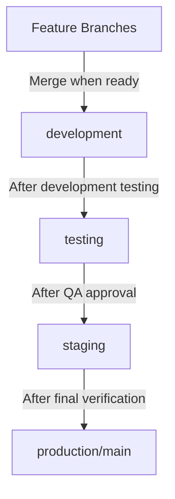

# Git Environment Branches

## Introduction

Environment branches are a powerful concept in Git workflow models that help teams manage code across different deployment environments like development, testing, staging, and production. This approach ensures that code progresses through various validation stages before reaching users, maintaining stability while enabling continuous development.

In this guide, we'll explore how to set up and manage environment branches, their benefits, and best practices for incorporating them into your Git workflow.

## Understanding Environment Branches

Environment branches represent different deployment targets in your application lifecycle. Unlike feature branches that focus on specific functionalities, environment branches act as stable collection points for code at different maturity levels.

### Common Environment Branches

The most typical environment branches include:

- `development` (or `dev`) - Contains code under active development
- `testing` (or `test`) - Used for QA and testing activities
- `staging` - Mirrors the production environment for final verification
- `production` (or `main`/`master`) - Contains code running in production

Each branch represents a progressively more stable version of your codebase.

## Setting Up Environment Branches

Let's walk through creating a basic environment branch structure:

```bash
# Initialize a repository (only needed for new projects)
git init

# Create and switch to the development branch
git checkout -b development

# Create other environment branches
git checkout -b testing
git checkout -b staging

# Typically main/master branch already exists for production
git checkout main
```

## Environment Branches Workflow

Here's how a typical workflow operates with environment branches:



### Step 1: Develop in Feature Branches

Developers work in feature branches created from the development branch:

```bash
# Start from development
git checkout development

# Create a feature branch
git checkout -b feature/new-login-screen

# Work, commit changes...
git add .
git commit -m "Implement new login screen"
```

### Step 2: Merge to Development

When a feature is complete, merge it into the development branch:

```bash
# Switch to development
git checkout development

# Merge the feature
git merge feature/new-login-screen

# Push to remote repository
git push origin development
```

### Step 3: Promote to Testing

After internal development testing, promote changes to the testing branch:

```bash
# Switch to testing
git checkout testing

# Merge from development
git merge development

# Push to remote
git push origin testing
```

### Step 4: Promote to Staging

Once QA approves changes in testing, promote to staging:

```bash
git checkout staging
git merge testing
git push origin staging
```

### Step 5: Deploy to Production

After final verification in staging, deploy to production:

```bash
git checkout main
git merge staging
git push origin main
```

## Git Hooks for Environment Control

You can enforce rules for environment branches using Git hooks. Here's an example pre-push hook that prevents direct pushes to production:

```bash
#!/bin/sh
# .git/hooks/pre-push

protected_branch='main'
current_branch=$(git symbolic-ref HEAD | sed -e 's,.*/\(.*\),\1,')

if [ $current_branch = $protected_branch ]; then
  read -p "You're about to push to $protected_branch, is that what you intended? [y|n] " -n 1 -r < /dev/tty
  echo
  if echo $REPLY | grep -E '^[Yy]$' > /dev/null; then
    exit 0 # push will execute
  fi
  exit 1 # push will not execute
fi
exit 0 # push will execute
```

Save this as `.git/hooks/pre-push` and make it executable with `chmod +x .git/hooks/pre-push`.

## Environment Branch Naming Conventions

Consistency in branch naming helps team members understand the purpose of each branch:

| Pattern | Example | Purpose |
|---------|---------|---------|
| `development` | `development` | Active development code |
| `dev/*` | `dev/v2.0` | Development for specific versions |
| `test/*` | `test/v1.5` | Testing specific versions |
| `staging` | `staging` | Pre-production verification |
| `production` | `production` or `main` | Live code |

## Real-World Example: Web Application Deployment

Let's walk through a practical example of using environment branches for a web application:

### 1. Set Up CI/CD Pipeline Configuration

Create environment-specific configuration files:

```yaml
# ci-cd-config.yml
environments:
  development:
    url: dev.myapp.com
    auto_deploy: true
    
  testing:
    url: test.myapp.com
    auto_deploy: true
    
  staging:
    url: staging.myapp.com
    auto_deploy: false
    require_approval: true
    
  production:
    url: myapp.com
    auto_deploy: false
    require_approval: true
```

### 2. Deploy Based on Branch

Your deployment script uses the branch name to determine the target environment:

```bash
#!/bin/bash
# deploy.sh

BRANCH=$(git rev-parse --abbrev-ref HEAD)

case $BRANCH in
  development)
    echo "Deploying to DEV environment..."
    deploy_to_server dev.myapp.com
    ;;
  testing)
    echo "Deploying to TEST environment..."
    deploy_to_server test.myapp.com
    ;;
  staging)
    echo "Deploying to STAGING environment..."
    deploy_to_server staging.myapp.com
    ;;
  main|master|production)
    echo "Deploying to PRODUCTION environment..."
    deploy_to_server myapp.com
    ;;
  *)
    echo "Unknown branch: $BRANCH"
    exit 1
    ;;
esac
```

## Best Practices for Environment Branches

1. **Keep Production Branch Stable**: Only merge well-tested code into production.

2. **Automate Deployments**: Set up CI/CD pipelines to automatically deploy to each environment.

3. **Use Protection Rules**: Prevent direct commits to environment branches, especially production.

4. **Regular Synchronization**: Regularly sync changes upstream to avoid divergence.

5. **Environment-Specific Configs**: Use different configuration files for different environments:

```bash
# Deploy with environment-specific config
if [ "$BRANCH" = "production" ]; then
  cp config.production.json config.json
elif [ "$BRANCH" = "staging" ]; then
  cp config.staging.json config.json
else
  cp config.development.json config.json
fi
```

6. **Tagging Releases**: Tag production deployments for better traceability:

```bash
# After merging to production
git checkout main
git tag -a v1.2.3 -m "Release version 1.2.3"
git push origin v1.2.3
```

## Common Challenges and Solutions

### Challenge: Hotfixes for Production

Sometimes you need to fix critical issues directly in production without going through the entire workflow.

**Solution**: Use hotfix branches from production:

```bash
# Create hotfix branch from production
git checkout main
git checkout -b hotfix/critical-bug

# Make fixes and commit
git add .
git commit -m "Fix critical production issue"

# Merge directly to production
git checkout main
git merge hotfix/critical-bug
git push origin main

# Don't forget to merge back to lower environments
git checkout development
git merge hotfix/critical-bug
git push origin development
```

### Challenge: Environment Drift

Lower environments can fall behind higher ones when hotfixes are applied directly to production.

**Solution**: Regular downstream synchronization:

```bash
# After hotfix to production, sync downstream
git checkout staging
git merge main
git push origin staging

git checkout testing
git merge staging
git push origin testing

git checkout development
git merge testing
git push origin development
```

## Summary

Environment branches provide a structured approach to managing code across different deployment stages. They help ensure code quality by promoting changes through progressively more stable environments before reaching users.

By adopting environment branches, you can:
- Maintain stability in production
- Enable continuous development
- Implement proper testing phases
- Enforce quality gates
- Support automation through CI/CD

Whether you're working on a small project or within a large team, environment branches can be adapted to fit your specific needs and deployment processes.

## Exercises and Practice

1. **Basic Setup**: Create a repository with the four main environment branches and practice merging changes through them.

2. **Protection Rules**: Set up branch protection rules in GitHub/GitLab for your environment branches.

3. **CI/CD Integration**: Configure a simple CI/CD pipeline that deploys to different environments based on the branch.

4. **Hotfix Simulation**: Practice creating and applying a hotfix to production, then synchronizing it back to lower environments.

5. **Documentation**: Create documentation for your team explaining your environment branch strategy and workflow.

## Further Reading

- Git Branching Strategies
- GitFlow Workflow
- Trunk-Based Development
- Continuous Integration and Deployment
- Feature Flags for Environment Control