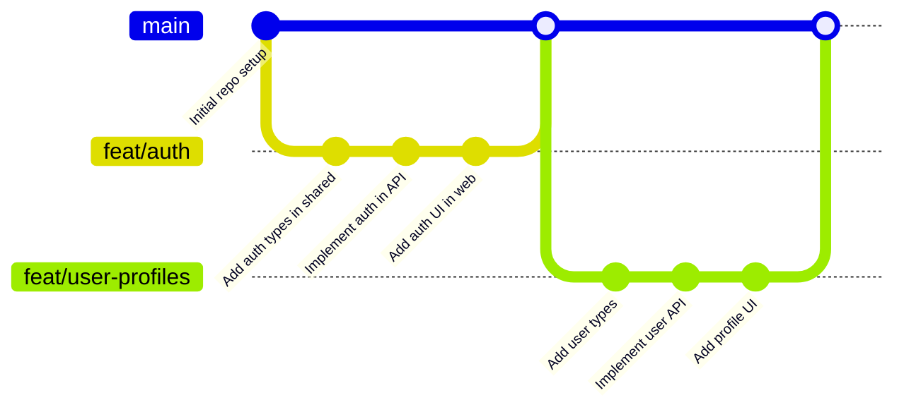

# Git Monorepo

## Introduction

A Git monorepo (short for "monolithic repository") is a version control strategy where multiple projects or components are stored in a single repository instead of being split across multiple repositories. This approach offers several advantages for managing related codebases, especially for projects that share dependencies or have tight integration requirements.

In this guide, we'll explore the concept of monorepos, understand their benefits and challenges, and learn how to implement a monorepo workflow using Git.

## What is a Monorepo?

A monorepo is a single repository that contains multiple distinct projects, libraries, or applications, along with their related assets and documentation. These projects might be related parts of a larger system, or they could be entirely separate products that share some common code or tooling.

### Monorepo vs. Multi-repo

Before diving deeper, let's compare monorepos with the alternative approach - multiple repositories (multi-repo):

| Characteristic | Monorepo | Multi-repo |
|----------------|----------|------------|
| Structure | All projects in one repository | Each project has its own repository |
| Code sharing | Direct access to shared code | Package management systems required |
| Dependency management | Centralized | Distributed |
| Atomic changes | Possible across projects | Requires coordination across repos |
| CI/CD complexity | Higher initial setup | Simpler per project |
| Team organization | Works well for cross-functional teams | Works well for independent teams |

## Benefits of Git Monorepos

Monorepos offer several advantages that make them popular among both small teams and large organizations:

1. **Unified versioning**: All code lives at a single version, making it easier to track the state of the entire system.

2. **Simplified dependency management**: Shared libraries exist in the same repository, eliminating complex dependency management between repositories.

3. **Atomic changes**: You can make changes across multiple projects in a single commit, ensuring that interdependent changes are always in sync.

4. **Code sharing and reuse**: Developers can easily share and reuse code across projects without publishing packages.

5. **Visibility**: Team members can see and understand the entire codebase, fostering collaboration and knowledge sharing.

6. **Consistent tooling**: Build tools, linters, and test suites can be standardized across all projects.

## Challenges of Git Monorepos

While monorepos have many benefits, they also present unique challenges:

1. **Repository size**: As more projects are added, the repository can grow very large, potentially slowing down Git operations.

2. **Build complexity**: Building and testing all projects can become resource-intensive.

3. **Access control**: Granular permission management can be more difficult.

4. **Learning curve**: The codebase can be overwhelming for new team members.

## Setting Up a Git Monorepo

Let's walk through setting up a basic monorepo structure. We'll create a repository with three projects: a backend API, a frontend web application, and a shared utilities library.

### Basic Structure

A common pattern for organizing a monorepo is to use a `packages` or `projects` directory at the root level:

```bash
# Create the repository
mkdir my-monorepo
cd my-monorepo
git init

# Create the basic structure
mkdir -p packages/{api,web,shared}
touch README.md
```

After running these commands, your directory structure should look like this:

```
my-monorepo/
├── packages/
│   ├── api/
│   ├── web/
│   └── shared/
└── README.md
```

### Project Setup

Now, let's set up each project with its own package.json file:

```bash
# Set up the API project
cd packages/api
npm init -y
echo "# API Service" > README.md
mkdir src
touch src/index.js

# Set up the Web project
cd ../web
npm init -y
echo "# Web Application" > README.md
mkdir src
touch src/index.js

# Set up the Shared utilities
cd ../shared
npm init -y
echo "# Shared Utilities" > README.md
mkdir src
touch src/utils.js

# Return to the root
cd ../../
```

### Root Package.json

It's common to have a root-level package.json to manage workspace-wide dependencies and scripts:

```bash
# Create root package.json
npm init -y
```

Then edit the package.json to include workspace information:

```json
{
  "name": "my-monorepo",
  "version": "1.0.0",
  "description": "A monorepo example with multiple packages",
  "private": true,
  "workspaces": [
    "packages/*"
  ],
  "scripts": {
    "test": "echo \"Error: no test specified\" && exit 1"
  },
  "keywords": [],
  "author": "",
  "license": "ISC"
}
```

### Initial Commit

Let's make our first commit to the repository:

```bash
git add .
git commit -m "Initial monorepo setup with api, web, and shared packages"
```

## Managing Dependencies in a Monorepo

In a monorepo, you'll often have dependencies between your projects. For example, both your API and web application might use code from the shared utilities.

### Local Dependencies with Workspaces

Using npm workspaces (or Yarn workspaces), you can reference local packages as dependencies:

```bash
# Navigate to the API project
cd packages/api

# Add the shared package as a dependency
npm install @my-monorepo/shared@1.0.0
```

For this to work, you need to update the package.json files with appropriate names:

```json
// packages/shared/package.json
{
  "name": "@my-monorepo/shared",
  "version": "1.0.0",
  // ... other fields
}

// packages/api/package.json
{
  "name": "@my-monorepo/api",
  "version": "1.0.0",
  "dependencies": {
    "@my-monorepo/shared": "1.0.0"
  }
  // ... other fields
}

// packages/web/package.json
{
  "name": "@my-monorepo/web",
  "version": "1.0.0",
  "dependencies": {
    "@my-monorepo/shared": "1.0.0"
  }
  // ... other fields
}
```

## Monorepo Tools

Several tools can help manage monorepos effectively:

1. **Lerna**: A tool for managing JavaScript/TypeScript monorepos with multiple packages.
2. **Nx**: A set of extensible dev tools for monorepos, with a focus on scalability.
3. **Rush**: Microsoft's scalable monorepo manager for JavaScript/TypeScript.
4. **Turborepo**: A high-performance build system for JavaScript/TypeScript monorepos.

### Example: Using Lerna

Let's see how to set up Lerna in our monorepo:

```bash
# Install Lerna globally
npm install -g lerna

# Initialize Lerna in your monorepo
cd my-monorepo
npx lerna init

# This creates a lerna.json file
```

Edit the lerna.json file:

```json
{
  "packages": ["packages/*"],
  "version": "independent",
  "npmClient": "npm",
  "useWorkspaces": true
}
```

Now you can use Lerna commands to manage your monorepo:

```bash
# Run a script in all packages
npx lerna run test

# Run npm install for all packages
npx lerna bootstrap

# Create a new version for changed packages
npx lerna version

# Publish packages that have changed
npx lerna publish
```

## Workflow in a Git Monorepo

Working in a monorepo requires some adjustments to your typical Git workflow. Here's a common workflow pattern:

### 1. Feature Development

```bash
# Create a feature branch
git checkout -b feat/user-authentication

# Make changes in multiple packages
echo "function authenticate() { return true; }" > packages/shared/src/auth.js
echo "const auth = require('../shared/src/auth');" > packages/api/src/auth-service.js

# Commit all changes together
git add .
git commit -m "Add user authentication across api and shared"
```

### 2. Testing Across Projects

One advantage of monorepos is the ability to test changes across multiple projects:

```bash
# Test all affected packages
npx lerna run test --since=main

# Or with npm workspaces
npm test -ws
```

### 3. Submitting Changes

When you submit a pull request, it can include changes to multiple projects, but reviewers can see all changes together:

```bash
git push origin feat/user-authentication
# Then create a PR on GitHub/GitLab/etc.
```

## Managing Monorepo Size and Performance

As your monorepo grows, you might encounter performance issues. Here are some strategies to address them:

### 1. Git Sparse Checkout

For large monorepos, developers might only need to work with a subset of projects:

```bash
# Enable sparse checkout
git config --local core.sparseCheckout true

# Specify which directories to check out
echo "packages/api/" > .git/info/sparse-checkout
echo "packages/shared/" >> .git/info/sparse-checkout

# Update your working directory
git read-tree -mu HEAD
```

### 2. Git LFS (Large File Storage)

For binary assets or large files:

```bash
# Install Git LFS
git lfs install

# Track large file types
git lfs track "*.zip"
git lfs track "*.png"

# Commit the .gitattributes file
git add .gitattributes
git commit -m "Configure Git LFS"
```

### 3. Shallow Clones

For CI/CD pipelines that don't need the full history:

```bash
git clone --depth=1 https://github.com/username/my-monorepo.git
```

## Real-world Example: Building a Full-stack Application

Let's look at a practical example of using a monorepo for a full-stack application with shared types between frontend and backend.

### 1. Create the Types Package

First, let's create a package for shared TypeScript types:

```bash
mkdir -p packages/types/src
touch packages/types/package.json
touch packages/types/src/index.ts
```

In `packages/types/package.json`:

```json
{
  "name": "@my-app/types",
  "version": "1.0.0",
  "main": "dist/index.js",
  "types": "dist/index.d.ts",
  "scripts": {
    "build": "tsc"
  },
  "devDependencies": {
    "typescript": "^4.9.5"
  }
}
```

In `packages/types/src/index.ts`:

```typescript
export interface User {
  id: string;
  name: string;
  email: string;
}

export interface AuthResponse {
  user: User;
  token: string;
}
```

### 2. Reference Types in Backend

Now, let's use these types in our API:

```bash
cd packages/api
npm install --save-dev typescript @types/node
npm install --save @my-app/types
```

In `packages/api/src/index.ts`:

```typescript
import { User, AuthResponse } from '@my-app/types';

const getUser = (): User => {
  return {
    id: '1',
    name: 'John Doe',
    email: 'john@example.com'
  };
};

const authenticate = (email: string, password: string): AuthResponse => {
  const user = getUser();
  return {
    user,
    token: 'jwt-token-example'
  };
};

console.log(authenticate('john@example.com', 'password'));
```

### 3. Reference Types in Frontend

Similarly, let's use the same types in our frontend:

```bash
cd packages/web
npm install --save-dev typescript
npm install --save @my-app/types
```

In `packages/web/src/index.ts`:

```typescript
import { User, AuthResponse } from '@my-app/types';

async function login(email: string, password: string): Promise<User> {
  const response = await fetch('/api/login', {
    method: 'POST',
    headers: { 'Content-Type': 'application/json' },
    body: JSON.stringify({ email, password })
  });
  
  const data: AuthResponse = await response.json();
  
  // We know the exact shape of the response thanks to shared types
  localStorage.setItem('token', data.token);
  return data.user;
}

// Usage example
async function handleLogin() {
  try {
    const user = await login('john@example.com', 'password');
    console.log(`Logged in as ${user.name}`);
  } catch (error) {
    console.error('Login failed', error);
  }
}
```

### 4. Building the Entire Application

With a monorepo, you can build all packages with proper dependency order:

```bash
# With Lerna
npx lerna run build

# Or with npm workspaces
npm run build --workspaces
```

This ensures that the `types` package is built before the `api` and `web` packages that depend on it.

## Git Workflows for Monorepos

### Branch Organization

In a monorepo, you need to decide how to organize your branches. Here are common approaches:

#### 1. Feature Branches

Create branches for features that might span multiple packages:

```bash
git checkout -b feature/user-profiles
# Make changes to API, web, and shared packages
git commit -am "Implement user profiles across platform"
```

#### 2. Package-specific Branches

For changes isolated to a single package:

```bash
git checkout -b api/fix-auth-bug
# Make changes only to the API package
git commit -am "Fix authentication bug in API"
```

### Visual Representation of Monorepo Workflow

Here's a diagram showing a typical Git workflow in a monorepo:



## Best Practices for Git Monorepos

To make the most of your monorepo, follow these best practices:

1. **Clear organization**: Establish a consistent directory structure and naming conventions.

2. **Comprehensive documentation**: Document the overall repository structure and individual project relationships.

3. **Automated testing**: Set up CI/CD to test affected packages when changes are made.

4. **Selective building**: Only build and test the packages that have changed or are affected by changes.

5. **Branch management**: Consider using feature flags for long-running changes.

6. **Codeowners file**: Use GitHub's CODEOWNERS or similar features to specify owners for different parts of the monorepo.

7. **Enforce consistency**: Use linting and formatting tools across all projects.

## Example: CODEOWNERS File

In your repository, create a `.github/CODEOWNERS` file:

```
# Default owners for everything
* @lead-developer

# API package owners
packages/api/ @backend-team @api-lead

# Web package owners
packages/web/ @frontend-team @web-lead

# Shared utilities owners
packages/shared/ @core-team @lead-developer
```

## When to Use a Monorepo

Monorepos are particularly beneficial in certain scenarios:

### Good Fit for Monorepos

1. Teams working on tightly integrated products
2. Projects with significant shared code
3. Organizations that prioritize code reuse and standardization
4. Projects with interdependent releases

### Less Ideal for Monorepos

1. Completely independent projects with no shared code
2. Teams with very different development workflows
3. Open-source projects where you want to limit contributor scope
4. Very large teams with thousands of developers (without specialized tooling)

## Summary

Git monorepos provide a powerful workflow model for managing multiple related projects in a single repository. They offer advantages in code sharing, atomic changes, and versioning consistency, but come with challenges related to repository size and build complexity.

By following the best practices and using appropriate tools like Lerna, Nx, or Turborepo, you can create an efficient development workflow that scales with your project's needs.

The monorepo approach is particularly valuable for full-stack applications, design systems, or any ecosystem of related packages where you want to ensure consistency and enable rapid development across components.

## Additional Resources

To deepen your understanding of Git monorepos, explore these resources:

- [Lerna Documentation](https://github.com/lerna/lerna)
- [Nx Documentation](https://nx.dev/getting-started/intro)
- [Git Submodules vs. Monorepos](https://www.git-tower.com/learn/git/ebook/en/command-line/advanced-topics/submodules)
- [Google's Monorepo Approach](https://research.google/pubs/pub45424/)

## Exercises

1. Create a simple monorepo with three packages: a library, an API that uses the library, and a frontend that consumes the API.

2. Set up a CI/CD pipeline that only builds and tests packages affected by changes.

3. Implement a feature that requires changes across multiple packages and make an atomic commit.

4. Configure a monorepo using a different tool than demonstrated (e.g., if we showed Lerna, try Nx or Turborepo).

5. Create a script that generates a dependency graph of your monorepo packages.