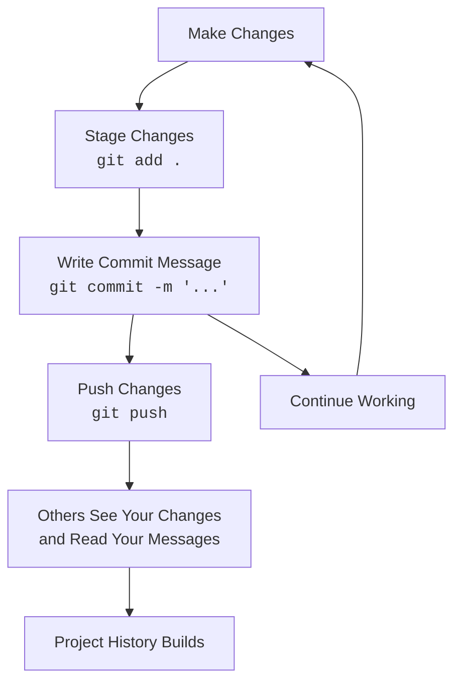

# Git Commit Messages

## Introduction

Commit messages are a vital but often overlooked aspect of working with Git. Think of commit messages as notes you leave for yourself and others explaining what changes you made and why. Good commit messages make it easier to:

- Understand the project's history
- Debug issues
- Collaborate with team members
- Make future changes confidently

In this guide, we'll learn how to write clear, effective commit messages that will make your development workflow smoother and more professional.

## The Anatomy of a Commit Message

A good commit message typically consists of two parts:

1. **Subject line**: A brief summary (50 characters or less)
2. **Description**: An optional, more detailed explanation

Here's the basic structure:

```bash
Subject line (50 chars or less)

More detailed explanation if needed. Wrap lines at
about 72 characters. The blank line separating the
subject from the body is critical.

- Bullet points are fine
- Use a hyphen or asterisk followed by a space

Relates to: #123
```

## Writing an Effective Subject Line

The subject line is the most important part of your commit message. It should be:

### 1. Concise (50 characters or less)

```bash
# Good
git commit -m "Fix login button on mobile devices"

# Not so good
git commit -m "Fixed the login button that wasn't working properly on mobile devices because of a CSS issue with the media queries"
```

### 2. Written in imperative mood

Write as if you're giving a command or instruction:

```bash
# Good (imperative)
git commit -m "Add user authentication feature"

# Not so good (past tense)
git commit -m "Added user authentication feature"
```

The imperative mood makes sense because a commit is essentially completing this sentence: "If applied, this commit will _____________".

### 3. Start with a capital letter

```bash
# Good
git commit -m "Fix navigation menu bug"

# Not so good
git commit -m "fix navigation menu bug"
```

### 4. No period at the end

```bash
# Good
git commit -m "Update user profile UI"

# Not so good
git commit -m "Update user profile UI."
```

## When to Include a Description

For simple changes, a subject line might be sufficient. However, for complex changes, add a description that explains:

- Why the change was necessary
- How it addresses the issue
- Any side effects or implications

To include a description, use the `-m` flag twice or omit it to open an editor:

```bash
# Using multiple -m flags
git commit -m "Add password reset functionality" -m "This implements the password reset flow including email notifications, token generation, and new password validation."

# Or omit -m to open the configured editor
git commit
```

## Commit Message Prefixes

A popular convention is to prefix commit messages with a category:

```
feat: Add user registration (new feature)
fix: Correct email validation logic (bug fix)
docs: Update installation instructions (documentation)
style: Format code according to style guide (formatting)
refactor: Simplify authentication logic (code refactoring)
test: Add tests for payment processing (adding tests)
chore: Update dependencies (maintenance tasks)
```

This convention, known as "Conventional Commits," makes it easier to categorize changes and can even automate release notes.

## Real-World Examples

Let's look at some practical examples:

### Example 1: Simple bug fix

```bash
git commit -m "Fix login button not working on Safari"
```

### Example 2: New feature with description

```bash
git commit -m "Add password strength indicator" -m "Implements a visual indicator that shows password strength in real-time as the user types. Uses zxcvbn library for strength calculation and updates UI with appropriate colors and messages."
```

### Example 3: Refactoring with conventional commit format

```bash
git commit -m "refactor: Simplify user authentication flow" -m "Reduces the authentication process from 5 steps to 3 by combining related operations. This improves performance and reduces code complexity while maintaining the same security level."
```

## Best Practices

### 1. Keep commits focused

Each commit should represent a single logical change. This makes it easier to:
- Understand the commit's purpose
- Revert changes if necessary
- Cherry-pick specific changes

```bash
# Not so good: Mixing unrelated changes
git commit -m "Fix login bug and update footer design"

# Better: Separate commits for unrelated changes
git commit -m "Fix login validation bug"
git commit -m "Update footer design with new branding"
```

### 2. Reference issue tracking numbers

If you use an issue tracker (like GitHub Issues or Jira), reference relevant issue numbers:

```bash
git commit -m "Fix dropdown menu on mobile devices (closes #42)"
```

### 3. Explain the "why", not just the "what"

The diff already shows what changed. Your message should explain why:

```bash
# Just the what
git commit -m "Change timeout from 30s to 60s"

# The what and why
git commit -m "Increase API timeout to 60s" -m "The external payment service has been experiencing latency issues, causing our 30s timeout to fail during peak hours."
```

### 4. Be consistent within your team

Follow your team's conventions. Many teams adopt established patterns like:
- [Conventional Commits](https://www.conventionalcommits.org/)
- [Angular's commit message format](https://github.com/angular/angular/blob/master/CONTRIBUTING.md#commit)
- [GitHub's guidelines](https://github.blog/2022-06-30-write-better-commits-build-better-projects/)

## Common Workflow Diagram

Here's a visualization of how commit messages fit into the Git workflow:



## Tools for Better Commit Messages

Several tools can help enforce good commit message practices:

1. **Git hooks**: Automatically check commit message format
2. **Commitizen**: A command-line tool that guides you through writing commits
3. **commitlint**: Lints commit messages against rules

Example of setting up a simple Git hook to validate commit messages:

```bash
# .git/hooks/commit-msg (make sure it's executable)
#!/bin/sh
commit_msg=$(cat "$1")
if [ ${#commit_msg} -lt 10 ]; then
    echo "Commit message too short (minimum 10 characters)"
    exit 1
fi
exit 0
```

## Learning from Project History

One of the best ways to understand the value of good commit messages is to explore the history of well-maintained projects.

Try running these commands on your favorite repository:

```bash
# View commit history
git log

# View commit history with a graph
git log --graph --oneline --decorate

# View history for a specific file
git log --follow -p -- path/to/file
```

Notice how informative (or not) the commit messages are.

## Summary

Good commit messages are essential for maintaining a healthy, collaborative codebase. Remember these key points:

- Write a concise, informative subject line (50 chars or less)
- Use the imperative mood ("Add feature" not "Added feature")
- When needed, provide details in a descriptive body
- Focus each commit on a single logical change
- Explain why you made the change, not just what you changed
- Reference issue numbers when applicable
- Be consistent with your team's conventions

By investing a little time in writing better commit messages, you'll create a more valuable project history that helps your team (and your future self) understand the evolution of your code.

## Exercise

1. Look at the last 10 commits in a project you're working on. How many of them follow the guidelines in this article?
2. Choose a commit with a vague message. Rewrite it following the best practices.
3. Set up a template for your commit messages using `git config --global commit.template ~/.gitmessage`

## Additional Resources

- [How to Write a Git Commit Message](https://chris.beams.io/posts/git-commit/)
- [Conventional Commits](https://www.conventionalcommits.org/)
- [Git Book - Recording Changes](https://git-scm.com/book/en/v2/Git-Basics-Recording-Changes-to-the-Repository)