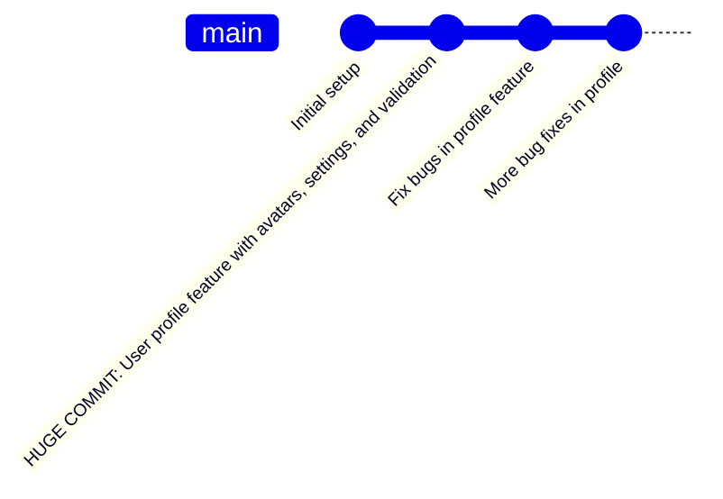
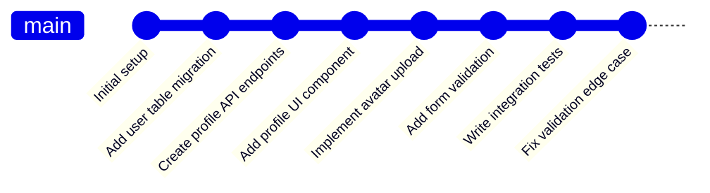

# Git Atomic Commits

## Introduction

When working with Git, the way you structure your commits can significantly impact how maintainable and understandable your project's history becomes. **Atomic commits** are one of the most important Git best practices that can elevate your version control workflow.

An atomic commit is a commit that includes changes related to only one feature, fix, or improvement. Think of it as the smallest possible unit of meaningful change to your codebase. By making your commits atomic, you create a cleaner, more navigable project history that will benefit both you and your collaborators.

## What Are Atomic Commits?

The term "atomic" comes from the word "atom," which historically was thought to be the smallest, indivisible unit of matter. Similarly, an atomic commit should be:

1. **Focused on a single change** - Each commit addresses one logical change
2. **Complete** - The change is fully implemented within the commit
3. **Buildable/testable** - The code should build or pass tests after each commit
4. **Independent** - The commit can be understood without requiring knowledge of other commits

## Why Use Atomic Commits?

### Benefits of Atomic Commits

- **Clearer project history** - Each commit tells a specific, understandable story
- **Easier code reviews** - Reviewers can focus on one logical change at a time
- **Simpler debugging** - When bugs appear, `git bisect` becomes much more effective
- **Smooth collaboration** - Reduces merge conflicts and makes them easier to resolve
- **Enables selective reverting** - You can revert specific changes without affecting others
- **Facilitates cherry-picking** - Makes it easy to apply specific commits to other branches

## How to Write Atomic Commits

### Step 1: Plan Your Changes

Before you start coding, think about what you're going to change and how to divide it into logical, atomic units. This might mean:

- Fixing one specific bug
- Adding one new feature
- Refactoring one component
- Updating documentation for one section

### Step 2: Make Small, Focused Changes

Work on one logical change at a time. If you find yourself making unrelated changes, consider using Git's staging area to split them into separate commits.

### Step 3: Review Your Changes Before Committing

Use `git diff` to review your changes before staging them:

```bash
git diff
```

This helps ensure your changes are focused on a single concern.

### Step 4: Stage Changes Carefully

Instead of using `git add .` which adds all changes, be selective:

```bash
git add path/to/changed/file.js
```

You can even stage parts of files using the interactive mode:

```bash
git add -p
```

This allows you to review each change and decide whether to include it in the current commit.

### Step 5: Write Clear Commit Messages

A good atomic commit needs a good commit message. Follow this structure:

```
Short summary (50 chars or less)

More detailed explanation if needed. Wrap it to about 72
characters. Explain the "what" and "why" of the change, not
the "how".

- List specific key points if helpful
- Reference related issues or tickets [#123]
```

Example of a good commit message:

```
Add email validation to user registration form

- Implement regex pattern for email format checking
- Add helpful error message for invalid emails
- Ensure validation happens before form submission

Fixes #42
```

## Real-World Examples

Let's look at a practical example of atomic commits in action:

### Non-Atomic Approach (Avoid This)

Imagine you're working on a user profile feature and you make all these changes in one large commit:

```
commit abc123
Author: Developer Name
Date: Tue Apr 5 14:32:21 2023

Add user profile feature with settings and avatar upload
```

This single commit might include:
- Database schema changes
- New API endpoints
- UI components
- Image upload functionality
- Form validation
- Tests for all the above

### Atomic Approach (Recommended)

The same work split into atomic commits:

```
commit 111aaa
Author: Developer Name
Date: Tue Apr 5 10:15:33 2023

Add user table migration for profile data

commit 222bbb
Author: Developer Name
Date: Tue Apr 5 11:22:45 2023

Create API endpoints for profile data retrieval

commit 333ccc
Author: Developer Name
Date: Tue Apr 5 12:08:17 2023

Implement basic profile information UI component

commit 444ddd
Author: Developer Name
Date: Tue Apr 5 13:15:42 2023

Add avatar upload functionality to profile page

commit 555eee
Author: Developer Name
Date: Tue Apr 5 14:02:39 2023

Implement form validation for profile data

commit 666fff
Author: Developer Name
Date: Tue Apr 5 14:32:21 2023

Add integration tests for profile feature
```

## Visualizing Atomic vs. Non-Atomic Commits

Let's visualize the difference between atomic and non-atomic commits:



Versus atomic commits:



## Common Challenges and Solutions

### "I've Made Multiple Changes Already"

If you've already made multiple changes before committing, you can still create atomic commits using Git's staging capabilities:

1. Use `git add -p` to interactively select changes
2. Commit the first logical group of changes
3. Repeat until all changes are committed

### "My Change Is Too Big to Be Atomic"

If a change feels too big, that's a sign it should be broken down further:

1. Identify natural dividing points in your change
2. Consider whether some preparatory changes (like refactoring) should be separate commits
3. Use feature branches to keep work organized

### "I Need to Fix Something in an Earlier Commit"

Use `git commit --amend` for the most recent commit, or `git rebase -i` for older commits (only if you haven't pushed your changes yet).

## Best Practices for Atomic Commits

1. **Commit early and often** - Don't wait until you've made many changes
2. **Use descriptive messages** - Make your commit messages clear and informative
3. **Keep logical changes together** - Group related changes in the same commit
4. **Separate different types of changes** - Don't mix refactoring with feature additions
5. **Ensure the code works after each commit** - Your tests should pass

## When to Make Exceptions

While atomic commits are generally the best practice, there are situations where you might deviate:

- **Initial project setup** - The first commit might include multiple files to establish the foundation
- **Major refactoring** - Some large-scale changes are difficult to break down
- **Emergency hotfixes** - Critical issues might require faster, less structured fixes

However, even in these cases, try to keep your commits as focused as possible.

## Summary

Atomic commits are a fundamental Git best practice that improves your project's history and makes collaboration smoother. By making each commit focus on a single logical change, you create a clearer history that is easier to understand, debug, and maintain.

Remember these key points:
- Each commit should focus on one logical change
- Write clear, descriptive commit messages
- Use Git's staging area to create focused commits
- Ensure the code works after each commit
- Review your changes before committing

By adopting atomic commits, you'll not only improve your own Git workflow but also make life easier for everyone who works with your code.

## Practice Exercises

1. Take an existing project and analyze its commit history. Identify commits that aren't atomic and consider how they could be improved.

2. For your next feature, plan out the atomic commits you'll make before you start coding.

3. Practice using `git add -p` to stage only specific changes from a file.

4. Try using `git bisect` on a repository with atomic commits to see how it helps pinpoint when a bug was introduced.

## Additional Resources

- [Git documentation on commit guidelines](https://git-scm.com/book/en/v2/Distributed-Git-Contributing-to-a-Project)
- [Pro Git book, available online](https://git-scm.com/book)
- [Conventional Commits specification](https://www.conventionalcommits.org/) - A convention for creating clear commit messages