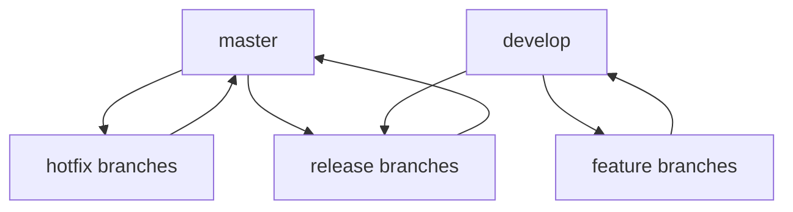
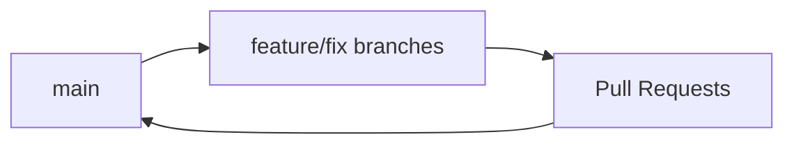
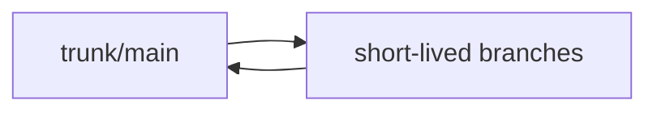

# Git Style Guides

## Introduction

When working with Git, especially in a team environment, consistency is key to maintaining a clean, readable, and manageable repository. Git style guides are sets of conventions and rules that define how you should format commit messages, name branches, structure workflows, and manage your repository. Just as code style guides help maintain readable code, Git style guides ensure your version control history remains clear, searchable, and useful.

In this guide, we'll explore the components of an effective Git style guide, provide examples you can adopt or adapt for your projects, and explain how implementing these practices can improve collaboration and project maintainability.

## Why You Need a Git Style Guide

Before diving into specific conventions, let's understand why a Git style guide matters:

- **Readability**: Well-formatted commit messages and branch names make it easier to understand the history and purpose of changes
- **Searchability**: Consistent conventions make it easier to find specific commits or branches
- **Onboarding**: New team members can quickly understand your workflows and patterns
- **Automation**: Consistent patterns enable automated tools for changelog generation, release management, and more
- **Quality**: Encourages thoughtful commits and branch organization

## Key Components of a Git Style Guide

### 1. Commit Message Conventions

Commit messages are perhaps the most important element to standardize. They serve as permanent documentation of your changes and intentions.

#### The Conventional Commits Format

One popular standard is [Conventional Commits](https://www.conventionalcommits.org/), which follows this structure:

```
<type>[optional scope]: <description>

[optional body]

[optional footer(s)]
```

Common types include:

- `feat`: A new feature
- `fix`: A bug fix
- `docs`: Documentation changes
- `style`: Code style changes (formatting, semicolons, etc.)
- `refactor`: Code changes that neither fix bugs nor add features
- `test`: Adding or correcting tests
- `chore`: Changes to the build process, tools, etc.

**Example of good commit messages:**

```
feat(authentication): implement JWT token refresh

Add automatic token refresh to prevent session timeouts.

Fixes #123
```

```
fix(navbar): correct dropdown menu position on mobile devices

The dropdown was appearing off-screen on devices narrower than 380px.
```

#### Benefits of Standardized Commit Messages

When commit messages follow a pattern:

1. Automated tools can generate changelogs
2. Semantic versioning can be automated
3. Filtering commit history becomes more powerful
4. Understanding the purpose of changes becomes easier

### 2. Branch Naming Conventions

Branch names should clearly communicate purpose and ownership. A common pattern is:

```
<type>/<description-or-issue-number>
```

**Examples:**

```
feature/user-authentication
fix/login-button-alignment
docs/api-endpoints
refactor/database-queries
```

For branches linked to specific issues:

```
feature/GH-123-user-login
bugfix/JIRA-456-password-reset
```

### 3. Git Workflow Guidelines

Your style guide should define which Git workflow the team follows. Common models include:

#### GitFlow



#### GitHub Flow



#### Trunk-Based Development



Your guide should specify:

- Which branches are protected
- How code reviews are conducted
- When and how to merge
- How releases are tagged

### 4. Pull Request/Merge Request Conventions

Define standards for PRs including:

#### PR Title Format

```
<type>: <short summary>
```

#### PR Description Template

```
## Description
Brief description of changes

## Changes
- Change 1
- Change 2

## Screenshots
(if UI changes)

## Testing
Steps to test these changes

## Checklist
- [ ] Tests
- [ ] Documentation
- [ ] Performance considerations
```

### 5. Tagging and Release Conventions

Define how releases should be tagged:

```
v<major>.<minor>.<patch>
```

For example: `v1.4.2`

For pre-releases:
```
v1.5.0-beta.1
v2.0.0-rc.2
```

## Implementing a Git Style Guide

### Step 1: Create Your Guide Document

Start by documenting your chosen conventions. Your document should cover:

1. Commit message format
2. Branch naming
3. Workflow explanation
4. PR/MR process
5. Tagging/release process

### Step 2: Enforce Conventions Automatically

Set up tools to enforce your style guide:

**Commit Message Validation:**

You can use Git hooks to validate commit messages. Create a `.git/hooks/commit-msg` file:

```bash
#!/bin/sh
# Example commit hook that enforces Conventional Commits format

commit_msg=$(cat "$1")
commit_pattern='^(feat|fix|docs|style|refactor|test|chore)(\([a-z0-9-]+\))?: .+$'

if ! echo "$commit_msg" | head -1 | grep -qE "$commit_pattern"; then
  echo "Error: Commit message does not follow the Conventional Commits standard"
  echo "Example: feat(component): add new feature"
  exit 1
fi
```

**Branch Name Validation:**

Create a `.git/hooks/pre-push` hook:

```bash
#!/bin/sh
# Example hook that enforces branch naming conventions

branch_name=$(git symbolic-ref --short HEAD)
branch_pattern='^(feature|fix|docs|refactor|chore)/[a-z0-9-]+$'

if ! echo "$branch_name" | grep -qE "$branch_pattern"; then
  echo "Error: Branch name does not follow the naming convention"
  echo "Example: feature/user-authentication"
  exit 1
fi
```

### Step 3: Integrate with CI/CD

Configure your CI/CD pipeline to validate commit messages and branch names. Many CI/CD platforms offer pre-made actions or steps for this purpose.

## Real-World Examples

### Example 1: A Small Team Project

Let's look at a practical example for a small development team:

**Commit Messages:**

```
feat: add user registration form
fix: correct email validation pattern
docs: update README with setup instructions
```

**Branch Structure:**

```
main           # production code
develop        # integration branch
feature/login  # feature branch
fix/email      # bugfix branch
```

**Workflow:**

1. Create feature branch from `develop`
2. Make changes and commit with descriptive messages
3. Open PR to merge back to `develop`
4. After testing, merge `develop` to `main` for release

### Example 2: An Open Source Project

For an open source project, you might use:

**Commit Messages:**

```
feat(api): add new endpoint for user preferences
fix(ui): resolve contrast issues in dark mode
docs(contributing): clarify PR process
```

**Branch Structure:**

```
main              # stable release branch
develop           # development branch
feature/GH-123    # feature tied to GitHub issue
```

## Common Git Style Guide Mistakes to Avoid

1. **Overly complex rules** that are hard to remember and follow
2. **Lack of enforcement tools**, making it easy to ignore conventions
3. **No explanation of the why** behind conventions
4. **Inconsistent application** where some team members follow the guide and others don't
5. **Failure to evolve** the guide as project needs change

## Summary

A Git style guide is an essential tool for maintaining consistency and clarity in your version control practices. By establishing conventions for commit messages, branch naming, workflow patterns, and other Git operations, you create a more readable history and improve collaboration among team members.

Remember that the best style guide is one that your team will actually follow. Start with essential conventions, provide clear examples, and consider implementing automated enforcement to help maintain standards.

## Additional Resources

- [Conventional Commits](https://www.conventionalcommits.org/)
- [Git Flow](https://nvie.com/posts/a-successful-git-branching-model/)
- [GitHub Flow](https://guides.github.com/introduction/flow/)
- [Angular Commit Message Guidelines](https://github.com/angular/angular/blob/main/CONTRIBUTING.md#commit)

## Exercises

1. Draft a Git style guide for a personal project you're working on.
2. Look at the commit history of an existing project and identify ways it could be improved with consistent conventions.
3. Set up a pre-commit hook that enforces your chosen commit message format.
4. Practice writing conventional commit messages for your next 10 commits.
5. Review an open-source project's contribution guidelines and compare their Git conventions to what you've learned.