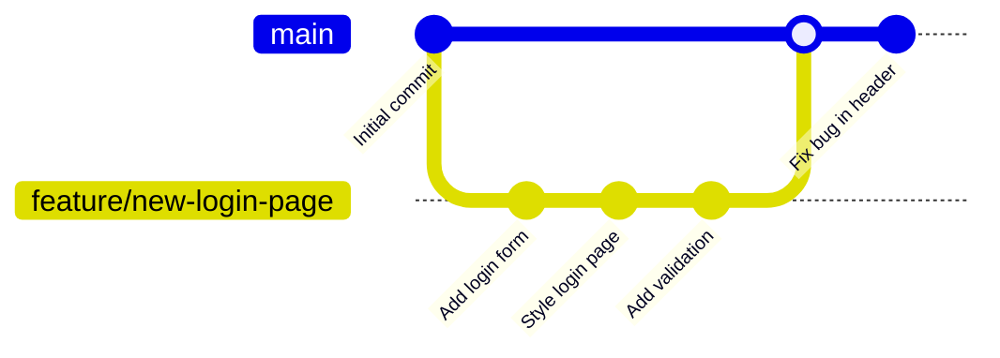
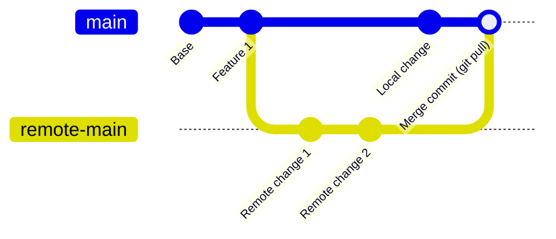
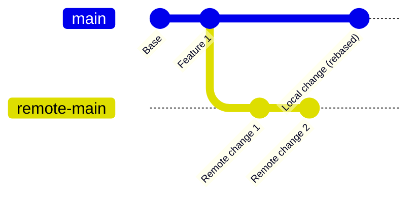

# Git Common Mistakes

## Introduction

Git is a powerful version control system, but with that power comes a learning curve. Even experienced developers occasionally make mistakes while using Git. This guide aims to help beginners identify and avoid common Git mistakes, understand why they happen, and learn how to recover when they do occur.

Understanding these common pitfalls will not only save you time and frustration but also deepen your understanding of how Git works. Let's dive into some of the most frequent Git mistakes and how to address them.

## Not Setting Up Git Properly

### The Mistake

Many beginners dive right into Git without configuring their identity, which causes commits to be associated with default or incorrect information.

### The Solution

Before you start working with Git, set up your username and email:

```bash
git config --global user.name "Your Name"
git config --global user.email "your.email@example.com"
```

You can verify your settings with:

```bash
git config --list
```

Output:
```
user.name=Your Name
user.email=your.email@example.com
...
```

## Committing Large Files or Sensitive Information

### The Mistake

Adding large files, build artifacts, or sensitive information (like API keys or passwords) to your Git repository.

### The Solution

Create a `.gitignore` file in your project root to specify files and directories that should be excluded from version control:

```bash
# Example .gitignore file
node_modules/
.env
*.log
build/
dist/
.DS_Store
```

If you've already committed sensitive information, you'll need to remove it from your Git history:

```bash
git filter-branch --force --index-filter \
  "git rm --cached --ignore-unmatch PATH_TO_FILE" \
  --prune-empty --tag-name-filter cat -- --all
```

Better yet, use tools like `git-secrets` or pre-commit hooks to prevent accidental commits of sensitive data.

## Not Creating a Branch for New Features

### The Mistake

Working directly on the main branch, which can lead to messy history and make it difficult to manage features or rollbacks.

### The Solution

Always create a new branch for each feature or bugfix:

```bash
# Create and switch to a new branch
git checkout -b feature/new-login-page

# Do your work, make commits...

# When ready, merge back to main
git checkout main
git merge feature/new-login-page
```

This workflow is visualized below:



## Committing Without a Clear Message

### The Mistake

Using vague commit messages like "Fixed stuff" or "Updated code."

### The Solution

Write clear, descriptive commit messages that explain what changed and why:

```bash
# Bad
git commit -m "Fixed bug"

# Good
git commit -m "Fix user authentication timeout issue"
```

For more complex changes, use the extended commit message format:

```bash
git commit -m "Add password reset functionality" -m "This commit implements the password reset feature including:
- Email notification system
- Token generation and validation
- Reset form with password strength validation"
```

## Forgetting to Pull Before Working

### The Mistake

Starting to work without pulling the latest changes, leading to merge conflicts.

### The Solution

Always pull the latest changes before you start working:

```bash
git pull origin main
```

If you're working on a feature branch that's been pushed remotely:

```bash
git checkout feature/my-feature
git pull origin feature/my-feature
```

## Pushing Large Commits Without Testing

### The Mistake

Making numerous changes and pushing them without testing or reviewing the changes.

### The Solution

Review your changes before committing:

```bash
git diff  # Show unstaged changes
git diff --staged  # Show staged changes
```

Break down large changes into smaller, logical commits:

```bash
git add src/components/LoginForm.js
git commit -m "Add login form component"

git add src/styles/login.css
git commit -m "Style login form"

git add src/utils/validation.js
git commit -m "Add form validation"
```

## Misusing `git reset`

### The Mistake

Using `git reset --hard` without understanding its implications, potentially losing work.

### The Solution

Understand the different reset options:

```bash
# Soft reset - keeps your changes but unstages them and moves HEAD
git reset --soft HEAD~1

# Mixed reset (default) - keeps your changes but unstages them
git reset HEAD~1

# Hard reset - discards all changes
git reset --hard HEAD~1
```

When in doubt, create a backup branch before performing a reset:

```bash
git branch backup-before-reset
git reset --hard HEAD~3  # Now you can safely reset
```

## Dealing with Merge Conflicts Incorrectly

### The Mistake

Resolving merge conflicts without understanding the changes, or aborting merges improperly.

### The Solution

When you encounter a merge conflict:

1. Understand both sides of the conflict
2. Decide what code should remain
3. Remove the conflict markers (`<<<<<<<`, `=======`, `>>>>>>>`)
4. Save the file
5. Stage the resolved files and commit

```bash
# When a merge conflict occurs
git status  # See which files have conflicts

# After resolving conflicts in the files
git add resolved-file.js
git commit  # Complete the merge
```

If you need to abort a merge:

```bash
git merge --abort
```

## Forgetting Which Branch You're On

### The Mistake

Making changes without knowing which branch you're currently on.

### The Solution

Always check your current branch before making changes:

```bash
git branch  # Lists all branches and highlights the current one
```

Better yet, configure your terminal to show the current Git branch in your prompt, or use a Git GUI client that clearly displays this information.

## Detached HEAD State Confusion

### The Mistake

Entering a detached HEAD state (by checking out a specific commit) and making changes without creating a branch, potentially losing those changes.

### The Solution

If you need to examine a specific commit, create a branch immediately if you plan to make changes:

```bash
# This will put you in a detached HEAD state
git checkout abc123

# If you want to make changes, create a branch
git checkout -b fix-based-on-old-commit
```

If you accidentally made changes in a detached HEAD state:

```bash
# Save your changes to a new branch
git branch new-branch-name

# Switch to that branch
git checkout new-branch-name
```

## Using `git pull` Without Understanding Merge vs. Rebase

### The Mistake

Using `git pull` without understanding that it performs a merge by default, which can create unnecessary merge commits.

### The Solution

Decide whether you want to merge or rebase when pulling:

```bash
# Default pull (merge)
git pull

# Pull with rebase instead
git pull --rebase
```

You can also configure Git to use rebase by default:

```bash
git config --global pull.rebase true
```

The difference between merge and rebase is illustrated below:



Versus rebase:



## Not Understanding the Staging Area

### The Mistake

Adding all changes to a commit without being selective about what goes into each commit.

### The Solution

Use the staging area to craft deliberate, logical commits:

```bash
# See what changes you have
git status

# Add specific files or parts of files
git add file1.js
git add -p file2.js  # Interactive staging, choose which parts to stage

# Commit only staged changes
git commit -m "Add login validation"
```

## Recovery: The Reflog Is Your Safety Net

Git keeps a record of all reference updates in the reflog. This can be a lifesaver when you think you've lost work:

```bash
# View the reflog
git reflog

# Recover a lost commit
git checkout HEAD@{2}  # Go to the state 2 moves ago

# Create a branch at this point if needed
git checkout -b recovered-work
```

Example output:
```
5f8584a (HEAD -> main) HEAD@{0}: commit: Latest change
a84c2d4 HEAD@{1}: commit: Previous change
e56d8e7 HEAD@{2}: commit: The change you want to recover
```

## Summary

Git is powerful but requires understanding to use effectively. By avoiding these common mistakes, you'll have a smoother experience with version control and be able to focus more on developing your projects.

Remember:
- Set up Git properly before you start
- Use `.gitignore` to exclude unnecessary files
- Create branches for features
- Write meaningful commit messages
- Pull before you start working
- Review changes before pushing
- Understand reset, merge, and rebase operations
- Always know which branch you're on

## Additional Resources

- [Git Documentation](https://git-scm.com/doc)
- [Pro Git Book](https://git-scm.com/book/en/v2)
- [GitHub Git Cheat Sheet](https://training.github.com/downloads/github-git-cheat-sheet/)
- [Oh Shit, Git!?!](https://ohshitgit.com/) - A resource for recovering from Git mistakes

## Practice Exercise

Try to simulate and recover from each of these common mistakes in a test repository:

1. Create a new Git repository
2. Make several commits
3. Create a "mistake" (e.g., hard reset, detached HEAD)
4. Use the appropriate recovery technique
5. Reflect on what you learned from the process

This hands-on practice will help cement your understanding of Git's error recovery mechanisms.