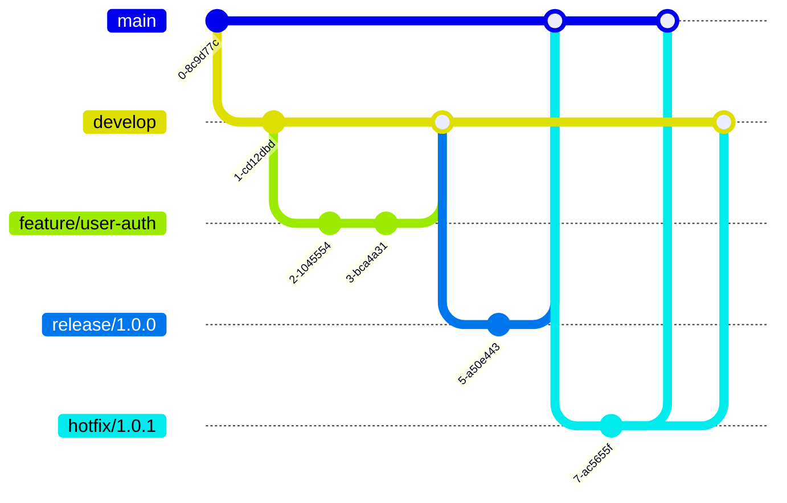

# Git Branch Naming

## Introduction

When working with Git, creating branches is a fundamental practice that allows developers to work on features, fixes, and experiments without affecting the main codebase. However, as projects grow and more developers join, having a consistent approach to naming branches becomes essential for maintaining a clean and understandable repository.

This guide will walk you through best practices for naming Git branches, explain why consistent naming matters, and provide practical examples you can immediately apply to your projects.

## Why Branch Naming Matters

Good branch naming conventions offer several benefits:

- **Clarity**: Team members can quickly understand what work is happening in each branch
- **Organization**: Related work is easily identifiable and grouped
- **Automation**: Consistent naming enables automated processes like CI/CD pipelines
- **History**: Well-named branches make repository history more navigable
- **Context**: Names provide context about the purpose and origin of changes

## Branch Naming Conventions

### The General Pattern

A well-structured branch name typically follows this pattern:

```
type/issue-reference/short-description
```

Where:
- `type`: Indicates the kind of work being done
- `issue-reference`: (Optional) Links to an issue tracker ID
- `short-description`: Brief explanation using kebab-case

### Common Branch Types

These prefixes help categorize the purpose of your branch:

| Type | Purpose |
|------|---------|
| `feature/` | New functionality or enhancements |
| `bugfix/` | Fixes for bugs in the codebase |
| `hotfix/` | Urgent fixes for production issues |
| `release/` | Preparation for a new production release |
| `chore/` | Maintenance tasks, dependency updates, etc. |
| `docs/` | Documentation updates only |
| `test/` | Adding or modifying tests |
| `refactor/` | Code changes that neither fix bugs nor add features |
| `style/` | Formatting, whitespace, etc. (no code changes) |
| `experiment/` | Experimental features not ready for production |

## Practical Examples

Let's look at some real-world examples of good branch naming:

```bash
# Adding a new login page
git checkout -b feature/login-page

# Fixing a button alignment in the navigation
git checkout -b bugfix/nav-button-alignment

# Urgent fix for production authentication error
git checkout -b hotfix/auth-token-expiration

# Updating API documentation
git checkout -b docs/api-endpoints-update

# Adding user account tests
git checkout -b test/user-account-validation

# Working on issue #123 from your tracker
git checkout -b feature/123/user-profile-redesign
```

## Including Issue References

If you use an issue tracker (like GitHub Issues, Jira, etc.), incorporating the issue ID makes cross-referencing easier:

```bash
# GitHub Issue #42
git checkout -b feature/GH-42/add-password-reset

# Jira ticket PROJ-123
git checkout -b bugfix/PROJ-123/fix-data-loading

# General approach with issue number
git checkout -b feature/42-add-password-reset
```

## Branch Naming for Different Workflows

Different Git workflows might have specific branch naming needs:

### Git Flow

The [Git Flow](https://nvie.com/posts/a-successful-git-branching-model/) workflow uses specific branch prefixes:



- `feature/*` - New features
- `release/*` - Release preparation (often with version numbers)
- `hotfix/*` - Production fixes
- `bugfix/*` - Fixes that go into the next release

### GitHub Flow

The simpler [GitHub Flow](https://guides.github.com/introduction/flow/) focuses more on descriptive feature branches:


### Trunk-Based Development

In [Trunk-Based Development](https://trunkbaseddevelopment.com/), branches are typically short-lived and might focus on issue numbers:

```bash
git checkout -b fix/GH-78
git checkout -b feat/PROJ-453
```

## Things to Avoid

Here are some common branch naming practices to avoid:

1. **Vague names**: Avoid `fix`, `update`, or `change` without context
2. **Personal branches only**: `john-work` doesn't describe the content
3. **Very long names**: Keep names reasonably concise
4. **Special characters**: Stick to letters, numbers, hyphens, and underscores
5. **Uppercase letters**: Use lowercase for consistency
6. **Temporary names**: Avoid `temp`, `wip` (or define clear rules for their usage)

## Setting Up Branch Naming Policies

For teams, it's often helpful to enforce branch naming conventions:

### Using Git Hooks

You can create a Git hook to check branch names:

```bash
#!/bin/sh
# .git/hooks/pre-push

branch_name=$(git symbolic-ref -q HEAD)
branch_name=${branch_name##refs/heads/}

valid_branch_regex="^(feature|bugfix|hotfix|release|chore|docs|test|refactor|style|experiment)\/[a-z0-9-]+$"

if [[ ! $branch_name =~ $valid_branch_regex ]]; then
    echo "ERROR: Branch naming doesn't match our standards."
    echo "Branch names should start with feature/, bugfix/, etc., followed by a description using hyphens."
    echo "Example: feature/user-authentication"
    exit 1
fi

exit 0
```

Don't forget to make the hook executable:

```bash
chmod +x .git/hooks/pre-push
```

### GitHub Branch Protection

In GitHub repositories, you can set up branch protection rules with naming patterns:

1. Go to your repository settings
2. Select "Branches" from the sidebar
3. Add a branch protection rule
4. Use pattern matching to require specific naming formats

## Tools for Automatic Branch Creation

Some tools can help create correctly-named branches:

### Git Aliases

Add this to your `.gitconfig`:

```
[alias]
    feature = "!f() { git checkout -b feature/$1; }; f"
    bugfix = "!f() { git checkout -b bugfix/$1; }; f"
    hotfix = "!f() { git checkout -b hotfix/$1; }; f"
```

Then use:

```bash
git feature user-authentication
# Creates and checks out feature/user-authentication
```

### IDE Integration

Most modern IDEs have Git integration that can help with branch creation:

- **VS Code**: Extensions like GitLens provide branch creation templates
- **JetBrains IDEs**: Offer branch type selection when creating branches
- **Atom/Sublime**: Various Git plugins provide branch naming assistance

## Summary

Effective branch naming is an essential practice for maintaining a clean and navigable Git repository. By following consistent conventions, you help yourself and your team understand the purpose and context of changes, making collaboration more efficient.

Remember these key points:
- Use prefixes to indicate the type of work (`feature/`, `bugfix/`, etc.)
- Include issue references when applicable
- Keep descriptions short but meaningful
- Use kebab-case for readability
- Adapt naming to your team's workflow

## Exercises

1. Analyze your current repository's branch names. How many follow a consistent pattern?
2. Create a branch naming policy document for your team
3. Set up a Git hook to enforce your preferred naming convention
4. Rename 3 poorly-named branches using `git branch -m old-name new-name`
5. Create a Git alias for your most commonly used branch type

## Additional Resources

- [Conventional Commits](https://www.conventionalcommits.org/) - Related standard for commit messages
- [Git Flow](https://nvie.com/posts/a-successful-git-branching-model/) - Popular workflow with specific branch naming
- [GitHub Flow](https://guides.github.com/introduction/flow/) - Simplified workflow focused on feature branches
- [Trunk Based Development](https://trunkbaseddevelopment.com/) - Alternative approach with fewer branches