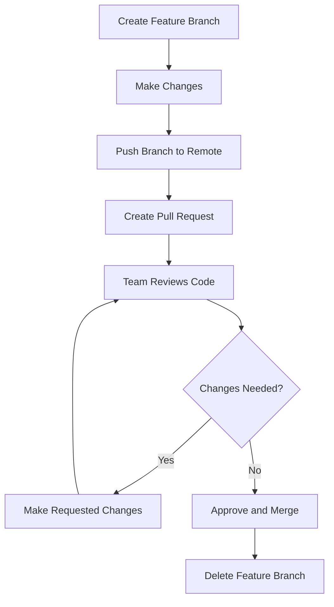

# Git Code Review

## Introduction

Code review is a critical part of modern software development that helps teams maintain high quality standards, share knowledge, and catch bugs before they reach production. When combined with Git's powerful version control capabilities, code reviews become even more effective.

In this guide, we'll explore how to conduct effective code reviews using Git workflows, understand what to look for during reviews, and learn how to use various tools to streamline the review process.

## What is a Git Code Review?

A Git code review is a systematic examination of code changes submitted through Git before they're merged into the main codebase. It typically involves:

1. A developer creating changes in a separate branch
2. The developer requesting a review (via pull/merge request)
3. One or more team members reviewing the changes
4. Discussions, revisions, and eventually approval
5. Merging the approved changes into the main branch

Code reviews help catch bugs, ensure code quality, share knowledge across the team, and maintain consistency in your codebase.

## Git Code Review Workflows

### The Basic Pull Request Workflow

The most common Git code review workflow uses pull requests (PRs) or merge requests (MRs). Here's how it works:



Let's break this down step by step:

1. **Create a feature branch**: Always work in a separate branch for new features or bug fixes.

```bash
# Create and switch to a new feature branch
git checkout -b feature/add-login-page
```

2. **Make your changes**: Develop your feature or fix with small, focused commits.

```bash
# Make changes to files...
git add .
git commit -m "Add login form component"

# Make more changes...
git add .
git commit -m "Implement authentication logic"
```

3. **Push your branch to the remote repository**:

```bash
git push -u origin feature/add-login-page
```

4. **Create a pull request**: Use GitHub, GitLab, Bitbucket, or your preferred platform to create a PR.

5. **Team reviews code**: Teammates examine your changes and provide feedback.

6. **Address feedback**: Make additional commits to address any feedback.

```bash
# After making requested changes
git add .
git commit -m "Fix input validation per review feedback"
git push origin feature/add-login-page
```

7. **Merge the approved changes**: Once approved, merge the changes into the main branch.

## What to Look for During Code Reviews

When reviewing code, pay attention to these aspects:

### 1. Code Correctness

- Does the code work as expected?
- Are there edge cases that aren't handled?
- Are there potential bugs or logic errors?

### 2. Code Quality

- Is the code readable and well-structured?
- Does it follow project conventions and style guides?
- Is there unnecessary complexity or duplication?

### 3. Test Coverage

- Are there sufficient tests for the new code?
- Do existing tests still pass?
- Are edge cases tested?

### 4. Documentation

- Are comments clear and helpful?
- Is any complex logic explained?
- Are public APIs documented?

### 5. Performance and Security

- Are there any performance concerns?
- Could the code introduce security vulnerabilities?
- Is sensitive data properly handled?

## Best Practices for Git Code Reviews

### For Authors (Submitting Code)

1. **Keep pull requests small and focused**
   
   Smaller PRs are easier to review thoroughly and tend to have fewer bugs.

2. **Write clear PR descriptions**

   Include what the change accomplishes, how to test it, and any relevant context.

   ```
   Title: Add user authentication feature
   
   Description:
   - Adds login and registration forms
   - Implements JWT authentication
   - Updates navigation to show logged-in state
   
   How to test:
   1. Run `npm install` for new dependencies
   2. Start the dev server with `npm start`
   3. Try to register a new account
   4. Log in with the new account
   ```

3. **Self-review before requesting feedback**

   Use `git diff` or the platform's comparison view to spot obvious issues:

   ```bash
   # Review your changes before committing
   git diff
   
   # Review the entire branch compared to main
   git diff main...feature/add-login-page
   ```

4. **Respond to all feedback constructively**

   Acknowledge comments and explain your reasoning when disagreeing.

### For Reviewers

1. **Review code promptly**

   Aim to review PRs within a day to avoid blocking teammates.

2. **Be specific and constructive**

   Explain why something should be changed and suggest alternatives.

   ```
   Instead of:
   "This code is messy."
   
   Say:
   "Consider breaking this function into smaller helper functions to improve readability. For example, you could extract the validation logic into its own function."
   ```

3. **Use a checklist**

   Ensure you're consistent in what you look for in every review.

4. **Balance thoroughness with progress**

   Focus on important issues rather than nitpicking every detail.

5. **Praise good code**

   Acknowledge clever solutions and well-written code to reinforce good practices.

## Git Code Review Tools

Several tools can help streamline your code review process:

### 1. GitHub Pull Requests

GitHub provides a robust interface for code reviews with:
- Line-by-line comments
- Suggested changes
- Review summaries
- Status checks from CI/CD systems

### 2. GitLab Merge Requests

Similar to GitHub, GitLab offers:
- Threaded discussions
- Approval rules
- Code quality reports
- Integration with CI/CD pipelines

### 3. Gerrit

A specialized code review tool that:
- Provides a more formal review process
- Supports multiple reviewers with voting
- Integrates with Git repositories

### 4. Pre-commit Hooks

Set up pre-commit hooks to catch issues before they reach review:

```bash
# Install pre-commit
pip install pre-commit

# Example .pre-commit-config.yaml
repos:
-   repo: https://github.com/pre-commit/pre-commit-hooks
    rev: v4.4.0
    hooks:
    -   id: trailing-whitespace
    -   id: end-of-file-fixer
    -   id: check-yaml
-   repo: https://github.com/psf/black
    rev: 23.1.0
    hooks:
    -   id: black
```

### 5. Continuous Integration

Use CI tools to automatically run tests, linters, and other checks.

```yaml
# Example GitHub Actions workflow
name: Code Quality Checks

on:
  pull_request:
    branches: [ main ]

jobs:
  test:
    runs-on: ubuntu-latest
    steps:
    - uses: actions/checkout@v3
    - name: Set up Node.js
      uses: actions/setup-node@v3
      with:
        node-version: '16'
    - run: npm ci
    - run: npm run lint
    - run: npm test
```

## Practical Example: Reviewing a Bug Fix

Let's walk through a complete example of a code review process for a bug fix.

### 1. The Bug Report

Your team receives a bug report: "User settings aren't being saved when clicking the Save button."

### 2. Creating a Fix

A developer creates a branch and fixes the issue:

```bash
git checkout -b fix/user-settings-save
```

They identify that the save function wasn't calling the API correctly:

```javascript
// Before: The bug
function saveSettings() {
  // Missing await and error handling
  api.updateSettings(settings);
  showSuccessMessage(); // This runs even if the API call fails
}

// After: The fix
async function saveSettings() {
  try {
    await api.updateSettings(settings);
    showSuccessMessage();
  } catch (error) {
    showErrorMessage(error.message);
  }
}
```

### 3. Creating the Pull Request

After pushing the fix, they create a PR with:

```
Title: Fix user settings not saving

Description:
The save button was showing a success message even when the API call failed. This fix:
- Makes the saveSettings function async
- Properly awaits the API call
- Adds error handling to show an error message on failure

How to test:
1. Go to user settings
2. Change a setting
3. Click save - should show success message
4. Temporarily disable your internet connection
5. Try to save again - should show error message

Fixes issue #123
```

### 4. The Code Review

A team member reviews the PR and comments:

```
Comment on line 5:
Good catch adding the try/catch! Could we also add some logging here to help with troubleshooting?

Suggested change:
try {
  await api.updateSettings(settings);
  showSuccessMessage();
  console.log('Settings saved successfully');
} catch (error) {
  showErrorMessage(error.message);
  console.error('Failed to save settings:', error);
}
```

### 5. Addressing Feedback

The author makes the suggested changes:

```bash
git add .
git commit -m "Add logging for settings save success/failure"
git push origin fix/user-settings-save
```

### 6. Approving and Merging

The reviewer approves the changes, and the PR is merged:

```bash
git checkout main
git pull
git branch -d fix/user-settings-save  # Delete the local branch after merging
```

## Setting Up a Code Review Process for Your Team

If you're establishing a code review process for your team, consider these steps:

1. **Agree on standards**
   
   Document your team's coding standards, commit message format, and branch naming conventions.

2. **Define the process**

   Decide who should review what code, how many approvals are needed, and what blocks merging.

3. **Use automation**

   Set up linters, formatters, and tests to catch simple issues automatically.

4. **Create templates**

   Provide templates for PR descriptions to ensure consistent information.

5. **Schedule review time**

   Encourage the team to set aside dedicated time for reviews.

## Summary

Git code reviews are an essential part of modern software development that help maintain code quality, share knowledge, and catch bugs early. By following a structured process, using the right tools, and adopting best practices, you can make your team's code reviews more effective and efficient.

Remember that the goal of code reviews isn't just to find bugs—it's also to share knowledge, mentor team members, and collectively own the codebase. With practice, your team will develop a healthy code review culture that balances thoroughness with productivity.

## Additional Resources

- [GitHub's Guide to Code Review](https://github.com/features/code-review)
- [Google's Engineering Practices Documentation](https://google.github.io/eng-practices/review/)
- [GitLab's Code Review Guidelines](https://docs.gitlab.com/ee/development/code_review.html)

## Exercises

1. **Practice creating pull requests**: Create a small change in a personal project and open a pull request to practice writing a good description.

2. **Review an open source PR**: Find an open source project you're interested in and review an open pull request to practice giving constructive feedback.

3. **Set up pre-commit hooks**: Configure pre-commit hooks in a project to catch common issues before they reach code review.

4. **Create a code review checklist**: Develop a personal checklist of things to look for when reviewing code, based on common issues you've seen.