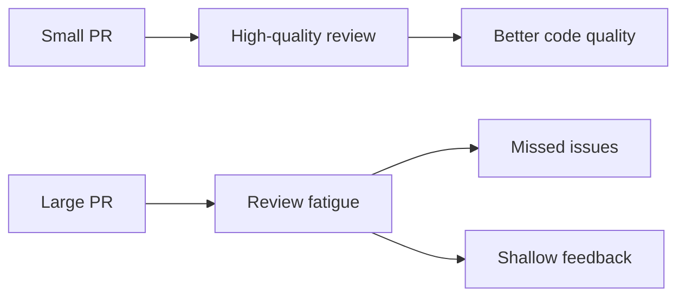
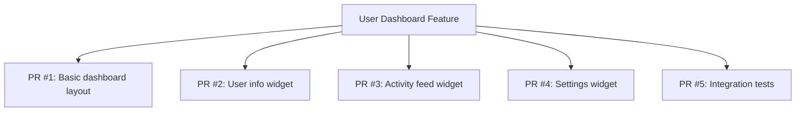

# Git Pull Request Size

## Introduction

When working with Git in a collaborative environment, pull requests (PRs) are a fundamental mechanism for code review and integration. One often overlooked aspect of creating effective pull requests is their size. The size of a pull request can significantly impact the review process, code quality, and team velocity.

In this guide, we'll explore why pull request size matters, how to determine the optimal size for your PRs, and strategies to keep your pull requests manageable and effective.

## Why Pull Request Size Matters

The size of a pull request directly affects several aspects of the development workflow:

### 1. Review Quality

Large pull requests are harder to review thoroughly. Studies have shown that the human brain's ability to effectively process information degrades as the amount of information increases.



### 2. Time to Merge

Smaller pull requests typically get reviewed and merged faster than larger ones. This reduces the chance of merge conflicts and keeps the development process flowing smoothly.

### 3. Team Morale

Both reviewers and authors experience less frustration with smaller, focused pull requests. Large PRs can be demoralizing for reviewers who must dedicate significant time to review them properly.

## What Is the Ideal Pull Request Size?

While there's no one-size-fits-all answer, research and industry experience suggest these guidelines:

- **Lines of code**: 200-400 lines of code is generally considered optimal
- **Files changed**: 10 or fewer files is preferred
- **Conceptual changes**: Ideally one logical change per PR

Let's look at some data from studies on pull request effectiveness:

| PR Size (LOC) | Average Review Time | Bug Detection Rate | Likelihood of Thorough Review |
|---------------|---------------------|-------------------|-------------------------------|
| < 200         | 30 minutes          | High              | Very High                     |
| 200-400       | 1 hour              | High              | High                          |
| 400-1000      | 3+ hours            | Medium            | Medium                        |
| 1000+         | 5+ hours or skipped | Low               | Low                           |

## Strategies for Creating Smaller Pull Requests

### 1. Plan Your Work in Smaller Units

Before writing code, break down larger features into smaller, independent chunks that can be implemented separately.

```javascript
// Instead of implementing an entire authentication system at once:

// PR #1: Add basic user model
const User = {
  id: String,
  username: String,
  passwordHash: String
};

// PR #2: Add login form components
function LoginForm() {
  // Form implementation
}

// PR #3: Add authentication logic
function authenticateUser(username, password) {
  // Authentication implementation
}

// Each could be its own PR instead of one massive change
```

### 2. Use Feature Flags

Implement larger features behind feature flags, allowing you to merge code incrementally while keeping the feature hidden until complete.

```javascript
// PR #1: Add feature flag infrastructure
function isFeatureEnabled(featureName) {
  return config.features[featureName] === true;
}

// PR #2: Add new component behind feature flag
function NewFeature() {
  if (!isFeatureEnabled('new-feature')) {
    return null;
  }
  
  return <div>New feature content</div>;
}
```

### 3. Separate Refactoring from Feature Work

Keep refactoring changes separate from new feature development.

```javascript
// BAD: Mixing refactoring and new features in one PR
function oldFunction() {
  // Refactored code
  // + New feature implementation
}

// GOOD: First PR - Just refactoring
function improvedFunction() {
  // Refactored code only
}

// GOOD: Second PR - New feature based on refactored code
function improvedFunction() {
  // Existing refactored code
  // New feature implementation
}
```

### 4. Follow the Single Responsibility Principle

Each pull request should focus on one specific task or feature.

## Practical Example: Breaking Down a Large Feature

Let's say you're implementing a new user dashboard with multiple widgets. Instead of creating one massive PR, break it down:



### Step 1: Basic Dashboard Layout

```jsx
// PR #1: Just the basic structure
function Dashboard() {
  return (
    <div className="dashboard">
      <header className="dashboard-header">
        <h1>User Dashboard</h1>
      </header>
      <div className="dashboard-grid">
        {/* Widget placeholders */}
        <div className="widget-placeholder">User Info (Coming Soon)</div>
        <div className="widget-placeholder">Activity Feed (Coming Soon)</div>
        <div className="widget-placeholder">Settings (Coming Soon)</div>
      </div>
    </div>
  );
}
```

### Step 2: Add User Info Widget

```jsx
// PR #2: Implement just the user info widget
function UserInfoWidget({ user }) {
  return (
    <div className="widget user-info-widget">
      <h2>User Information</h2>
      <div className="user-avatar">
        
      </div>
      <div className="user-details">
        <p><strong>Name:</strong> {user.name}</p>
        <p><strong>Email:</strong> {user.email}</p>
        <p><strong>Member since:</strong> {formatDate(user.createdAt)}</p>
      </div>
    </div>
  );
}

// Then update the Dashboard to use this widget
```

And you would continue this pattern for each subsequent PR.

## How to Check PR Size Before Submitting

Before submitting your PR, use these Git commands to check its size:

```bash
# See how many files are changed and how many lines are modified
git diff --stat main

# Get a detailed count of added/removed lines
git diff --stat-width=200 main
```

## Handling Necessary Large PRs

Sometimes larger PRs are unavoidable. In these cases:

1. **Provide a thorough description** explaining the changes and why they need to be in one PR
2. **Break down the changes** in your PR description, section by section
3. **Consider requesting incremental reviews** as you work on the PR
4. **Add detailed comments** in your code to guide reviewers

## Summary

Keeping pull requests small and focused is a best practice that leads to:

- More thorough code reviews
- Faster integration of changes
- Fewer merge conflicts
- Better team collaboration
- Higher quality code

As a general rule, aim for PRs under 400 lines of code that implement a single logical change. When larger changes are necessary, use strategies like feature flags and incremental development to keep individual PRs manageable.

## Additional Resources

- **Git commands for analyzing PR size:**
  ```bash
  git diff --stat main
  git diff --numstat main
  ```
- **Tools for PR analysis:**
  - Many CI/CD platforms have PR size checkers
  - GitHub and GitLab have PR visualization extensions

## Exercises

1. Take a recent large PR you or your team created and break it down into multiple smaller PRs on paper. Identify where natural boundaries could have been created.

2. Set up a PR size checker for your repository to flag PRs that exceed recommended sizes.

3. Practice the following workflow:
   - Start with a feature branch
   - Make changes for a small, complete piece of functionality
   - Create a PR and get it reviewed
   - Merge it to the main branch
   - Create a new branch from the updated main for the next piece