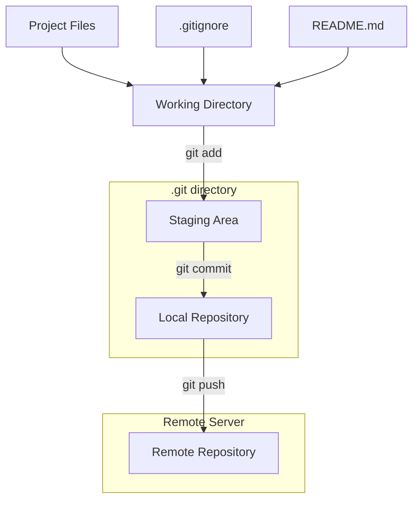

# Git Repository Structure

## Introduction

A well-organized Git repository is the foundation of any successful software project. Understanding the structure of a Git repository not only helps you navigate your codebase more efficiently but also enables better collaboration with other developers. This guide will walk you through the essential components of a Git repository structure, explain how they work together, and provide best practices for organizing your projects.

## What is a Git Repository?

A Git repository (or "repo") is a collection of files and the complete history of changes made to those files. When you initialize a Git repository in a directory, Git creates a hidden `.git` folder that contains all the necessary data structures and objects to track your project's history.

The `.git` directory is the actual repository, while the working directory (the files you see and edit) is just a checkout of one version of your project.

## The `.git` Directory

The `.git` directory is the heart of your Git repository. Let's explore its key components:

### Key Components

```
.git/
├── HEAD           # Points to the current branch
├── config         # Repository-specific configuration
├── description    # Used by GitWeb program (optional)
├── hooks/         # Client or server-side scripts that run at specific points
├── index          # Staging area information
├── logs/          # Record of changes to refs
├── objects/       # Stores all content for your database
└── refs/          # Pointers to commit objects (branches, tags, etc.)
```

Let's examine some of these components in more detail:

### HEAD File

The HEAD file is a reference to the current branch you're on. It's a simple text file that contains a reference.

```bash
$ cat .git/HEAD
ref: refs/heads/main
```

This indicates that you're currently on the `main` branch.

### Config File

The config file contains repository-specific configuration settings. This includes remote repository URLs, user information, and other settings.

```bash
$ cat .git/config
[core]
	repositoryformatversion = 0
	filemode = true
	bare = false
	logallrefupdates = true
[remote "origin"]
	url = https://github.com/username/repository.git
	fetch = +refs/heads/*:refs/remotes/origin/*
[branch "main"]
	remote = origin
	merge = refs/heads/main
```

### Objects Directory

The objects directory stores all content in your Git database. It uses a content-addressable storage system, where the content itself is used to generate its address (SHA-1 hash).

There are four types of objects:
- **Blob**: File content
- **Tree**: Directory content
- **Commit**: Pointer to a tree with metadata
- **Tag**: Named references to specific commits

```bash
$ ls -la .git/objects
total 24
drwxr-xr-x 6 user group 192 Jan 1 12:00 .
drwxr-xr-x 13 user group 416 Jan 1 12:00 ..
drwxr-xr-x 2 user group 64 Jan 1 12:00 17
drwxr-xr-x 2 user group 64 Jan 1 12:00 61
drwxr-xr-x 2 user group 64 Jan 1 12:00 ae
drwxr-xr-x 2 user group 64 Jan 1 12:00 info
drwxr-xr-x 2 user group 64 Jan 1 12:00 pack
```

### Refs Directory

The refs directory contains pointers to commit objects. There are three main subdirectories:
- **heads/**: Points to local branches
- **remotes/**: Points to remote repository branches
- **tags/**: Points to specific tagged commits

```bash
$ ls -la .git/refs
total 24
drwxr-xr-x 5 user group 160 Jan 1 12:00 .
drwxr-xr-x 13 user group 416 Jan 1 12:00 ..
drwxr-xr-x 2 user group 64 Jan 1 12:00 heads
drwxr-xr-x 3 user group 96 Jan 1 12:00 remotes
drwxr-xr-x 2 user group 64 Jan 1 12:00 tags
```

## Working Directory Structure

While the `.git` directory manages the repository metadata, the working directory contains the actual project files. Here's a typical structure for a well-organized Git repository:

```
my-project/                  # Root directory
├── .git/                    # Git repository data
├── .gitignore               # Files to be ignored by Git
├── .gitattributes           # Attributes for paths
├── README.md                # Project documentation
├── LICENSE                  # License information
├── src/                     # Source code
│   ├── main.js
│   └── utils/
├── tests/                   # Test files
├── docs/                    # Documentation
├── assets/                  # Static assets
│   ├── images/
│   ├── styles/
│   └── scripts/
└── package.json             # Dependencies and scripts (for Node.js projects)
```

Let's understand each of these components:

### Essential Files

#### .gitignore

The `.gitignore` file specifies files and directories that Git should ignore. This typically includes build artifacts, temporary files, logs, and environment-specific configurations.

Example `.gitignore` file:

```
# Dependency directories
node_modules/
vendor/

# Build outputs
dist/
build/
out/

# Environment variables
.env
.env.local

# Log files
*.log
logs/

# Operating system files
.DS_Store
Thumbs.db

# IDE files
.idea/
.vscode/
*.sublime-project
*.sublime-workspace
```

#### README.md

The README.md file is usually the first file people see when they visit your repository. It should include:
- Project name and description
- Installation instructions
- Usage examples
- Contribution guidelines
- License information

Example `README.md`:

```markdown
# My Project

A brief description of what this project does and who it's for.

## Installation

```bash
npm install my-project
```

## Usage

```javascript
import { myFunction } from 'my-project';

// Example usage
const result = myFunction();
console.log(result);
```

## Contributing

Contributions are welcome! Please see CONTRIBUTING.md for details.

## License

This project is licensed under the MIT License - see the LICENSE file for details.
```

#### LICENSE

The LICENSE file contains the license terms under which your code is released. Common licenses include MIT, Apache 2.0, GPL, and BSD.

## Best Practices for Repository Structure

### 1. Separate Source Code from Other Assets

Maintain clear separation between:
- Source code (`src/`)
- Tests (`tests/`)
- Documentation (`docs/`)
- Build configuration files (at the root)

### 2. Use Consistent Directory Naming

Choose a naming convention for directories and stick with it:
- `kebab-case` (e.g., `user-authentication/`)
- `snake_case` (e.g., `user_authentication/`)
- `camelCase` (e.g., `userAuthentication/`)

### 3. Organize by Feature or Component

Group related files together by feature or component rather than by file type:

```
src/
├── authentication/       # Authentication feature
│   ├── login.js
│   ├── register.js
│   └── auth-utils.js
├── profiles/             # User profiles feature
│   ├── view-profile.js
│   ├── edit-profile.js
│   └── profile-utils.js
└── shared/               # Shared utilities
    ├── api-client.js
    └── formatting.js
```

### 4. Keep Configuration Files at the Root

Configuration files should be placed at the root of the repository for easy access:
- `.gitignore`, `.gitattributes`
- Build configuration (`.babelrc`, `webpack.config.js`)
- CI/CD configuration (`.github/workflows/`, `.travis.yml`)
- Code quality tools (`.eslintrc`, `.prettierrc`)

### 5. Create Meaningful Documentation

Documentation should be comprehensive and well-organized:
- `README.md` in the root directory
- `CONTRIBUTING.md` for contribution guidelines
- `docs/` directory for detailed documentation
- Inline code comments where appropriate

## Common Repository Structures

Different types of projects often have different standard structures. Let's look at some examples:

### Node.js / JavaScript Project

```
node-project/
├── .git/
├── .gitignore
├── package.json
├── package-lock.json
├── README.md
├── src/
│   ├── index.js
│   └── components/
├── tests/
│   └── index.test.js
├── docs/
└── dist/           # Compiled code (gitignored)
```

### Python Project

```
python-project/
├── .git/
├── .gitignore
├── requirements.txt
├── setup.py
├── README.md
├── my_package/
│   ├── __init__.py
│   ├── main.py
│   └── utils/
├── tests/
│   └── test_main.py
└── docs/
```

### Web Project

```
web-project/
├── .git/
├── .gitignore
├── package.json
├── README.md
├── src/
│   ├── index.html
│   ├── js/
│   ├── css/
│   └── assets/
├── tests/
└── build/          # Compiled code (gitignored)
```

## Visualizing Repository Structure

We can use a Mermaid diagram to visualize the relationship between Git's internal structure and working files:



## Practical Example: Setting Up a New Repository

Let's walk through creating a well-structured repository for a new project:

### Step 1: Initialize the Repository

```bash
# Create a new directory
mkdir my-new-project
cd my-new-project

# Initialize Git repository
git init
```

### Step 2: Create Essential Files

Create a README.md file:

```markdown
# My New Project

A description of what this project does.

## Installation

Installation instructions here.

## Usage

Usage examples here.
```

Create a .gitignore file:

```
# Node.js dependencies
node_modules/

# Build directory
dist/

# Environment variables
.env

# Editor files
.vscode/
.idea/

# Logs
logs/
*.log
```

### Step 3: Set Up the Basic Directory Structure

```bash
# Create directories
mkdir -p src/components src/utils tests docs assets

# Create initial files
touch src/index.js
touch src/components/example.js
touch tests/index.test.js
touch docs/getting-started.md
```

### Step 4: Make the Initial Commit

```bash
# Add all files to staging
git add .

# Make the initial commit
git commit -m "Initial repository structure"
```

### Step 5: Add Remote Repository (Optional)

```bash
# Add a remote repository
git remote add origin https://github.com/username/my-new-project.git

# Push to remote repository
git push -u origin main
```

## Common Issues and Solutions

### Issue: Large Files in Repository

**Problem**: Adding large files (binaries, logs, etc.) bloats repository size.

**Solution**: 
- Add them to `.gitignore`
- Use Git LFS (Large File Storage) for necessary large files
- Keep build artifacts out of the repository

### Issue: Sensitive Information Committed

**Problem**: Accidentally committed API keys, passwords, or other sensitive information.

**Solution**:
- Use environment variables stored in `.env` files (add to `.gitignore`)
- Use tools like `git-filter-branch` to remove sensitive data if already committed
- Consider using a service like Git Guardian for automated scanning

### Issue: Disorganized Repository

**Problem**: Files scattered without clear organization.

**Solution**:
- Establish conventions before starting
- Refactor existing repositories by moving files (with `git mv` to preserve history)
- Document the structure in README.md

## Summary

A well-structured Git repository is essential for efficient development and collaboration. By organizing your files logically, ignoring unnecessary files, and following best practices, you can create a repository that is easy to navigate and maintain.

Remember these key points:
- The `.git` directory contains all repository metadata and history
- Use a consistent directory structure organized by feature or component
- Keep configuration files at the root level
- Create comprehensive documentation
- Use `.gitignore` to exclude unnecessary files

## Additional Resources

For further learning about Git repository structure and best practices:

- [Git Documentation](https://git-scm.com/doc)
- [Pro Git Book](https://git-scm.com/book/en/v2)
- [GitHub Guides](https://guides.github.com/)

## Exercises

1. Initialize a new Git repository and set up a basic structure for a project in your preferred programming language.
2. Create a `.gitignore` file appropriate for your project type.
3. Experiment with examining the contents of the `.git` directory after making several commits.
4. Try organizing an existing project according to the best practices outlined in this guide.
5. Practice adding a remote repository and pushing your changes.