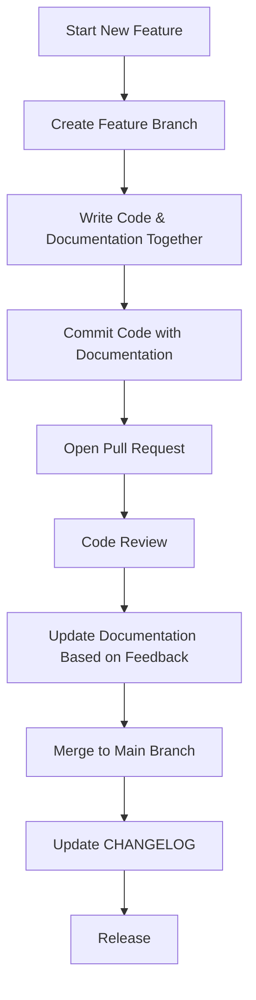

# Git Documentation

## Introduction

Documentation is a crucial but often overlooked aspect of Git-based projects. Good documentation helps team members understand your code, reduces onboarding time for new developers, and serves as a reference for future maintenance. This guide will walk you through the essentials of Git documentation and how to implement documentation best practices in your projects.

## Why Documentation Matters in Git Projects

Documentation in Git repositories serves several important purposes:

- Provides context about why certain decisions were made
- Helps new contributors understand how to work with your codebase
- Creates institutional knowledge that remains even as team members change
- Makes your project more accessible to the open-source community
- Serves as a reference for yourself when returning to a project after time away

## Essential Documentation for Git Repositories

### 1. README Files

The README.md file is the first thing people see when they visit your repository. It should:

```markdown
# Project Name

A brief description of what your project does.

## Installation

Instructions on how to install your project.

## Usage

Examples of how to use your project.

## Contributing

Guidelines for contributing to your project.

## License

Information about the license.
```

A good README answers these questions:
- What does this project do?
- How do I install it?
- How do I use it?
- How can I contribute?
- What license does it use?

### 2. Code Comments

Good code comments explain the "why" rather than the "what":

```javascript
// BAD: This function adds two numbers
function add(a, b) {
  return a + b;
}

// GOOD: Calculate the total price including tax
function add(price, tax) {
  return price + tax;
}
```

### 3. Commit Messages

Commit messages are a form of documentation that explain the history of your codebase:

```bash
# Bad commit message
git commit -m "Fixed stuff"

# Good commit message
git commit -m "Fix navigation bar overflow on mobile devices"
```

### 4. Issue and Pull Request Templates

Create templates to standardize how issues and pull requests are documented:

```markdown
## Description
[Describe the issue or feature]

## Steps to Reproduce
1. [First Step]
2. [Second Step]
3. [and so on...]

## Expected behavior
[What should happen]

## Actual behavior
[What actually happens]

## Environment
- OS: [e.g. iOS]
- Browser: [e.g. chrome, safari]
- Version: [e.g. 22]
```

### 5. CONTRIBUTING.md

This file explains how others can contribute to your project:

```markdown
# Contributing to [Project Name]

We love your input! We want to make contributing as easy and transparent as possible, whether it's:

- Reporting a bug
- Discussing the current state of the code
- Submitting a fix
- Proposing new features
- Becoming a maintainer

## Development Process

We use GitHub to host code, to track issues and feature requests, as well as accept pull requests.

## Pull Requests

1. Fork the repo and create your branch from `main`.
2. If you've added code that should be tested, add tests.
3. If you've changed APIs, update the documentation.
4. Ensure the test suite passes.
5. Make sure your code lints.
6. Issue that pull request!
```

### 6. CHANGELOG.md

Track changes between versions:

```markdown
# Changelog

## [1.0.0] - 2023-03-14

### Added
- New feature A
- New feature B

### Changed
- Improved performance of X
- Updated dependencies

### Fixed
- Bug in component Y
- Issue with Z not working in Safari
```

## Documentation Workflow with Git

Here's a practical workflow for maintaining documentation with Git:



## Automation and Tools

### Documentation Generation

Tools like JSDoc (JavaScript), Sphinx (Python), or Javadoc can automatically generate documentation from code comments:

```javascript
/**
 * Calculates the sum of two numbers
 * @param {number} a - The first number
 * @param {number} b - The second number
 * @returns {number} The sum of a and b
 */
function add(a, b) {
  return a + b;
}
```

### Git Hooks for Documentation

Use pre-commit hooks to enforce documentation standards:

```bash
#!/bin/sh
# .git/hooks/pre-commit

# Check if README.md exists
if [ ! -f README.md ]; then
  echo "ERROR: README.md file is missing"
  exit 1
fi

# Check if essential sections exist in README
if ! grep -q "# Installation" README.md; then
  echo "ERROR: README.md is missing Installation section"
  exit 1
fi

# Additional checks can be added here

exit 0
```

## Practical Example: Documenting a Project from Scratch

Let's walk through documenting a simple web application:

### 1. Initial Setup

Create the basic documentation structure:

```bash
touch README.md
touch CONTRIBUTING.md
touch CHANGELOG.md
mkdir docs
```

### 2. README.md Content

```markdown
# Weather Dashboard

A simple weather dashboard that shows current weather and 5-day forecast using the OpenWeatherMap API.

## Installation

1. Clone the repository:
   ```bash
   git clone https://github.com/username/weather-dashboard.git
   cd weather-dashboard
   ```

2. Install dependencies:
   ```bash
   npm install
   ```

3. Create a `.env` file with your API key:
   ```
   OPENWEATHERMAP_API_KEY=your_api_key_here
   ```

## Usage

Start the development server:

```bash
npm start
```

Visit `http://localhost:3000` in your browser.

## API

The application uses the following endpoints:

- `/api/current/:city` - Get current weather for a city
- `/api/forecast/:city` - Get 5-day forecast for a city

## Contributing

See CONTRIBUTING.md for details on how to contribute.

## License

MIT
```

### 3. Commit Documentation Changes

```bash
git add README.md CONTRIBUTING.md CHANGELOG.md
git commit -m "Add initial project documentation"
git push origin main
```

## Common Documentation Mistakes

1. **Outdated documentation**: Documentation that doesn't match the current code
2. **Inconsistent style**: Using different formats across documentation
3. **Too technical**: Not considering the audience's knowledge level
4. **Too vague**: Not providing enough details for implementation
5. **Missing examples**: Not showing practical usage

## Best Practices for Git Documentation

1. **Update documentation with code changes**: Treat documentation as part of your code
2. **Use Markdown for consistency**: Markdown is supported by most Git platforms
3. **Keep a consistent style**: Use style guides for documentation
4. **Include visual aids**: Diagrams, screenshots, and flowcharts help understanding
5. **Link related documents**: Create a web of information
6. **Automate when possible**: Use tools to generate and validate documentation

## Documentation Review Process

When reviewing documentation, ask these questions:

1. Is it accurate and up-to-date?
2. Is it clear and concise?
3. Does it provide enough context?
4. Does it include relevant examples?
5. Is it accessible to the target audience?
6. Are there any spelling or grammar errors?

## Summary

Effective Git documentation is a critical component of successful software projects. By implementing the practices outlined in this guide, you'll create documentation that:

- Helps new team members understand your project
- Provides a historical record of why decisions were made
- Increases the adoptability of your code
- Makes maintenance easier
- Builds credibility with users and contributors

Remember that documentation is not a one-time task but an ongoing process that evolves with your project.

## Additional Resources

- [GitHub Docs on README files](https://docs.github.com/en/repositories/managing-your-repositorys-settings-and-features/customizing-your-repository/about-readmes)
- [Conventional Commits](https://www.conventionalcommits.org/)
- [Writing effective documentation](https://www.writethedocs.org/guide/)
- [Markdown Guide](https://www.markdownguide.org/)

## Exercises

1. Create a README.md file for one of your existing projects
2. Set up issue and pull request templates for your repository
3. Document an API endpoint using a standard format
4. Configure a pre-commit hook to check documentation quality
5. Contribute to open-source by improving their documentation