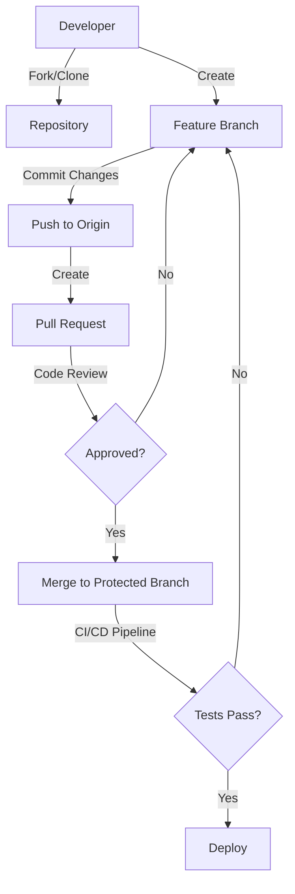

# Git Security

Git is a powerful version control system used by developers worldwide, but without proper security practices, it can expose sensitive information or leave your repositories vulnerable to attacks. This guide will help you understand and implement essential Git security measures.

## Introduction

Version control systems like Git store your entire project history, including all changes made over time. While this is incredibly valuable for development, it can also present security risks if not properly managed. Common security issues include:

- Leaking sensitive credentials or API keys
- Unauthorized access to repositories
- Code tampering
- History exposure

In this guide, we'll explore best practices to secure your Git workflows and protect your repositories.

## Keep Git Updated

One of the simplest yet most effective security measures is keeping Git updated to the latest version.

### Why Update Git?

Like all software, Git occasionally has security vulnerabilities that are fixed in newer releases. Running outdated versions can leave you exposed to known exploits.

### How to Check Your Git Version

```bash
git --version
```

**Output:**
```
git version 2.39.2
```

### How to Update Git

**On macOS (using Homebrew):**
```bash
brew update
brew upgrade git
```

**On Ubuntu/Debian:**
```bash
sudo apt update
sudo apt upgrade git
```

**On Windows:**
Download the latest version from the [official Git website](https://git-scm.com/) and install it.

## Prevent Credential Leaks

One of the most common security issues is accidentally committing sensitive information to Git repositories.

### Never Commit Secrets

Avoid committing:
- API keys
- Passwords
- Private keys
- Access tokens
- Connection strings

### Use .gitignore

Create a comprehensive `.gitignore` file to prevent sensitive files from being tracked.

```bash
# Example .gitignore entries
.env
config/secrets.yml
*.pem
*.key
credentials.json
```

### Use Environment Variables

Store sensitive information in environment variables instead of in your codebase:

```javascript
// Bad practice
const API_KEY = "1a2b3c4d5e6f7g8h9i0j";

// Good practice
const API_KEY = process.env.API_KEY;
```

## Git Hooks for Security

Git hooks are scripts that Git executes before or after events such as commit, push, and receive. They can be used to enforce security policies.

### Pre-commit Hooks

These run before a commit is finalized and can prevent sensitive data from being committed.

Create a `.git/hooks/pre-commit` file:

```bash
#!/bin/bash

# Check for potential API keys
if git diff --cached | grep -E '[a-zA-Z0-9_-]{32,}'; then
  echo "WARNING: Possible API key or secret token found in commit"
  echo "Please remove the sensitive data and try again"
  exit 1
fi

# Continue with commit if no issues found
exit 0
```

Don't forget to make the hook executable:

```bash
chmod +x .git/hooks/pre-commit
```

### Using pre-commit Framework

For a more robust solution, use the pre-commit framework:

```bash
# Install pre-commit
pip install pre-commit

# Create a configuration file
touch .pre-commit-config.yaml
```

Example configuration:

```yaml
repos:
-   repo: https://github.com/pre-commit/pre-commit-hooks
    rev: v4.4.0
    hooks:
    -   id: detect-private-key
    -   id: detect-aws-credentials
```

Install the hooks:

```bash
pre-commit install
```

## Remove Sensitive Data from Git History

If sensitive data has already been committed, you need to remove it from your Git history.

### Using BFG Repo-Cleaner

BFG is a faster alternative to `git-filter-branch` for removing sensitive data:

```bash
# Install BFG (example for macOS)
brew install bfg

# Remove files containing passwords
bfg --delete-files passwords.txt my-repo.git

# Replace all occurrences of API keys
bfg --replace-text passwords.txt my-repo.git
```

### Using git-filter-repo

For more complex history rewriting:

```bash
# Install git-filter-repo
pip install git-filter-repo

# Remove a file from history
git filter-repo --path passwords.txt --invert-paths
```

After cleaning your history, force push the changes:

```bash
git push --force
```

⚠️ **Warning:** Force pushing rewrites history. Coordinate with team members to avoid disruption.

## Secure Authentication

Proper authentication is crucial for Git security.

### Use SSH Keys Instead of Passwords

SSH keys provide stronger security than passwords:

```bash
# Generate an SSH key
ssh-keygen -t ed25519 -C "your_email@example.com"

# Start the SSH agent
eval "$(ssh-agent -s)"

# Add your key to the agent
ssh-add ~/.ssh/id_ed25519
```

Add the public key to your Git provider (GitHub, GitLab, etc.).

### Enable Two-Factor Authentication (2FA)

Always enable 2FA on your Git hosting service for an extra layer of security.

## Signed Commits

Signing commits cryptographically verifies that commits came from a trusted source.

### Set Up GPG for Signing

```bash
# Generate a GPG key
gpg --full-generate-key

# List your keys
gpg --list-secret-keys --keyid-format=long

# Configure Git to use your key
git config --global user.signingkey YOUR_KEY_ID
git config --global commit.gpgsign true
```

### Verifying Signed Commits

```bash
git log --show-signature
```

The output will show verification status for signed commits:

```
commit a123b456c789d012e345f678g901h234i567j890
gpg: Signature made Wed Mar 15 10:12:30 2023 PST
gpg:                using RSA key 1A2B3C4D5E6F7G8H
gpg: Good signature from "Your Name <your.email@example.com>"
Author: Your Name <your.email@example.com>
Date:   Wed Mar 15 10:12:30 2023 -0700

    Add new feature
```

## Repository Access Control

Properly managing access to your repositories is essential for security.

### Principle of Least Privilege

Grant only the minimum necessary permissions:

- Read-only access for most team members
- Write access only when needed
- Admin access restricted to trusted maintainers

### Branch Protection Rules

Set up branch protection rules to prevent unauthorized changes:

1. Protected branches cannot be deleted
2. Direct pushes to protected branches are blocked
3. Pull requests require review before merging
4. Status checks must pass before merging

Here's a workflow diagram showing secure branch management:



## Git Vulnerabilities and Mitigations

### Git Submodule Attacks

Git submodules can be vulnerable to "update" attacks where the remote repository changes unexpectedly.

**Mitigation:**
```bash
# Use specific commits for submodules
git submodule add -b master https://github.com/example/repo.git
cd repo
git checkout v1.0.0  # Use a specific tag or commit
cd ..
git add .
git commit -m "Add submodule at specific version"
```

### Repository Configuration

Prevent unsafe directory traversal:

```bash
git config --global core.fsmonitor false
```

## Security Auditing

Regularly audit your Git repositories for security issues.

### Check for Sensitive Content

Use tools like `git-secrets` or `trufflehog` to scan for secrets:

```bash
# Install git-secrets
brew install git-secrets

# Register AWS patterns
git secrets --register-aws

# Scan repository
git secrets --scan
```

### Audit Commit History

Review your Git history for sensitive information:

```bash
# Search for password-related strings
git log -p | grep -i password

# Search for specific patterns
git log -p | grep -E "[a-zA-Z0-9_-]{32,}"
```

## Secure Git Workflows

Implement secure workflows for your team.

### Trunk-Based Development

A simplified branching strategy reduces complexity and security risks:

1. Short-lived feature branches
2. Frequent merges to main
3. CI/CD integration at every step

### Code Review Requirements

Enforce code reviews for security:

1. At least one approval required
2. Automated security scanning
3. No self-approval

## Summary

Git security is a critical aspect of modern development. By following these best practices, you can protect your repositories from common vulnerabilities and ensure the integrity of your code.

Key takeaways:
- Keep Git updated
- Never commit sensitive information
- Use Git hooks for prevention
- Clean history if needed
- Use strong authentication
- Sign your commits
- Control repository access
- Implement secure workflows
- Regularly audit your repositories

## Additional Resources

- [Git Documentation](https://git-scm.com/doc)
- [GitHub Security Best Practices](https://docs.github.com/en/code-security)
- [OWASP Source Code Management Security](https://owasp.org/www-community/Source_Code_Analysis_Tools)

## Exercises

1. Set up a pre-commit hook to detect potential API keys in your code.
2. Generate and configure GPG signing for your commits.
3. Audit an existing repository for sensitive information.
4. Create a `.gitignore` file tailored to your project's security needs.
5. Configure branch protection for your main branch.