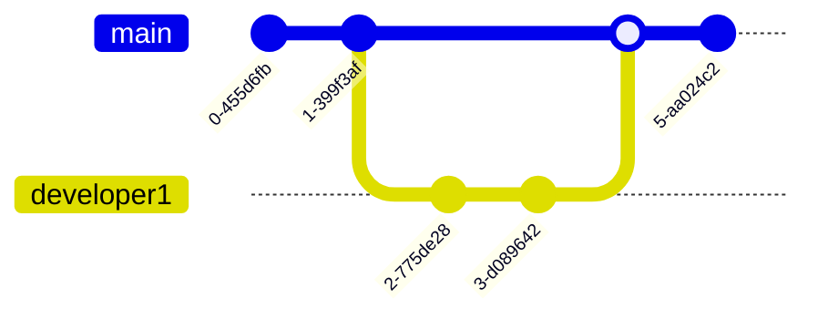

# Git Workflow Policies

## Introduction

Git workflow policies are established guidelines that define how teams use Git for version control. These policies streamline collaboration, maintain code quality, and prevent conflicts when multiple developers work on the same project. For beginners, understanding common Git workflows is crucial for effective teamwork and professional development practices.

This guide will explore different Git workflow models, explain how to implement them, and provide practical examples to help you establish effective Git policies in your projects.

## Why Git Workflow Policies Matter

Before diving into specific workflows, let's understand why having defined Git policies is important:

- **Consistency**: Ensures all team members follow the same processes
- **Quality control**: Helps maintain high standards through review processes
- **Conflict reduction**: Minimizes merge conflicts and lost work
- **Traceability**: Makes it easier to track changes and identify issues
- **Onboarding**: Simplifies the process for new team members to contribute

## Common Git Workflow Models

### 1. Centralized Workflow

The simplest Git workflow where all developers work directly on the `main` branch.



#### How it works:

1. Developers clone the central repository
2. Make changes locally
3. Pull updates from the central repository
4. Resolve any conflicts
5. Push changes back to the central repository

#### Example policy implementation:

```bash
# Clone the repository
git clone https://github.com/example/project.git

# Pull latest changes before starting work
git pull origin main

# Make your changes and commit them
git add .
git commit -m "Add new feature X"

# Pull again to get any new changes
git pull origin main

# Push your changes
git push origin main
```

**Best for**: Small teams or solo projects with minimal parallel development.

**Drawbacks**: Higher risk of conflicts and no formal review process.

### 2. Feature Branch Workflow

Developers create a new branch for each feature or task, then merge back to `main` when complete.


#### How it works:

1. Create a feature branch from `main`
2. Develop the feature in isolation
3. Push the branch to the central repository
4. Create a pull request (PR)
5. After review, merge into `main`

#### Example policy implementation:

```bash
# Start from an updated main branch
git checkout main
git pull origin main

# Create a feature branch
git checkout -b feature/user-authentication

# Make changes and commit them
git add .
git commit -m "Implement user login form"

# Push feature branch to remote
git push -u origin feature/user-authentication

# Then create a Pull Request through GitHub/GitLab/Bitbucket
```

**Best for**: Small to medium teams working on features that take a few days to complete.

### 3. Gitflow Workflow

A more structured approach with dedicated branches for features, releases, and hotfixes.


#### Key branches:

- `main`: Production-ready code
- `develop`: Latest development changes
- `feature/*`: New features
- `release/*`: Preparing for a new release
- `hotfix/*`: Quick fixes for production issues

#### Example policy implementation:

```bash
# Feature development
git checkout develop
git checkout -b feature/shopping-cart
# (make changes)
git push origin feature/shopping-cart
# (create PR to merge into develop)

# Preparing a release
git checkout develop
git checkout -b release/1.2.0
# (make final adjustments and fixes)
git checkout main
git merge release/1.2.0
git checkout develop
git merge release/1.2.0
git tag -a v1.2.0 -m "Version 1.2.0"
git push origin v1.2.0

# Hotfix for production
git checkout main
git checkout -b hotfix/1.2.1
# (fix the critical bug)
git checkout main
git merge hotfix/1.2.1
git checkout develop
git merge hotfix/1.2.1
git tag -a v1.2.1 -m "Version 1.2.1"
git push origin v1.2.1
```

**Best for**: Larger teams with scheduled release cycles and complex projects.

**Drawbacks**: More complexity and overhead for simple projects.

### 4. Trunk-Based Development

Developers work in very short-lived branches (or directly in trunk/main) with frequent integration.


#### How it works:

1. Work in small increments (1-2 days maximum)
2. Frequently integrate changes to the trunk/main
3. Use feature flags to hide incomplete work
4. Release directly from the trunk

#### Example policy implementation:

```bash
# Start from an updated main branch
git checkout main
git pull origin main

# Create a short-lived branch for a small change
git checkout -b small-fix

# Make changes, commit, and merge back quickly
git add .
git commit -m "Fix navbar alignment"
git push origin small-fix

# Create PR and merge back to main within 1-2 days
```

**Best for**: Experienced teams practicing continuous integration/deployment.

## Implementing Branch Protection Policies

To enforce your chosen workflow, configure branch protection rules in your Git hosting platform:

### GitHub Branch Protection Example:

1. Go to your repository settings
2. Navigate to "Branches"
3. Add a rule for your primary branches (e.g., `main`, `develop`)
4. Enable settings like:
   - Require pull request reviews before merging
   - Require status checks to pass before merging
   - Require linear history
   - Include administrators in these restrictions

### GitLab Protected Branches Example:

1. Go to your project's settings
2. Navigate to "Repository" > "Protected Branches" 
3. Add protection for important branches
4. Set permissions for merging and pushing

## Commit Message Policies

Clear commit messages are essential for project history. Consider adopting a conventional commit format:

```
<type>(<scope>): <short summary>

<body>

<footer>
```

Where:
- **type**: feat, fix, docs, style, refactor, test, chore
- **scope**: component affected (optional)
- **summary**: brief description in present tense
- **body**: detailed explanation if needed
- **footer**: reference issues, breaking changes

### Example:

```
feat(authentication): implement password reset functionality

Add password reset form and email notification system.
Email template includes secure reset link with 24-hour expiration.

Fixes #423
```

## Code Review Policies

Establish guidelines for effective code reviews:

1. **Reviewer responsibilities**:
   - Check code correctness
   - Verify test coverage
   - Ensure adherence to coding standards
   - Look for potential bugs or performance issues

2. **Author responsibilities**:
   - Create focused, small PRs when possible
   - Provide context in the PR description
   - Respond to feedback promptly

3. **Review process**:
   - Required reviewers based on code ownership
   - Maximum response time (e.g., 24 hours)
   - Resolution process for disagreements

## Implementing Git Hooks for Policy Enforcement

Git hooks can automatically enforce certain policies. Here's an example of a pre-commit hook that checks for linting issues:

```bash
#!/bin/sh
# .git/hooks/pre-commit

FILES=$(git diff --cached --name-only --diff-filter=ACM | grep '\.js$')
if [ "$FILES" = "" ]; then 
    exit 0 
fi

echo "Running linter on staged JavaScript files..."
npx eslint $FILES

if [ $? -ne 0 ]; then
    echo "❌ Linting errors found. Please fix them before committing."
    exit 1
else
    echo "✅ No linting errors found!"
fi
```

Make the hook executable:

```bash
chmod +x .git/hooks/pre-commit
```

## Real-World Example: Implementing a Feature Branch Workflow

Let's walk through a complete example of implementing a feature branch workflow for a team:

### 1. Document the workflow

Create a `CONTRIBUTING.md` file in your repository:

```markdown
# Contributing Guidelines

## Git Workflow

We use a feature branch workflow:

1. Create a branch from `main` for each feature/bugfix
2. Use the naming convention: `feature/description` or `fix/description`
3. Keep branches focused on a single issue/feature
4. Create a Pull Request when ready for review
5. Squash and merge into `main` after approval
```

### 2. Set up branch protection

Configure GitHub to:
- Require at least one approval for PRs to `main`
- Require status checks (tests) to pass
- Enable "Squash and merge" option

### 3. Day-to-day development

#### Developer A starts a new feature:

```bash
git checkout main
git pull origin main
git checkout -b feature/user-settings
# Make changes...
git add .
git commit -m "feat: add user settings panel"
git push -u origin feature/user-settings
# Create Pull Request on GitHub
```

#### Developer B reviews the code:

- Examines changes in the GitHub interface
- Provides feedback or approval
- Developer A makes any requested changes

#### Merging the completed feature:

- Once approved, use the "Squash and merge" option
- Delete the feature branch after merging

## Common Challenges and Solutions

| Challenge | Solution |
|-----------|----------|
| Frequent merge conflicts | Use smaller, focused branches and integrate often |
| Long-lived feature branches | Break work into smaller increments |
| Inconsistent commit messages | Adopt conventional commits and use commit templates |
| Accidental commits to `main` | Implement branch protection rules |
| Complex merge scenarios | Use `git rebase` to maintain a cleaner history |

## Advanced Policies for Growing Teams

As your team grows, consider these advanced policies:

1. **Release branches**: Create release branches to stabilize code before deployment
2. **Environment branches**: Use branches that correspond to deployment environments (dev/staging/production)
3. **Code owners**: Define code owners in a `CODEOWNERS` file to automatically assign reviewers
4. **Automated testing**: Require passing tests before merging
5. **Versioning policy**: Define when and how to increment semantic version numbers

## Summary

Effective Git workflow policies create structure and clarity for teams of any size. By selecting the right workflow model for your project needs and implementing clear guidelines, you can improve collaboration, maintain code quality, and reduce integration problems.

Remember that Git workflows should evolve with your team. Start with simpler approaches for small teams and gradually adopt more structured policies as your team and project grow.

## Additional Resources

- [Pro Git Book](https://git-scm.com/book/en/v2) - Free comprehensive Git reference
- [Atlassian Git Workflow Guide](https://www.atlassian.com/git/tutorials/comparing-workflows)
- [GitHub Flow](https://guides.github.com/introduction/flow/)
- [Interactive Git Branching Tutorial](https://learngitbranching.js.org/)

## Exercises

1. Set up a local repository and practice implementing the Feature Branch workflow with a teammate
2. Create a `CONTRIBUTING.md` file for a project describing your chosen Git workflow
3. Configure branch protection rules on a GitHub repository
4. Write a pre-commit hook that enforces a commit message format
5. Practice resolving merge conflicts in a controlled exercise