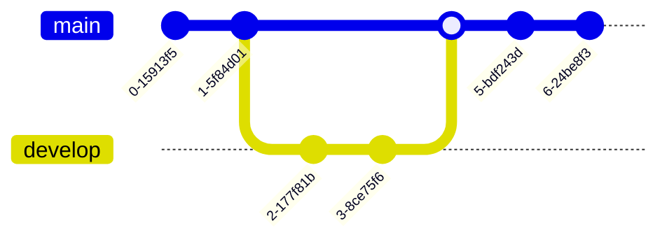

# Git Error Messages

## Introduction

When working with Git, encountering error messages is an inevitable part of the learning process. These messages might seem cryptic at first, but they contain valuable information that can help you understand what went wrong and how to fix it. This guide will walk you through the most common Git error messages, explain their causes, and provide step-by-step solutions to resolve them.

## Understanding Git Error Message Structure

Git error messages typically follow a pattern:

1. A descriptive header that identifies the problem
2. Details about what went wrong
3. Sometimes, suggestions for how to fix the issue

For example:

```bash
error: failed to push some refs to 'https://github.com/username/repository.git'
hint: Updates were rejected because the remote contains work that you do not have locally.
hint: This is usually caused by another repository pushing to the same ref.
hint: You may want to first integrate the remote changes before pushing again.
```

This structure helps you understand both what happened and potential solutions to try.

## Common Git Error Messages and Solutions

### 1. "fatal: not a git repository"

#### Problem

```bash
fatal: not a git repository (or any of the parent directories): .git
```

This error occurs when you try to run a Git command outside of a Git repository.

#### Solution

1. Check if you're in the correct directory:

```bash
pwd
```

2. Navigate to your repository:

```bash
cd path/to/your/repository
```

3. If you haven't initialized a repository yet, create one:

```bash
git init
```

### 2. "fatal: refusing to merge unrelated histories"

#### Problem

```bash
fatal: refusing to merge unrelated histories
```

This happens when you try to merge or pull from a repository that doesn't share a common commit history with your local repository.

#### Solution

Use the `--allow-unrelated-histories` flag:

```bash
git pull origin main --allow-unrelated-histories
```

### 3. "error: failed to push some refs"

#### Problem

```bash
error: failed to push some refs to 'https://github.com/username/repository.git'
hint: Updates were rejected because the remote contains work that you do not have locally.
```

This occurs when someone else has pushed changes to the remote repository that you haven't pulled into your local repository.

#### Solution

1. Pull the latest changes:

```bash
git pull origin main
```

2. Resolve any merge conflicts if they occur
3. Push your changes again:

```bash
git push origin main
```

### 4. "fatal: The current branch has no upstream branch"

#### Problem

```bash
fatal: The current branch branch-name has no upstream branch
```

This error appears when you try to push or pull without specifying a remote branch, and Git doesn't know which remote branch to use.

#### Solution

Set up the upstream branch:

```bash
git push --set-upstream origin branch-name
```

Or use the shorter version:

```bash
git push -u origin branch-name
```

### 5. "error: Your local changes would be overwritten by merge"

#### Problem

```bash
error: Your local changes to the following files would be overwritten by merge:
    file.txt
Please commit your changes or stash them before you merge.
```

This occurs when you have local changes that would be overwritten by the pull operation.

#### Solution

Option 1: Commit your changes first:

```bash
git add .
git commit -m "Your commit message"
git pull origin main
```

Option 2: Stash your changes temporarily:

```bash
git stash
git pull origin main
git stash pop
```

### 6. "fatal: Cannot do a partial commit during a merge"

#### Problem

```bash
fatal: Cannot do a partial commit during a merge.
```

This happens when you try to commit specific files after a merge conflict has occurred.

#### Solution

Either commit all changes after the merge:

```bash
git add .
git commit
```

Or abort the merge and start over:

```bash
git merge --abort
```

### 7. "error: commit failed - cannot update HEAD"

#### Problem

```bash
error: cannot update HEAD ref
```

This error often occurs when there's a permissions issue with the repository files.

#### Solution

1. Check file permissions:

```bash
ls -la .git
```

2. Fix permissions if needed:

```bash
chmod -R u+w .git
```

### 8. "fatal: Unable to create 'path/.git/index.lock': File exists"

#### Problem

```bash
fatal: Unable to create 'path/.git/index.lock': File exists.
```

This happens when a previous Git operation was interrupted, leaving a lock file behind.

#### Solution

Remove the lock file (be careful with this command):

```bash
rm -f .git/index.lock
```

### 9. "error: Remote ref does not exist"

#### Problem

```bash
error: Remote ref refs/heads/branch-name does not exist
```

This occurs when you try to push to or pull from a branch that doesn't exist on the remote repository.

#### Solution

1. Check available remote branches:

```bash
git ls-remote origin
```

2. Create the branch on the remote if needed:

```bash
git push origin local-branch:remote-branch
```

### 10. "fatal: Authentication failed"

#### Problem

```bash
fatal: Authentication failed for 'https://github.com/username/repository.git/'
```

This happens when your credentials for the remote repository are invalid or expired.

#### Solution

1. For HTTPS repositories, update your credentials:

```bash
git config --global credential.helper store
```

2. For SSH repositories, check your SSH key:

```bash
ssh -T git@github.com
```

## Diagnosing Git Errors with `git status`

The `git status` command is one of your most valuable tools for diagnosing errors. It shows:

- Current branch
- Tracked/untracked files
- Changes staged for commit
- Current state of your working directory

```bash
git status
```

Always run this command first when you encounter an error to understand your repository's current state.

## Visualizing Git Errors with Git Log

The `git log` command can help you understand the commit history and identify where things might have gone wrong:

```bash
git log --graph --oneline --all
```

This provides a visual representation of branch histories and merge points.



## Recovering from Serious Errors

### The Git Reflog

The reflog records all changes to branch tips and provides a safety net for recovering from serious errors:

```bash
git reflog
```

Example output:

```
1a2b3c4 HEAD@{0}: commit: Add new feature
5d6e7f8 HEAD@{1}: checkout: moving from main to feature-branch
9g8h7i6 HEAD@{2}: commit: Fix bug in login page
```

To recover to a specific point:

```bash
git reset --hard HEAD@{2}
```

### Reverting Commits

If you need to undo a commit but keep a record of the reversion:

```bash
git revert commit-hash
```

## Best Practices to Avoid Git Errors

1. **Pull before pushing**: Always pull the latest changes before pushing your own work.

```bash
git pull origin main
# Make your changes
git push origin main
```

2. **Commit frequently**: Make small, focused commits rather than large ones.

3. **Use descriptive commit messages**: This helps with troubleshooting later.

4. **Create branches for new features**: Keep your main branch stable.

```bash
git checkout -b feature-branch
# Make your changes
git checkout main
git merge feature-branch
```

5. **Check your status often**: Run `git status` frequently to understand your repository state.

## Summary

Understanding Git error messages is crucial for effective version control. Most Git errors can be resolved by:

1. Reading the error message carefully
2. Checking your repository status
3. Applying the appropriate solution
4. Using Git's built-in recovery tools when needed

Remember that errors are a normal part of the development process. With practice, you'll become more comfortable troubleshooting these issues and maintaining a clean Git workflow.

## Additional Resources

- [Git Documentation](https://git-scm.com/doc)
- [Pro Git Book](https://git-scm.com/book/en/v2)
- [Oh Shit, Git!?!](https://ohshitgit.com/) - A practical guide to recovering from common Git mistakes

## Practice Exercises

1. Deliberately create a merge conflict and practice resolving it.
2. Try to push to a non-existent remote branch and fix the error.
3. Create a situation where you need to use `git stash` to save your work.
4. Practice recovering a deleted commit using `git reflog`.
5. Simulate a scenario where you need to use `git revert` to undo changes.