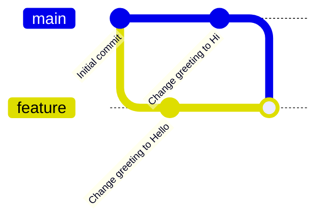

# Git Merge Conflicts

## Introduction

When multiple developers work on the same codebase, they often modify the same files. Git is excellent at automatically merging changes, but sometimes it needs human assistance. A **merge conflict** occurs when Git cannot automatically resolve differences between two commits.

Merge conflicts happen when:
- Different developers change the same lines in a file
- One developer deletes a file while another modifies it
- Two branches have competing changes that Git cannot reconcile

While merge conflicts might seem intimidating at first, they're a normal part of collaborative development. This guide will help you understand what merge conflicts are, how to resolve them effectively, and how to minimize them in your workflow.

## Understanding Merge Conflicts

### What Causes Merge Conflicts?

Let's visualize a typical scenario that leads to a merge conflict:



In this scenario:
1. You start with a shared codebase
2. You create a feature branch and change a greeting to "Hello"
3. Meanwhile, your colleague changes the same greeting to "Hi" on the main branch
4. When you try to merge your feature branch back to main, Git detects the conflict

### Anatomy of a Merge Conflict

When Git encounters a merge conflict, it modifies the affected files to show both versions of the conflicting changes, marked with special dividers:

```
<<<<<<< HEAD
Hi, world!
=======
Hello, world!
>>>>>>> feature-branch
```

These markers mean:
- `<<<<<<< HEAD` marks the beginning of the conflicting changes in the current branch
- `=======` separates the changes between the two branches
- `>>>>>>> feature-branch` marks the end of the conflicting changes in the incoming branch

## Resolving Merge Conflicts

### Basic Resolution Steps

1. **Identify conflicts**: Run `git status` to see which files have conflicts
2. **Open the conflicting files**: Use your code editor to find and resolve conflicts
3. **Edit the files**: Remove conflict markers and decide which changes to keep
4. **Mark as resolved**: Use `git add` to mark the resolved files
5. **Complete the merge**: Run `git commit` to finalize the merge

Let's walk through a practical example:

### Example: Resolving a Text File Conflict

Imagine we have a simple greeting.js file:

```js
function greet() {
  return "Good morning, world!";
}
```

Two developers make different changes to this file:

**Developer A (feature branch):**
```js
function greet() {
  return "Hello, wonderful world!";
}
```

**Developer B (main branch):**
```js
function greet() {
  return "Hi there, world!";
}
```

When Developer A tries to merge their feature branch into main, they'll encounter a conflict. Git will modify the file to look like:

```js
function greet() {
<<<<<<< HEAD
  return "Hi there, world!";
=======
  return "Hello, wonderful world!";
>>>>>>> feature-branch
}
```

#### Resolution Process

1. **Identify the conflict**:
   ```bash
   $ git status
   On branch main
   You have unmerged paths.
     (fix conflicts and run "git commit")
   
   Unmerged paths:
     (use "git add <file>..." to mark resolution)
     both modified:   greeting.js
   ```

2. **Decide how to resolve it**. You might:
   - Choose one version over another
   - Combine both changes
   - Create something completely new

3. **Edit the file** to remove conflict markers and implement your decision:
   ```js
   function greet() {
     return "Hello there, wonderful world!";
   }
   ```

4. **Mark as resolved**:
   ```bash
   $ git add greeting.js
   ```

5. **Complete the merge**:
   ```bash
   $ git commit -m "Merge feature branch, resolve greeting conflict"
   ```

### Using Merge Tools

For complex conflicts, visual merge tools can be helpful:

```bash
$ git mergetool
```

This command launches a visual tool that helps you see and resolve conflicts more intuitively. Popular merge tools include:
- VS Code's built-in merge conflict resolver
- KDiff3
- Meld
- Beyond Compare

## Handling Different Types of Conflicts

### Line-Level Conflicts

These are the most common conflicts, as shown in our previous example, where changes occur on the same lines.

### File-Level Conflicts

These occur when:
- One developer modifies a file while another deletes it
- Both developers rename or move a file differently

Example of resolving a file-level conflict:

```bash
# If you want to keep the file
$ git add filename.txt

# If you want to confirm the deletion
$ git rm filename.txt
```

### Complex Merge Scenarios

For complex projects with many files in conflict:

1. **Tackle one file at a time**:
   ```bash
   $ git checkout --ours -- filename.txt  # Take our version
   $ git checkout --theirs -- another.txt  # Take their version
   $ git add filename.txt another.txt
   ```

2. **Abort the merge if needed**:
   ```bash
   $ git merge --abort
   ```

## Preventing Merge Conflicts

While conflicts can't always be avoided, you can minimize them:

### Best Practices

1. **Pull frequently** from the main branch to stay updated:
   ```bash
   $ git pull origin main
   ```

2. **Communicate with your team** about which files you're modifying

3. **Keep commits small and focused** on a single change

4. **Use feature branches** for isolated development:
   ```bash
   $ git checkout -b feature-name
   # Work on your feature
   $ git checkout main
   $ git pull
   $ git checkout feature-name
   $ git rebase main  # Or merge
   ```

5. **Consider using Git's rebase workflow** to create a cleaner history:
   ```bash
   $ git pull --rebase origin main
   ```

### Setting Up Proper Line Endings

Different operating systems use different line endings, which can cause unnecessary conflicts:

```bash
# Configure Git to handle line endings automatically
$ git config --global core.autocrlf true  # For Windows
$ git config --global core.autocrlf input  # For macOS/Linux
```

## Real-World Examples

### Scenario 1: Resolving Conflicts During a Pull Request

When working with remote repositories like GitHub or GitLab:

1. You create a pull request
2. The system shows merge conflicts
3. You can resolve them locally:
   ```bash
   $ git checkout feature-branch
   $ git pull origin main
   # Resolve conflicts
   $ git add .
   $ git commit -m "Resolve merge conflicts"
   $ git push
   ```

### Scenario 2: Conflicts in Configuration Files

Configuration files often cause conflicts because everyone modifies them:

```bash
# Create a template config
$ cp config.json config.template.json

# Add personal config to .gitignore
$ echo "config.json" >> .gitignore

# Document this in README
```

## Advanced Techniques

### Using Git Rerere (Reuse Recorded Resolution)

For recurring conflicts, enable Git to remember how you resolved them:

```bash
$ git config --global rerere.enabled true
```

This is especially useful for long-lived feature branches that you rebase frequently.

### Strategic Merge Options

Git offers special strategies for complex merges:

```bash
# Prefer our changes over theirs
$ git merge -X ours feature-branch

# Prefer their changes over ours
$ git merge -X theirs feature-branch
```

## Summary

Merge conflicts are a natural part of collaborative development. By understanding how they occur, how to resolve them effectively, and how to minimize them, you can make your Git workflow smoother and more productive.

Remember these key points:
- Conflicts occur when Git can't automatically merge changes
- Resolution involves manual editing to combine competing changes
- Communication and proper Git workflows can reduce conflict frequency
- Tools like `git mergetool` can help with complex conflicts
- Regular pulls and small, focused commits help prevent conflicts

## Additional Resources

Here are some exercises to practice your merge conflict resolution skills:

1. Create a sample repository and deliberately cause conflicts by editing the same line in different branches.
2. Try using different merge tools to resolve conflicts and see which one you prefer.
3. Set up a project with a teammate and practice communicating about changes to avoid conflicts.

## Further Learning

To deepen your Git knowledge:
- Explore Git's interactive rebase feature
- Learn about Git hooks for automating checks
- Practice using Git's reflog to recover from mistakes during merges

With practice, you'll find that handling merge conflicts becomes a routine part of your development workflow rather than a source of stress!