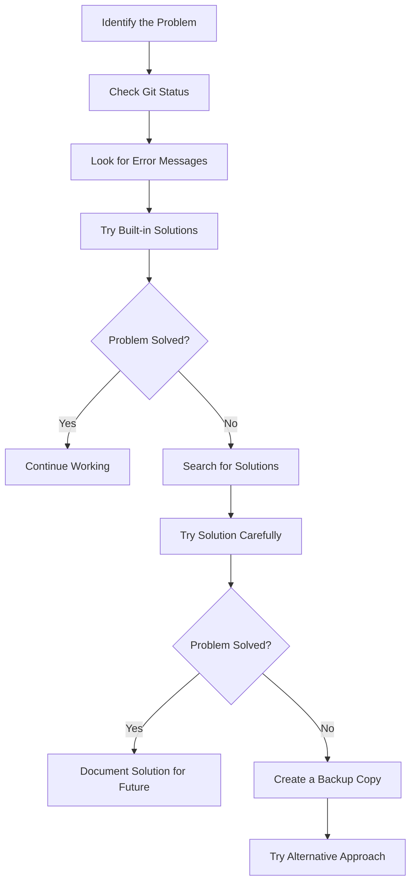

# Git Common Solutions

## Introduction

When working with Git, it's common to encounter various issues that can interrupt your workflow. This guide aims to provide solutions to the most frequent Git problems that beginners face. Understanding these common solutions will help you troubleshoot issues quickly and get back to coding without frustration.

Git is a powerful version control system, but with that power comes complexity. The good news is that most Git problems have well-established solutions, and learning these will dramatically improve your Git experience.

## Common Issue 1: Undoing the Last Commit

### Problem

You've just committed changes but realized you made a mistake or committed to the wrong branch.

### Solution

To undo the last commit while keeping your changes staged:

```bash
# Undo last commit but keep changes
git reset --soft HEAD~1
```

If you want to completely discard the last commit and changes:

```bash
# Completely discard last commit and changes
git reset --hard HEAD~1
```

**Example:**

```bash
# Original state: Three commits in history
$ git log --oneline
abc1234 Add user authentication feature
def5678 Update documentation
ghi9101 Initial commit

# Reset the last commit (soft)
$ git reset --soft HEAD~1

# Check status - changes are now staged
$ git status
On branch main
Changes to be committed:
  (use "git restore --staged <file>..." to unstage)
        modified:   authentication.js
        modified:   README.md
```

## Common Issue 2: Fixing a Detached HEAD State

### Problem

You've checked out a specific commit directly (rather than a branch), resulting in a "detached HEAD" state.

### Solution

Create a new branch at your current position and switch to it:

```bash
# Create a new branch where you are
git branch new-branch-name
git checkout new-branch-name

# Or in one command
git checkout -b new-branch-name
```

**Example:**

```bash
# You're in a detached HEAD state
$ git status
HEAD detached at abc1234
nothing to commit, working tree clean

# Create a new branch and switch to it
$ git checkout -b recovery-branch

# Now you're on a proper branch
$ git status
On branch recovery-branch
nothing to commit, working tree clean
```

## Common Issue 3: Resolving Merge Conflicts

### Problem

You tried to merge branches or pull changes, but Git encountered conflicting changes.

### Solution

1. Identify conflicted files:

```bash
git status
```

2. Open each conflicted file and look for conflict markers (`<<<<<<<`, `=======`, `>>>>>>>`).
3. Edit the files to resolve conflicts.
4. Add the resolved files:

```bash
git add <resolved-file>
```

5. Complete the merge:

```bash
git commit
```

**Example of a conflict:**

```
<<<<<<< HEAD
function calculateTotal(items) {
  return items.reduce((total, item) => total + item.price, 0);
}
=======
function calculateTotal(items) {
  let total = 0;
  items.forEach(item => {
    total += item.price;
  });
  return total;
}
>>>>>>> feature-branch
```

To resolve this, you would edit the file to keep the implementation you want (or create a combination), then remove the conflict markers.

## Common Issue 4: Stashing Changes

### Problem

You need to switch branches but have uncommitted changes that you're not ready to commit yet.

### Solution

Use Git's stash feature:

```bash
# Stash your changes
git stash save "Brief description of changes"

# Switch branches or perform other operations
git checkout other-branch

# Later, reapply your stashed changes
git stash apply   # Keeps the stash for future use
# or
git stash pop     # Removes the stash after applying
```

**Example:**

```bash
# You have some changes in progress
$ git status
On branch feature-x
Changes not staged for commit:
  modified:   src/components/Button.js

# Stash the changes
$ git stash save "Work in progress on Button component"
Saved working directory and index state On feature-x: Work in progress on Button component

# Switch branches
$ git checkout hotfix-y
Switched to branch 'hotfix-y'

# Do some work on hotfix-y, then switch back
$ git checkout feature-x
Switched to branch 'feature-x'

# Reapply your changes
$ git stash pop
On branch feature-x
Changes not staged for commit:
  modified:   src/components/Button.js
Dropped refs/stash@{0}
```

## Common Issue 5: Reverting a File to a Previous State

### Problem

You've made changes to a file and want to revert it to a previous state.

### Solution

Use `git checkout` with a commit reference:

```bash
# Revert a file to its state in the last commit
git checkout -- <file-path>

# Revert a file to its state in a specific commit
git checkout <commit-hash> -- <file-path>
```

**Example:**

```bash
# Revert config.js to its state in the last commit
$ git checkout -- src/config.js

# Revert config.js to its state from 3 commits ago
$ git checkout HEAD~3 -- src/config.js
```

## Common Issue 6: Handling Large Files Accidentally Committed

### Problem

You've accidentally committed a large file that shouldn't be in the repository.

### Solution

1. Remove the file but keep it locally:

```bash
git rm --cached <large-file>
```

2. Add the file to `.gitignore` to prevent future commits:

```bash
echo "<large-file>" >> .gitignore
```

3. Commit these changes:

```bash
git commit -m "Remove large file and add to gitignore"
```

**Example:**

```bash
# Remove the large file from Git but keep it locally
$ git rm --cached large-database-dump.sql

# Add it to .gitignore
$ echo "large-database-dump.sql" >> .gitignore

# Commit the changes
$ git commit -m "Remove database dump and add to gitignore"
```

## Common Issue 7: Fixing Commit Messages

### Problem

You've made a typo or want to improve your last commit message.

### Solution

```bash
# Amend the last commit message
git commit --amend -m "New, improved commit message"
```

**Example:**

```bash
# Original commit
$ git commit -m "Fix bugg in login form"

# Oops, typo! Let's fix it
$ git commit --amend -m "Fix bug in login form"
```

## Common Issue 8: Recovering Deleted Branches

### Problem

You've accidentally deleted a branch and need to recover it.

### Solution

1. Find the SHA of the last commit on the deleted branch:

```bash
git reflog
```

2. Create a new branch at that commit:

```bash
git checkout -b <branch-name> <commit-sha>
```

**Example:**

```bash
# Check the reflog to find the deleted branch's last commit
$ git reflog
abc1234 HEAD@{0}: checkout: moving from deleted-branch to main
def5678 HEAD@{1}: commit: Last commit on deleted-branch
...

# Create a new branch at that commit
$ git checkout -b recovered-branch def5678
Switched to a new branch 'recovered-branch'
```

## Common Issue 9: Aborting a Merge

### Problem

You've started a merge but want to cancel it due to too many conflicts or other issues.

### Solution

```bash
# Abort the merge and return to pre-merge state
git merge --abort
```

**Example:**

```bash
# Start merging feature-branch into main
$ git checkout main
$ git merge feature-branch

# Oh no, too many conflicts!
CONFLICT (content): Merge conflict in src/components/App.js
CONFLICT (content): Merge conflict in src/utils/helpers.js
...

# Abort the merge
$ git merge --abort

# Back to pre-merge state
$ git status
On branch main
nothing to commit, working tree clean
```

## Common Issue 10: Cleaning Untracked Files

### Problem

Your working directory is cluttered with untracked files or build artifacts you want to remove.

### Solution

```bash
# See what would be removed (dry run)
git clean -n

# Remove untracked files
git clean -f

# Remove untracked files and directories
git clean -fd
```

**Example:**

```bash
# See what would be removed
$ git clean -n
Would remove build/
Would remove temp.log
Would remove test.tmp

# Remove the files
$ git clean -fd
Removing build/
Removing temp.log
Removing test.tmp
```

## Git Problem-Solving Workflow

When facing any Git issue, follow this general troubleshooting workflow:



## Summary

This guide covered solutions to common Git problems that beginners frequently encounter. Remember these key points:

- Git provides tools to undo, revert, and recover from most mistakes
- Always check your status before and after performing Git operations
- When in doubt, create a backup or branch before trying complex solutions
- The `git reflog` command is invaluable for recovering lost work

By becoming familiar with these common solutions, you'll spend less time troubleshooting and more time coding.

## Additional Resources

- [Pro Git Book](https://git-scm.com/book/en/v2) - A comprehensive and free guide to Git
- [Git Cheatsheet](https://education.github.com/git-cheat-sheet-education.pdf) - Quick reference for common Git commands
- [Oh Shit, Git!?!](https://ohshitgit.com/) - Plain language explanations for common Git mistakes

## Practice Exercises

1. Create a test repository and practice undoing commits with both `--soft` and `--hard` options
2. Deliberately create merge conflicts and practice resolving them
3. Use `git stash` to save changes while switching between branches
4. Try recovering a deleted branch using the reflog
5. Practice amending commit messages and using interactive rebase to modify commit history

Remember that Git has a learning curve, but understanding these common solutions will make you much more confident in using it effectively.