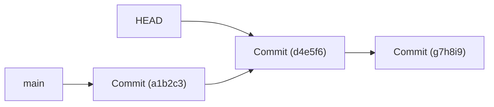
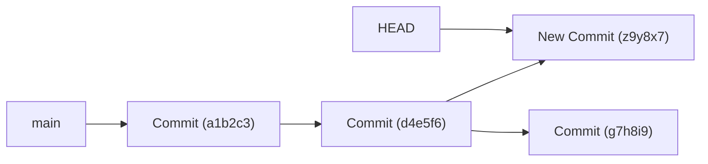
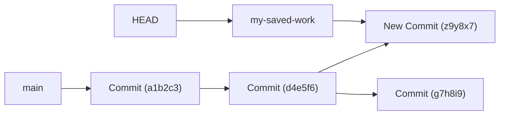

# Git Detached HEAD

## Introduction

Have you ever run a Git command and suddenly seen a strange message about being in a "detached HEAD state"? Don't worry—this isn't as scary as it sounds! In this tutorial, we'll explore what a detached HEAD is, why it happens, how to recover from it, and even how to use it to your advantage.

A detached HEAD is a common Git situation that confuses many beginners, but understanding it will deepen your knowledge of how Git works behind the scenes.

## What is a HEAD in Git?

Before diving into a detached HEAD, let's understand what HEAD means in Git:

- **HEAD** is a reference to the current commit you're working on in your repository
- Normally, HEAD points to a branch name (like `main` or `feature/login`)
- The branch, in turn, points to a specific commit

In a normal Git workflow, your situation looks like this:


## What is a Detached HEAD?

A **detached HEAD** occurs when HEAD points directly to a commit instead of a branch. This happens when you checkout a specific commit, tag, or remote branch without creating a local branch.



## How to Enter a Detached HEAD State

You can enter a detached HEAD state by:

1. Checking out a specific commit hash:

```bash
git checkout a1b2c3d4e5
```

2. Checking out a tag:

```bash
git checkout v1.0.0
```

3. Checking out a remote branch without tracking:

```bash
git checkout origin/feature/login
```

When you do this, Git will show you a warning message like:

```
Note: checking out 'a1b2c3d4e5'.

You are in 'detached HEAD' state. You can look around, make experimental
changes and commit them, and you can discard any commits you make in this
state without impacting any branches by performing another checkout.

If you want to create a new branch to retain commits you create, you may
do so (now or later) by using -b with the checkout command again. Example:

  git checkout -b <new-branch-name>

HEAD is now at a1b2c3d... Your commit message
```

## Identifying a Detached HEAD State

To check if you're in a detached HEAD state, run:

```bash
git status
```

If you see a message like "HEAD detached at a1b2c3d" instead of "On branch main", you're in a detached HEAD state.

## The Dangers of a Detached HEAD

The main risk in a detached HEAD state is **losing work**. Any commits you make in this state are not attached to any branch, so they may become "orphaned" and eventually be garbage-collected by Git if you don't create a branch to save them.

Let's see what happens when you make changes in a detached HEAD state:

```bash
# Start in detached HEAD state
git checkout a1b2c3d4e5

# Make some changes
echo "New content" > file.txt

# Commit the changes
git add file.txt
git commit -m "Add new content in detached HEAD"
```

At this point, your new commit exists but isn't connected to any branch:



If you now checkout another branch without saving your work, your new commit might be lost!

## Recovering from a Detached HEAD

If you've made commits in a detached HEAD state that you want to keep, you have several options:

### 1. Create a new branch

The simplest solution is to create a new branch at your current position:

```bash
git checkout -b my-saved-work
```

This turns your detached HEAD into a proper branch:



### 2. Use Git reflog to find and recover lost commits

If you've already moved away from the detached HEAD state, you can use Git's reflog to find your commits:

```bash
# View recent HEAD positions
git reflog

# Example output:
# a1b2c3d HEAD@{0}: checkout: moving from detached HEAD z9y8x7 to main
# z9y8x7 HEAD@{1}: commit: Add new content in detached HEAD
# a1b2c3d HEAD@{2}: checkout: moving from main to a1b2c3d

# Create a branch at the lost commit
git branch my-recovered-work z9y8x7
```

### 3. Return to a branch without saving changes

If you don't need the changes you made, you can simply checkout an existing branch:

```bash
git checkout main
```

## Practical Uses for Detached HEAD

A detached HEAD isn't always a problem—it can be useful in several scenarios:

### 1. Examining Old Code Versions

You can use a detached HEAD to temporarily look at old versions of your codebase:

```bash
# Check out a specific version to examine it
git checkout v1.0.0

# Look around, run tests, etc.

# Return to your branch when done
git checkout main
```

### 2. Testing Quick Changes

Detached HEAD is perfect for testing experimental changes without creating a branch:

```bash
# Check out the commit to modify
git checkout a1b2c3d4e5

# Make changes, test them

# If changes work, create a branch
git checkout -b feature/my-fix

# If changes don't work, just discard them
git checkout main
```

### 3. Building from a Specific Version

When you need to build or deploy a specific tagged version:

```bash
# Checkout the tag
git checkout v1.2.3

# Build or deploy the code

# Return to development
git checkout develop
```

## Common Mistakes and Solutions

### Mistake 1: Forgetting you're in a detached HEAD state

**Solution**: Always check `git status` before making important changes.

### Mistake 2: Making important changes without creating a branch

**Solution**: If you know you'll be making commits, create a branch immediately:

```bash
git checkout v1.0.0
git checkout -b hotfix/v1.0.1
```

### Mistake 3: Panicking and making the situation worse

**Solution**: Remember that Git rarely loses work completely. Use `git reflog` to find your way back.

## Best Practices with Detached HEAD

1. **Create branches immediately** when planning to make commits
2. **Use tags and branches** rather than raw commit hashes when possible
3. **Understand the difference** between viewing old code and developing new features
4. **Learn to use `git reflog`** to recover from mistakes

## Summary

A detached HEAD state in Git occurs when your HEAD reference points directly to a commit instead of a branch. While it can be dangerous if you make commits that aren't attached to any branch, it's also a useful tool for examining old code versions and testing changes.

Remember these key points:
- A detached HEAD isn't an error—it's a normal Git state
- You can create a branch at any time to save your work
- Always use `git status` to be aware of your current state
- If you lose work, `git reflog` can help you recover it

## Additional Resources

- [Git Documentation on Detached HEAD](https://git-scm.com/docs/git-checkout#_detached_head)
- [Pro Git Book - Git Internals](https://git-scm.com/book/en/v2/Git-Internals-Git-References)

## Exercises

1. Practice entering and exiting a detached HEAD state without losing work.
2. Create a commit in a detached HEAD state, then recover it using both the immediate branch creation method and the reflog method.
3. Use a detached HEAD to compare the code between two different tagged releases of an open-source project.