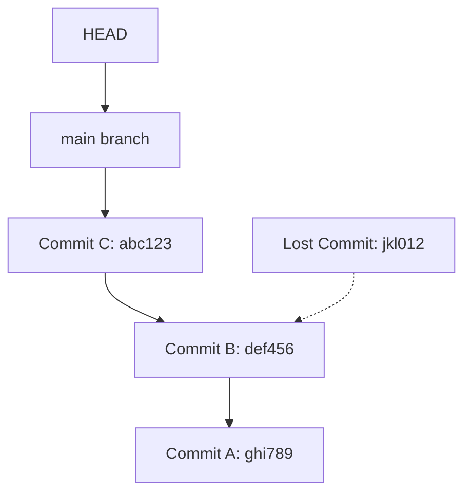

# Git Lost Commits

## Introduction

Have you ever made changes to your project, committed them, and then somehow lost those commits? Maybe you ran a Git command without fully understanding its consequences, or perhaps you did a hard reset and regretted it immediately. Don't panic! Git is designed with data safety in mind, and in most cases, your commits aren't truly gone—they're just no longer referenced.

This guide will teach you how to recover "lost" commits in Git. We'll explore various recovery techniques and best practices to ensure you can rescue your work even when things go wrong.

## Understanding Git's Object Model

Before diving into recovery techniques, it helps to understand how Git stores your data. Git uses a content-addressable filesystem, which means:

1. Every commit, file, and directory is stored as an object in Git's database
2. Each object has a unique SHA-1 hash identifier
3. Git maintains references (like branches and tags) that point to these objects
4. When a commit appears to be "lost," the object still exists in Git's database—it's just no longer referenced by any branch or tag

Let's visualize this:



In this diagram, the commit with hash `jkl012` is "lost" because no reference points to it, but it still exists in Git's database.

## Common Scenarios for Lost Commits

Let's look at some common scenarios where commits might appear to be lost:

1. **Hard reset**: Running `git reset --hard` to an earlier commit
2. **Branch deletion**: Deleting a branch with unique commits
3. **Rebasing gone wrong**: Interrupting a rebase operation
4. **Detached HEAD commits**: Making commits while in a detached HEAD state, then checking out another branch
5. **Force push**: Overwriting remote history with a force push

## Recovering Lost Commits with Git Reflog

Git maintains a log of all reference updates in your local repository called the "reflog." This is your first line of defense when recovering lost commits.

### Using Git Reflog

The reflog shows a history of all the actions you've performed in your repository:

```bash
git reflog
```

Output example:

```
abc123 (HEAD -> main) HEAD@{0}: commit: Add new feature
def456 HEAD@{1}: checkout: moving from feature to main
jkl012 HEAD@{2}: commit: WIP: Feature implementation
ghi789 HEAD@{3}: reset --hard HEAD~1
```

In this example, the commit `jkl012` might be considered "lost" if you abandoned the feature branch, but reflog still has a reference to it.

To recover this commit, you can create a new branch at that commit:

```bash
git branch recovered-branch jkl012
```

Or checkout directly to that commit:

```bash
git checkout jkl012
```

### Time-Based Recovery

If you don't remember the specific commit hash, you can use time-based specifications:

```bash
git reflog show --since="2 days ago"
```

## Finding Dangling Commits with Git FSCheck

If a commit is not in the reflog (perhaps it's older than the reflog's retention period), you can still find it using Git's filesystem checker:

```bash
git fsck --lost-found
```

This command will show you "dangling" commits and blobs. Look for lines like:

```
dangling commit abc123def456...
```

You can then examine the content of a dangling commit with:

```bash
git show abc123def456
```

And recover it by creating a branch:

```bash
git branch recovered-branch abc123def456
```

## Practical Example: Recovering from a Hard Reset

Let's walk through a common scenario: recovering from an accidental hard reset.

### Scenario

You've been working on a feature and made several commits. Then, by mistake, you run:

```bash
git reset --hard HEAD~3
```

This command moves your branch pointer back three commits, making it appear as if your last three commits are gone.

### Recovery Steps

1. First, check the reflog to see your recent actions:

```bash
git reflog
```

Output:

```
abc123 (HEAD -> main) HEAD@{0}: reset --hard HEAD~3: updating HEAD
def456 HEAD@{1}: commit: Add validation logic
ghi789 HEAD@{2}: commit: Implement error handling
jkl012 HEAD@{3}: commit: Create initial UI components
mno345 HEAD@{4}: commit: Base setup
```

2. Identify the last commit before the reset (`jkl012` in this case)

3. Create a new branch at that commit:

```bash
git branch recovery jkl012
```

4. Switch to the recovery branch:

```bash
git checkout recovery
```

Now you've recovered your lost commits!

## Cherry-Picking Specific Lost Commits

Sometimes, you might not want to recover all lost commits but just specific ones. In this case, you can use cherry-pick:

```bash
git cherry-pick def456
```

This will apply the changes from the commit `def456` to your current branch as a new commit.

## Preventing Lost Commits

Prevention is better than cure. Here are some best practices to avoid losing commits:

1. **Create branches for experimental work**: Always work in a separate branch for major changes
2. **Use `git stash` for temporary changes**: Instead of hard resets, use stash to temporarily set aside changes
3. **Understand destructive commands**: Be careful with commands like `reset --hard`, `push --force`, and `rebase`
4. **Push to remote regularly**: Once your changes are pushed to a remote repository, they're much harder to lose
5. **Configure longer reflog expiration**: You can extend the reflog retention period:

```bash
git config --global gc.reflogExpire "90 days"
```

## Advanced Recovery: Git Bisect for Finding Lost Work

If you have a rough idea of when a specific piece of code existed in your repository but don't know which commit it was in, you can use `git bisect` to help find it:

```bash
git bisect start
git bisect good <known-good-commit>
git bisect bad <known-bad-commit>
```

Then Git will help you navigate through the commit history to find when the code was present.

## Summary

In this guide, we've covered:

- How Git's object model stores your commits even when they appear "lost"
- Using `git reflog` to find recently "lost" commits
- Finding older dangling commits with `git fsck`
- Practical recovery techniques for common scenarios
- Best practices to prevent losing commits in the first place

Remember, Git is designed to keep your data safe. In most cases, if you've committed something, it's still there somewhere—you just need to know how to find it.

## Additional Resources

- [Git Documentation on reflog](https://git-scm.com/docs/git-reflog)
- [Git Internals: Plumbing and Porcelain](https://git-scm.com/book/en/v2/Git-Internals-Plumbing-and-Porcelain)
- [Git Tools - Advanced Merging](https://git-scm.com/book/en/v2/Git-Tools-Advanced-Merging)

## Exercises

1. Create a test repository and practice losing and recovering commits:
   - Make several commits
   - Perform a hard reset
   - Use reflog to recover the lost commits

2. Experiment with the following scenario:
   - Create a branch and make some commits
   - Delete the branch without merging
   - Recover the deleted branch's commits

3. Practice using `git fsck` to find dangling commits:
   - Create a repository with some commits
   - Delete references to some commits
   - Use `git fsck` to find and recover them