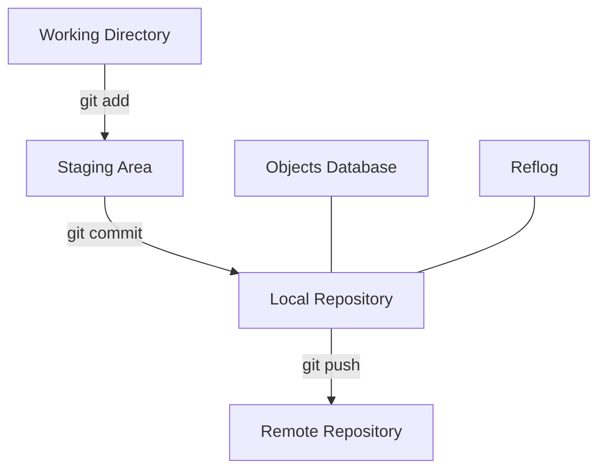

# Git Data Recovery

## Introduction

Ever accidentally deleted a branch? Lost commits after a bad merge? Overwrote important changes? Git's design as a content-addressable filesystem means that while data may appear lost, it often remains in your repository. This guide will walk you through techniques to recover seemingly lost data in Git.

## Understanding Git's Data Storage

Before learning recovery techniques, it helps to understand how Git stores data. Git doesn't just track changes—it preserves a complete history of your project.



When you commit changes, Git:
1. Creates immutable objects with unique hashes
2. Maintains reference pointers to these objects
3. Records all reference changes in the reflog

This means that even when you can't see a commit in `git log`, the data often still exists in the repository.

## Common Recovery Scenarios

### 1. Recovering Lost Commits

#### Using the Reflog

Git's reflog records where your HEAD and branch references have pointed during the past 90 days (by default).

```bash
# View the reflog
git reflog
```

Example output:
```
734713b HEAD@{0}: commit: Add payment feature
a6f30b1 HEAD@{1}: pull origin main: Fast-forward
c59d056 HEAD@{2}: commit: Fix rendering issue in navbar
3e7b21d HEAD@{3}: reset --hard HEAD~1
8a92d3f HEAD@{4}: commit: Add user authentication
```

To recover a commit that's no longer referenced:

```bash
# Find the lost commit in the reflog
git reflog

# Create a new branch pointing to the lost commit
git branch recovery-branch 8a92d3f

# Or directly check out the commit
git checkout 8a92d3f
```

#### Finding Dangling Commits

If a commit is truly "lost" (not in the reflog), you can search for dangling commits:

```bash
# Find dangling commits
git fsck --lost-found
```

Example output:
```
Checking object directories: 100% (256/256), done.
dangling commit 7a3fb3d02d88c4eb85c0f99195e7a1a4996db32f
dangling blob 3b18e512dba79e4c8300dd08aeb37f8e728b8dad
dangling commit fe43631bf52e348db3e1264e5a6bb7bd657c803d
```

Examine the content of a dangling commit:
```bash
git show 7a3fb3d02d88c4eb85c0f99195e7a1a4996db32f
```

To recover it:
```bash
git branch recovered-branch 7a3fb3d02d88c4eb85c0f99195e7a1a4996db32f
```

### 2. Recovering Deleted Branches

When you delete a branch, Git doesn't immediately delete its commits. They remain accessible through the reflog.

```bash
# List all entries in the reflog
git reflog

# Recreate the branch at its last position
git branch recovered-feature-branch a6f30b1
```

### 3. Recovering After a Hard Reset

If you've run `git reset --hard` and lost changes:

```bash
# Check the reflog to find the commit before the reset
git reflog

# Create a new branch from that point
git branch pre-reset-state HEAD@{1}
```

### 4. Recovering Uncommitted Changes

#### Using git stash

If you accidentally ran commands that cleared your working directory:

```bash
# Check for stashed changes (if you remembered to stash)
git stash list

# Apply the latest stash
git stash apply
```

#### Using git fsck for unstaged blobs

Sometimes Git keeps deleted file contents as dangling blobs:

```bash
# Find dangling blobs
git fsck --lost-found
```

To examine a blob's content:
```bash
git cat-file -p 3b18e512dba79e4c8300dd08aeb37f8e728b8dad
```

## Advanced Recovery Techniques

### Recovering Files from Any Commit

You can extract files from any commit, even if they've been deleted:

```bash
# Find when the file existed
git log --all -- path/to/deleted/file.js

# Restore the file from a specific commit
git checkout abc1234 -- path/to/deleted/file.js
```

### Excavating Lost Commits with git-reflog-walk

For complex situations, you can create a script to walk through the reflog:

```bash
#!/bin/bash
# save-all-dangling-commits.sh

for commit in $(git fsck --no-reflog | grep "dangling commit" | awk '{print $3}')
do
  git log -1 $commit > /tmp/message
  message=$(cat /tmp/message | grep -v "^commit" | tr -d '
')
  date=$(cat /tmp/message | grep "^Date:" | sed "s/Date: //")
  branch_name="recovered/$(date -d "$date" +%Y-%m-%d_%H-%M-%S)"
  git branch $branch_name $commit
  echo "Saved $commit as $branch_name: $message"
done
```

Make it executable and run:
```bash
chmod +x save-all-dangling-commits.sh
./save-all-dangling-commits.sh
```

### Recovering from Corrupted Repositories

If `.git` becomes corrupted, you can often recover using:

```bash
# Try automatic repair
git fsck --full

# If index is corrupted
rm .git/index
git reset
```

## Practical Real-World Examples

### Example 1: Recovering After an Accidental Force Push

Imagine someone force-pushed to the main branch, overwriting commits:

```bash
# Find the last known good state 
git reflog show origin/main@{1}

# Create a recovery branch
git checkout -b recovery-main a6f30b1

# Push the recovery branch 
git push -u origin recovery-main
```

### Example 2: Retrieving an Earlier Version of a File

To retrieve a file as it existed 5 commits ago:

```bash
# View the file's history
git log -p -- path/to/file.js

# Restore the file from 5 commits ago
git checkout HEAD~5 -- path/to/file.js

# Review changes and commit if needed
git diff --staged
git commit -m "Restore file.js to earlier version"
```

### Example 3: Recovering After a Botched Rebase

If you've rebased incorrectly and lost commits:

```bash
# Check the reflog for pre-rebase state
git reflog

# Find the last commit before rebase started
git checkout HEAD@{5}

# Create a new branch at this point
git checkout -b pre-rebase-backup
```

## Best Practices to Prevent Data Loss

1. **Make backups before risky operations**:
   ```bash
   git branch backup-before-rebase main
   ```

2. **Push to remote frequently**:
   ```bash
   git push origin feature-branch
   ```

3. **Use Git aliases for safer commands**:
   ```bash
   git config --global alias.safe-reset 'reset --keep'
   ```

4. **Extend reflog expiration time**:
   ```bash
   git config --global gc.reflogExpire "365 days"
   ```

## Summary

Git's design provides several layers of data protection that help you recover from mistakes:

1. **Reflog**: Your first line of defense, tracking reference changes
2. **Object database**: Stores all commit data until garbage collection
3. **Remote repositories**: Act as distributed backups

When working with Git, remember that "lost" usually means "not currently referenced" rather than "permanently deleted." With the techniques in this guide, you can recover from most common data loss scenarios.

## Additional Resources

- [Git Internals - Git Objects](https://git-scm.com/book/en/v2/Git-Internals-Git-Objects)
- [Pro Git Book - Maintenance and Data Recovery](https://git-scm.com/book/en/v2/Git-Internals-Maintenance-and-Data-Recovery)

## Exercises

1. Create a test repository and practice intentionally "losing" and recovering commits using the reflog.
2. Try to recover a file that was deleted 5 commits ago without using the reflog.
3. Set up a script that automatically creates backup branches before performing risky operations.