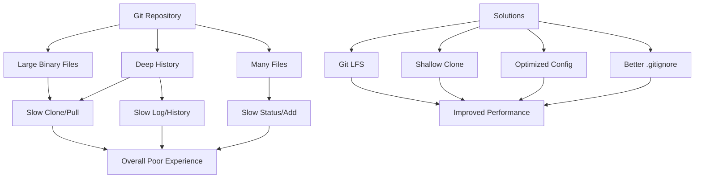

# Git Performance Issues

## Introduction

Git is a powerful version control system, but as projects grow in size or complexity, you might encounter performance issues that slow down your workflow. These problems can manifest as slow clones, laggy commits, or painful pushes and pulls. Understanding why these slowdowns occur and how to address them is essential for maintaining a smooth development experience, especially in larger teams or projects.

In this guide, we'll explore common Git performance bottlenecks, how to diagnose them, and practical solutions to make your Git operations fast again.

## Common Git Performance Problems

### 1. Slow Clone Operations

One of the first performance issues you might encounter is slow repository cloning.

#### Symptoms
- `git clone` takes minutes or even hours to complete
- Progress seems to stall at "Receiving objects" or "Resolving deltas"

#### Diagnosis

Let's check how long a clone takes:

```bash
time git clone https://github.com/large-org/large-repo.git
```

Output:
```
Cloning into 'large-repo'...
remote: Enumerating objects: 250000, done.
remote: Counting objects: 100% (250000/250000), done.
remote: Compressing objects: 100% (120000/120000), done.
Receiving objects: 100% (250000/250000), 500 MB | 2.1 MB/s, done.
Resolving deltas: 100% (130000/130000), done.

real    4m12.355s
user    1m27.232s
sys     0m35.142s
```

#### Solutions

**Use shallow clones for faster operations:**

```bash
git clone --depth 1 https://github.com/large-org/large-repo.git
```

This creates a "shallow" clone with only the latest commit history.

**Clone specific branches:**

```bash
git clone --branch main --single-branch https://github.com/large-org/large-repo.git
```

**Use Git LFS for large files:**

If your repository contains large binary files, set up [Git LFS](https://git-lfs.github.com/) to improve performance:

```bash
git lfs install
git lfs track "*.psd" "*.zip" "*.mp4"
```

### 2. Slow Git Status and Add Operations

#### Symptoms
- `git status` takes many seconds to complete
- Adding files is sluggish 
- Working directory feels unresponsive

#### Diagnosis

Measure how long `git status` takes:

```bash
time git status
```

Output:
```
On branch main
Your branch is up to date with 'origin/main'.

Changes not staged for commit:
  (use "git add <file>..." to update what will be committed)
  (use "git restore <file>..." to discard changes in working directory)
	modified:   src/components/App.js
	modified:   src/utils/helpers.js

real    0m3.251s
user    0m0.125s
sys     0m0.095s
```

#### Solutions

**Exclude unnecessary files using .gitignore:**

Create or update your `.gitignore` file to exclude build artifacts, dependency directories, and other files that don't need version control:

```
# Node modules
node_modules/

# Build artifacts
build/
dist/

# OS files
.DS_Store
Thumbs.db

# Log files
*.log

# IDE specific files
.idea/
.vscode/
```

**Enable Git's file system monitor:**

```bash
git config core.fsmonitor true
```

This lets Git use your operating system's file monitoring capabilities to track changes without scanning everything.

**Use Git's built-in caching:**

```bash
git config core.untrackedcache true
```

### 3. Slow Commits in Large Repositories

#### Symptoms
- `git commit` operations take a long time
- Committing many files is painfully slow

#### Diagnosis

Time your commit operations:

```bash
time git commit -m "Add new feature"
```

Output:
```
[main a1b2c3d] Add new feature
 50 files changed, 2500 insertions(+), 500 deletions(-)

real    0m8.354s
user    0m7.232s
sys     0m1.142s
```

#### Solutions

**Commit smaller batches:**

Instead of committing hundreds of files at once, make more frequent, smaller commits:

```bash
git add src/components/Button.js
git commit -m "Refactor Button component"

git add src/utils/
git commit -m "Update utility functions"
```

**Use partial commits:**

```bash
git add -p
```

This interactively stages changes in hunks, allowing you to commit logical changes together.

**Optimize Git's garbage collection:**

```bash
git config gc.auto 256
```

This increases the number of loose objects before Git triggers automatic garbage collection.

### 4. Slow Network Operations (Push/Pull)

#### Symptoms
- `git push` or `git pull` take a long time
- Operations stall at "Writing objects" or "Receiving objects"

#### Diagnosis

Time a push operation:

```bash
time git push origin main
```

Output:
```
Enumerating objects: 573, done.
Counting objects: 100% (573/573), done.
Delta compression using up to 8 threads
Compressing objects: 100% (320/320), done.
Writing objects: 100% (573/573), 4.2 MB | 245 KB/s, done.
Total 573 (delta 250), reused 520 (delta 220)
To github.com:username/repo.git
   a1b2c3d..e4f5g6h  main -> main

real    0m17.251s
user    0m0.525s
sys     0m0.395s
```

#### Solutions

**Use compression:**

```bash
git config --global core.compression 9
```

This increases compression (values 1-9) to reduce network transfer size.

**Update Git to the latest version:**

Newer Git versions often include performance improvements:

```bash
# For Ubuntu/Debian
sudo apt update && sudo apt install git

# For macOS
brew update && brew upgrade git
```

**Use a local Git server for large teams:**

For teams working on the same network, setting up a local Git server can dramatically improve network performance.

## Visualizing Git Performance Bottlenecks

The following diagram shows how different Git operations affect performance:



## Advanced Git Performance Optimizations

### Optimize Your Git Configuration

Create an optimized `.gitconfig`:

```bash
git config --global core.preloadindex true
git config --global core.fscache true
git config --global gc.auto 256
```

### Use Git Sparse Checkout for Monorepos

If you're working with a monorepo (a single repository containing multiple projects), you can checkout only the parts you need:

```bash
# Initialize sparse checkout
git clone --no-checkout https://github.com/large-org/monorepo.git
cd monorepo
git sparse-checkout init --cone
git sparse-checkout set frontend/react-app

# Now you only have the react-app subfolder
```

### Diagnose Performance with Git's Built-in Profiler

Git has a built-in trace mechanism for profiling:

```bash
GIT_TRACE=1 git status
```

Output:
```
10:55:17.931716 git.c:344               trace: built-in: git status
10:55:17.934898 run-command.c:637       trace: run_command: 'status'
10:55:17.935069 git.c:577               trace: exec: 'git-status'
10:55:18.423116 git.c:344               trace: built-in: git-status
10:55:18.425461 runtime-config.c:162    trace: reading config from .git/config
[... more trace output ...]
```

For more detailed performance information:

```bash
GIT_TRACE_PERFORMANCE=1 git status
```

## Practical Example: Optimizing a Large JavaScript Project

Let's consider a real-world example of optimizing a large React application with performance issues:

1. First, identify what's slowing things down:

```bash
GIT_TRACE_PERFORMANCE=1 git status
```

We notice that Git is spending a lot of time scanning `node_modules` and `build` directories.

2. Create a proper `.gitignore`:

```
# Dependencies
/node_modules
/.pnp
.pnp.js

# Production build folder
/build
/dist

# Coverage reports
/coverage

# Environment variables
.env.local
.env.development.local
.env.test.local
.env.production.local

# Debug logs
npm-debug.log*
yarn-debug.log*
yarn-error.log*

# IDE
/.idea
/.vscode
```

3. Configure Git for better performance:

```bash
# In project directory
git config core.fsmonitor true
git config core.untrackedcache true
git config gc.auto 256
git config core.preloadindex true
```

4. Move large assets to Git LFS:

```bash
git lfs install
git lfs track "*.png" "*.jpg" "*.jpeg" "*.gif" "*.svg"
git add .gitattributes
git commit -m "Configure Git LFS for image assets"
```

5. Clean up Git history if needed:

```bash
# Compact the repository
git gc --aggressive
```

After these optimizations, operations like `git status`, `git add`, and `git commit` should be significantly faster.

## Summary

Git performance issues commonly arise as projects grow larger or more complex. The main culprits are typically:

1. Large repository size due to binary files or deep history
2. Inefficient handling of many files
3. Network bottlenecks during push/pull operations
4. Suboptimal Git configuration

By applying the techniques covered in this guide, you can dramatically improve Git's performance for your daily workflow:

- Use shallow clones and single-branch clones when appropriate
- Implement Git LFS for large binary files
- Create comprehensive `.gitignore` files
- Optimize Git configuration for your specific environment
- Use Git's built-in performance tools to diagnose issues

Remember that different projects may require different optimization strategies. Monitor your Git performance regularly, especially after significant project growth, and adjust your approach accordingly.

## Additional Resources

- [Git Documentation: Performance](https://git-scm.com/docs/git-gc)
- [GitHub's Guide to Git LFS](https://github.com/git-lfs/git-lfs/wiki/Tutorial)
- [Pro Git Book: Internals](https://git-scm.com/book/en/v2/Git-Internals-Plumbing-and-Porcelain)

## Exercises

1. Time the `git status` command in one of your larger repositories. Then implement the performance optimizations from this guide and measure the improvement.

2. Create a `.gitignore` file for a typical project in your primary programming language, making sure to exclude all build artifacts and dependency directories.

3. Try using Git LFS to track large files in a test repository and observe how it affects performance.

4. Use Git's performance tracing to identify the slowest operations in your workflow and optimize them.